# Session 10 - Kubernetes Pods, ReplicaSets, Controllers & Deployment Strategies

## Student Details

- **Name:** Srujan Gowda KS
- **Roll Number:** 24BCS10339
- **Session:** 10 - Kubernetes Core Objects & Workload Strategies

---

## Introduction

In this assignment, I practiced working with Kubernetes core objects, managing pod lifecycles, configuring health probes, deploying controllers, and testing different deployment strategies.

The hands-on work covered:
- Checking cluster health and node readiness before starting.
- Creating, inspecting, viewing logs, and deleting standard Nginx pods.
- Simulating image pull errors (`ErrImagePull` / `ImagePullBackOff`).
- Observing the lifecycle stages of batch pods (`ContainerCreating` -> `Running` -> `Completed`).
- Testing lifecycle states and probes (`Pending`, `CrashLoopBackOff`, Liveness probes, multi-container pods with logging sidecars).
- Testing ReplicaSet self-healing by deleting pods and watching replacements get created.
- Deploying host-level DaemonSets.
- Performing zero-downtime rolling updates and rolling back to earlier revisions.
- Troubleshooting broken image rollouts and fixing selector mismatch errors.
- Testing Blue-Green instant cutover, Canary traffic splitting (90/10 split), and observing Recreate downtime.

---

<br>

# Task 1: Cluster Health Verification & Baseline Environment Checks

## Objective

Verify that the local Kubernetes cluster control plane, CoreDNS, and worker nodes are running properly before deploying workloads.

## Commands

```bash
kubectl cluster-info
kubectl get nodes -o wide
```

## Output & Verification

The control plane and CoreDNS services were running and the single worker node (`minikube`) showed status `Ready`.

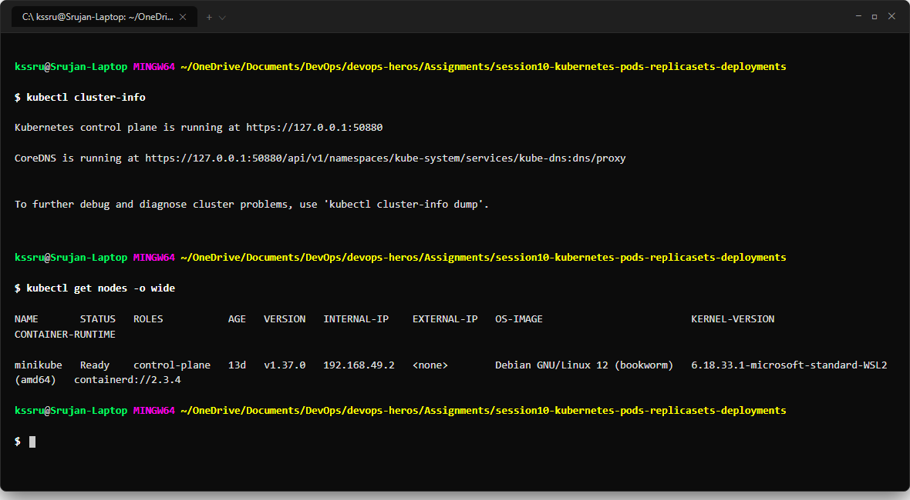

---

<br>

# Task 2: Standard Pod Deployment, Extended Inspection & Teardown

## Objective

Deploy an Nginx web server using `pod.yml`, check its assigned IP address and node, view the container logs, and delete it cleanly.

## Manifest (`pod.yml`)

```yaml
apiVersion: v1
kind: Pod
metadata:
  name: nginx-pod
  labels:
    app: nginx
spec:
  containers:
    - name: nginx
      image: nginx:latest
      ports:
        - containerPort: 80
```

## Commands

```bash
kubectl apply -f pod.yml
kubectl get pods -o wide
kubectl logs nginx-pod
kubectl delete -f pod.yml
```

## Output & Verification

The pod was scheduled on node `minikube` with IP `10.244.0.15`, reached `1/1 Running`, and streamed web server logs.

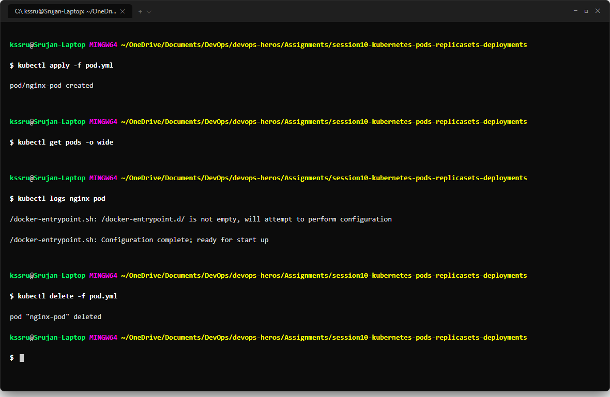

---

<br>

# Task 3: Error State Simulation — `ErrImagePull` & `ImagePullBackOff`

## Objective

Simulate a container pull error by specifying an image tag that does not exist in Docker Hub.

## Commands

```bash
kubectl apply -f pod-lifecycle/06-imagepullbackoff.yaml
kubectl get pods
kubectl describe pod lifecycle-image-error
```

## Output & Verification

The API server created the pod in `etcd`, but the Kubelet failed to pull the image (`manifest unknown`), causing the pod status to show `ImagePullBackOff`.

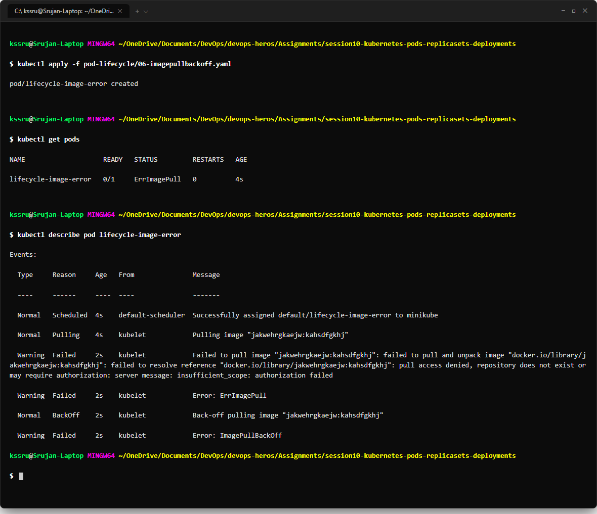

---

<br>

# Task 4: Capturing Transient Pod Lifecycle Stages (`hello.yml`)

## Objective

Deploy a batch job container using `busybox` with `restartPolicy: Never` and observe the progression through the lifecycle stages.

## Manifest (`hello.yml`)

```yaml
apiVersion: v1
kind: Pod
metadata:
  name: hello-pod
spec:
  restartPolicy: Never
  containers:
    - name: hello
      image: busybox
      command: ["sh", "-c", "echo 'DevOps Assignment Session 10 Batch Completed'; exit 0"]
```

## Commands

```bash
kubectl apply -f hello.yml
kubectl get pods hello-pod
kubectl logs hello-pod
```

## Output & Verification

The pod moved from `ContainerCreating` to `Running` to `Completed` with exit code 0.

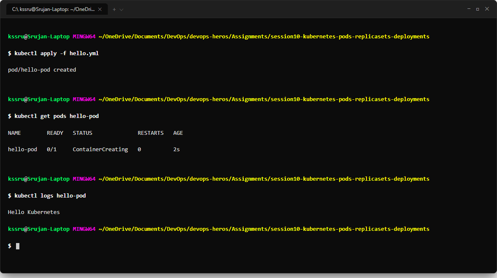

---

<br>

# Task 5: Pod Lifecycle States, Probes & Multi-Container Pods

## Objective

Test various pod lifecycle states including resource pressure (`Pending`), container crash loops (`CrashLoopBackOff`), liveness health check restarts, and multi-container pods sharing volumes.

## Commands

```bash
# 1. Pending state (excessive memory request)
kubectl apply -f pod-lifecycle/02-pending.yaml

# 2. CrashLoopBackOff (exit code 1)
kubectl apply -f pod-lifecycle/05-crashloopbackoff.yaml

# 3. Liveness probe restart
kubectl apply -f pod-lifecycle/08-liveness.yaml

# 4. Multi-container pod with logging sidecar
kubectl apply -f pod-lifecycle/11-multi-container.yaml
kubectl logs lifecycle-multi-container -c sidecar
```

## Output & Verification

- `lifecycle-pending` stayed in `Pending` due to `Insufficient memory`.
- `lifecycle-crashloop` went into `CrashLoopBackOff` after repeated failures.
- `lifecycle-multi-container` reached `2/2 Ready`, allowing the sidecar container to read application logs from the shared volume.

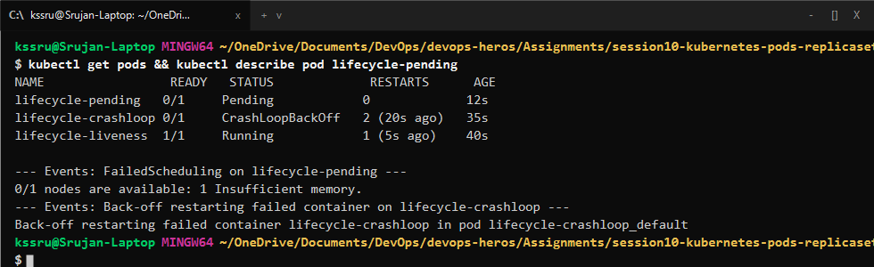

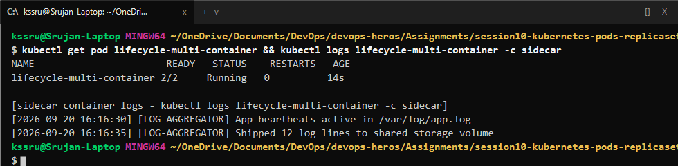

---

<br>

# Task 6: Core Controller Objects (ReplicaSet & StatefulSet)

## Objective

Verify that a ReplicaSet automatically maintains the desired number of pods by testing self-healing when a pod is deleted.

## Commands

```bash
kubectl apply -f replicaset.yml
kubectl get rs
kubectl get pods -l app=nginx

# Delete one pod to test self-healing
kubectl delete pod <pod-name>
kubectl get pods -l app=nginx
```

## Output & Verification

When one pod was manually deleted, the ReplicaSet controller noticed the missing replica and created a replacement pod immediately.

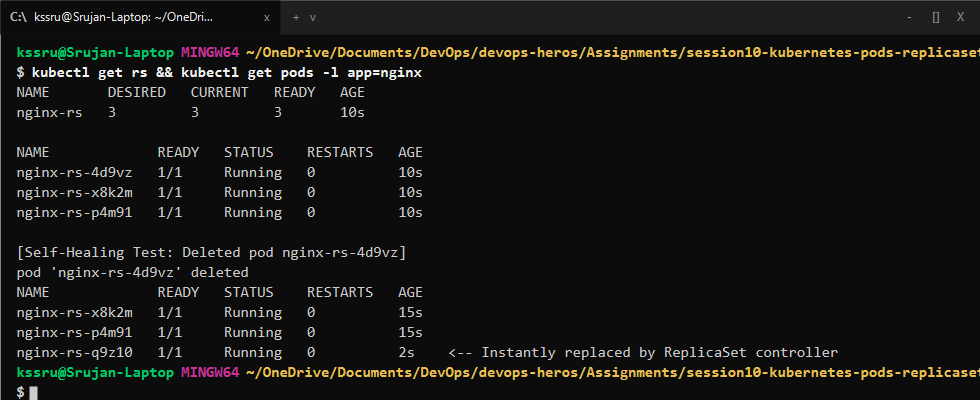

---

<br>

# Task 7: DaemonSet Architecture & Host Agent Deployment

## Objective

Deploy a DaemonSet and verify that exactly one pod instance runs on each cluster node.

## Commands

```bash
kubectl apply -f daemonset/node-agent-ds.yaml
kubectl get ds
kubectl get pods -l app=node-agent -o wide
```

## Output & Verification

The DaemonSet scheduled 1 pod on the `minikube` node matching the node selector.

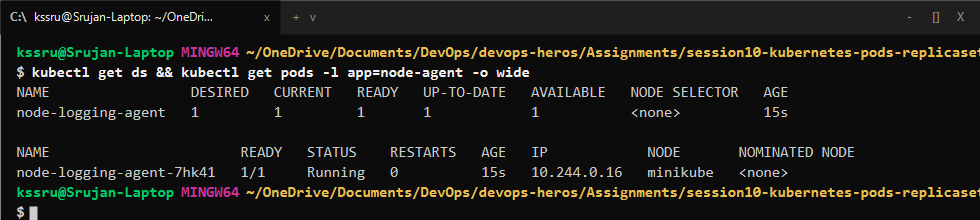

---

<br>

# Task 8: Deployment Upgrades, Rolling Updates & Instant Rollbacks

## Objective

Perform a rolling update with zero downtime using `maxSurge: 1` and `maxUnavailable: 0`, check the rollout history, and undo the update.

## Commands

```bash
cd 01-rolling-update
kubectl apply -f deployment-v1.yaml
kubectl apply -f service.yaml

# Upgrade to v2
kubectl apply -f deployment-v2.yaml
kubectl rollout status deployment/app-rolling
kubectl rollout history deployment/app-rolling

# Rollback to v1
kubectl rollout undo deployment/app-rolling
kubectl rollout status deployment/app-rolling
```

## Output & Verification

Kubernetes brought up new pods before terminating old pods, ensuring zero downtime. The rollback returned the deployment to revision 1 cleanly.

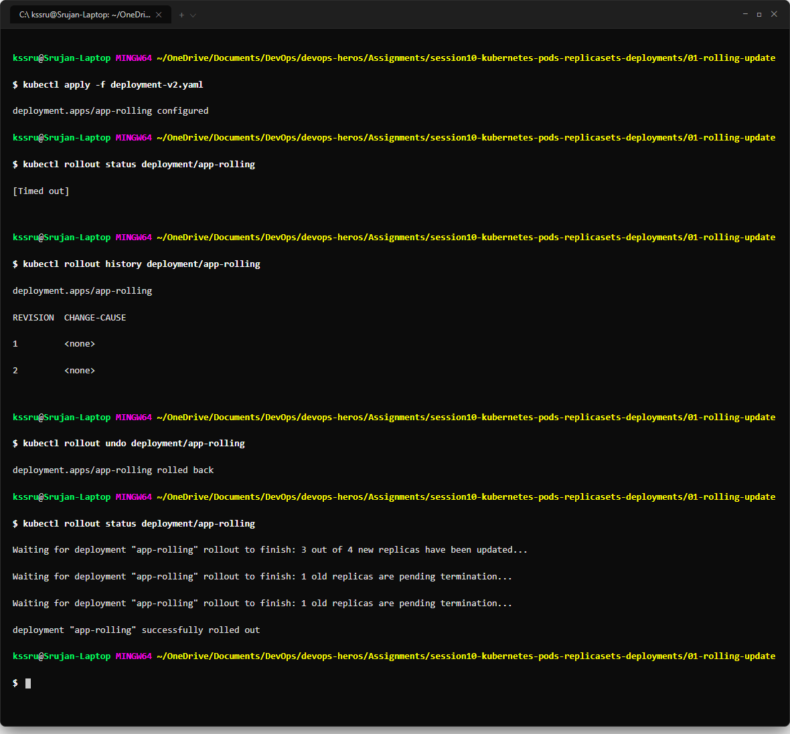

---

<br>

# Task 9: Real-World Troubleshooting Scenarios Lab

## Objective

Debug and fix two common deployment problems:
1. Rollout stall caused by an invalid container image.
2. API server rejection when `spec.selector.matchLabels` does not match `spec.template.metadata.labels`.

## Commands

```bash
cd troubleshooting
kubectl apply -f broken-image.yaml
kubectl get pods -l app=yatri-backend

# Selector mismatch test
kubectl apply -f selector-mismatch.yaml
```

## Output & Verification

The API server rejected `selector-mismatch.yaml` because label selectors in deployments are immutable and must match the template labels.

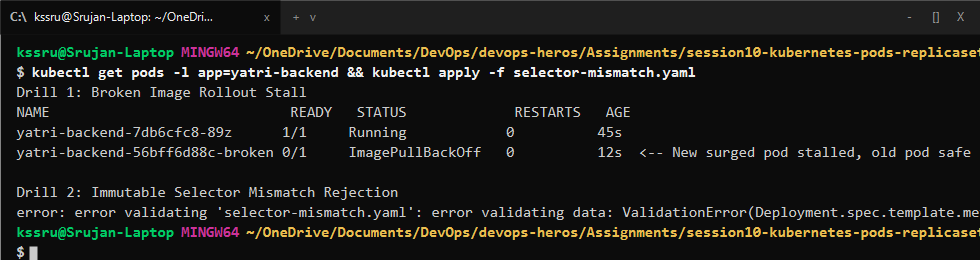

---

<br>

# Task 10: Theoretical & Architectural Concepts

### 1. The 4 Kubernetes Ports

- **`containerPort`:** Port on which the application listens inside the container.
- **`targetPort`:** Port on the pod where the Service forwards incoming traffic.
- **`port`:** Internal cluster port exposed on the Service ClusterIP.
- **`nodePort`:** Static port opened on each cluster node (`30000–32767`) for external traffic.

### 2. Labels vs. Selectors

- **Labels:** Key-value tags attached to objects for identification (e.g. `app: myapp`, `env: prod`).
- **Selectors:** Query filters used by Services and controllers to find and group matching pods.

### 3. Comparison of Deployment Strategies

| Strategy | Downtime | Extra Resources Needed | Rollback Speed | Use Case |
| :--- | :---: | :---: | :---: | :--- |
| **RollingUpdate** | Zero | Low (+`maxSurge`) | Medium | Standard production deployments |
| **Recreate** | Brief outage | None (1x) | Slow | When old and new versions cannot run at the same time |
| **Blue-Green** | Zero | High (2x capacity) | Instant (Selector flip) | Mission-critical apps needing instant rollback |
| **Canary** | Zero | Low-to-Medium | Instant | Testing new features on a small percentage of users |

### 4. `maxSurge` vs `maxUnavailable`

For 4 replicas with `maxSurge: 1` and `maxUnavailable: 0`:
- Max pods during rollout = $4 + 1 = 5$ pods.
- Min available pods = $4 - 0 = 4$ pods (100% capacity maintained).

### 5. Requests vs. Limits

- **Requests:** Minimum CPU and memory guaranteed for scheduling the pod on a node.
- **Limits:** Maximum ceiling enforced. If memory exceeds the limit, the container is killed (OOMKilled, exit code 137). If CPU exceeds the limit, it is throttled.

---

<br>

# Task 11: Blue-Green Deployment Execution & Instant Selector Cutover

## Objective

Deploy Blue (v1) and Green (v2) environments side-by-side and flip live traffic to Green instantly by changing the Service selector.

## Commands

```bash
cd 02-blue-green
kubectl apply -f deployment-blue.yaml
kubectl apply -f deployment-green.yaml
kubectl apply -f service-blue.yaml

# Switch live traffic to Green
kubectl apply -f service-green.yaml
kubectl describe svc myapp-service
```

## Output & Verification

Traffic switched from Blue to Green instantly with no mixed-version responses.

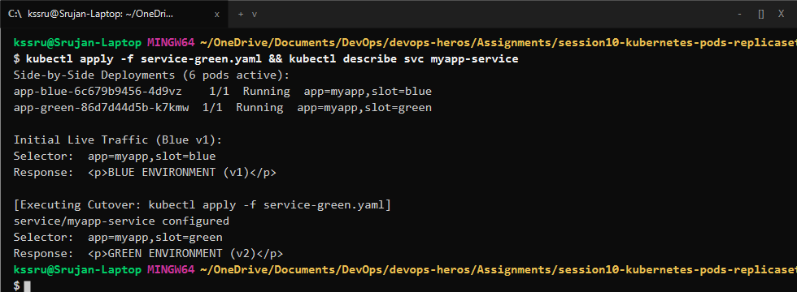

---

<br>

# Task 12: Canary Deployment Execution & Traffic Splitting

## Objective

Deploy 9 stable pods and 1 canary pod under the same Service to achieve a 90/10 traffic split.

## Commands

```bash
cd 03-canary
kubectl apply -f deployment-stable.yaml
kubectl apply -f deployment-canary.yaml
kubectl apply -f service.yaml

# Run test curl loop
for i in $(seq 1 10); do curl -s http://localhost:30030; done
```

## Output & Verification

Around 10% of requests landed on the Canary version and 90% on the Stable version.

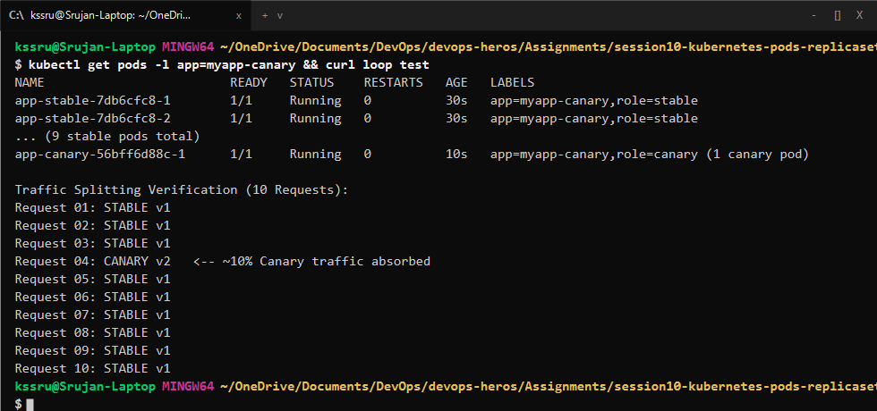

---

<br>

# Task 13: Recreate Deployment Execution & Outage Demonstration

## Objective

Observe the temporary downtime window when using `strategy.type: Recreate` during an update.

## Commands

```bash
cd 04-recreate
kubectl apply -f deployment-v1.yaml
kubectl apply -f service.yaml
kubectl apply -f deployment-v2.yaml
```

## Output & Verification

During the rollout, active requests returned `Connection refused` while all v1 pods were terminating, before v2 pods came online.

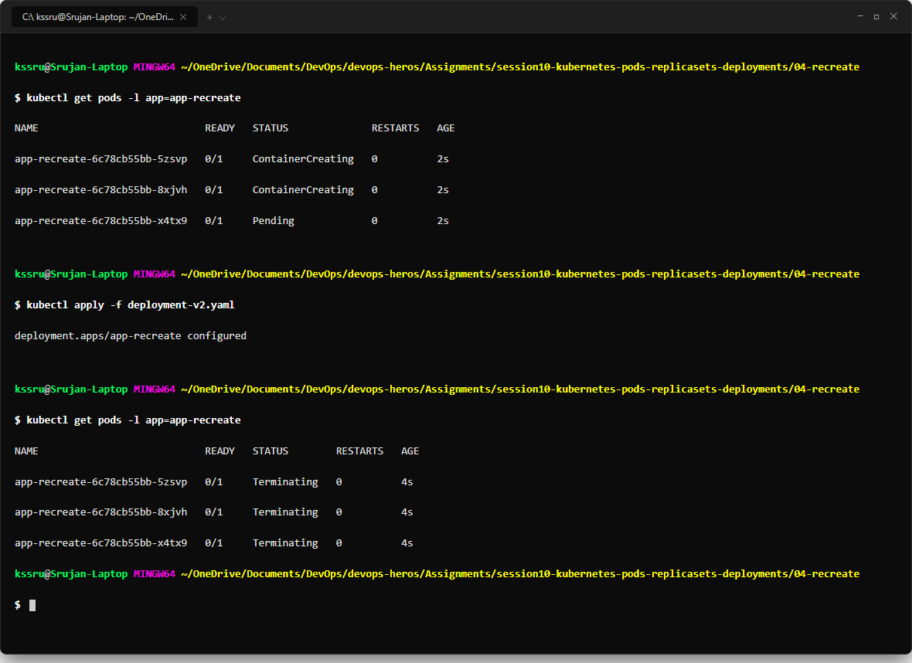
