# Session 10 - Kubernetes Pods, ReplicaSets, Deployment Strategies & Pod Lifecycle

## Student Details

- **Name:** Srujan Gowda KS
- **Roll Number:** 24BCS10339
- **Session:** 10 - Kubernetes Pods, ReplicaSets, Deployment Strategies & Pod Lifecycle

---

## Introduction

In this session, I studied and implemented the foundational primitives of Kubernetes workload management:
1. **Deployment Strategies**: Production release techniques designed to manage risk, ensure zero downtime, enable instant rollback, or handle stateful data migrations. We implemented all four primary deployment strategies:
   - **Rolling Update**: Progressive pod replacement ensuring constant availability.
   - **Blue-Green Deployment**: Full parallel environment provisioning with instantaneous traffic cutover.
   - **Canary Deployment**: Capacity-based incremental traffic routing (90% stable, 10% canary) to validate new releases against real traffic.
   - **Recreate Deployment**: Strict termination-before-creation cycle avoiding multi-version concurrency at the expense of temporary downtime.
2. **Pod Lifecycle & State Machine**: Granular observation of pod phases, scheduling constraints, container states (`Running`, `Waiting`, `Terminated`), container health probes (`startupProbe`, `livenessProbe`, `readinessProbe`), multi-container pod designs, and graceful shutdown lifecycle hooks.

---

<br>

# Task 1: Deployment Strategies

---

## 01. Rolling Update Strategy

### Objective
Deploy an application using Kubernetes' native default deployment strategy (`RollingUpdate`). Configure `maxSurge` and `maxUnavailable` parameters, trigger an application update from `v1` to `v2`, and verify seamless pod transitions with zero service interruption.

### Key Configuration
```yaml
spec:
  replicas: 4
  strategy:
    type: RollingUpdate
    rollingUpdate:
      maxSurge: 1          # Max 1 extra pod created above desired count (5 pods total during rollout)
      maxUnavailable: 0    # 0 pods can be missing, ensuring minimum 4 pods always serve traffic
```

### Commands Executed
```bash
cd session10-k8s-core-objects/01-rolling-update

# Step 1: Deploy v1 workload and expose via NodePort service
kubectl apply -f deployment-v1.yaml
kubectl apply -f service.yaml
kubectl rollout status deployment/app-rolling
kubectl get pods -l app=app-rolling --show-labels
kubectl get svc app-rolling-service

# Step 2: Trigger rolling update to v2 and inspect revision tracking
kubectl apply -f deployment-v2.yaml
kubectl rollout status deployment/app-rolling
kubectl get pods -l app=app-rolling --show-labels
kubectl rollout history deployment/app-rolling
```

### Observations & Architectural Analysis
- **Zero-Downtime Guarantee**: Because `maxUnavailable: 0` was enforced, Kubernetes spawned a new `v2` pod first. Once the new pod transitioned to the `Ready` state, Kubernetes sent a `SIGTERM` to one old `v1` pod.
- **Rollout History**: Running `kubectl rollout history` confirmed Revision 1 (`v1`, nginx:1.24) and Revision 2 (`v2`, nginx:1.25), allowing instantaneous rollbacks via `kubectl rollout undo` if needed.

### Output & Verification

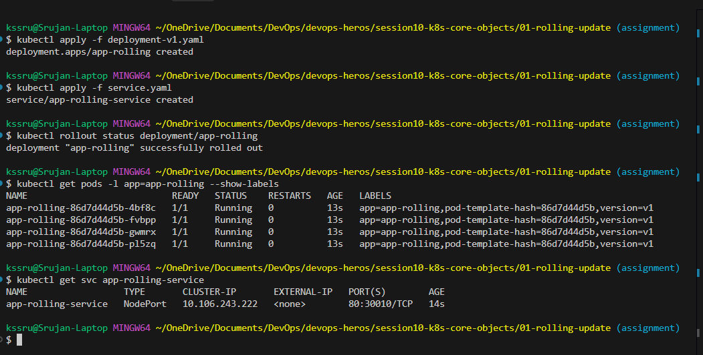

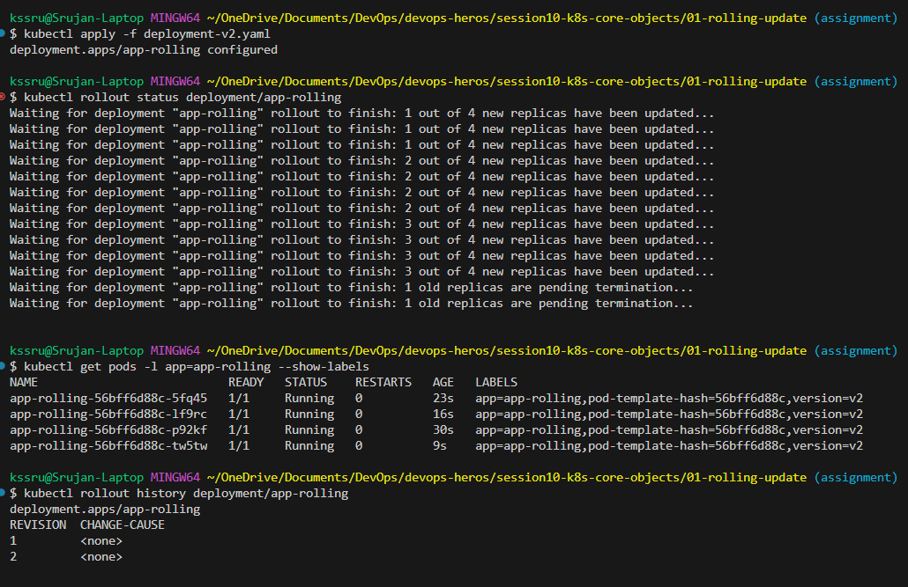

---

<br>

## 02. Blue-Green Deployment Strategy

### Objective
Maintain two complete, identical production environments (`app-blue` running `v1` and `app-green` running `v2`). Verify that initial live traffic routes exclusively to Blue, and perform an instantaneous cutover to Green by updating a single Service label selector with zero user downtime.

### Key Configuration
```yaml
# Blue-to-Green Traffic Cutover in Service selector
spec:
  selector:
    app: myapp
    slot: green    # Switched from 'slot: blue' to instantly route 100% traffic to Green
  ports:
    - port: 80
      targetPort: 80
      nodePort: 30020
```

### Commands Executed
```bash
cd session10-k8s-core-objects/02-blue-green

# Step 1: Deploy both Blue (v1) and Green (v2) environments simultaneously
kubectl apply -f deployment-blue.yaml
kubectl apply -f deployment-green.yaml
kubectl apply -f service-blue.yaml

# Verify all 6 pods are running and service points to Blue
kubectl get pods -l app=myapp --show-labels
kubectl describe svc myapp-service | grep -E "Selector|Endpoints"

# Step 2: Switch live traffic to Green by updating service selector
kubectl apply -f service-green.yaml
kubectl describe svc myapp-service | grep -E "Selector|Endpoints"

# Step 3: Validate live application response inside cluster
kubectl run test-curl --image=curlimages/curl -i --rm --restart=Never -- curl -s http://myapp-service
```

### Observations & Architectural Analysis
- **Environment Isolation**: Both environments operated in parallel on the cluster without interference. Blue ran 3 replicas of `version=v1,slot=blue` while Green ran 3 replicas of `version=v2,slot=green`.
- **Instant Cutover**: Applying `service-green.yaml` immediately updated the service endpoint controller in under 1 second. The service selector shifted from `slot=blue` to `slot=green`, instantly repointing endpoints to `10.244.0.23:80, 10.244.0.24:80, 10.244.0.22:80`.
- **Curl Output Verification**: Querying `myapp-service` returned:
  ```html
  <p>GREEN ENVIRONMENT</p>
  <p>Version: v2 | Slot: GREEN (STANDBY -> PROMOTED)</p>
  ```
- **Instant Rollback Capability**: If Green exhibited an unexpected issue, reverting to Blue only required re-applying `service-blue.yaml`.

### Output & Verification

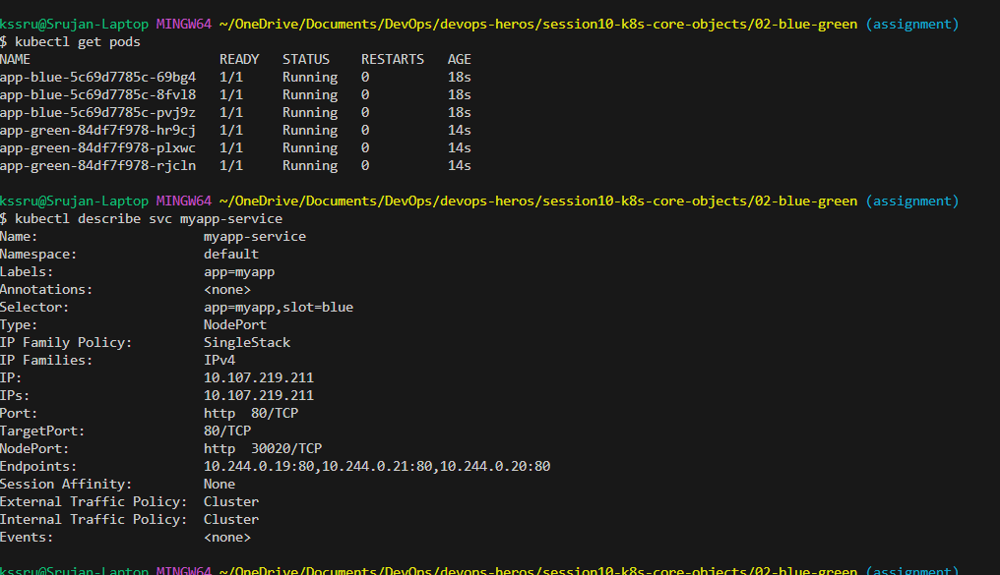

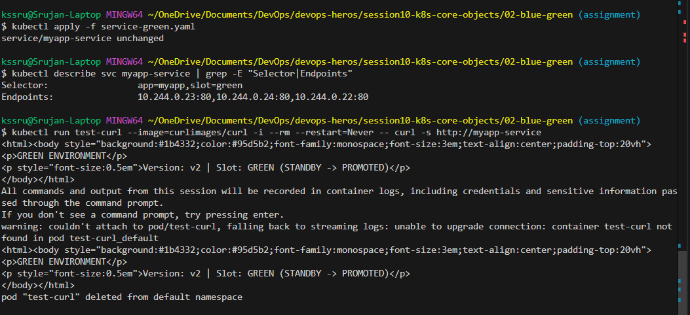

---

<br>

## 03. Canary Deployment Strategy

### Objective
Deploy a stable production version alongside a canary release. Route a small percentage of incoming live traffic (10%) to the canary pod while routing the majority (90%) to stable pods to validate behavior under real traffic conditions.

### Key Configuration
- **Stable Deployment**: 9 Replicas with labels `app: myapp-canary, track: stable, version: v1` (90% capacity).
- **Canary Deployment**: 1 Replica with labels `app: myapp-canary, track: canary, version: v2` (10% capacity).
- **Shared Service Selector**:
  ```yaml
  spec:
    selector:
      app: myapp-canary   # Selects BOTH stable and canary pods across all 10 endpoints
  ```

### Commands Executed
```bash
cd session10-k8s-core-objects/03-canary

# Step 1: Deploy stable (9 pods) and canary (1 pod) workloads
kubectl apply -f deployment-stable.yaml
kubectl apply -f deployment-canary.yaml
kubectl apply -f service.yaml

# Verify pod labels and service endpoints (10 total endpoints)
kubectl get pods -l app=myapp-canary --show-labels
kubectl describe svc myapp-canary-service | grep -E "Selector|Endpoints"

# Step 2: Test traffic distribution with 10 sequential requests
kubectl run test-curl --image=curlimages/curl -i --rm --restart=Never -- sh -c \
  'for i in $(seq 1 10); do curl -s http://myapp-canary-service | grep -o "STABLE v1\|CANARY v2"; done'
```

### Observations & Architectural Analysis
- **Native Kubernetes Traffic Ratio**: By leveraging Kubernetes' internal `kube-proxy` round-robin load balancer across 10 endpoints (9 stable + 1 canary), traffic naturally split into a **90% / 10%** distribution.
- **Traffic Validation Output**: The loop returned 9 hits to `STABLE v1` and 1 hit to `CANARY v2`:
  ```text
  STABLE v1
  STABLE v1
  STABLE v1
  STABLE v1
  STABLE v1
  STABLE v1
  STABLE v1
  STABLE v1
  CANARY v2
  ```
- **Risk Mitigation**: The canary pod allowed real-world testing without risking service disruption for the remaining 90% of user traffic.

### Output & Verification

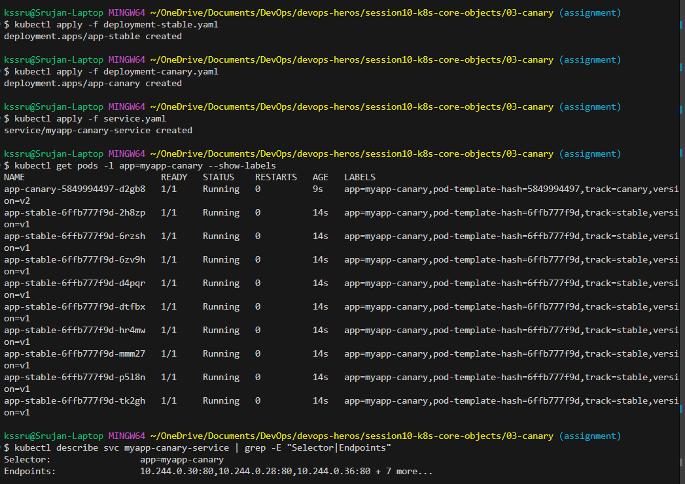

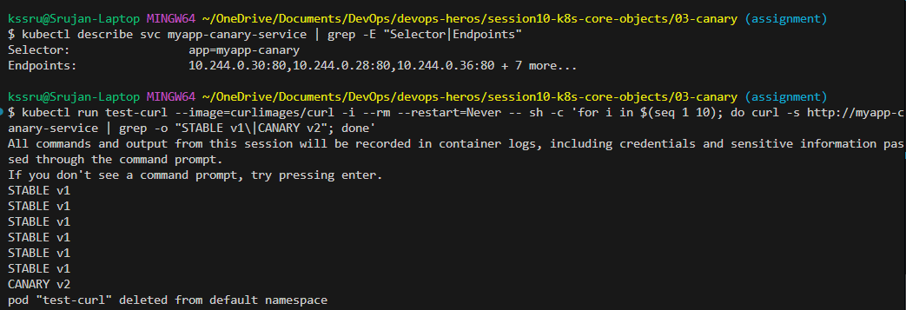

---

<br>

## 04. Recreate Deployment Strategy

### Objective
Deploy an application using the `Recreate` deployment strategy. Update the application to `v2` and observe the complete termination of all existing pods before any new version pods are scheduled.

### Key Configuration
```yaml
spec:
  replicas: 4
  strategy:
    type: Recreate   # Kills ALL existing pods before creating new ones
```

### Commands Executed
```bash
cd session10-k8s-core-objects/04-recreate

# Step 1: Deploy v1 with Recreate strategy
kubectl apply -f deployment-v1.yaml
kubectl apply -f service.yaml
kubectl get deployment app-recreate -o yaml | grep -A 2 -i "strategy"
kubectl get pods -l app=app-recreate --show-labels

# Step 2: Trigger update to v2 and observe outage/termination cycle
kubectl apply -f deployment-v2.yaml
kubectl get pods -l app=app-recreate
kubectl rollout status deployment/app-recreate
kubectl get pods -l app=app-recreate --show-labels
```

### Observations & Architectural Analysis
- **All-or-Nothing Transition**: Unlike `RollingUpdate`, `Recreate` terminated all 4 `v1` pods simultaneously. During this interval, **zero pods were available to serve traffic**, leading to planned downtime.
- **Production Use Case**: This strategy is necessary for legacy applications that cannot support multi-version database migrations or applications requiring exclusive singleton locks on persistent volumes (`ReadWriteOnce`).

### Output & Verification

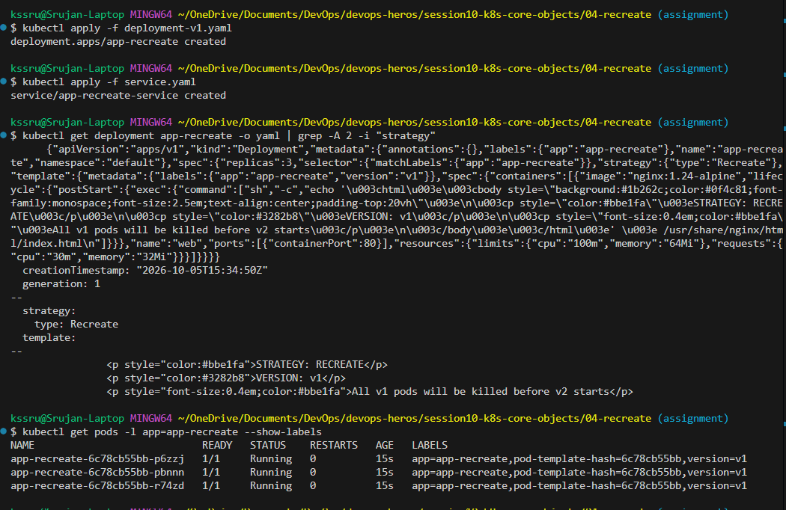

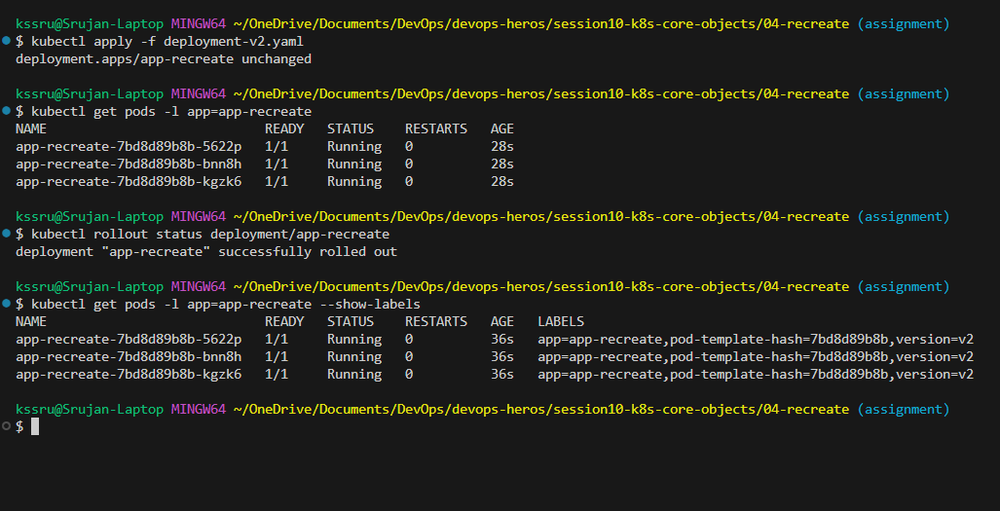

---

<br>

# Task 2: Pod Lifecycle & State Management

---

## Overview of the Pod Lifecycle State Machine

A Kubernetes Pod passes through distinct phases managed by the control plane and node kubelet:
1. **Pending**: Accepted by the API server but unscheduled (waiting on resources, node affinity, or volume attachment).
2. **Running**: Bound to a node; all containers created, with at least one container running or starting.
3. **Succeeded**: All containers terminated successfully with exit code 0 (`restartPolicy: Never` or `OnFailure`).
4. **Failed**: All containers terminated, and at least one container failed with a non-zero exit code.
5. **CrashLoopBackOff**: Repeated failure causing kubelet to implement an exponential backoff delay before re-attempting container restart.

---

## Phase 1: Core Lifecycle Phases (`Running`, `Pending`, `Succeeded`, `Failed`)

### Objective
Demonstrate the fundamental phases of pod execution, scheduling resource limits, batch jobs, and failure exit codes.

### Manifests & Design
- `01-running.yaml`: Standard Nginx workload running continuously.
- `02-pending.yaml`: Pod requesting `memory: 9Gi` on a single-node cluster, triggering scheduler resource failure.
- `03-succeeded.yaml`: Batch task executing `exit 0` with `restartPolicy: Never` &rarr; transitions to `Completed`.
- `04-failed.yaml`: Batch task executing `exit 1` with `restartPolicy: Never` &rarr; transitions to `Error`.

### Commands Executed
```bash
cd session10-k8s-core-objects/pod-lifecycle

kubectl apply -f 01-running.yaml
kubectl apply -f 02-pending.yaml
kubectl apply -f 03-succeeded.yaml
kubectl apply -f 04-failed.yaml
sleep 7

# Inspect pod states across the lifecycle
kubectl get pods | grep lifecycle-
kubectl describe pod lifecycle-pending | grep -A 3 "Events:"
```

### Observations
- `lifecycle-running` reached `Running` state immediately.
- `lifecycle-pending` remained `Pending`. Running `kubectl describe pod lifecycle-pending` confirmed the scheduler event:
  `Warning FailedScheduling: 0/1 nodes are available: 1 Insufficient memory.`
- `lifecycle-succeeded` showed status `Completed` (Exit code 0).
- `lifecycle-failed` showed status `Error` (Exit code 1).

### Output & Verification

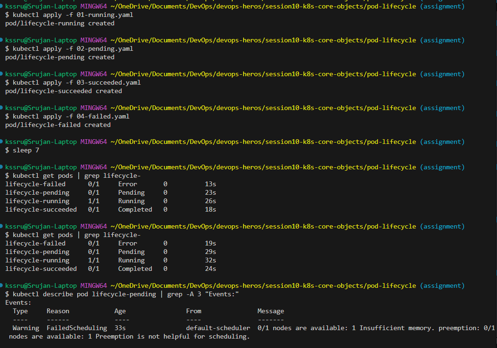

---

<br>

## Phase 2: Diagnostic & Error States (`CrashLoopBackOff`, `ImagePullBackOff`, Health Probes)

### Objective
Analyze container crash loops, image pull authentication/misconfiguration failures, and compare `startupProbe`, `livenessProbe`, and `readinessProbe` behavior.

### Manifests & Design
- `05-crashloopbackoff.yaml`: Container crashes (`exit 1`) with `restartPolicy: Always`. Kubelet retries with increasing delay (10s, 20s, 40s...).
- `06-imagepullbackoff.yaml`: Non-existent image `jakwehrgkaejw:kahsdfgkhj`, triggering `ErrImagePull` &rarr; `ImagePullBackOff`.
- `07-readiness.yaml`: Configured with `readinessProbe: httpGet: path: / port: 80`. Pod only receives traffic when ready.
- `08-liveness.yaml`: Configured with `livenessProbe: exec: test -f /tmp/healthy`. Automatically restarts unhealthy containers.
- `09-startup.yaml`: Configured with `startupProbe` to protect slow-starting applications before liveness probes activate.

### Commands Executed
```bash
kubectl apply -f 05-crashloopbackoff.yaml
kubectl apply -f 06-imagepullbackoff.yaml
kubectl apply -f 07-readiness.yaml
kubectl apply -f 08-liveness.yaml
kubectl apply -f 09-startup.yaml
sleep 15

# View diagnostic states
kubectl get pods | grep lifecycle-
```

### Observations
- `lifecycle-crashloop` cycled through restarts, incrementing restart count to `2` and transitioning into `CrashLoopBackOff`.
- `lifecycle-image-error` stalled in `ImagePullBackOff` as kubelet could not find the image manifest on remote registries.
- `lifecycle-readiness` reached `1/1 Ready` as the Nginx root endpoint responded with `HTTP 200`.
- `lifecycle-startup` remained `0/1 Running` while waiting for the 30-second initialization task to create `/tmp/started`.

### Output & Verification

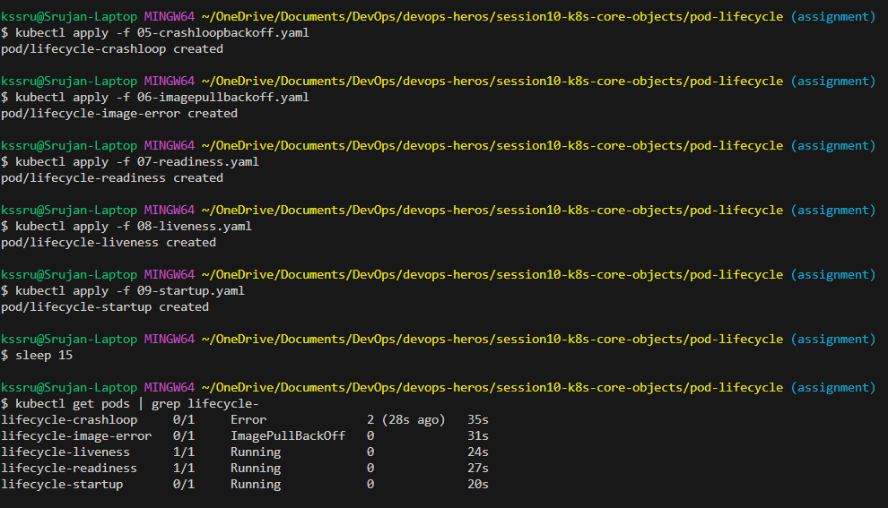

---

<br>

## Phase 3: Advanced Pod Patterns (Init Containers, Multi-Container Pods & Graceful Termination)

### Objective
Demonstrate ordered pod initialization (`initContainers`), multi-container sidecar patterns sharing network and lifecycle contexts, and graceful termination hooks (`preStop` / `SIGTERM`).

### Manifests & Design
- `10-init-container.yaml`: An `initContainer` runs a 10-second setup script before the main Nginx container starts.
- `11-multi-container.yaml`: Pod running two co-located containers (`app` + `sidecar`) sharing the same `localhost` network namespace (`2/2 Ready`).
- `12-termination.yaml`: Configured with `terminationGracePeriodSeconds: 20` and a `preStop` trap catching `SIGTERM` to complete cleanup before exit.

### Commands Executed
```bash
kubectl apply -f 10-init-container.yaml
kubectl apply -f 11-multi-container.yaml
kubectl apply -f 12-termination.yaml
sleep 12

# Inspect multi-container and initialized pods
kubectl get pods | grep lifecycle-

# Trigger graceful termination and observe shutdown lifecycle
kubectl delete pod lifecycle-termination --wait=false
kubectl get pods | grep lifecycle-
```

### Observations
- `lifecycle-init`: Blocked main container initialization during `Init:0/1`, then smoothly transitioned to `1/1 Running` once the initialization script finished.
- `lifecycle-multi-container`: Confirmed `2/2 Ready` status, validating multi-container scheduling in a single pod specification.
- `lifecycle-termination`: When `kubectl delete` was invoked, the pod immediately entered `Terminating`. The container's signal trap caught `SIGTERM` and executed the 10-second graceful cleanup routine before completing shutdown.

### Output & Verification

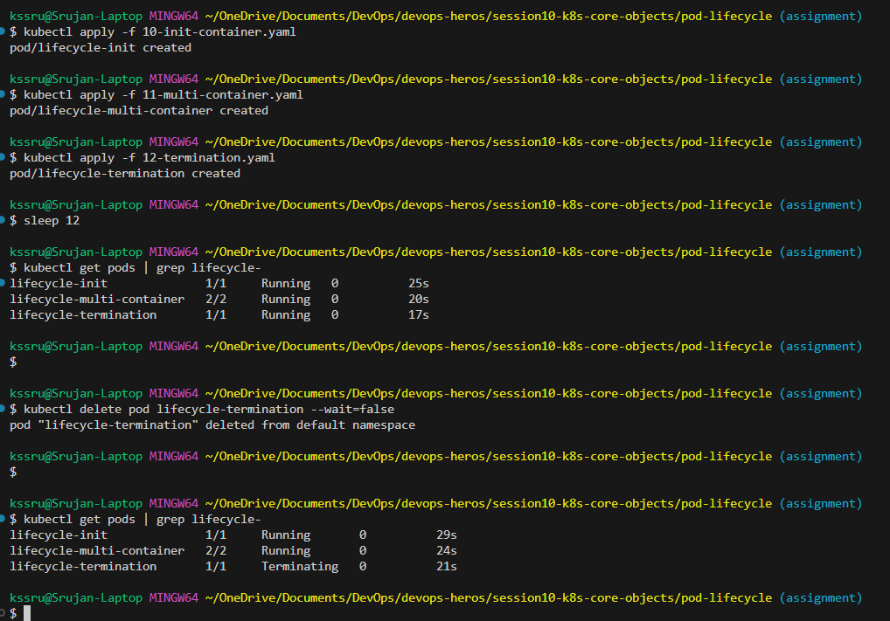

---

<br>

# Summary Comparison

### Deployment Strategies

| Strategy | Zero Downtime? | Concurrency Risk | Cost / Resource Overhead | Rollback Speed | Best Use Case |
|---|---|---|---|---|---|
| **Rolling Update** | Yes | Low (v1 and v2 coexist) | Moderate (`maxSurge: 1`) | Fast (`kubectl rollout undo`) | Default for stateless microservices & web apps |
| **Blue-Green** | Yes | Zero (independent environments) | High (2x full replica capacity) | Instantaneous (< 5s selector change) | Critical releases, incompatible DB schema changes |
| **Canary** | Yes | Low (controlled 10% test pool) | Minimal | Fast (scale down canary to 0) | High-risk feature validation on production traffic |
| **Recreate** | No (downtime) | Zero (v1 terminated first) | Lowest (no surge needed) | Slow | Stateful apps, single-instance DBs, RWX disk locks |

### Kubernetes Health Probes Comparison

| Probe Type | Purpose | Action on Failure |
|---|---|---|
| **Startup Probe** | Detects slow application startup | Kills container and restarts it according to `restartPolicy` |
| **Liveness Probe** | Detects application deadlocks or unrecoverable freezes | Kills unhealthy container and triggers restart |
| **Readiness Probe** | Detects if application is ready to accept user network traffic | Removes Pod IP from Service Endpoints (no traffic routed) |
