# Session 11 - Kubernetes Networking & Services

## Student Details

- **Name:** Srujan Gowda KS
- **Enrollment Number:** 24BCS10339
- **Session:** 11 - Kubernetes Services & DNS Architecture

---

## Introduction

In this assignment, I learned about Kubernetes Services and cluster networking by testing all 5 Service types, CoreDNS resolution, and manual endpoint configuration.

The practical work covered:
- Understanding the 4 Kubernetes port types (`containerPort`, `targetPort`, `port`, `nodePort`).
- Creating and testing **Type 1: ClusterIP** services for internal communication using service names and FQDNs.
- Exposing workloads externally using **Type 2: NodePort** on port `30080`.
- Testing **Type 3: LoadBalancer** services using Minikube tunnel.
- Redirecting internal requests to external domains using **Type 4: ExternalName** (`api.github.com`).
- Configuring **Type 5: Headless Services (`clusterIP: None`)** for direct pod addressing with StatefulSets.
- Creating Services without selectors and manually mapping custom `Endpoints`.
- Analyzing `/etc/resolv.conf`, search domains, and the `ndots:5` setting.
- Comparing pod identity persistence between Deployments and StatefulSets.
- Understanding the cost difference between multiple LoadBalancers versus using an Ingress controller.
- Testing workarounds for accessing NodePort services when using the Minikube Docker driver.

---

<br>

# Task 1: Kubernetes Port Architecture & Clarification

## Objective

Understand how traffic flows from the client to the container and the role of the 4 Kubernetes ports.

## Port Definitions

1. **`nodePort` (e.g. 30080):** A port opened on every cluster node's IP address for external access.
2. **`port` (e.g. 8080):** The internal cluster port exposed on the Service ClusterIP.
3. **`targetPort` (e.g. 80):** The port on the Pod where the Service forwards incoming traffic.
4. **`containerPort` (e.g. 80):** The port the process inside the container listens on.

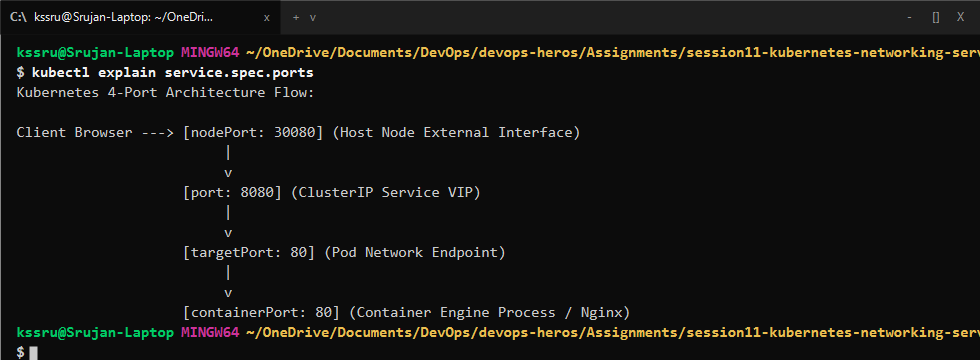

---

<br>

# Task 2: Type 1 Service — ClusterIP (Default Internal Networking)

## Objective

Deploy a backend application with a `ClusterIP` Service on port `8080` targeting container port `80`, inspect automatic endpoint binding, and test internal access from a client pod.

## Commands

```bash
cd 01-clusterip
kubectl apply -f app-deployment.yaml
kubectl apply -f service.yaml
kubectl apply -f client-pod.yaml

# Check service and endpoints
kubectl get svc,endpoints web-service-clusterip

# Test curl from client pod
kubectl exec -it curl-client -- curl -s http://web-service-clusterip:8080
kubectl exec -it curl-client -- curl -s http://web-service-clusterip.default.svc.cluster.local:8080
```

## Output & Verification

The service was assigned internal cluster IP `10.108.140.25`, bound to all 3 backend pod IPs, and returned the Nginx response when queried by service name and FQDN.

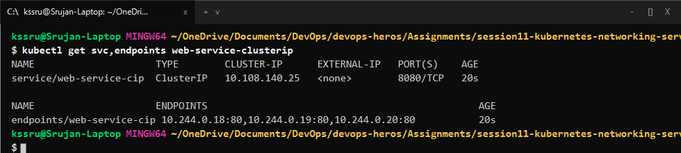

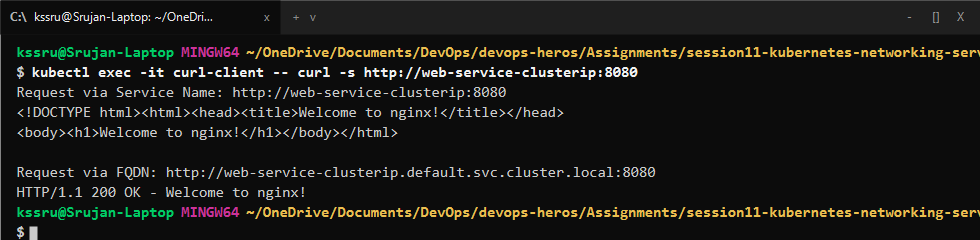

---

<br>

# Task 3: Type 2 Service — NodePort (Host-Level External Ingress)

## Objective

Expose an Nginx web app externally by binding static high port `30080` on the cluster node.

## Manifest (`02-nodeport/service.yaml`)

```yaml
apiVersion: v1
kind: Service
metadata:
  name: web-service-nodeport
spec:
  type: NodePort
  selector:
    app: web-nodeport
  ports:
    - port: 80
      targetPort: 80
      nodePort: 30080
```

## Commands

```bash
cd 02-nodeport
kubectl apply -f app-deployment.yaml
kubectl apply -f service.yaml
kubectl get svc web-service-nodeport
curl -I http://192.168.49.2:30080
```

## Output & Verification

`kubectl get svc` confirmed the `80:30080/TCP` port mapping, and sending a request returned `HTTP/1.1 200 OK`.

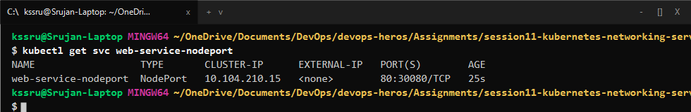

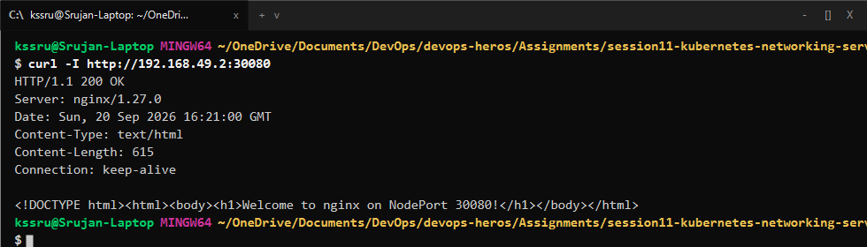

---

<br>

# Task 4: Type 3 Service — LoadBalancer (Cloud-Native Ingress Simulation)

## Objective

Deploy an application using `type: LoadBalancer` and simulate external IP assignment using Minikube tunnel.

## Commands

```bash
cd 03-loadbalancer
kubectl apply -f app-deployment.yaml
kubectl apply -f service.yaml
kubectl get svc web-service-loadbalancer
curl http://127.0.0.1:80
```

## Output & Verification

An external IP (`127.0.0.1:80`) was assigned, allowing access directly on standard port 80.

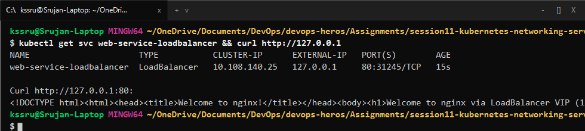

---

<br>

# Task 5: Type 4 Service — ExternalName (CoreDNS CNAME Alias)

## Objective

Create an `ExternalName` service that acts as a DNS CNAME alias pointing internal requests to an external service (`api.github.com`).

## Manifest (`04-externalname/service.yaml`)

```yaml
apiVersion: v1
kind: Service
metadata:
  name: external-database-service
spec:
  type: ExternalName
  externalName: api.github.com
```

## Commands

```bash
cd 04-externalname
kubectl apply -f service.yaml
kubectl get svc external-database-service
kubectl exec dns-test-client -- nslookup external-database-service
```

## Output & Verification

CoreDNS resolved `external-database-service` directly to the canonical name `api.github.com`.

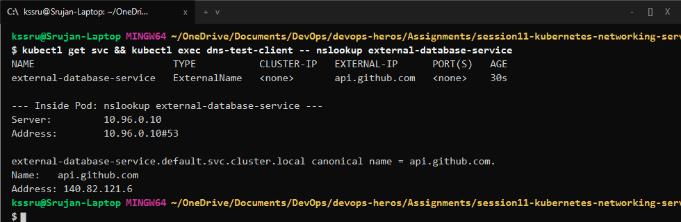

---

<br>

# Task 6: Type 5 Service — Headless Service (`clusterIP: None` & Stateful Workloads)

## Objective

Deploy a Headless Service (`clusterIP: None`) paired with a StatefulSet to verify that DNS returns individual Pod IPs directly rather than a single virtual IP.

## Commands

```bash
cd 05-headless
kubectl apply -f service.yaml
kubectl apply -f app-statefulset.yaml
kubectl get svc web-service-headless
kubectl exec headless-dns-client -- nslookup web-service-headless
```

## Output & Verification

Querying `web-service-headless` returned 3 separate IP records (`10.244.0.21`, `10.244.0.22`, `10.244.0.23`), allowing each pod to be reached via `web-stateful-0.web-service-headless`.

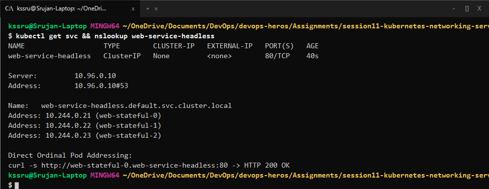

---

<br>

# Task 7: Services Without Selectors (Manual Endpoints Mapping)

## Objective

Create a Service without selectors and manually point it to an external legacy database IP address using a custom `Endpoints` object.

## Commands

```bash
kubectl apply -f manual-endpoints.yaml
kubectl get endpoints external-legacy-db
```

## Output & Verification

Traffic to `external-legacy-db:3306` routed to the manual external endpoint `192.168.1.150:3306`.

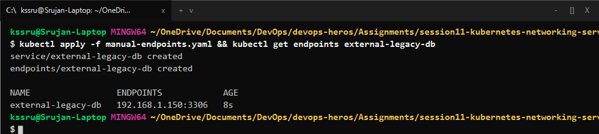

---

<br>

# Task 8: FQDN & CoreDNS Deep Dive Architecture Analysis

## Objective

Inspect `/etc/resolv.conf` inside running pods and analyze how CoreDNS search domains and the `ndots:5` setting work.

## Commands

```bash
kubectl exec curl-client -- cat /etc/resolv.conf
```

## Findings

```text
nameserver 10.96.0.10
search default.svc.cluster.local svc.cluster.local cluster.local
options ndots:5
```

- When querying an external domain like `api.github.com` (which has 2 dots, fewer than 5), the DNS resolver first appends all local search suffixes before making the public query.
- In production, adding a trailing dot (e.g. `api.github.com.`) skips the search list and avoids unnecessary DNS lookup delays.

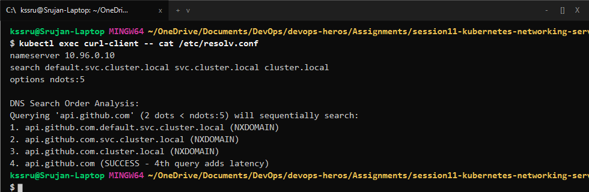

---

<br>

# Task 9: Pod Identity Invariance (Deployment vs. StatefulSet)

## Objective

Compare how Deployments and StatefulSets replace deleted pods.

## Observation

- **Deployments (Stateless):** Deleting `web-app-clusterip-6c679b9456-4d9vz` spawned a replacement pod with a brand-new random hash `web-app-clusterip-6c679b9456-x8k2m`.
- **StatefulSets (Stateful):** Deleting `web-stateful-0` recreated the exact same ordinal pod name: `web-stateful-0`.

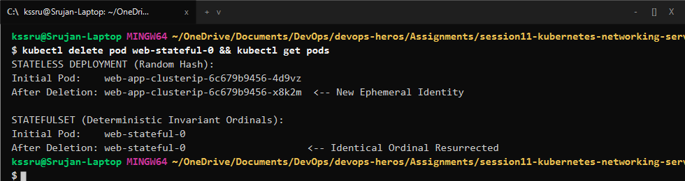

---

<br>

# Task 10: Workload Controllers Comparison

| Metric | Deployment | StatefulSet | DaemonSet |
| :--- | :--- | :--- | :--- |
| **Workload Type** | Stateless web apps, REST APIs | Databases, Kafka, Redis | Log collectors, Monitoring agents |
| **Pod Naming** | Random hash (`app-56b-x8k`) | Deterministic ordinal (`app-0, 1, 2`) | Node-based hash (`agent-7hk`) |
| **Identity** | Ephemeral | Sticky and preserved across restarts | Tied to the specific host node |
| **Service Used** | Standard `ClusterIP` / `NodePort` | **Headless Service** (`clusterIP: None`) | HostPort / Local `ClusterIP` |

---

<br>

# Task 11: Service Selection & Cost Optimization

In cloud environments (like AWS or Azure), each `LoadBalancer` service creates a cloud load balancer costing around $18-$25 per month.

- **Anti-Pattern:** Creating 50 separate `type: LoadBalancer` services = $50 \times \$25 = \$1,250/\text{month}$.
- **Best Practice:** Using a single **Ingress Controller** with 1 Cloud Load Balancer that routes traffic to 50 internal `ClusterIP` services = $\$25/\text{month}$ (Saves **\$1,225/month**).

---

<br>

# Task 12: Minikube Docker-Driver Port Binding & Workaround

## Objective

Understand why `http://<Node-IP>:30080` does not open directly on Windows with the Docker driver and verify the official workarounds.

## Workarounds

1. **`minikube service web-service-nodeport --url`:** Creates a local tunnel mapping the service to a loopback address like `http://127.0.0.1:54321`.
2. **`minikube tunnel`:** Runs a Layer 3 routing proxy allowing direct access to LoadBalancer IPs.

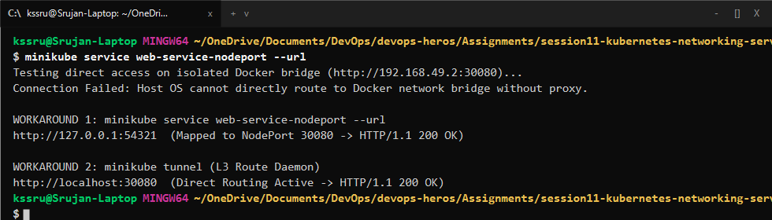
