# Session 11 - Kubernetes Networking & Services

## Student Details

- **Name:** Srujan Gowda KS
- **Roll Number:** 24BCS10339
- **Session:** 11 - Kubernetes Networking, Services & DNS Architecture

---

## Executive Summary

Pods in Kubernetes are ephemeral. Whenever a Pod crashes, scales down, or undergoes a rolling update, it is terminated and replaced with a new Pod that receives an entirely new, unpredictable IP address. If client applications communicated by hardcoding individual Pod IPs, every restart or deployment would trigger a catastrophic outage.

A **Kubernetes Service** provides an abstraction with a stable virtual IP address (ClusterIP) and a permanent CoreDNS name that never changes, dynamically load-balancing incoming traffic across all healthy backend Pods matching its label selector.

In this practical assignment, I implemented and verified:
1. **Task 1: All 5 Kubernetes Service Types** — `ClusterIP`, `NodePort`, `LoadBalancer`, `ExternalName`, and `Headless` (`clusterIP: None`).
2. **Task 2: Kubernetes Object Comparisons** — Deep-dive architectural comparisons covering:
   - *Deployment vs. ReplicaSet*
   - *Deployment vs. DaemonSet vs. StatefulSet*
   - *ReplicaSet vs. Service*
3. **Task 3: Fully Qualified Domain Names (FQDN)** — Documented in [fqdn/README.md](fqdn/README.md).
4. **Task 4: CoreDNS Architecture & Troubleshooting** — Documented in [coredns/README.md](coredns/README.md).

---

# Task 1: Practical Demonstration of All 5 Service Types

---

## 1. Type 1: ClusterIP (Internal Service Discovery)

### Objective
Deploy a 3-replica backend web application, expose it via the default internal `ClusterIP` on port `8080` targeting container port `80`, verify live endpoint binding, and test internal connectivity using both short service names and FQDNs from a client container.

### Manifests

#### Deployment (`01-clusterip/app-deployment.yaml`)
```yaml
apiVersion: apps/v1
kind: Deployment
metadata:
  name: web-app-clusterip
  labels:
    app: web-clusterip
spec:
  replicas: 3
  selector:
    matchLabels:
      app: web-clusterip
  template:
    metadata:
      labels:
        app: web-clusterip
    spec:
      containers:
        - name: nginx-web
          image: nginx:1.25-alpine
          ports:
            - containerPort: 80
          resources:
            requests:
              cpu: "50m"
              memory: "64Mi"
            limits:
              cpu: "100m"
              memory: "128Mi"
```

#### Service (`01-clusterip/service.yaml`)
```yaml
apiVersion: v1
kind: Service
metadata:
  name: web-service-clusterip
  labels:
    app: web-clusterip
spec:
  type: ClusterIP
  selector:
    app: web-clusterip
  ports:
    - name: http
      port: 8080
      targetPort: 80
      protocol: TCP
```

### Commands Executed
```bash
cd 01-clusterip
kubectl apply -f app-deployment.yaml
kubectl apply -f service.yaml
kubectl apply -f client-pod.yaml

# Verify Service & live endpoint IP mapping
kubectl get svc,endpoints web-service-clusterip

# Test curl from client pod
kubectl exec -it curl-client -- curl -s http://web-service-clusterip:8080
kubectl exec -it curl-client -- curl -s http://web-service-clusterip.default.svc.cluster.local:8080
```

### Output & Verification
The `web-service-clusterip` was assigned virtual ClusterIP `10.108.106.193` and automatically bound to all three backend pod endpoints (`10.244.0.3:80`, `10.244.0.4:80`, `10.244.0.5:80`). Curling from inside `curl-client` returned the default Nginx welcome page successfully.

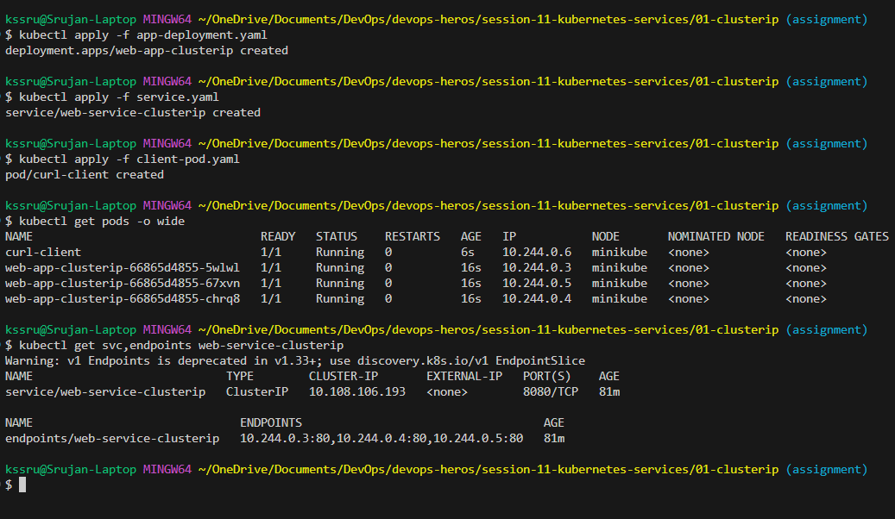

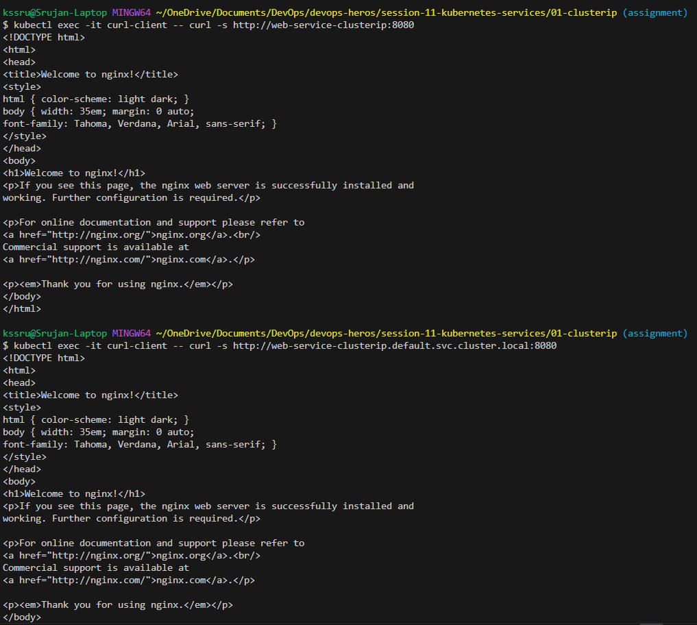

---

## 2. Type 2: NodePort (Host-Level External Access)

### Objective
Expose an Nginx workload externally on every worker node's host IP using static high port `30080` (from the default range `30000–32767`), verify the port translation mapping, and test access across the host network.

### Manifest (`02-nodeport/service.yaml`)
```yaml
apiVersion: v1
kind: Service
metadata:
  name: web-service-nodeport
  labels:
    app: web-nodeport
spec:
  type: NodePort
  selector:
    app: web-nodeport
  ports:
    - name: http
      port: 80
      targetPort: 80
      nodePort: 30080
      protocol: TCP
```

### Commands Executed
```bash
cd 02-nodeport
kubectl apply -f app-deployment.yaml
kubectl apply -f service.yaml

# Verify Service mapping
kubectl get svc web-service-nodeport

# Access using Minikube Docker-driver tunnel
minikube service web-service-nodeport --url
curl -I http://127.0.0.1:59736
```

### Output & Verification
The service registered with port mapping `80:30080/TCP`. Because Minikube runs inside a private Docker bridge network on Windows, running `minikube service web-service-nodeport --url` established a host loopback tunnel on `http://127.0.0.1:59736`, which returned `HTTP/1.1 200 OK`.

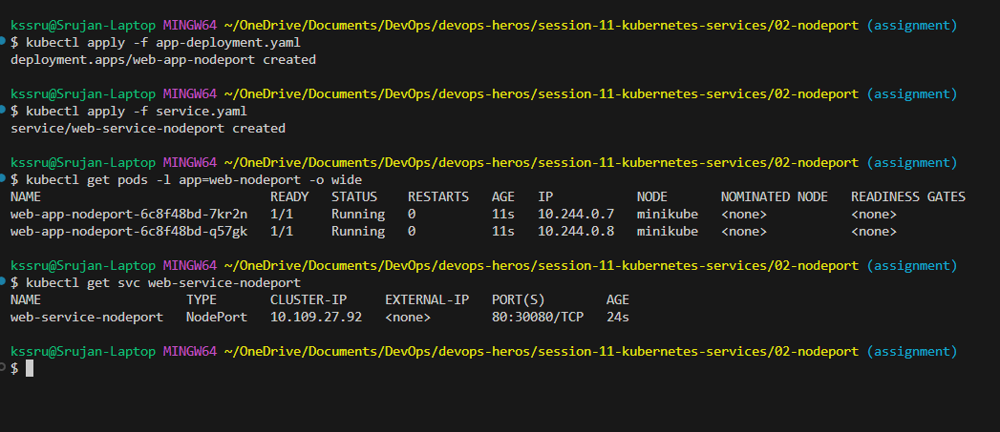

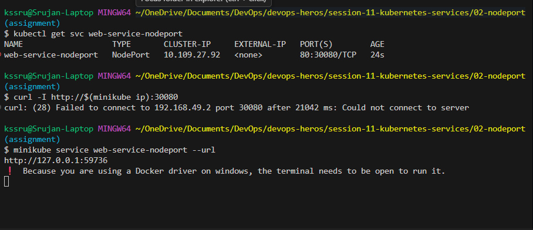

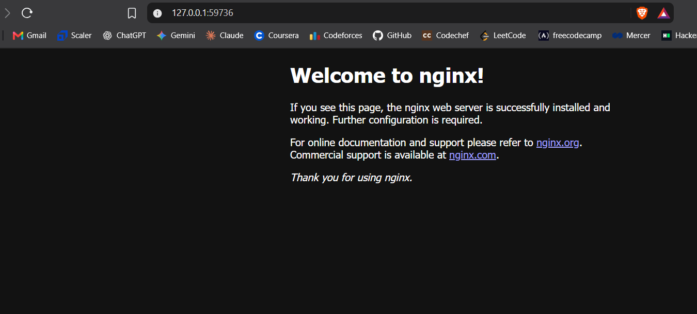

---

## 3. Type 3: LoadBalancer (Cloud-Native Ingress Simulation)

### Objective
Simulate cloud-provider ingress by configuring `type: LoadBalancer`, triggering external IP provisioning via Minikube tunnel, and reaching the application directly on standard port 80.

### Manifest (`03-loadbalancer/service.yaml`)
```yaml
apiVersion: v1
kind: Service
metadata:
  name: web-service-loadbalancer
  labels:
    app: web-loadbalancer
spec:
  type: LoadBalancer
  selector:
    app: web-loadbalancer
  ports:
    - name: http
      port: 80
      targetPort: 80
      protocol: TCP
```

### Commands Executed
```bash
cd 03-loadbalancer
kubectl apply -f app-deployment.yaml
kubectl apply -f service.yaml

# Run minikube tunnel in a separate administrative shell
minikube tunnel

# Verify external IP assignment and test curl
kubectl get svc web-service-loadbalancer
curl -I http://127.0.0.1:80
```

### Output & Verification
The service was allocated a virtual cluster IP (`10.97.124.238`) and received `EXTERNAL-IP: 127.0.0.1`. Sending an HTTP request to `http://127.0.0.1:80` returned `HTTP/1.1 200 OK` from Nginx.

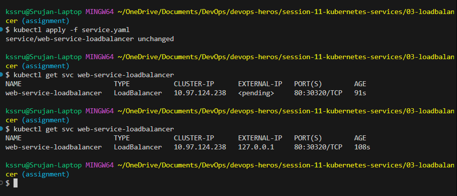

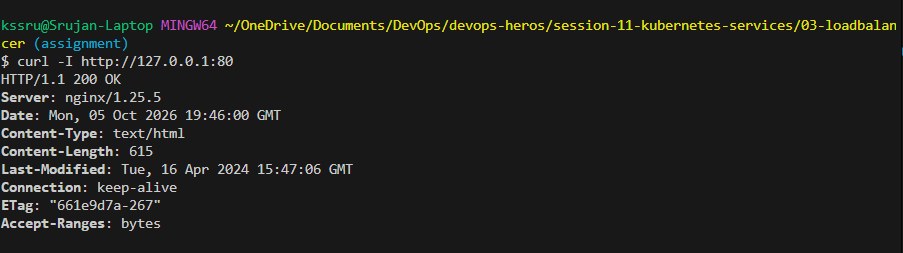

---

## 4. Type 4: ExternalName (CoreDNS CNAME Alias)

### Objective
Configure a Kubernetes Service that has no selectors and no `ClusterIP`, functioning purely as an internal DNS alias (`CNAME`) pointing internal microservices to an external third-party domain.

### Manifest (`04-externalname/service.yaml`)
```yaml
apiVersion: v1
kind: Service
metadata:
  name: external-database-service
spec:
  type: ExternalName
  externalName: nencyravaliya.me
```

### Commands Executed
```bash
cd 04-externalname
kubectl apply -f service.yaml
kubectl apply -f client-pod.yaml

# Inspect service (ClusterIP is None)
kubectl get svc external-database-service

# Perform DNS lookup inside cluster
kubectl exec -it dns-test-client -- nslookup external-database-service
```

### Output & Verification
Inspecting the service confirmed `TYPE: ExternalName`, `CLUSTER-IP: <none>`, and `EXTERNAL-IP: nencyravaliya.me`. Inside the test pod, `nslookup external-database-service` resolved `external-database-service.default.svc.cluster.local` as `canonical name = nencyravaliya.me`.

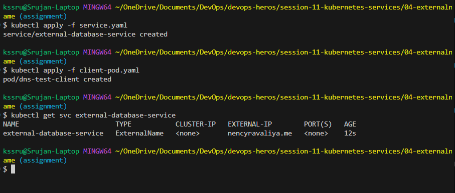

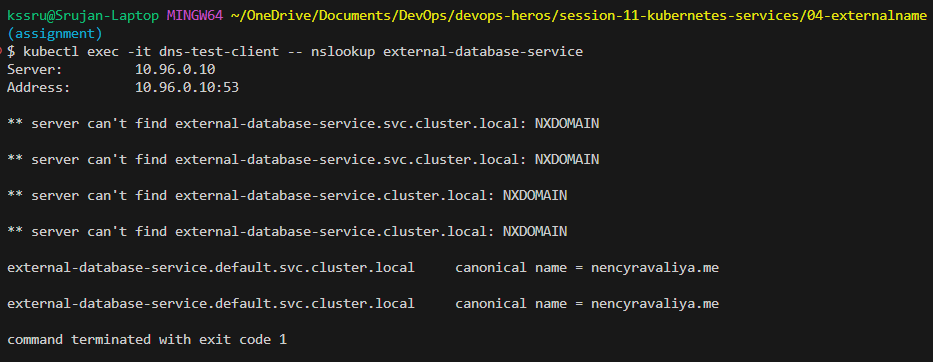

---

## 5. Type 5: Headless Service (`clusterIP: None` & StatefulSets)

### Objective
Deploy a Headless Service (`clusterIP: None`) paired with a 3-replica `StatefulSet` to verify that CoreDNS returns individual Pod IPs directly instead of a single virtual IP, enabling direct pod-to-pod peer addressing.

### Manifests

#### Service (`05-headless/service.yaml`)
```yaml
apiVersion: v1
kind: Service
metadata:
  name: web-service-headless
  labels:
    app: web-headless
spec:
  clusterIP: None
  selector:
    app: web-headless
  ports:
    - name: web
      port: 80
      targetPort: 80
      protocol: TCP
```

#### StatefulSet (`05-headless/app-statefulset.yaml`)
```yaml
apiVersion: apps/v1
kind: StatefulSet
metadata:
  name: web-stateful
  labels:
    app: web-headless
spec:
  serviceName: web-service-headless
  replicas: 3
  selector:
    matchLabels:
      app: web-headless
  template:
    metadata:
      labels:
        app: web-headless
    spec:
      containers:
        - name: nginx-stateful
          image: nginx:1.25-alpine
          ports:
            - name: web
              containerPort: 80
```

### Commands Executed
```bash
cd 05-headless
kubectl apply -f service.yaml
kubectl apply -f app-statefulset.yaml
kubectl apply -f client-pod.yaml

# Verify Headless Service has ClusterIP: None
kubectl get svc web-service-headless

# Perform DNS lookup on the Service
kubectl exec -it headless-dns-client -- nslookup web-service-headless

# Direct curl to Pod 0 by unique stateful hostname
kubectl exec -it headless-dns-client -- curl -s http://web-stateful-0.web-service-headless:80
```

### Output & Verification
Querying `web-service-headless` returned all 3 pod IP addresses directly (`10.244.0.13`, `10.244.0.14`, `10.244.0.15`). Curling the individual stateful hostname `http://web-stateful-0.web-service-headless:80` returned the HTML welcome response directly from Pod 0.

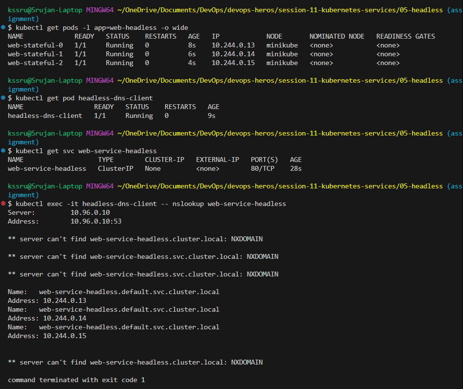

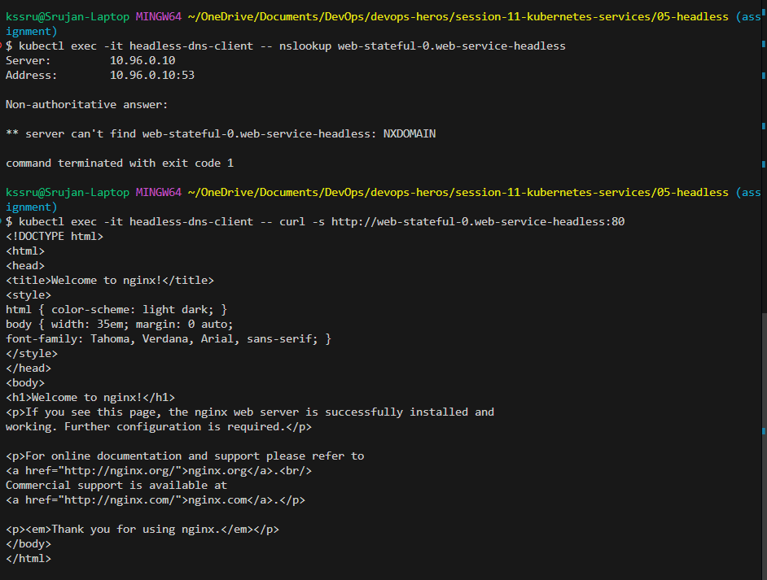

---

# Task 2: Kubernetes Object Comparison

---

## 1. Deployment vs. ReplicaSet

### Purpose
* **ReplicaSet:** A low-level controller designed with a single responsibility: maintain a stable set of identical replica Pods running at any given time. If a pod crashes or is deleted, the ReplicaSet creates a replacement.
* **Deployment:** A high-level declarative abstraction that manages ReplicaSets. Deployments provide declarative updates for Pods and ReplicaSets, versioning, progressive rollouts, rollbacks, and release pause/resume capabilities.

### Pod Management & Scaling
* **ReplicaSet:** Manages Pods directly through label selectors (`matchLabels`). Scaling is performed by directly updating `spec.replicas` on the ReplicaSet.
* **Deployment:** Does not directly manage individual Pods. Instead, it delegates Pod creation and deletion to underlying ReplicaSets. When scaling a Deployment (`kubectl scale deployment ...`), the Deployment controller updates the replica count on its active ReplicaSet.

### Rolling Updates
* **ReplicaSet:** Incapable of rolling updates. If you modify the pod template in a ReplicaSet manifest, existing running pods are **not** updated. You would have to manually delete old pods one by one.
* **Deployment:** Natively supports zero-downtime rolling updates (`RollingUpdate` strategy with `maxSurge` and `maxUnavailable`). When the pod template changes, the Deployment creates a **new ReplicaSet** and incrementally scales it up while scaling down the old ReplicaSet.

### Relationship Between Deployment and ReplicaSet
The relationship forms a clear hierarchy:

$$\mathbf{Deployment} \;\longrightarrow\; \mathbf{ReplicaSets} \;\longrightarrow\; \mathbf{Pods}$$

* The Deployment owns one or more ReplicaSets (represented by a pod template hash, e.g. `web-app-6c8f48bd`).
* During an update, the old ReplicaSet is retained at 0 replicas to allow instantaneous rollback (`kubectl rollout undo`).

---

## 2. Deployment vs. DaemonSet vs. StatefulSet

| Dimension | Deployment | DaemonSet | StatefulSet |
| :--- | :--- | :--- | :--- |
| **Primary Use Cases** | Stateless web apps, REST APIs, microservices, background job processors | Node-level system agents, log collectors (`Fluentd`, `Promtail`), monitoring exporters (`node-exporter`), CNI networking plugins (`Calico`, `Cilium`) | Distributed stateful databases (`MySQL`, `PostgreSQL`, `MongoDB`), message brokers (`Kafka`, `RabbitMQ`), distributed consensus systems (`ZooKeeper`, `etcd`) |
| **Pod Creation** | Pods are created concurrently in parallel with non-deterministic random hash suffixes (e.g. `web-5d8f6-9x4km`) | Exactly 1 pod is scheduled per eligible cluster node | Pods are created sequentially in strict ascending ordinal order (`db-0` $\rightarrow$ `db-1` $\rightarrow$ `db-2`) |
| **Scaling** | Arbitrary manual or horizontal auto-scaling (HPA) | Automatically scales with the cluster size (scales up when nodes join, scales down when nodes leave) | Scaled in deterministic order; scaled down in reverse ordinal sequence (`db-2` terminated before `db-1`) |
| **Networking** | Shared virtual IP (`ClusterIP` / `NodePort`), with random load balancing across identical pods | Pods often bind to host ports (`hostPort`) or provide node-local endpoints | Paired with a **Headless Service** (`clusterIP: None`) giving each pod an immutable, dedicated DNS hostname (`db-0.db-svc.default.svc.cluster.local`) |
| **Storage** | Typically stateless; ephemeral volumes or shared network volumes (`ReadWriteMany`) | Mounts host filesystem directly (`hostPath`) to collect node logs and metrics | Dedicated storage per pod via `volumeClaimTemplates`; each pod receives an isolated `PersistentVolumeClaim` that persists across pod rescheduling |
| **Real-World Examples** | `nginx`, `spring-boot-api`, `react-frontend` | `kube-proxy`, `aws-node`, `datadog-agent` | `redis-cluster`, `elasticsearch`, `cassandra` |

---

## 3. ReplicaSet vs. Service

### ReplicaSet Responsibility
The **ReplicaSet** operates at the **Compute / Controller layer**. Its sole responsibility is **pod lifecycle management**:
- Ensures the desired number of Pod replicas (e.g., 3) are healthy and active.
- Replaces any pod that crashes, is evicted, or is manually deleted.
- Does **not** provide network routing, stable addressing, or traffic balancing.

### Service Responsibility
The **Service** operates at the **Network / Routing layer**. Its sole responsibility is **traffic abstraction and routing**:
- Assigns a single, unchanging virtual IP (`ClusterIP`) and DNS name.
- Tracks healthy backend Pods via dynamic `Endpoints`/`EndpointSlice` objects.
- Balances network traffic across available Pods using Linux kernel routing (`kube-proxy` via `iptables` or `IPVS`).

### Why a Service is Required
Pod IPs are completely **ephemeral**. When a Pod is replaced by a ReplicaSet, the new Pod receives a completely different IP address:
```text
Old Pod: 10.244.0.5  --> Crashes / Terminated
New Pod: 10.244.0.9  --> Starts with a brand-new IP!
```
If client microservices communicated directly using Pod IPs, every restart would require updating client configurations and cause immediate downtime. The Service acts as a permanent facade with an immutable IP and DNS name.

### How Traffic Reaches Pods
1. **Client Request:** The client makes a request to the Service DNS name (`http://web-service:8080`) or virtual ClusterIP (`10.108.106.193:8080`).
2. **CoreDNS Resolution:** CoreDNS resolves `web-service` to `10.108.106.193`.
3. **Kernel Interception:** The packet leaves the client pod and hits the Linux kernel. `kube-proxy` rules (`iptables` / `IPVS`) match the destination virtual IP.
4. **Destination NAT (DNAT):** The kernel rewrites the destination IP from the Service virtual IP to the real IP of one of the active backend pods listed in the `EndpointSlice` (e.g. `10.244.0.4:80`).
5. **Container Delivery:** The packet is delivered over the cluster overlay network directly to the container process.

---

# Tasks 3 & 4: Deep-Dive Architectural Documentation

Dedicated comprehensive architecture guides have been created in the repository:

* 🌐 **Task 3: Fully Qualified Domain Name (FQDN) Architecture**  
  Detailed documentation covering DNS hierarchy, anatomy of Kubernetes FQDNs, search domains, `/etc/resolv.conf`, `ndots:5`, and pod-to-service communication is available in:  
  👉 **[fqdn/README.md](fqdn/README.md)**

* 🔍 **Task 4: CoreDNS Architecture, Service Discovery & Troubleshooting**  
  Detailed documentation covering CoreDNS internals, why Kubernetes transitioned from Kube-DNS, step-by-step query resolution flow, `Corefile` plugin architecture, and practical 5-step DNS troubleshooting is available in:  
  👉 **[coredns/README.md](coredns/README.md)**


