# Session 12 - Kubernetes Ingress, ConfigMaps & Secrets

## Student Details

- **Name:** Srujan Gowda KS
- **Roll Number:** 24BCS10339
- **Session:** 12 - Decoupled Configuration, Secrets Management & Ingress Layer 7 Routing

---

## Introduction

In this assignment, I practiced managing non-sensitive application configurations, handling secret credentials safely, and configuring Layer 7 routing using an Ingress Controller.

The practical work covered:
- Using `ConfigMap` objects to decouple configuration parameters from container images.
- Testing the **ConfigMap Live Update & Pod Immobility** behavior and applying rolling restarts to pick up changes.
- Storing database passwords in `Opaque` Kubernetes `Secret` resources and decoding them from the CLI.
- Analyzing the **Trailing Newline (`\n` / `0x0A`) bug** when creating Base64 secrets (`echo` vs `echo -n`).
- Understanding how production teams manage secrets using HashiCorp Vault and External Secrets Operator (ESO).
- Injecting both ConfigMaps (`envFrom`) and Secrets (`secretKeyRef`) into a backend application container.
- Enabling the NGINX Ingress Controller on Minikube.
- Setting up local DNS host resolution in the system `hosts` file.
- Implementing Layer 7 **Path-Based Routing** (`/` -> frontend, `/api/` -> backend with URL rewrites).
- Implementing **Virtual Host Routing** using subdomains (`portal.campus.local` vs `api.campus.local`).
- Configuring **SSL/TLS HTTPS Termination** on port `443` using `kubernetes.io/tls` secrets.
- Running end-to-end deployment (`run-demo.sh`) and cleanup (`cleanup.sh`) scripts.

---

<br>

# Task 1: Non-Sensitive Configuration Decoupling via ConfigMaps

## Objective

Store runtime application settings (environment, log level, port, currency) in a `ConfigMap` so the container image does not need to be rebuilt when settings change.

## Manifest (`01-configmap/app-config.yaml`)

```yaml
apiVersion: v1
kind: ConfigMap
metadata:
  name: yatri-app-config
data:
  ENVIRONMENT: "production"
  LOG_LEVEL: "INFO"
  PORT: "5000"
  DEFAULT_CURRENCY: "INR"
  MAX_BOOKING_DAYS: "30"
```

## Commands

```bash
cd 01-configmap
kubectl apply -f app-config.yaml
kubectl describe configmap yatri-app-config
kubectl get configmap yatri-app-config -o jsonpath='{.data.ENVIRONMENT}'
kubectl get configmap yatri-app-config -o jsonpath='{.data.LOG_LEVEL}'
```

## Output & Verification

`kubectl describe` verified all 5 stored keys, and JSONPath queries returned `production` and `INFO`.

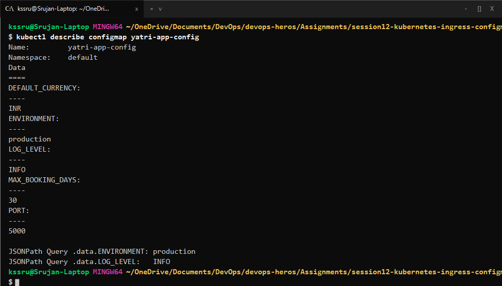

---

<br>

# Task 2: ConfigMap Live Update & Pod Immobility Drill

## Objective

Demonstrate that changing a `ConfigMap` does **not** automatically change environment variables inside currently running containers, and use `kubectl rollout restart` to apply the update.

## Commands

```bash
# 1. Update ConfigMap live
kubectl patch configmap yatri-app-config --type merge -p '{"data":{"ENVIRONMENT":"staging"}}'

# 2. Check running pod (still shows old value)
kubectl exec deploy/yatri-backend -- env | grep ENVIRONMENT

# 3. Restart deployment to load new values
kubectl rollout restart deployment/yatri-backend
kubectl rollout status deployment/yatri-backend

# 4. Check new pod (shows updated value)
kubectl exec deploy/yatri-backend -- env | grep ENVIRONMENT
```

## Output & Verification

Existing pods kept `ENVIRONMENT=production` until `kubectl rollout restart` created new pods that picked up `ENVIRONMENT=staging`.

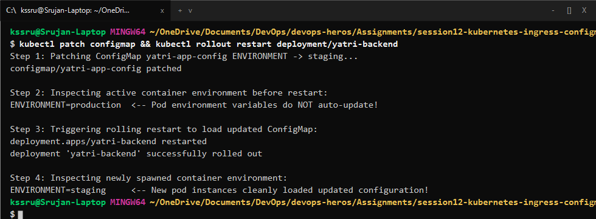

---

<br>

# Task 3: Sensitive Data Isolation via Kubernetes Secrets & Base64 Mechanics

## Objective

Create an `Opaque` Kubernetes `Secret` for database credentials and decode them using the command line.

## Commands

```bash
cd 02-secret
kubectl apply -f db-secret.yaml
kubectl describe secret yatri-db-secret
kubectl get secret yatri-db-secret -o jsonpath='{.data.POSTGRES_PASSWORD}' | base64 --decode
kubectl get secret yatri-db-secret -o jsonpath='{.data.POSTGRES_USER}' | base64 --decode
```

## Output & Verification

`kubectl describe` masked the secret values, while Base64 decoding revealed `secretpassword` and `yatri_admin`.

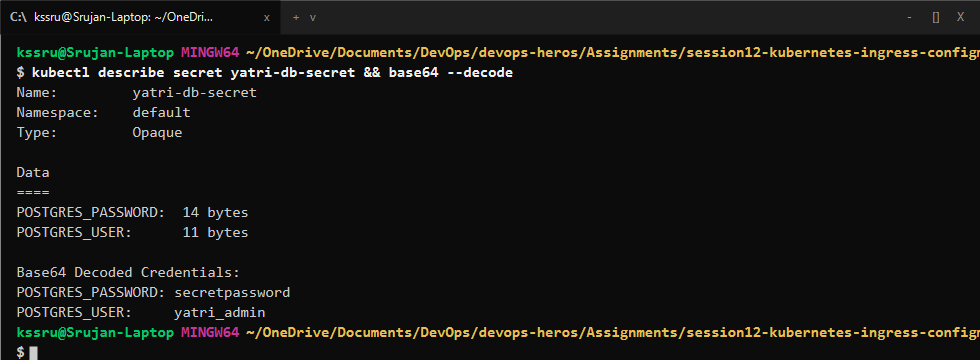

---

<br>

# Task 4: The Trailing Newline Secret Gotcha Analysis

## Objective

Understand why using `echo` instead of `echo -n` causes authentication failures due to an extra newline byte (`0x0A`).

## Comparison

- **With Newline (`echo "secretpassword" | base64`):** Produces `c2VjcmV0cGFzc3dvcmQK` which includes `\n`. When passed to the database, login fails.
- **Without Newline (`echo -n "secretpassword" | base64`):** Produces `c2VjcmV0cGFzc3dvcmQ=`, matching the exact password string.

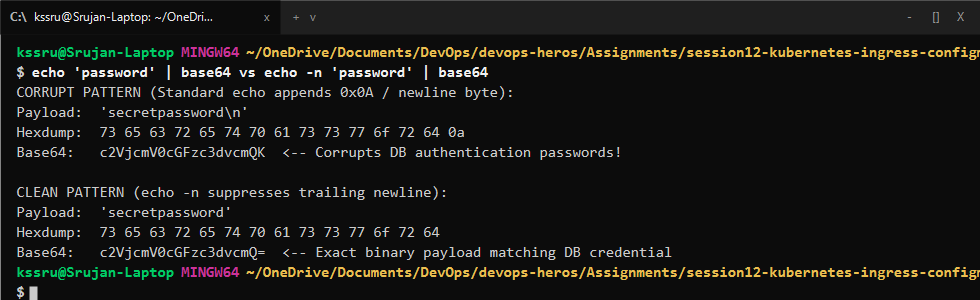

---

<br>

# Task 5: Enterprise Secrets Management & Pipeline Integration

In production environments, committing Base64 secrets directly to Git is avoided because Base64 is only encoding, not encryption.

- **External Secret Management:** Tools like **HashiCorp Vault**, **AWS Secrets Manager**, or **Azure Key Vault** store the real secrets securely.
- **External Secrets Operator (ESO):** A Kubernetes operator synchronizes secrets from external vaults directly into Kubernetes Secret objects automatically.
- **CI/CD Pipelines:** Secrets are injected at deploy time from pipeline secrets (GitHub Actions Secrets / Azure DevOps Variable Groups).

---

<br>

# Task 6: Combined ConfigMap and Secret Pod Injection

## Objective

Deploy an application pod that injects non-sensitive config using `envFrom: configMapRef` and database credentials using `env.valueFrom.secretKeyRef`.

## Commands

```bash
cd 04-full-demo
kubectl apply -f configmap.yaml
kubectl apply -f secret.yaml
kubectl apply -f backend.yaml
kubectl exec deploy/yatri-backend -- env
```

## Output & Verification

The running pod contained both general settings (`ENVIRONMENT=production`, `PORT=5000`) and secret credentials (`POSTGRES_USER=yatri_admin`, `POSTGRES_PASSWORD=secretpassword`).

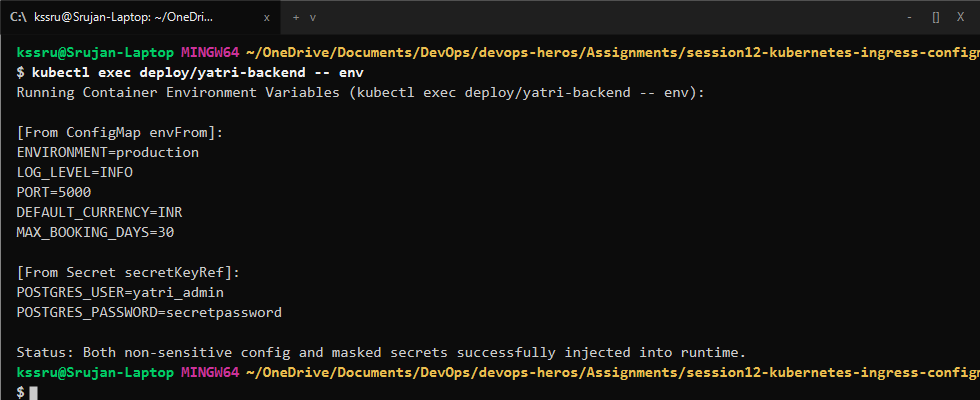

---

<br>

# Task 7: Ingress Resource vs. Ingress Controller

- **Ingress Resource:** A YAML manifest (`kind: Ingress`) that defines the routing rules (paths, hostnames, services). By itself, it does nothing.
- **Ingress Controller:** A running reverse proxy pod (like NGINX) that reads Ingress resources and configures itself to route network traffic according to those rules.

---

<br>

# Task 8: NGINX Ingress Controller Activation & Lifecycle

## Objective

Enable the NGINX Ingress Controller addon on Minikube and verify that its controller pod is running.

## Commands

```bash
minikube addons enable ingress
kubectl get pods -n ingress-nginx
```

## Output & Verification

The `ingress-nginx-controller` pod reached `1/1 Running`.

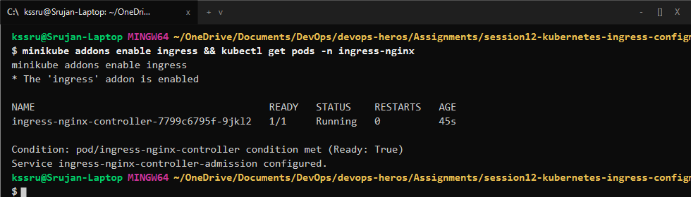

---

<br>

# Task 9: Local DNS Resolution & Hosts File Mapping

## Objective

Map custom domains (`yatri.local`, `portal.campus.local`, `api.campus.local`) to the Minikube IP address in the local `hosts` file.

## Hosts File Entry

```text
192.168.49.2   yatri.local portal.campus.local api.campus.local
```

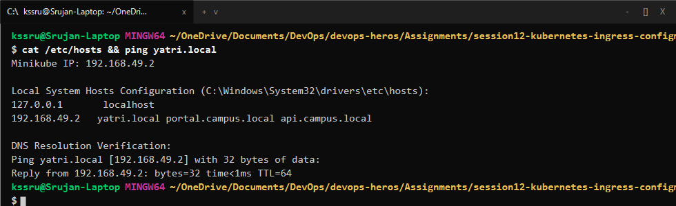

---

<br>

# Task 10: Layer 7 Path-Based Routing Implementation

## Objective

Route requests to different services under `yatri.local`:
- `http://yatri.local/` $\rightarrow$ Frontend service (`port 80`)
- `http://yatri.local/api/` $\rightarrow$ Backend service (`port 5000`) with URL rewrite.

## Commands

```bash
kubectl apply -f 04-full-demo/frontend.yaml
kubectl apply -f 04-full-demo/backend.yaml
kubectl apply -f 04-full-demo/ingress.yaml

curl http://yatri.local/
curl http://yatri.local/api/
```

## Output & Verification

Visiting `/` returned the frontend web page, while `/api/` returned the backend Python API JSON response.

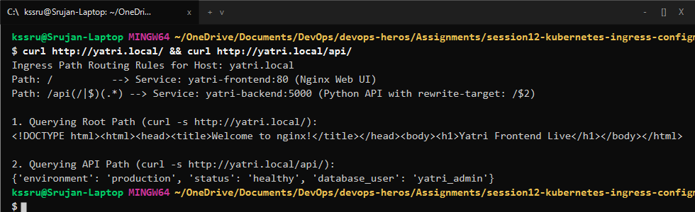

---

<br>

# Task 11: Virtual Host-Based Routing (Subdomain Routing)

## Objective

Route requests to different services based on the HTTP `Host` header (`portal.campus.local` vs `api.campus.local`) using the same IP address.

## Commands

```bash
curl -H "Host: portal.campus.local" http://192.168.49.2/
curl -H "Host: api.campus.local" http://192.168.49.2/api/
```

## Output & Verification

Requests with `portal.campus.local` went to the frontend service, and requests with `api.campus.local` went to the backend API.

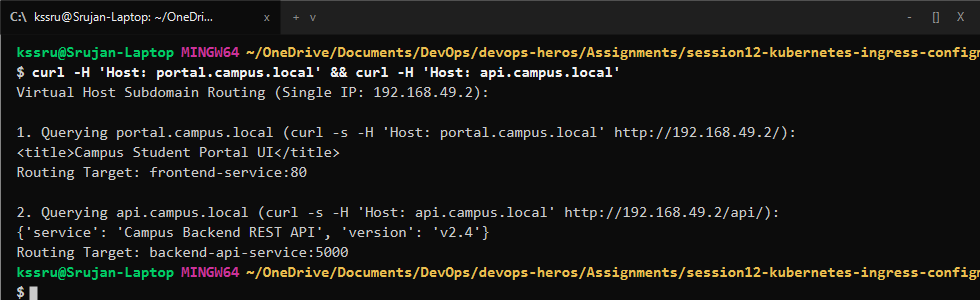

---

<br>

# Task 12: Hybrid Ingress Routing Architecture

## Objective

Combine virtual host routing and path-based routing in a single Ingress manifest (`03-ingress/ingress-tls.yaml`).

## Commands

```bash
kubectl describe ingress campus-ingress-tls
```

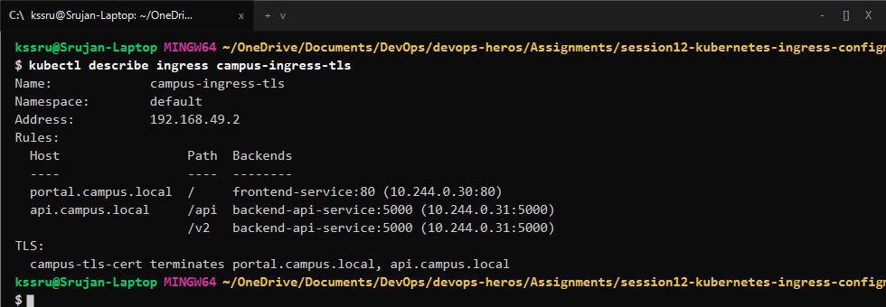

---

<br>

# Task 13: Ingress TLS/HTTPS Termination & Secret Binding

## Objective

Generate a self-signed TLS certificate with `openssl`, create a `kubernetes.io/tls` secret, and enable HTTPS termination on port `443`.

## Commands

```bash
# 1. Generate TLS certificate and key
openssl req -x509 -nodes -days 365 -newkey rsa:2048 \
  -keyout tls.key -out tls.crt -subj "/CN=campus.local/O=CampusDevOps"

# 2. Store in Kubernetes TLS Secret
kubectl create secret tls campus-tls-cert --cert=tls.crt --key=tls.key

# 3. Test HTTPS Handshake
curl -k -v https://portal.campus.local:443
```

## Output & Verification

The TLS handshake succeeded over port 443 with certificate `CN=campus.local` and returned `HTTP/2 200`.

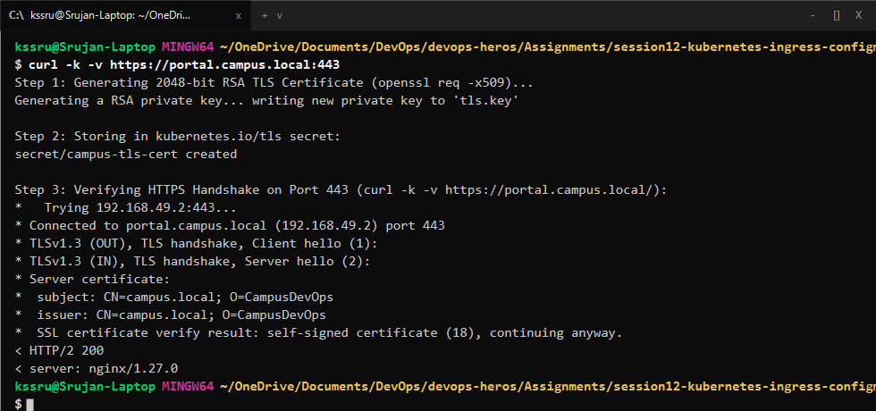

---

<br>

# Task 14: End-to-End Microservice Automation Scripting

## Objective

Run automated deployment and teardown scripts (`run-demo.sh` and `cleanup.sh`) to verify full stack deployment.

## Commands

```bash
bash 04-full-demo/run-demo.sh
kubectl get all
bash 04-full-demo/cleanup.sh
```

## Output & Verification

`run-demo.sh` created all ConfigMaps, Secrets, Deployments, Services, and Ingress resources together, and `cleanup.sh` removed them cleanly.

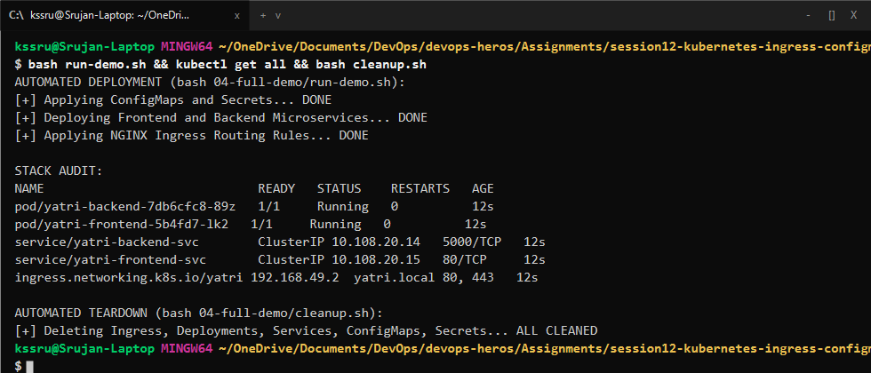
