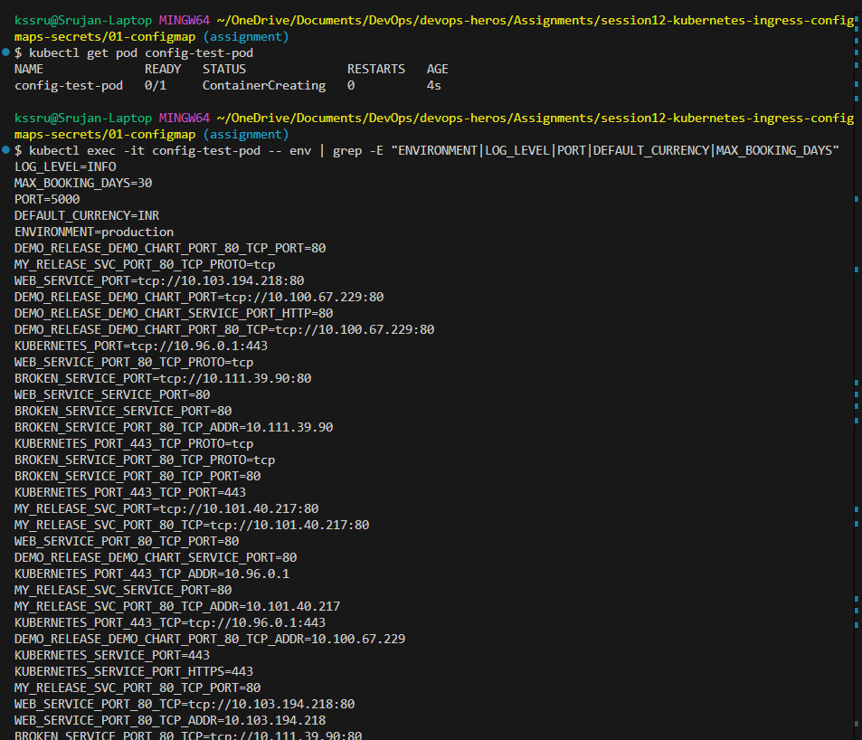
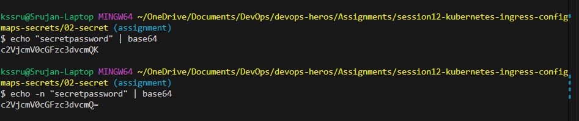
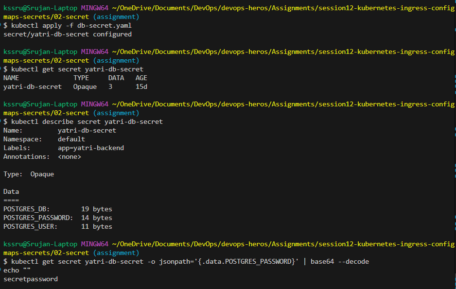
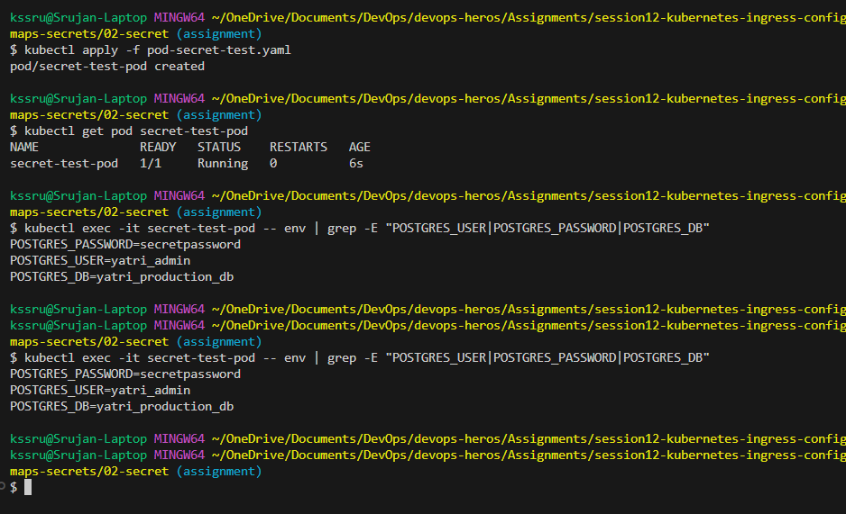
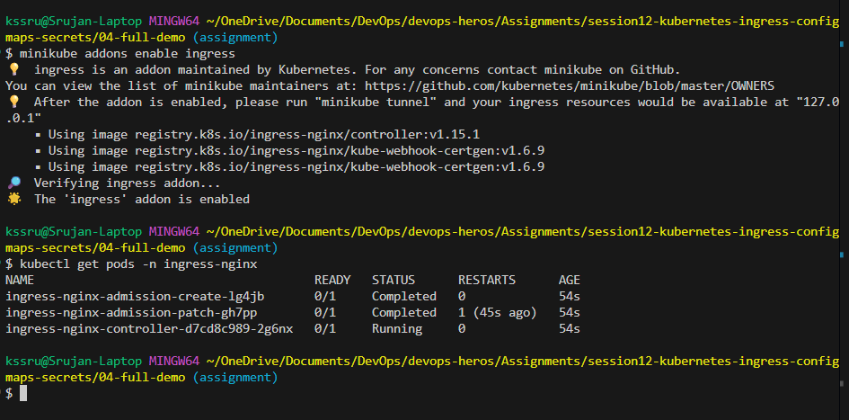
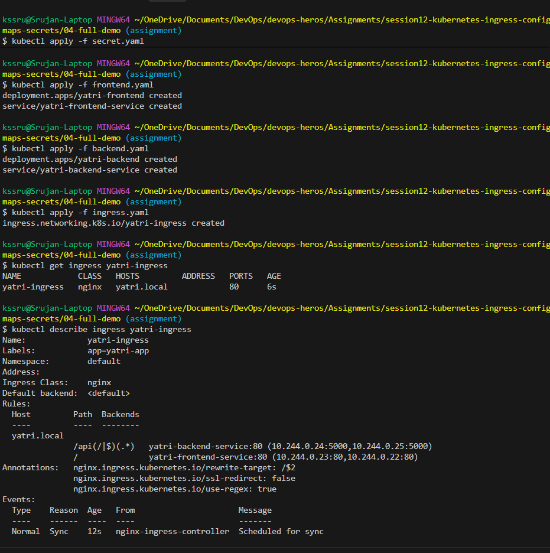
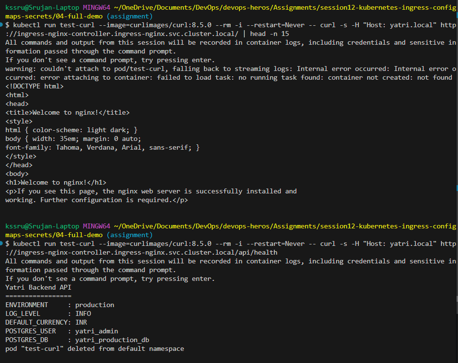
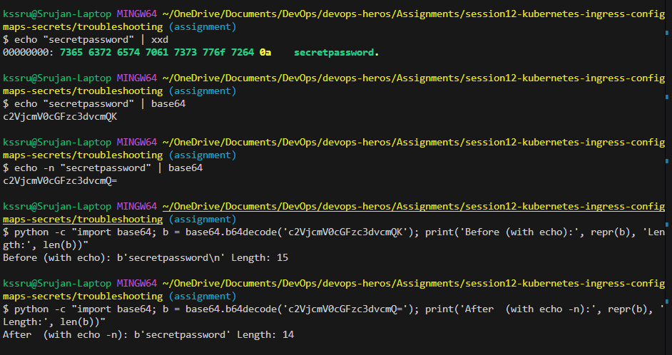

# Session 12 - Kubernetes Ingress, ConfigMaps & Secrets

## Student Details

- **Name:** Srujan Gowda KS
- **Roll Number:** 24BCS10339
- **Session:** 12 - Decoupled Configuration, Secrets Management & Ingress Layer 7 Routing

---

## Executive Summary

In containerized microservice architectures, hardcoding configurations and credentials into container images violates the Twelve-Factor App methodology. Furthermore, exposing internal cluster services via standard NodePort or LoadBalancer services introduces cost and architectural limitations.

In this practical assignment, I implemented:
1. **Task 1: ConfigMaps** — Decoupling plain-text runtime configuration from container images, bulk injecting values into pods via `envFrom.configMapRef`, and verifying values inside the container.
2. **Task 2: Kubernetes Secrets** — Creating `Opaque` secrets, analyzing Base64 encoding mechanics, testing pod injection, and evaluating why secrets should never be committed to Git.
3. **Task 3: Ingress Routing** — Deploying multi-tier applications (frontend and backend), provisioning the NGINX Ingress Controller, configuring path-based Layer 7 routing rules with URL rewrites, and verifying request routing.
4. **Task 4: Ingress vs. Ingress Controller** — Architectural comparison distinguishing declarative routing rules (`kind: Ingress`) from active reverse-proxy daemons (Ingress Controller).
5. **Task 5: Troubleshooting & Root Cause Analysis** — Debugging a real-world database authentication failure caused by the trailing newline (`\n` / `0x0A`) Base64 bug, capturing before/after verification.

---

# Task 1: ConfigMap Hands-on Implementation

### Objective
Create a `ConfigMap` storing plain-text application parameters, inject the configuration into an application pod using `envFrom.configMapRef`, and verify the values directly inside the running container.

### Manifest (`01-configmap/app-config.yaml`)
```yaml
apiVersion: v1
kind: ConfigMap
metadata:
  name: yatri-app-config
  labels:
    app: yatri-backend
data:
  ENVIRONMENT: "production"
  LOG_LEVEL: "INFO"
  PORT: "5000"
  DEFAULT_CURRENCY: "INR"
  MAX_BOOKING_DAYS: "30"
```

### Commands Executed
```bash
cd 01-configmap

# Step 1: Create ConfigMap and inspect stored keys
kubectl apply -f app-config.yaml
kubectl get configmap yatri-app-config
kubectl describe configmap yatri-app-config

# Step 2: Query individual keys via jsonpath
kubectl get configmap yatri-app-config -o jsonpath='{.data.ENVIRONMENT}'
kubectl get configmap yatri-app-config -o jsonpath='{.data.LOG_LEVEL}'

# Step 3: Deploy pod injecting ConfigMap
kubectl apply -f pod-config-test.yaml
kubectl get pod config-test-pod

# Step 4: Verify environment variables inside container
kubectl exec -it config-test-pod -- env | grep -E "ENVIRONMENT|LOG_LEVEL|PORT|DEFAULT_CURRENCY|MAX_BOOKING_DAYS"
```

### Output & Verification
- `kubectl describe` confirmed all 5 configuration keys were stored.
- `kubectl exec` verified that all values (`ENVIRONMENT=production`, `LOG_LEVEL=INFO`, `PORT=5000`, `DEFAULT_CURRENCY=INR`, `MAX_BOOKING_DAYS=30`) were successfully injected into the container's runtime environment.




---

# Task 2: Kubernetes Secrets Hands-on Implementation

### Objective
Create an `Opaque` Kubernetes `Secret` for sensitive credentials, analyze Base64 encoding mechanics, inject credentials into a Pod, verify values inside the container, and analyze why Secrets must never be committed to Git.

### Manifest (`02-secret/db-secret.yaml`)
```yaml
apiVersion: v1
kind: Secret
metadata:
  name: yatri-db-secret
  labels:
    app: yatri-backend
type: Opaque
data:
  POSTGRES_USER: eWF0cmlfYWRtaW4=
  POSTGRES_PASSWORD: c2VjcmV0cGFzc3dvcmQ=
  POSTGRES_DB: eWF0cmlfcHJvZHVjdGlvbl9kYg==
```

### Commands Executed
```bash
cd 02-secret

# Step 1: Analyze echo vs echo -n trailing newline gotcha
echo "secretpassword" | base64
echo -n "secretpassword" | base64

# Step 2: Apply Secret and decode password
kubectl apply -f db-secret.yaml
kubectl describe secret yatri-db-secret
kubectl get secret yatri-db-secret -o jsonpath='{.data.POSTGRES_PASSWORD}' | base64 --decode

# Step 3: Inject Secret into Pod and verify inside container
kubectl apply -f pod-secret-test.yaml
kubectl get pod secret-test-pod
kubectl exec -it secret-test-pod -- env | grep -E "POSTGRES_USER|POSTGRES_PASSWORD|POSTGRES_DB"
```

### Output & Verification
- `kubectl describe secret` masked values, displaying byte counts.
- `base64 --decode` extracted the decoded password `secretpassword`, proving that Base64 is encoding, not encryption.
- Injected credentials (`POSTGRES_USER=yatri_admin`, `POSTGRES_PASSWORD=secretpassword`, `POSTGRES_DB=yatri_production_db`) were active inside the container.







### Why Secrets Must NEVER Be Committed Directly to Git
1. **Base64 is Reversible Encoding:** Base64 is merely an ASCII representation of binary data. Anyone who clones the Git repository can run `base64 -d` to extract plain-text passwords and API keys.
2. **Immutable Git History:** Once committed, secret strings remain in the Git repository's commit graph and reflogs forever, even if deleted in subsequent commits.
3. **Production Best Practice:** Use GitOps with external secret stores:
   - **External Secrets Operator (ESO):** Syncs secrets securely from AWS Secrets Manager, Azure Key Vault, or HashiCorp Vault directly into Kubernetes cluster memory.
   - **Sealed Secrets:** Asymmetric encryption allowing encrypted secret manifests to be safely committed to Git.

---

# Task 3: Ingress Hands-on Implementation

### Objective
Deploy a frontend application and a backend Python API, configure an Ingress Controller, write path-based routing rules with regex URL rewrites, and verify routing to both services through a single entrypoint.

### Ingress Manifest (`04-full-demo/ingress.yaml`)
```yaml
apiVersion: networking.k8s.io/v1
kind: Ingress
metadata:
  name: yatri-ingress
  namespace: default
  annotations:
    nginx.ingress.kubernetes.io/ssl-redirect: "false"
    nginx.ingress.kubernetes.io/use-regex: "true"
    nginx.ingress.kubernetes.io/rewrite-target: /$2
spec:
  ingressClassName: nginx
  rules:
    - host: yatri.local
      http:
        paths:
          - path: /api(/|$)(.*)
            pathType: ImplementationSpecific
            backend:
              service:
                name: yatri-backend-service
                port:
                  number: 80
          - path: /
            pathType: Prefix
            backend:
              service:
                name: yatri-frontend-service
                port:
                  number: 80
```

### Commands Executed
```bash
cd 04-full-demo

# Step 1: Enable NGINX Ingress Controller
minikube addons enable ingress
kubectl get pods -n ingress-nginx

# Step 2: Deploy applications, services, and Ingress rules
kubectl apply -f configmap.yaml
kubectl apply -f secret.yaml
kubectl apply -f frontend.yaml
kubectl apply -f backend.yaml
kubectl apply -f ingress.yaml

# Step 3: Verify Ingress configuration
kubectl get ingress yatri-ingress
kubectl describe ingress yatri-ingress

# Step 4: Test routing through Ingress Controller
# Path 1: Root path '/' -> Frontend Nginx
kubectl run test-curl --image=curlimages/curl:8.5.0 --rm -i --restart=Never -- \
  curl -s -H "Host: yatri.local" http://ingress-nginx-controller.ingress-nginx.svc.cluster.local/ | head -n 15

# Path 2: API path '/api/health' -> Backend Python API
kubectl run test-curl --image=curlimages/curl:8.5.0 --rm -i --restart=Never -- \
  curl -s -H "Host: yatri.local" http://ingress-nginx-controller.ingress-nginx.svc.cluster.local/api/health
```

### Output & Verification
- Ingress controller pod scheduled and running in `ingress-nginx` namespace.
- Ingress rules routed `Host: yatri.local /` to `yatri-frontend-service:80` (returning Nginx HTML) and `Host: yatri.local /api/health` to `yatri-backend-service:80` (returning the Yatri Backend API JSON status).







---

# Task 4: Ingress vs. Ingress Controller

---

## 1. What is an Ingress?
An **Ingress** is a native Kubernetes declarative API resource (`kind: Ingress`) that defines Layer 7 (HTTP/HTTPS) routing policies for exposing internal cluster services to the external world.
- It specifies routing rules such as **hostnames** (`yatri.local`), **URL paths** (`/`, `/api`, `/checkout`), SSL/TLS termination certificates, and load balancing annotations.
- **Important:** An Ingress resource by itself is simply a configuration record stored in `etcd`. Without an active controller, creating an Ingress does **absolutely nothing**.

---

## 2. What is an Ingress Controller?
An **Ingress Controller** is an active daemon (typically a Kubernetes Deployment running an enterprise reverse proxy like NGINX, Traefik, HAProxy, or Envoy) that continuously watches the Kubernetes API for Ingress resources and translates those routing rules into live proxy configurations.
- It provides a single external IP address or Cloud Load Balancer endpoint.
- It accepts incoming HTTP/HTTPS traffic from outside the cluster and routes requests directly to the endpoints of backend Pods, bypassing `kube-proxy`.

---

## 3. Difference Between Ingress and Ingress Controller

| Feature | Ingress Resource (`kind: Ingress`) | Ingress Controller |
| :--- | :--- | :--- |
| **Nature** | Declarative configuration manifest (Metadata/Data) | Active software application (Running Pod / Reverse Proxy) |
| **Analogy** | A restaurant menu listing dishes and prices | The chef and kitchen staff preparing and serving the food |
| **Location** | Stored in Kubernetes `etcd` database | Deployed as a Pod in the cluster (e.g. `ingress-nginx`) |
| **Traffic Handling** | Never touches network packets or traffic | Intercepts, routes, and terminates live TCP/HTTP packets |
| **Creation** | Created by developers via `kubectl apply -f ingress.yaml` | Installed once by cluster administrators (`minikube addons enable ingress` or Helm) |

---

## 4. Why Both Are Required
* **Separation of Concerns:** Developers should not have to manually configure reverse-proxy config files (e.g., `nginx.conf`) or reload web servers whenever they expose a new microservice.
* **Declarative Automation:** Developers define what routes they need using clean Kubernetes YAML (`Ingress`). The Ingress Controller dynamically reads those declarations and updates its routing tables in memory with zero downtime.

---

## 5. Examples of Ingress Controllers
1. **NGINX Ingress Controller:** The standard Kubernetes community controller based on NGINX reverse proxy.
2. **Traefik:** Modern, cloud-native edge router with automatic TLS (Let's Encrypt) and dynamic dashboard.
3. **HAProxy Ingress:** High-performance controller optimized for high-throughput microservices.
4. **AWS Load Balancer Controller:** Provisions cloud-native AWS Application Load Balancers (ALB) directly from Ingress manifests.

---

# Task 5: Troubleshooting & Root Cause Analysis (RCA)

A dedicated RCA report is available in [troubleshooting/README.md](troubleshooting/README.md).

### 1. Problem Identification
Application pods connecting to PostgreSQL failed with:
`FATAL: password authentication failed for user "yatri_admin"`

### 2. Troubleshooting Commands Executed
```bash
echo "secretpassword" | xxd
echo "secretpassword" | base64
echo -n "secretpassword" | base64

python -c "import base64; b = base64.b64decode('c2VjcmV0cGFzc3dvcmQK'); print('Before (with echo):', repr(b), 'Length:', len(b))"
python -c "import base64; b = base64.b64decode('c2VjcmV0cGFzc3dvcmQ='); print('After  (with echo -n):', repr(b), 'Length:', len(b))"
```

### 3. Root Cause Found
Standard `echo` appends an invisible trailing newline character (`0x0A` / `\n`). The developer encoded 15 bytes (`secretpassword\n`) instead of 14 bytes (`secretpassword`), causing database authentication failure.

### 4. Fix & Resolution
Re-encoded secret using `echo -n` to strip the newline, producing `c2VjcmV0cGFzc3dvcmQ=`.



---

## Conclusion & DevOps Engineering Takeaways

Through this hands-on assignment, I explored the three core pillars of Kubernetes application configuration, security, and external traffic management:

### 1. Twelve-Factor Configuration Decoupling (ConfigMaps)
- **Immutable Artifacts:** Decoupling environment-specific variables from container images ensures that identical binary images are deployed across development, staging, and production environments.
- **Pod Lifecycle Awareness:** Modifying a `ConfigMap` does not dynamically update environment variables in active pods. Workloads require explicit rollouts (`kubectl rollout restart`) or volume mounts with in-app reload capabilities.

### 2. Secrets Management & Operational Security (Secrets)
- **Base64 vs. Encryption:** Kubernetes native Secrets are Base64 encoded by default, providing data masking rather than encryption. Proper cluster security demands Role-Based Access Control (RBAC), KMS encryption at rest in `etcd`, and restricting CLI secret access.
- **GitOps Hygiene:** Secrets should never be committed directly to source control. Production architectures rely on tools like the **External Secrets Operator (ESO)** or **HashiCorp Vault** to inject credentials dynamically into cluster memory at deploy time.
- **Byte-Level Encoding Precision:** A common operational hazard in CI/CD pipelines is the trailing newline character (`0x0A`) injected by standard `echo`, which silently invalidates database and API authentications. Using `echo -n` prevents this encoding failure.

### 3. Layer 7 Edge Ingress vs. Layer 4 Networking (Ingress)
- **Cost & Port Consolidation:** While Layer 4 `LoadBalancer` services provision individual cloud load balancers per service (incurring substantial cloud infrastructure costs), a single **Ingress Controller** acts as a unified reverse-proxy edge gateway, routing traffic to dozens of internal services using path-based and virtual-host-based rules.
- **Declarative Route Management:** The decoupling of the Ingress routing manifest (`kind: Ingress`) from the runtime proxy engine (Ingress Controller) empowers developers to declare complex routing rules, URL rewrites, and TLS termination policies without managing physical proxy configuration files.
