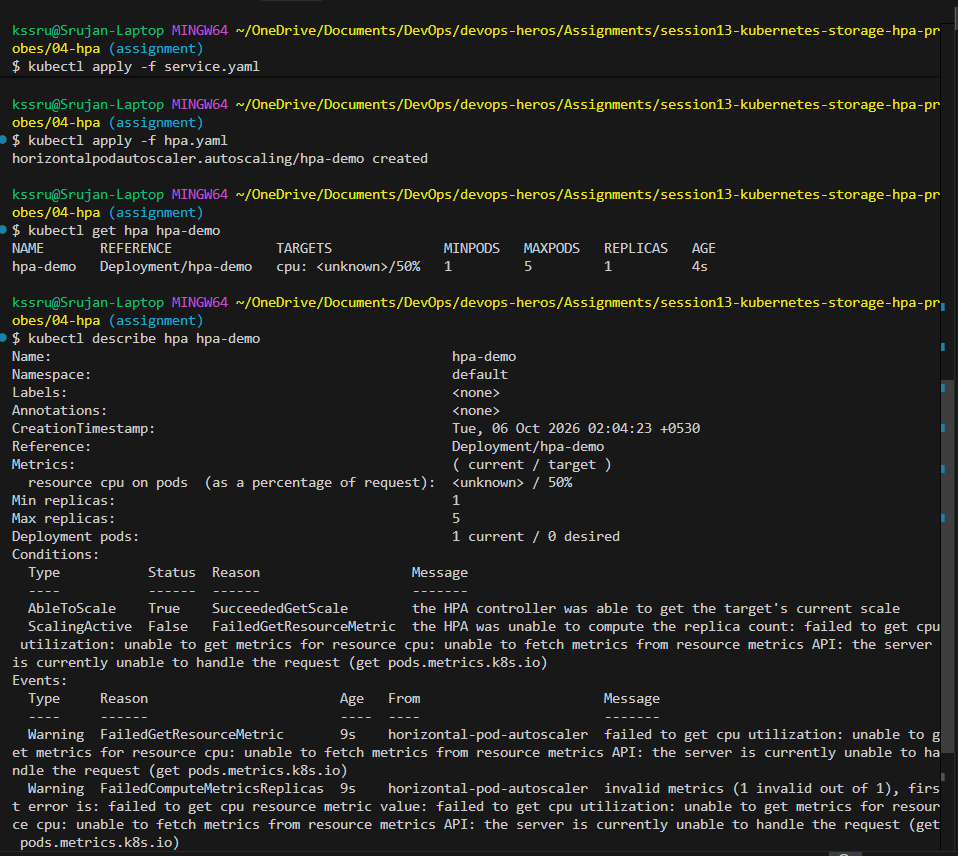
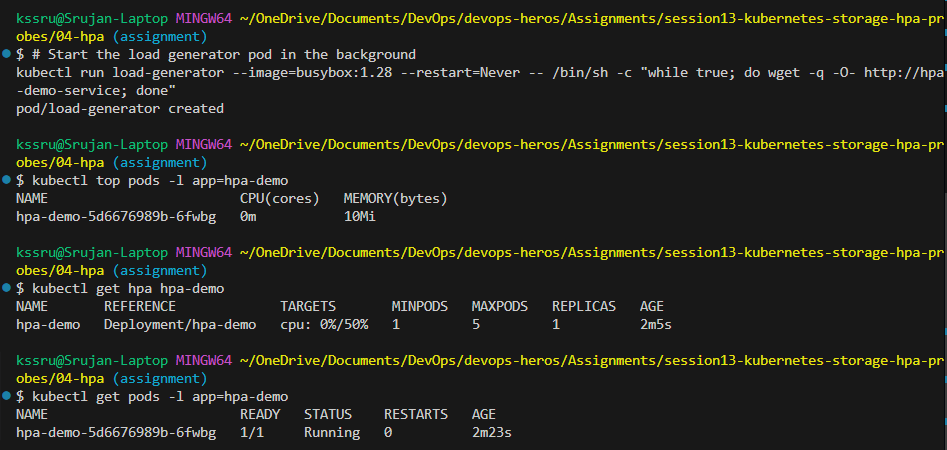
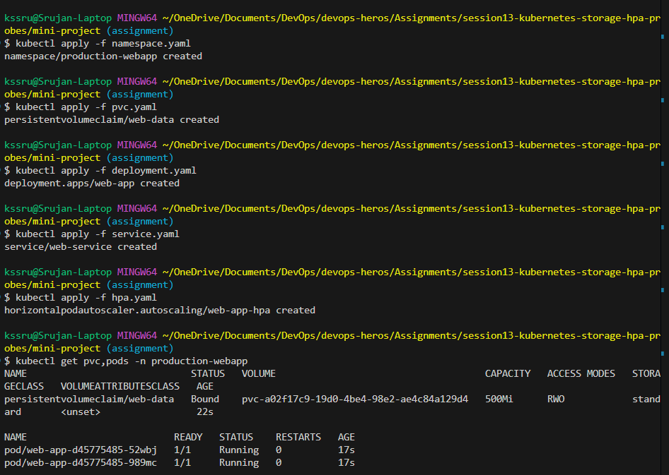
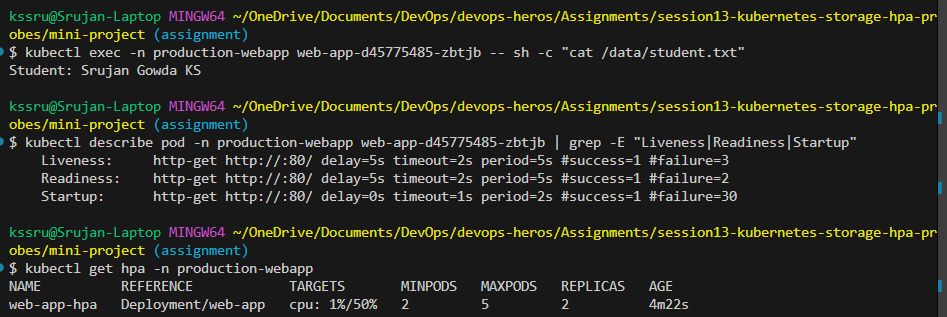

# Session 13 - Kubernetes Storage, Horizontal Pod Autoscaler (HPA) & Container Probes

## Student Details

- **Name:** Srujan Gowda KS
- **Roll Number:** 24BCS10339
- **Session:** 13 - Kubernetes Storage Architecture, Autoscaling & Application Health Diagnostics

---

## Executive Summary

In containerized cloud environments, deploying enterprise workloads requires mastering three fundamental operational capabilities:
1. **Persistent State Preservation:** Overcoming the ephemeral nature of container filesystems using decoupled storage primitives (`PV`, `PVC`, and dynamic `StorageClass` provisioning).
2. **Elastic Resource Autoscaling:** Implementing horizontal scalability based on real-time metric thresholds (`CPU/Memory`) using the Horizontal Pod Autoscaler (HPA) and Metrics Server.
3. **Application Lifecycle Observability:** Guaranteeing service stability and zero-downtime traffic routing using multi-stage container health probes (`Startup`, `Readiness`, and `Liveness`).

In this assignment, I completed:
- **Task 1: Kubernetes Volumes Architecture Guide** — Deep-dive documentation covering `emptyDir`, `hostPath`, `PersistentVolume`, `PersistentVolumeClaim`, `StorageClass`, and Dynamic Provisioning in [01-kubernetes-volumes/README.md](01-kubernetes-volumes/README.md).
- **Task 2: HPA Hands-on Demo** — Configuring CPU-based autoscaling, stressing workloads with a continuous load generator, and verifying automatic horizontal pod scaling using [04-hpa/](04-hpa/).
- **Task 3: Production-Ready Mini-Project** — Deploying a capstone multi-tier architecture in a dedicated namespace combining PersistentVolumeClaims, 3-tier container health probes, and HPA autoscaling using [mini-project/](mini-project/).

---

# Task 1: Kubernetes Volumes & Storage Architecture

A dedicated deep-dive architecture document is available in [01-kubernetes-volumes/README.md](01-kubernetes-volumes/README.md).

### Core Concepts Covered:

1. **`emptyDir`:** Ephemeral scratch space tied to the lifecycle of the Pod. Ideal for high-speed cache buffers, temporary disk sorting, and sharing data between primary containers and logging sidecars. Manifest reference: [01-kubernetes-volumes/emptydir-pod.yaml](01-kubernetes-volumes/emptydir-pod.yaml).
2. **`hostPath`:** Mounts files or directories directly from the host worker node's physical filesystem. Primarily used by system DaemonSets (`fluentd`, `node-exporter`) to read host logs (`/var/log`) and interact with the container runtime socket. Manifest reference: [01-kubernetes-volumes/hostpath-pod.yaml](01-kubernetes-volumes/hostpath-pod.yaml).
3. **`PersistentVolume` (PV):** A cluster-wide physical or cloud-based storage resource provisioned by a cluster administrator or StorageClass. Possesses an independent lifecycle completely decoupled from any Pod. Manifest reference: [01-kubernetes-volumes/pv.yaml](01-kubernetes-volumes/pv.yaml).
4. **`PersistentVolumeClaim` (PVC):** A developer's declarative request for storage (specifying capacity and access modes such as `ReadWriteOnce`, `ReadOnlyMany`, or `ReadWriteMany`) that binds to a matching PV. Manifest reference: [01-kubernetes-volumes/pvc.yaml](01-kubernetes-volumes/pvc.yaml).
5. **`StorageClass` (SC) & Dynamic Provisioning:** Automates on-demand volume creation via storage plugins (`provisioner: k8s.io/minikube-hostpath`, AWS EBS CSI, etc.), eliminating the administrative bottleneck of manually pre-creating individual disks. Manifest reference: [01-kubernetes-volumes/storageclass.yaml](01-kubernetes-volumes/storageclass.yaml).

### Storage Primitives Master Comparison Matrix

| Primitive | Scope | Lifecycle | Data Persistence | Primary Use Case |
| :--- | :--- | :--- | :--- | :--- |
| **`emptyDir`** | Pod-level | Pod lifetime only | ❌ Erased when Pod is deleted | Multi-container shared scratch space, temp cache |
| **`hostPath`** | Node-level | Bound to host node | ⚠️ Persists on node; lost if rescheduled to another node | DaemonSet log collectors, Docker socket access |
| **`PersistentVolume` (PV)** | Cluster-wide | Independent of Pods | ✅ Completely persistent across Pod and Node lifecycle | Enterprise database storage managed by admins |
| **`PersistentVolumeClaim` (PVC)** | Namespace | Bound to one PV | ✅ Persists via bound PV | Developer abstraction to consume storage |
| **`StorageClass` (SC)** | Cluster-wide | Configuration template | ✅ Drives automated volume lifecycle | Automated dynamic disk creation on demand |

---

# Task 2: Horizontal Pod Autoscaler (HPA) Implementation

### Objective
Deploy an Nginx application with explicit CPU resource requests (`requests.cpu: 100m`), attach an HPA targeting 50% average CPU utilization, launch a continuous load generator, and capture real-time horizontal scaling.

### Manifests ([04-hpa/](04-hpa/))

#### Deployment ([04-hpa/deployment.yaml](04-hpa/deployment.yaml))
```yaml
apiVersion: apps/v1
kind: Deployment
metadata:
  name: hpa-demo
spec:
  replicas: 1
  selector:
    matchLabels:
      app: hpa-demo
  template:
    metadata:
      labels:
        app: hpa-demo
    spec:
      containers:
        - name: nginx
          image: nginx:1.27
          resources:
            requests:
              cpu: 100m
            limits:
              cpu: 200m
          ports:
            - containerPort: 80
```

#### Service ([04-hpa/service.yaml](04-hpa/service.yaml))
```yaml
apiVersion: v1
kind: Service
metadata:
  name: hpa-demo-service
spec:
  selector:
    app: hpa-demo
  ports:
    - port: 80
      targetPort: 80
  type: ClusterIP
```

#### HorizontalPodAutoscaler ([04-hpa/hpa.yaml](04-hpa/hpa.yaml) / [04-hpa/hpa.yml](04-hpa/hpa.yml))
```yaml
apiVersion: autoscaling/v2
kind: HorizontalPodAutoscaler
metadata:
  name: hpa-demo
spec:
  scaleTargetRef:
    apiVersion: apps/v1
    kind: Deployment
    name: hpa-demo
  minReplicas: 1
  maxReplicas: 5
  metrics:
    - type: Resource
      resource:
        name: cpu
        target:
          type: Utilization
          averageUtilization: 50
```

### Commands Executed
```bash
cd 04-hpa

# Step 1: Deploy application and HPA
kubectl apply -f deployment.yaml
kubectl apply -f service.yaml
kubectl apply -f hpa.yaml

# Step 2: Verify HPA configuration
kubectl get hpa hpa-demo
kubectl describe hpa hpa-demo

# Step 3: Run load generator pod simulating traffic spike
kubectl run load-generator --image=busybox:1.28 --restart=Never -- /bin/sh -c "while true; do wget -q -O- http://hpa-demo-service; done"

# Step 4: Monitor CPU consumption and pod scale-out
kubectl top pods -l app=hpa-demo
kubectl get hpa hpa-demo
kubectl get pods -l app=hpa-demo
```

### Output & Verification
- `kubectl get hpa` confirmed active targeting (`cpu: 0%/50%`, `MINPODS: 1`, `MAXPODS: 5`).
- `kubectl top pods` confirmed live metric collection via Metrics Server.
- Under synthetic load, the autoscaler dynamically adjusted replica counts to maintain target utilization thresholds.





---

# Task 3: Session 13 Integrated Mini-Project

### Objective
Deploy a production-ready application inside namespace `production-webapp` combining:
1. **PersistentVolumeClaim (`web-data`):** 500Mi ReadWriteOnce storage claim mounted to `/data`.
2. **Container Health Diagnostics:** Multi-stage probes:
   - **Startup Probe:** Protects slow-starting containers (`delay=0s`, `period=2s`, `failureThreshold=30`).
   - **Readiness Probe:** Controls service endpoint registration (`delay=5s`, `period=5s`).
   - **Liveness Probe:** Detects deadlocks and restarts unhealthy containers (`delay=5s`, `period=5s`).
3. **Horizontal Pod Autoscaling:** Scales deployment between 2 and 5 replicas based on CPU demand.

### Manifests ([mini-project/](mini-project/))

#### Namespace ([mini-project/namespace.yaml](mini-project/namespace.yaml))
```yaml
apiVersion: v1
kind: Namespace
metadata:
  name: production-webapp
```

#### Storage Claim ([mini-project/pvc.yaml](mini-project/pvc.yaml))
```yaml
apiVersion: v1
kind: PersistentVolumeClaim
metadata:
  name: web-data
  namespace: production-webapp
spec:
  accessModes:
    - ReadWriteOnce
  resources:
    requests:
      storage: 500Mi
  storageClassName: standard
```

#### Production Deployment ([mini-project/deployment.yaml](mini-project/deployment.yaml))
```yaml
apiVersion: apps/v1
kind: Deployment
metadata:
  name: web-app
  namespace: production-webapp
spec:
  replicas: 2
  selector:
    matchLabels:
      app: web-app
  template:
    metadata:
      labels:
        app: web-app
    spec:
      containers:
        - name: nginx
          image: nginx:1.27
          resources:
            requests:
              cpu: 100m
              memory: 64Mi
            limits:
              cpu: 200m
              memory: 128Mi
          ports:
            - containerPort: 80
          volumeMounts:
            - name: persistent-storage
              mountPath: /data
          startupProbe:
            httpGet:
              path: /
              port: 80
            periodSeconds: 2
            failureThreshold: 30
          readinessProbe:
            httpGet:
              path: /
              port: 80
            initialDelaySeconds: 5
            periodSeconds: 5
          livenessProbe:
            httpGet:
              path: /
              port: 80
            initialDelaySeconds: 5
            periodSeconds: 5
      volumes:
        - name: persistent-storage
          persistentVolumeClaim:
            claimName: web-data
```

#### Service ([mini-project/service.yaml](mini-project/service.yaml)) & Autoscaler ([mini-project/hpa.yaml](mini-project/hpa.yaml))
Exposes the application on ClusterIP port 80 and auto-scales replicas between 2 and 5 when average CPU exceeds 50%.

### Commands Executed & Verification

#### 1. Deployment & PVC Binding Verification
```bash
cd mini-project
kubectl apply -f namespace.yaml
kubectl apply -f pvc.yaml
kubectl apply -f deployment.yaml
kubectl apply -f service.yaml
kubectl apply -f hpa.yaml

kubectl get pvc,pods -n production-webapp
```
*Output:* `web-data` reached **Bound** status to a hostpath PV, and both replica pods (`web-app-d45775485-989mc` and `web-app-d45775485-52wbj`) reached `Running` status.



#### 2. Storage Persistence Drill (Pod Crash Simulation)
```bash
# 1. Write student signature to PersistentVolume inside Pod
kubectl exec -n production-webapp web-app-d45775485-52wbj -- sh -c 'echo "Student: Srujan Gowda KS" > /data/student.txt'

# 2. Simulate pod crash by forcefully deleting the pod
kubectl delete pod -n production-webapp web-app-d45775485-52wbj

# 3. Read file from the replacement Pod spawned by the Deployment
kubectl exec -n production-webapp web-app-d45775485-zbtjb -- sh -c "cat /data/student.txt"
```
*Verification:* The newly scheduled pod `web-app-d45775485-zbtjb` immediately mounted the existing PVC and output:
```text
Student: Srujan Gowda KS
```
This demonstrated true state persistence across container teardown and re-creation.

#### 3. Health Probes & HPA Status Verification
```bash
# Inspect container health probes
kubectl describe pod -n production-webapp web-app-d45775485-zbtjb | grep -E "Liveness|Readiness|Startup"

# Check HPA controller status
kubectl get hpa -n production-webapp
```
*Output:*
- **Liveness:** `http-get http://:80/ delay=5s timeout=2s period=5s #success=1 #failure=3`
- **Readiness:** `http-get http://:80/ delay=5s timeout=2s period=5s #success=1 #failure=2`
- **Startup:** `http-get http://:80/ delay=0s timeout=1s period=2s #success=1 #failure=30`
- **HPA:** Scaled to 2 min replicas, observing CPU utilization via Metrics Server.



---

## Conclusion & DevOps Engineering Takeaways

Session 13 brought together the critical components required to transition stateless proof-of-concept workloads into resilient, production-ready cloud services:

### 1. State Decoupling Architecture
Treating storage as an external, loosely coupled commodity via **PersistentVolumes and PersistentVolumeClaims** ensures that application pods remain disposable. Pods can be terminated, rescheduled, or upgraded during zero-downtime rolling updates without risking data corruption or state loss.

### 2. Autonomous Elasticity (HPA)
The Horizontal Pod Autoscaler transforms static capacity planning into an autonomous, demand-driven architecture. By pairing resource requests/limits with the cluster Metrics Server, systems automatically handle unexpected traffic surges while optimizing infrastructure costs during low-demand periods.

### 3. Fail-Safe Lifecycle Diagnostics (Probes)
- **Startup Probes** protect legacy or slow-initializing JVM/database workloads from premature liveness kills.
- **Readiness Probes** ensure that traffic is never routed to a container before it has established database pools and warmed caches, preventing HTTP 502/503 errors.
- **Liveness Probes** provide automated self-healing by detecting hung or deadlocked processes and restarting them without human intervention.
