# Session 14 - Kubernetes Troubleshooting & Debugging

## Student Details

- **Name:** Srujan Gowda KS
- **Roll Number:** 24BCS10339
- **Session:** 14 - Kubernetes Pod Diagnostics, Cluster Events & Failure Modes

---

## Introduction

In this session, I practiced foundational and advanced Kubernetes troubleshooting workflows. In production environments, containerized applications face various failure modes such as broken image tags, startup script errors, node resource exhaustion, and service selector mismatches.

Rather than guessing or restarting containers blindly, Kubernetes provides structured diagnostic tools and telemetry:
- **`kubectl get`**: Provides rapid macro-level cluster visibility.
- **`kubectl describe`**: Inspects granular object metadata, conditions, and the control plane **Events** chronological timeline.
- **`kubectl logs`**: Reads `stdout` and `stderr` application streams, including previous crash outputs (`--previous`).
- **`kubectl exec`**: Enables direct internal container validation, network loopback testing, and interactive debugging.

This report documents the hands-on execution, root cause analyses, and solutions across all practical tasks (Tasks 1–9) and the final Mini-Project Troubleshooting Challenge.

---

<br>

# Task 1: Inspecting Cluster State via `kubectl get`

## Objective

Use `kubectl get` as the first line of observation to answer: *"What is currently happening across the cluster?"*

## Manifest (`01-kubectl-get/sample-workload.yaml`)

```yaml
apiVersion: v1
kind: Pod
metadata:
  name: get-demo
  labels:
    app: get-demo
spec:
  containers:
    - name: nginx
      image: nginx:1.27
      ports:
        - containerPort: 80
```

## Commands Executed

```bash
cd 01-kubectl-get

# Deploy sample pod
kubectl apply -f sample-workload.yaml

# Check general pod status
kubectl get pods

# Inspect detailed network and node placement
kubectl get pods -o wide

# Check other cluster components
kubectl get nodes
kubectl get services
kubectl get all

# Stream real-time resource state transitions
kubectl get pods -w
```

## Concepts & Key Learnings

- **Column Header Breakdown**:
  - `NAME`: Unique identifier of the resource.
  - `READY (1/1)`: Ready containers vs. total containers in the Pod.
  - `STATUS`: Pod phase (`Running`, `Pending`, `CrashLoopBackOff`, `ErrImagePull`).
  - `RESTARTS`: Restart counter incremented by kubelet upon container termination.
  - `AGE`: Uptime since creation.
- **Extended Node & IP Visibility (`-o wide`)**: Revealed the internal Pod IP (`10.244.0.20`) and host node (`minikube`).
- **Live Stream Tracking (`-w`)**: Continuously monitors state transitions without repeatedly re-running the command.

## Output & Verification

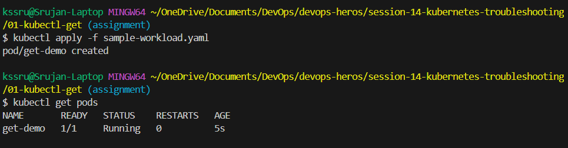

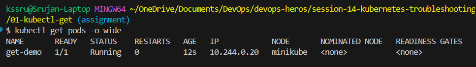

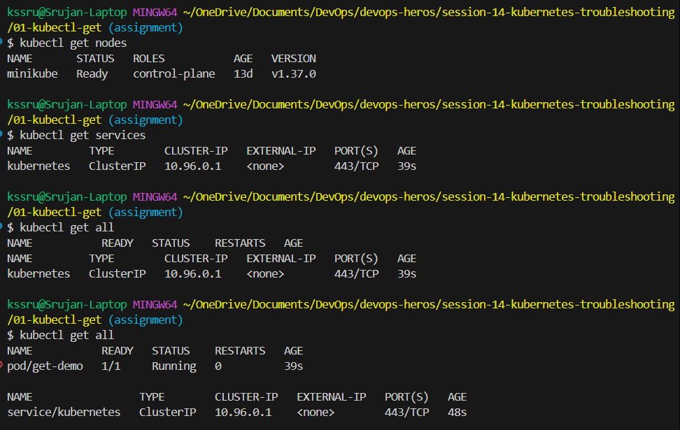

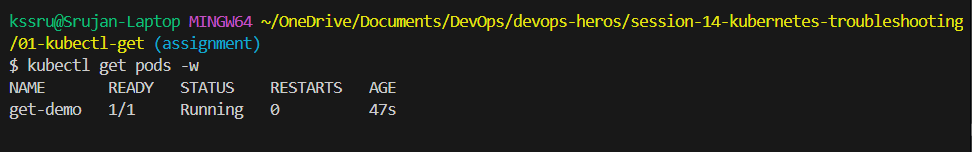

---

<br>

# Task 2: Deep-Dive Diagnostics via `kubectl describe`

## Objective

Use `kubectl describe` to answer: *"Why is a resource in its current state?"* by inspecting container states, conditions, and lifecycle events.

## Manifest (`02-kubectl-describe/demo-pod.yaml`)

```yaml
apiVersion: v1
kind: Pod
metadata:
  name: describe-demo
  labels:
    app: describe-demo
spec:
  containers:
    - name: nginx
      image: nginx:1.27
      ports:
        - containerPort: 80
```

## Commands Executed

```bash
cd ../02-kubectl-describe

kubectl apply -f demo-pod.yaml
kubectl get pods
kubectl describe pod describe-demo
```

## Concepts & Key Learnings

- **`get` vs `describe`**: `kubectl get` gives a summary table, whereas `kubectl describe` provides complete configuration, controller references, and runtime conditions.
- **Key Sections Analyzed**:
  - **Containers**: Image tag (`nginx:1.27`), container ID, state (`Running`), and readiness status.
  - **Conditions**: `PodScheduled`, `Initialized`, `ContainersReady`, and `Ready` all reported `True`.
  - **Events**: The chronological log at the bottom recorded `Scheduled`, `Pulling`, `Pulled`, `Created`, and `Started`. This is the single most valuable section when debugging non-running pods.

## Output & Verification

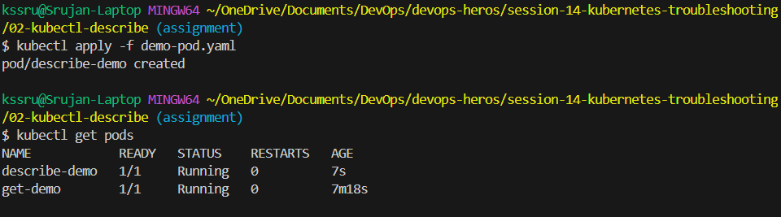

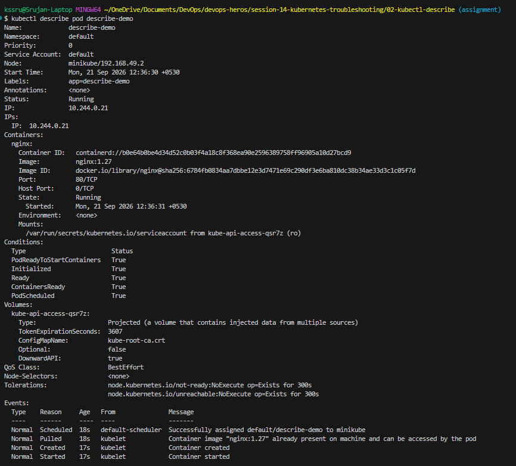

---

<br>

# Task 3: Application Telemetry & Stream Diagnostics via `kubectl logs`

## Objective

Use `kubectl logs` to answer: *"What is the application reporting from standard output and standard error?"*

## Manifest (`03-kubectl-logs/pod.yaml`)

```yaml
apiVersion: v1
kind: Pod
metadata:
  name: logs-demo
spec:
  containers:
    - name: app
      image: busybox:1.36
      command:
        - sh
        - -c
        - |
          echo "Application started"
          echo "Connecting to database..."
          echo "Database connection successful"
          echo "Application is running"
          while true; do
            echo "Application is healthy"
            sleep 5
          done
```

## Commands Executed

```bash
cd ../03-kubectl-logs

kubectl apply -f pod.yaml
kubectl logs logs-demo
kubectl logs -f logs-demo
kubectl logs logs-demo -c app
```

## Concepts & Key Learnings

- **Container I/O Logging**: Kubernetes standardizes logging by capturing all console writes (`stdout`/`stderr`).
- **Live Stream Tracking (`-f`)**: Follows active logging in real time (e.g. tracking health check loops).
- **Multi-Container Pods (`-c`)**: Isolates logs when a pod contains multiple containers (such as app + sidecar).
- **Post-Mortem Analysis (`--previous`)**: Retrieves logs from previous crashed instances when debugging `CrashLoopBackOff`.

## Output & Verification

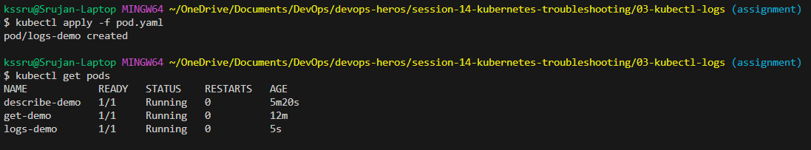

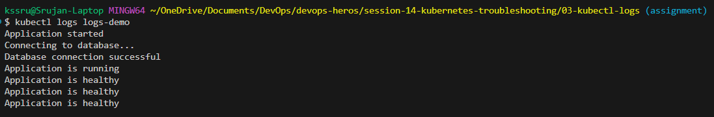

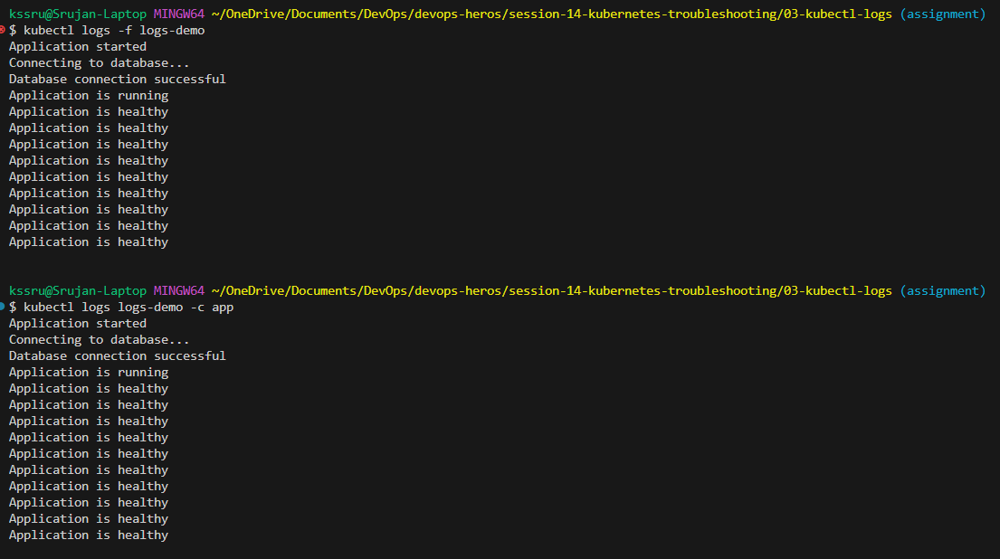

---

<br>

# Task 4: In-Container Inspection & Verification via `kubectl exec`

## Objective

Directly access running containers using `kubectl exec` to verify files, configurations, and internal network responsiveness.

## Manifest (`04-kubectl-exec/pod.yaml`)

```yaml
apiVersion: v1
kind: Pod
metadata:
  name: exec-demo
spec:
  containers:
    - name: nginx
      image: nginx:1.27
      ports:
        - containerPort: 80
```

## Commands Executed

```bash
cd ../04-kubectl-exec

# Apply workload
kubectl apply -f pod.yaml

# Direct non-interactive diagnostic commands
kubectl exec exec-demo -- hostname
kubectl exec exec-demo -- ls //usr/share/nginx/html
kubectl exec exec-demo -- cat //etc/hosts

# Interactive shell debugging
kubectl exec -it exec-demo -- bash

# (Inside container shell)
ls /usr/share/nginx/html
cat /etc/hosts
curl localhost
exit
```

## Concepts & Key Learnings

- **Non-Interactive Execution**: Allows quick checks (e.g., hostname, network hosts) without attaching a full interactive TTY.
- **Git Bash Path Conversion**: On Windows MINGW64, paths like `/usr/...` are auto-converted to host paths; using double slashes (`//usr/...`) or opening an interactive `bash` session bypasses this.
- **Local Application Verification**: Running `curl localhost` directly inside the container proved NGINX was running and listening on port 80 before exposing it to services.

## Output & Verification

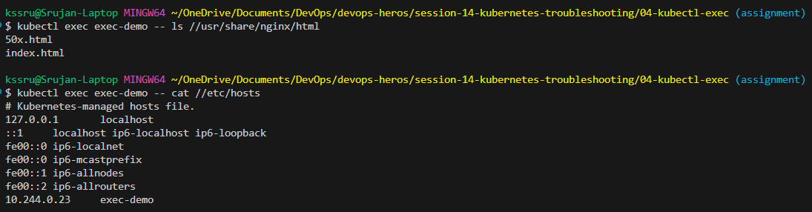

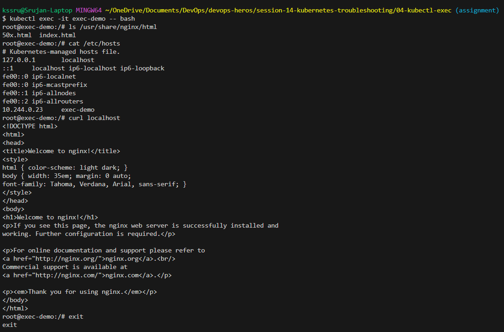

---

<br>

# Task 5: Cluster Activity Logging via Kubernetes Events

## Objective

Inspect and filter Kubernetes Events to understand control plane decisions, scheduling steps, and runtime warnings.

## Manifest (`05-events/pod.yaml`)

```yaml
apiVersion: v1
kind: Pod
metadata:
  name: events-demo
spec:
  containers:
    - name: nginx
      image: nginx:1.27
```

## Commands Executed

```bash
cd ../05-events

kubectl apply -f pod.yaml

# Inspect all events
kubectl get events

# Sort events chronologically
kubectl get events --sort-by=.lastTimestamp

# Inspect events for a specific pod
kubectl describe pod events-demo
```

## Concepts & Key Learnings

- **Event Retention & Ephemerality**: Events are stored in `etcd` and retained for 1 hour by default.
- **Sorting by Timestamp**: `--sort-by=.lastTimestamp` presents events in chronological order, making recent failures stand out immediately.
- **Event Filtering**: In production triage, filtering by `--field-selector type=Warning` eliminates noise and highlights actionable errors.

## Output & Verification

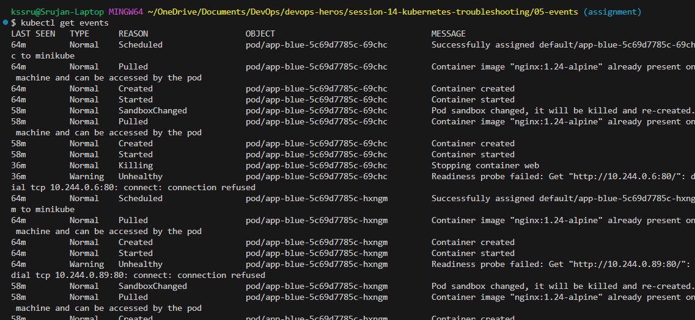

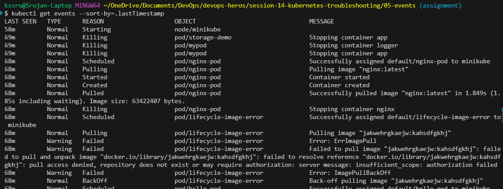

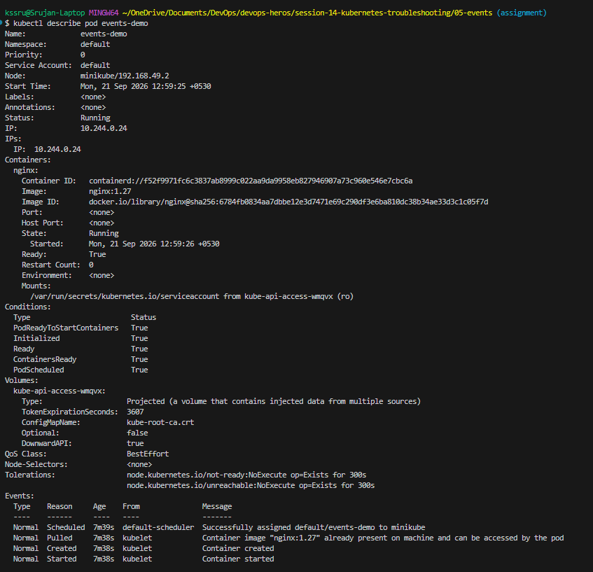

---

<br>

# Task 6: Diagnosing & Resolving `CrashLoopBackOff`

## Objective

Diagnose an application that repeatedly starts, crashes, and triggers Kubernetes back-off restart delays.

### Broken Manifest (`broken-pod.yaml`)

```yaml
apiVersion: v1
kind: Pod
metadata:
  name: crash-demo
spec:
  containers:
    - name: app
      image: busybox:1.36
      command: ["sh", "-c", "echo 'Application starting...'; echo 'Something went wrong!'; exit 1"]
```

### Fixed Manifest (`fixed-pod.yaml`)

```yaml
apiVersion: v1
kind: Pod
metadata:
  name: crash-demo
spec:
  containers:
    - name: app
      image: busybox:1.36
      command: ["sh", "-c", "echo 'Application starting...'; echo 'Application is healthy'; sleep 3600"]
```

## Commands Executed

```bash
cd ../06-crashloopbackoff

# 1. Deploy broken pod
kubectl apply -f broken-pod.yaml
kubectl get pods

# 2. Investigate failure
kubectl describe pod crash-demo
kubectl logs crash-demo
kubectl logs crash-demo --previous

# 3. Fix pod
kubectl delete pod crash-demo
kubectl apply -f fixed-pod.yaml
kubectl get pods
kubectl logs crash-demo
```

## Concepts & Root Cause Analysis

- **Understanding `CrashLoopBackOff`**: It is a status symptom indicating that a container exited with a non-zero code repeatedly. Kubernetes applies an exponential back-off delay (10s, 20s, 40s... up to 5m) before restarting.
- **Root Cause**: The startup script executed `exit 1`, causing immediate container death.
- **Resolution**: Replaced `exit 1` with a persistent long-running process (`sleep 3600`), stabilizing the pod in `1/1 Running`.

## Output & Verification

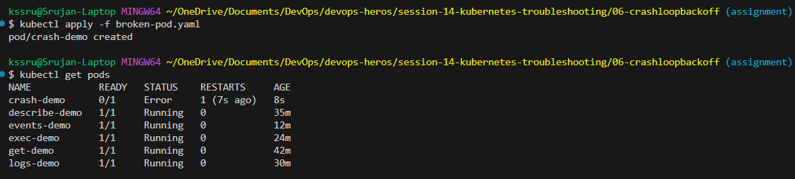

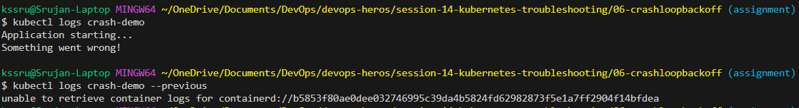

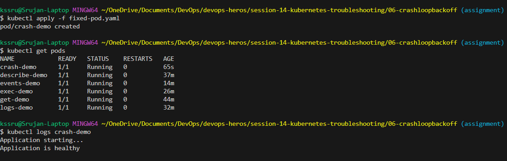

---

<br>

# Task 7: Diagnosing & Resolving `ImagePullBackOff`

## Objective

Identify and fix image pull failures caused by invalid container tags or nonexistent registry artifacts.

### Broken Manifest (`broken-pod.yaml`)

```yaml
apiVersion: v1
kind: Pod
metadata:
  name: image-demo
spec:
  containers:
    - name: app
      image: nginx:this-image-does-not-exist
```

### Fixed Manifest (`fixed-pod.yaml`)

```yaml
apiVersion: v1
kind: Pod
metadata:
  name: image-demo
spec:
  containers:
    - name: app
      image: nginx:1.27
```

## Commands Executed

```bash
cd ../07-imagepullbackoff

# 1. Deploy broken workload
kubectl apply -f broken-pod.yaml
kubectl get pods

# 2. Inspect failure events
kubectl describe pod image-demo

# 3. Apply fix
kubectl delete pod image-demo
kubectl apply -f fixed-pod.yaml
kubectl get pods
```

## Concepts & Root Cause Analysis

- **`ErrImagePull` vs `ImagePullBackOff`**: `ErrImagePull` is the initial pull failure attempt. If retries fail repeatedly, Kubernetes enters `ImagePullBackOff` to prevent overloading the registry with continuous requests.
- **Root Cause**: The image tag `nginx:this-image-does-not-exist` does not exist on Docker Hub (`manifest unknown`).
- **Resolution**: Corrected the image tag to `nginx:1.27`, allowing the image to pull and start immediately.

## Output & Verification

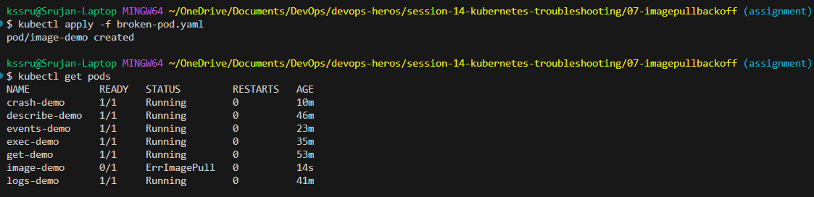

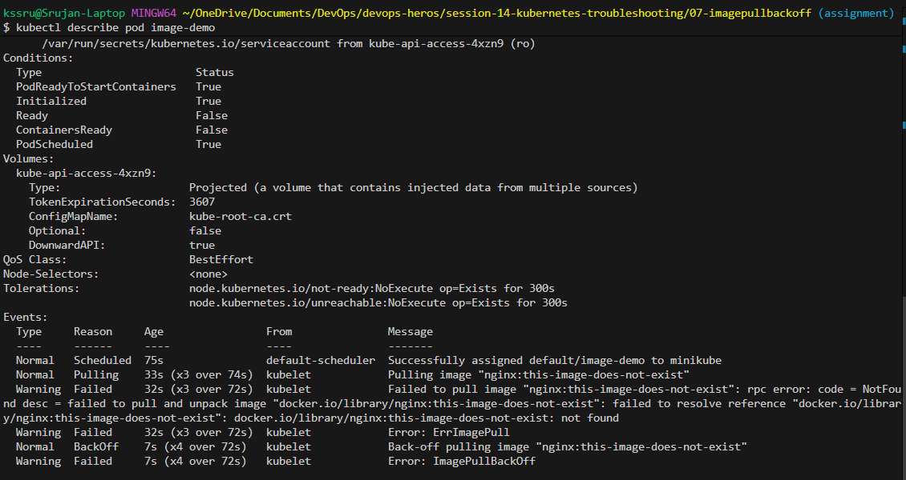

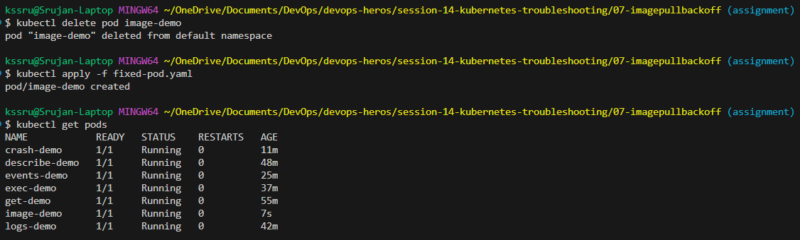

---

<br>

# Task 8: Diagnosing & Resolving `Pending` Pods

## Objective

Identify why a Pod remains unscheduled in `Pending` state and resolve node scheduling constraints.

### Broken Manifest (`broken-pod.yaml`)

```yaml
apiVersion: v1
kind: Pod
metadata:
  name: pending-demo
spec:
  nodeSelector:
    kubernetes.io/hostname: node-that-does-not-exist
  containers:
    - name: nginx
      image: nginx:1.27
```

### Fixed Manifest (`fixed-pod.yaml`)

```yaml
apiVersion: v1
kind: Pod
metadata:
  name: pending-demo
spec:
  containers:
    - name: nginx
      image: nginx:1.27
```

## Commands Executed

```bash
cd ../08-pending-pods

# 1. Deploy broken workload
kubectl apply -f broken-pod.yaml
kubectl get pods

# 2. Inspect scheduler rejection
kubectl describe pod pending-demo
kubectl get nodes

# 3. Fix pod
kubectl delete pod pending-demo
kubectl apply -f fixed-pod.yaml
kubectl get pods
```

## Concepts & Root Cause Analysis

- **Scheduler Lifecycle**: When a pod is submitted to `etcd`, `kube-scheduler` filters all available nodes. If zero nodes satisfy requirements (nodeSelector, resource limits, taints), the pod stays in `Pending` with `Node: <none>` and `PodScheduled: False`.
- **Root Cause**: The `nodeSelector` requested `node-that-does-not-exist`, but the cluster only contains `minikube`.
- **Resolution**: Removed the invalid selector in `fixed-pod.yaml`, allowing `kube-scheduler` to bind the pod to `minikube`.

## Output & Verification

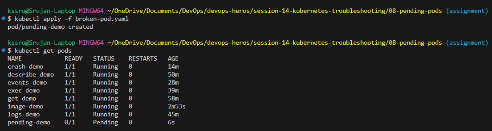

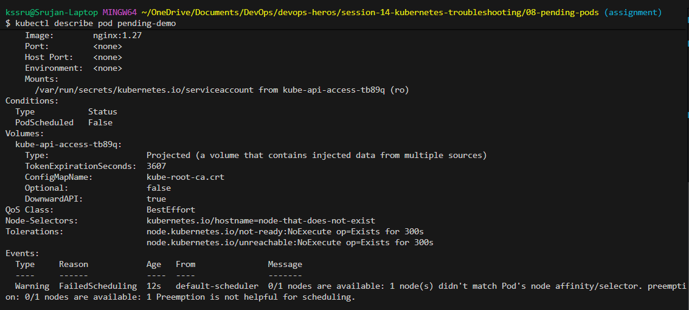

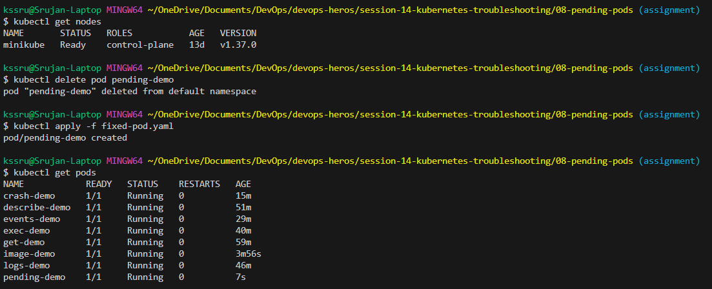

---

<br>

# Task 9: Service Routing, Selector Mismatch & DNS Troubleshooting

## Objective

Verify Service endpoint routing, test in-cluster DNS resolution via CoreDNS, and troubleshoot broken services caused by label selector mismatches.

## Manifests

- **Deployment (`deployment.yaml`)**: Runs 2 replicas of NGINX labeled `app: web`.
- **Valid Service (`service.yaml`)**: Exposes port 80 with selector `app: web`.
- **Broken Service (`broken-service.yaml`)**: Selector set to `app: does-not-exist`.

## Commands Executed

```bash
cd ../09-service-dns-troubleshooting

# 1. Deploy app and valid service
kubectl apply -f deployment.yaml
kubectl apply -f service.yaml
kubectl get pods -l app=web
kubectl get endpoints web-service
kubectl describe service web-service

# 2. Launch DNS testing pod
kubectl run dns-test --image=busybox:1.36 -- sleep 3600

# 3. Test DNS & HTTP
kubectl exec dns-test -- nslookup web-service
kubectl exec dns-test -- nslookup web-service.default.svc.cluster.local
kubectl exec dns-test -- wget -qO- http://web-service
kubectl exec dns-test -- cat //etc/resolv.conf
kubectl get pods -n kube-system -l k8s-app=kube-dns

# 4. Simulate selector mismatch
kubectl apply -f broken-service.yaml
kubectl get endpoints broken-service
```

## Concepts & Key Learnings

- **Service Selector to Endpoint Mapping**: A Service does not route to Pods directly; it dynamically builds an `Endpoints` list from Pods matching its `spec.selector`.
- **The Selector Mismatch Gotcha**: If a Service selector has a typo (`app: does-not-exist`), the Service and Pods can both be healthy, but `ENDPOINTS` will be `<none>`, causing all traffic to drop.
- **In-Cluster DNS Structure**: DNS queries resolve using the format `<service-name>.<namespace>.svc.cluster.local`, managed by CoreDNS (`10.96.0.10`).

## Output & Verification

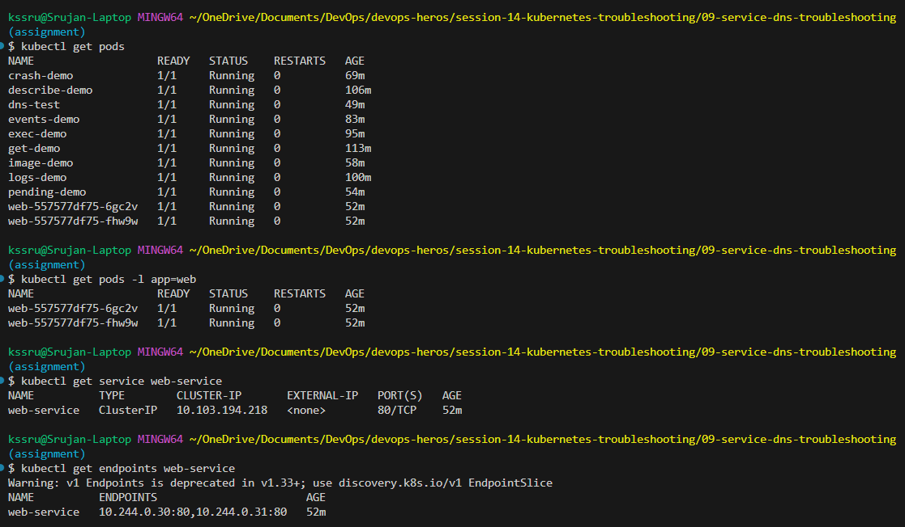

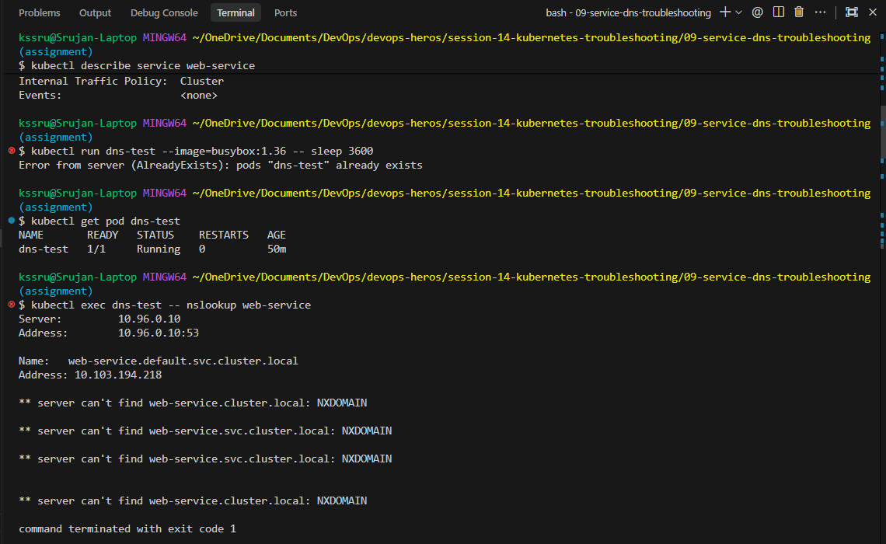

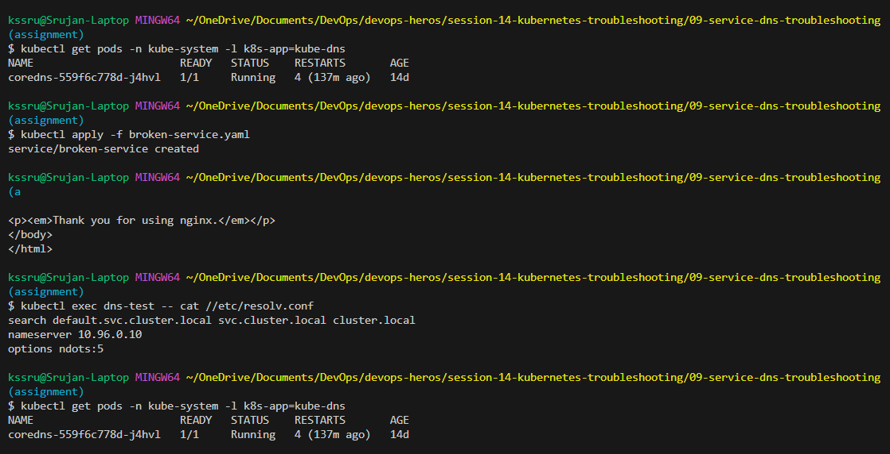

---

<br>

# Mini-Project: Troubleshooting Challenge & Submission Synthesis

## Troubleshooting Summary Table

| Scenario | Symptom / Status | Diagnostic Command Used | Root Cause | Resolution |
| :--- | :--- | :--- | :--- | :--- |
| **CrashLoopBackOff** | Pod status `CrashLoopBackOff`, restarts incrementing | `kubectl logs <pod> --previous` & `kubectl describe pod` | Startup command failed with `exit 1` | Replaced exit command with continuous process `sleep 3600` |
| **ImagePullBackOff** | Pod status `ErrImagePull` $\rightarrow$ `ImagePullBackOff` | `kubectl describe pod` (Events section) | Non-existent image tag `nginx:this-image-does-not-exist` | Corrected image tag to valid version `nginx:1.27` |
| **Pending Pod** | Pod status `Pending`, `Node: <none>` | `kubectl describe pod` (Events: `FailedScheduling`) | Invalid `nodeSelector` targeting missing hostname | Removed invalid `nodeSelector` to allow scheduling on `minikube` |
| **Broken Service** | Service created but requests fail, `Endpoints: <none>` | `kubectl get endpoints <svc>` & `kubectl describe svc` | Service selector `app: does-not-exist` mismatched Pod label `app: web` | Aligned Service `spec.selector` to match Pod label `app: web` |
| **DNS Resolution** | Name lookup failing inside container | `kubectl exec <pod> -- nslookup <svc>` & check `/etc/resolv.conf` | CoreDNS pod down or incorrect service FQDN queried | Queried FQDN `<svc>.<ns>.svc.cluster.local` and verified CoreDNS status |

---

## Conceptual Review & Reflection

### 1. What does `kubectl get` tell us?
`kubectl get` provides a high-level summary of cluster resources, showing current state, ready container counts, restart numbers, and uptime.

### 2. What is the difference between `get` and `describe`?
`kubectl get` is a quick macro overview ("What is the status?"), whereas `kubectl describe` is an in-depth inspection ("Why is it in this status?"), revealing container configurations, conditions, and the control plane Events timeline.

### 3. Why do we use `kubectl logs`?
It reads application-level standard output (`stdout`) and standard error (`stderr`) logs, essential for debugging application logic errors, failed database connections, and startup failures.

### 4. When would you use `kubectl exec`?
When you need to perform internal inspection from inside a running container, such as verifying local configuration files, testing network connectivity (`curl localhost`), or checking DNS configurations (`/etc/resolv.conf`).

### 5. What does `CrashLoopBackOff` mean?
It means the container starts, crashes (exits with a non-zero code), and Kubernetes pauses with an increasing back-off delay before restarting it again.

### 6. What does `ImagePullBackOff` mean?
It indicates Kubernetes failed to download the container image (due to invalid image name/tag, private registry authentication failure, or network issues) and is pausing before retrying.

### 7. Why can a Pod remain in `Pending`?
A Pod remains `Pending` when `kube-scheduler` cannot bind it to any node. Common reasons include insufficient CPU/memory resources, unmatched `nodeSelector`/affinity rules, unfulfilled PVCs, or node taints.

### 8. Why can a Service have no endpoints?
A Service will have `Endpoints: <none>` if its `spec.selector` labels do not match the labels defined under `spec.template.metadata.labels` of any running pods.

### 9. What is the relationship between a Service selector and Pod labels?
The Service selector acts as a query filter. Kubernetes watches pod labels and automatically registers matching Pod IP addresses into the Service's Endpoints/EndpointSlices object to route traffic.

### 10. What is Kubernetes DNS?
Kubernetes DNS (CoreDNS) is an internal cluster name resolution service that assigns consistent domain names (`<service>.<namespace>.svc.cluster.local`) to Service ClusterIPs, enabling decoupled microservice communication.

---
