# Session 15 - Helm: Package Manager for Kubernetes

## Student Details

- **Name:** Srujan Gowda KS
- **Roll Number:** 24BCS10339
- **Session:** 15 - Helm Architecture, Chart Packaging, Templating, Releases & Lifecycle Management

---

## Introduction

In standard Kubernetes deployments, managing multiple environments (Development, Staging, Production) requires maintaining duplicate sets of static YAML manifests (`deployment.yaml`, `service.yaml`, `configmap.yaml`). Any configuration change necessitates repetitive, error-prone manual edits across files.

**Helm** solves this problem by functioning as the **package manager for Kubernetes**:
- **Helm Chart**: A standardized packaging format encapsulating Kubernetes manifests parameterised with Go template syntax.
- **Values (`values.yaml`)**: Key-value configuration files that decouple dynamic environment-specific variables from workload templates.
- **Release Management**: Every installation and upgrade generates an immutable **Revision** stored securely inside Kubernetes Secrets, enabling zero-downtime upgrades, atomic rollouts, and instant rollbacks.

## Assignment Deliverables Summary

| Assignment Task | Focus Area | Status | Key Screenshot(s) |
|---|---|---|---|
| **Task 1: Helm Commands** | Hands-on execution of all 11 core commands (`repo`, `search`, `create`, `install`, `list`, `status`, `get`, `upgrade`, `history`, `rollback`, `uninstall`) | **Completed** | `Screenshot/task1-helm-core-commands.png` |
| **Task 2: Helm Rollback** | Complete lifecycle workflow: Install $\rightarrow$ Upgrade $\rightarrow$ Verify $\rightarrow$ Upgrade (Faulty) $\rightarrow$ Verify $\rightarrow$ Rollback $\rightarrow$ Verify | **Completed** | `Screenshot/task2-01-rollback-upgrades-and-failure.png`, `Screenshot/task2-02-rollback-success-and-history.png` |
| **Task 3: Mini Project** | Production Notes App Chart (`Chart.yaml`, `values.yaml`, `values-prod.yaml`, templates, ConfigMap, Dev $\rightarrow$ Prod rollout, rollback, teardown) | **Completed** | `Screenshot/task3-01-miniproject-dev-to-prod.png`, `Screenshot/task3-02-miniproject-rollback-and-cleanup.png` |

---

<br>

# Task 1: What is Helm & Basic Workflow (`01-what-is-helm`)

## Objective

Understand Helm's architecture (client-only Helm 3 architecture with no Tiller), add remote chart repositories, install public charts from Bitnami, and observe automated Kubernetes resource provisioning and lifecycle cleanup.

## Commands Executed

```bash
cd devops-heros/session-15-helm/01-what-is-helm

# 1. Verify Helm client version and check empty cluster releases
helm version
helm list

# 2. Add and update the Bitnami public repository
helm repo add bitnami https://charts.bitnami.com/bitnami
helm repo update

# 3. Install Nginx using the Bitnami chart
helm install my-nginx bitnami/nginx

# 4. Verify release status and created Kubernetes resources
helm list
kubectl get pods
kubectl get svc

# 5. Uninstall the release and verify clean teardown
helm uninstall my-nginx
helm list
kubectl get pods
```

## Concepts & Key Learnings

- **Helm 3 Architecture**: Unlike Helm 2 which required an in-cluster `Tiller` pod with excessive cluster-admin privileges, Helm 3 is completely client-side and relies directly on the user's `kubeconfig` RBAC permissions.
- **Chart vs. Release vs. Values**:
  - **Chart**: The packaged template skeleton (the recipe).
  - **Values**: Input variables applied during rendering (the ingredients).
  - **Release**: A distinct running instance of a chart deployed into a namespace (the cooked meal).
- **Automated Lifecycle & Teardown**: Running `helm uninstall` cleanly tracks and deletes all resources associated with the release without leaving orphaned objects behind.

## Output & Verification

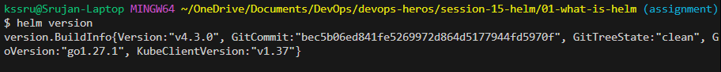

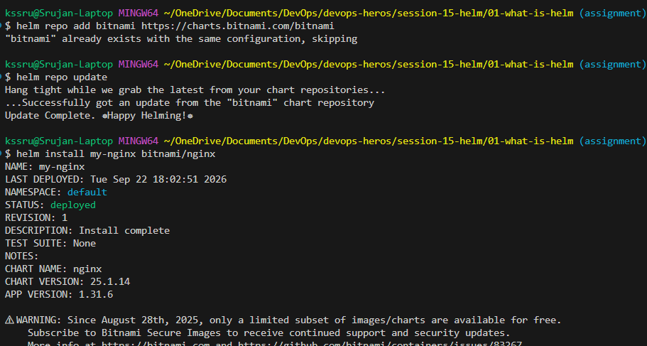

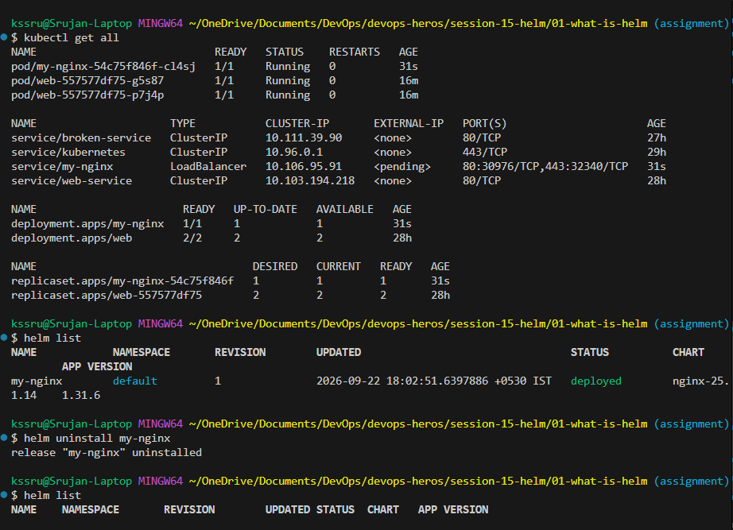

---

## Hands-On Practice: All 11 Core Helm Commands

As required by the session assignment, each core Helm command was executed, evaluated, and documented below:

### 1. `helm repo`
- **Purpose**: Manages remote Helm chart repositories (HTTP/HTTPS/OCI registries) where packaged charts are hosted.
- **Commands**:
  ```bash
  helm repo add bitnami https://charts.bitnami.com/bitnami
  helm repo update
  helm repo list
  ```
- **What it does**: Fetches the `index.yaml` repository catalog containing chart names, versions, and checksums and caches them locally on disk.

### 2. `helm search`
- **Purpose**: Queries Helm repositories or Artifact Hub for available charts and application versions.
- **Commands**:
  ```bash
  helm search repo bitnami/nginx
  helm search hub prometheus
  ```
- **What it does**: Scans the local repository cache (`helm search repo`) or queries Artifact Hub API (`helm search hub`) matching keywords and returns chart version, app version, and description.

### 3. `helm create`
- **Purpose**: Scaffolds a new, standardized chart directory skeleton with default templates and best practices.
- **Command**:
  ```bash
  helm create demo-chart
  ```
- **What it does**: Generates `Chart.yaml`, `values.yaml`, `templates/` (`deployment.yaml`, `service.yaml`, `ingress.yaml`, `hpa.yaml`, `serviceaccount.yaml`, `_helpers.tpl`, `NOTES.txt`), and `.helmignore`.

### 4. `helm install`
- **Purpose**: Deploys a Helm chart to the Kubernetes cluster as a new named Release (Revision 1).
- **Command**:
  ```bash
  helm install demo-release ./simple-chart
  ```
- **What it does**: Renders Go templates using supplied values, submits the generated manifests to the Kubernetes API server via your `kubeconfig` context, and creates a release tracking Secret.

### 5. `helm list`
- **Purpose**: Lists all active or deployed Helm releases in the current or all namespaces.
- **Commands**:
  ```bash
  helm list
  helm list -A  # across all namespaces
  ```
- **What it does**: Queries Kubernetes Secrets matching label `owner=helm` and displays release name, namespace, revision, status, chart version, and app version.

### 6. `helm status`
- **Purpose**: Displays the real-time operational status, metadata, and provisioned Kubernetes resources of a deployed release.
- **Command**:
  ```bash
  helm status demo-release
  ```
- **What it does**: Retrieves release state from the cluster, showing deployment status (`STATUS: deployed`), revision number, namespace, and all active resources (Deployments, Services, Pods, ConfigMaps).

### 7. `helm get`
- **Purpose**: Inspects the low-level stored release artifacts stored in Kubernetes Secrets.
- **Commands**:
  ```bash
  helm get values demo-release      # Shows user-supplied override values
  helm get values demo-release -a   # Shows all computed/default values
  helm get manifest demo-release    # Shows the exact rendered YAML manifests applied to cluster
  helm get all demo-release         # Shows notes, values, and manifests combined
  ```
- **What it does**: Decodes the base64 gzipped release secret directly without querying individual Kubernetes API endpoints.

### 8. `helm upgrade`
- **Purpose**: Applies configuration changes, value overrides, or updated templates to an existing release.
- **Command**:
  ```bash
  helm upgrade demo-release ./simple-chart --set replicaCount=3
  ```
- **What it does**: Computes a three-way merge patch between the previous manifest, the new rendered manifest, and the live Kubernetes state, incrementing the Revision number to 2.

### 9. `helm history`
- **Purpose**: Displays the complete audit log of revisions for a given release.
- **Command**:
  ```bash
  helm history demo-release
  ```
- **What it does**: Lists every revision (`1`, `2`, `3`...), timestamp, status (`superseded`, `deployed`), chart version, and description (`Install complete`, `Upgrade complete`, `Rollback to 2`).

### 10. `helm rollback`
- **Purpose**: Instantly rolls back a release to a previously known healthy revision.
- **Command**:
  ```bash
  helm rollback demo-release 1
  ```
- **What it does**: Restores the exact manifest configuration of Revision 1 and applies it as a brand-new revision (Revision 3), preserving the full audit trail.

### 11. `helm uninstall`
- **Purpose**: Deletes a release and purges all associated Kubernetes resources from the cluster.
- **Command**:
  ```bash
  helm uninstall demo-release
  ```
- **What it does**: Cascades deletion across all Kubernetes objects associated with the release (Deployments, Pods, Services, Secrets) and marks or purges the Helm release secret.

---

### Task 1 Output & Verification Screenshot

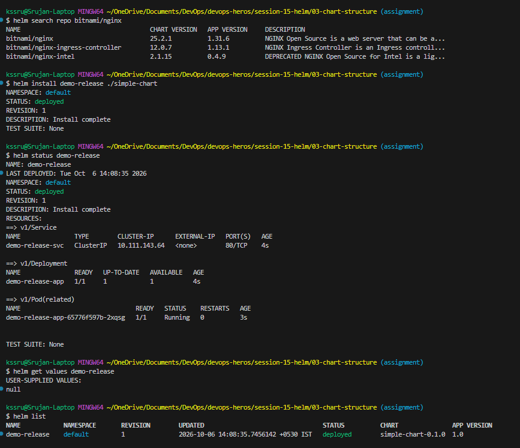

---

<br>

# Task 2: Helm Charts & Starter Scaffolding (`02-helm-charts`)

## Objective

Learn how to generate a starter chart using `helm create`, examine its directory layout, validate manifests locally using `helm template` (dry-run rendering), deploy the local chart to the cluster, and manage its lifecycle.

## Commands Executed

```bash
cd devops-heros/session-15-helm/02-helm-charts

# 1. Generate starter chart skeleton and inspect files
helm create demo-chart
ls demo-chart
ls demo-chart/templates

# 2. Render templates locally without deploying (dry-run)
helm template my-release demo-chart

# 3. Install the local chart to the cluster
helm install demo-release demo-chart

# 4. Verify release status and running resources
helm list
kubectl get pods,svc

# 5. Uninstall release
helm uninstall demo-release
helm list
kubectl get pods
```

## Concepts & Key Learnings

- **`helm create`**: Scaffolds a production-ready chart directory containing `Chart.yaml`, `values.yaml`, `charts/` (subcharts), and `templates/` (`deployment.yaml`, `service.yaml`, `serviceaccount.yaml`, `hpa.yaml`, `ingress.yaml`, `NOTES.txt`, `_helpers.tpl`).
- **`helm template`**: Executes client-side rendering of Go templates combined with default or overridden values. This allows developers to catch syntax and indentation errors before applying anything to Kubernetes.
- **Deploying Local Directories**: Helm accepts local directory paths (`./demo-chart`) directly, removing the need to publish charts to a remote registry during development.

## Output & Verification

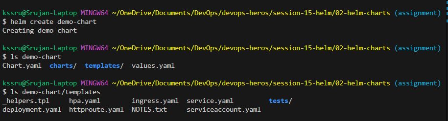

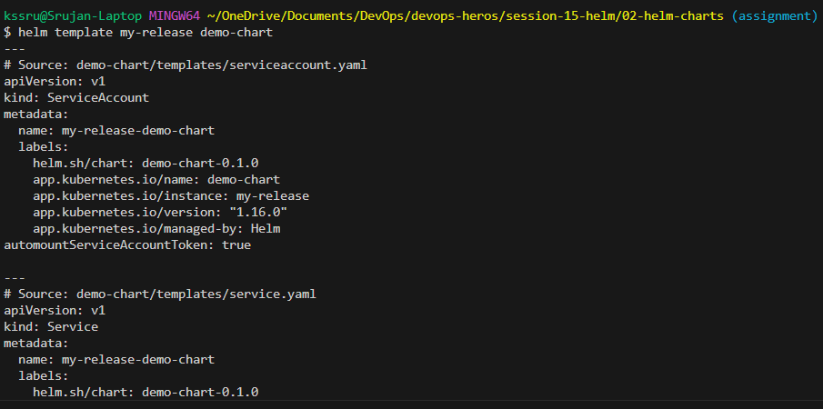

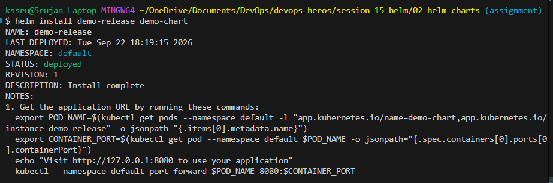

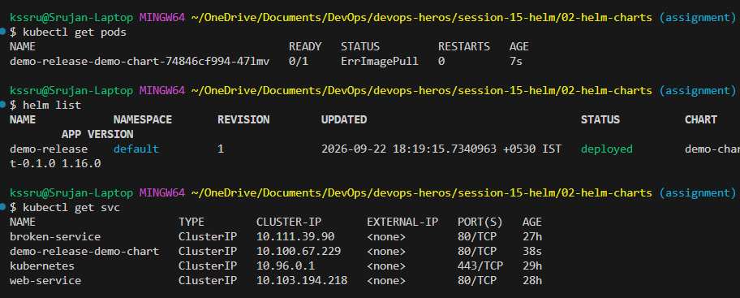

---

<br>

# Task 3: Chart Structure & Parameterized Templates (`03-chart-structure`)

## Objective

Understand the internal anatomy of a minimal Helm chart (`Chart.yaml`, `values.yaml`, and `templates/`) and see how Go template expressions interpolate variables during deployment.

## Chart Manifests & Structure

### `simple-chart/Chart.yaml`
```yaml
apiVersion: v2
name: simple-chart
description: A simple Helm chart example
type: application
version: 0.1.0
appVersion: "1.0"
```

### `simple-chart/values.yaml`
```yaml
replicaCount: 1
image:
  repository: nginx
  tag: latest
service:
  port: 80
```

### `simple-chart/templates/deployment.yaml`
```yaml
apiVersion: apps/v1
kind: Deployment
metadata:
  name: {{ .Release.Name }}-app
spec:
  replicas: {{ .Values.replicaCount }}
  selector:
    matchLabels:
      app: {{ .Release.Name }}
  template:
    metadata:
      labels:
        app: {{ .Release.Name }}
    spec:
      containers:
        - name: app
          image: "{{ .Values.image.repository }}:{{ .Values.image.tag }}"
          ports:
            - containerPort: {{ .Values.service.port }}
```

### `simple-chart/templates/service.yaml`
```yaml
apiVersion: v1
kind: Service
metadata:
  name: {{ .Release.Name }}-svc
spec:
  selector:
    app: {{ .Release.Name }}
  ports:
    - port: {{ .Values.service.port }}
      targetPort: {{ .Values.service.port }}
```

## Commands Executed

```bash
cd devops-heros/session-15-helm/03-chart-structure

# 1. Inspect chart files
ls simple-chart
cat simple-chart/Chart.yaml
cat simple-chart/values.yaml

# 2. Inspect templates
cat simple-chart/templates/deployment.yaml
cat simple-chart/templates/service.yaml

# 3. Render chart templates locally
helm template my-release simple-chart

# 4. Deploy release and verify pods and services
helm install my-release simple-chart
helm list
kubectl get pods,svc

# 5. Clean up release
helm uninstall my-release
helm list
kubectl get pods
```

## Concepts & Key Learnings

- **Template Variable Interpolation**: Expressions enclosed in `{{ .Values.<key> }}` pull values directly from `values.yaml`.
- **Built-in Objects**:
  - `{{ .Release.Name }}`: The name assigned to the release at execution time.
  - `{{ .Chart.Name }}` / `{{ .Chart.Version }}`: Metadata pulled from `Chart.yaml`.
- **Decoupled Architecture**: Kubernetes resource definitions are completely separated from configuration parameters, ensuring reusability across infinite deployment environments.

## Output & Verification

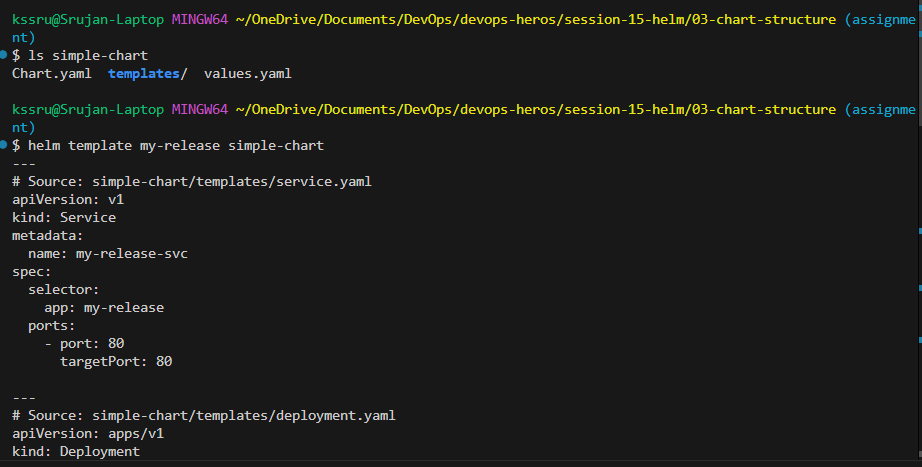

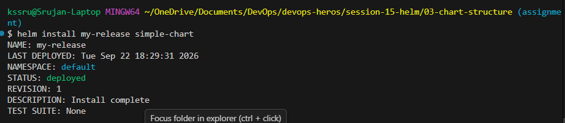

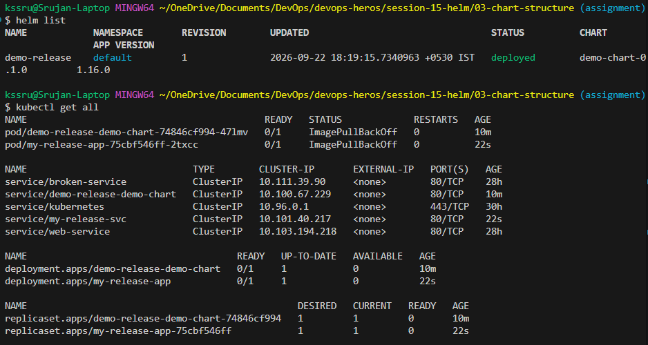

---

<br>

# Task 4: Deep Dive into `Chart.yaml` Metadata (`04-chart-yaml`)

## Objective

Master the role of `Chart.yaml` as the authoritative identity and packaging specification of a Helm chart, understand versioning best practices, validate chart syntax using `helm lint`, and utilize chart metadata inside Kubernetes templates.

## Structure & Manifests

```yaml
apiVersion: v2
name: my-app
description: A learning chart
type: application
version: 0.1.0
appVersion: "1.0"
keywords:
  - nginx
  - web
home: https://example.com
maintainers:
  - name: Srujan Gowda
    email: srujan@example.com
```

## Workflow & Commands

```bash
cd devops-heros/session-15-helm/04-chart-yaml

# Validate chart syntax and check for missing required fields
helm lint my-app/

# Render template using Chart metadata inside labels
helm template test-release my-app/
```

## Concepts & What Was Learned

1. **`version` vs `appVersion` Distinction**:
   - `version` (SemVer: `0.1.0`): The version of the **Helm chart itself**. This version must be bumped whenever templates, default values, or chart dependencies change.
   - `appVersion` (`1.0` / `v2.4.1`): The version of the **underlying containerized application** (matching the Docker container image tag).
2. **`apiVersion: v2`**: Required declaration indicating a Helm 3 chart. Helm 2 used `v1`.
3. **`type: application` vs `type: library`**: Application charts produce deployable Kubernetes resources; library charts only provide reusable helper functions and definitions for other charts.
4. **`helm lint`**: A mandatory CI/CD quality gate that inspects charts for schema compliance, formatting errors, missing required keys, or malformed YAML.
5. **Chart Metadata in Templates**: Labels like `chart: "{{ .Chart.Name }}-{{ .Chart.Version }}"` and `app.kubernetes.io/version: "{{ .Chart.AppVersion }}"` standardize observability and cluster inventory tracking.

---

<br>

# Task 5: Dynamic Configuration with `values.yaml` (`05-values-yaml`)

## Objective

Learn how to configure default values, override settings dynamically during installation/upgrade using `--set` and environment-specific values files (`-f values-prod.yaml`), and understand value precedence.

## Structure & Manifests

### `values.yaml` (Default / Development)
```yaml
replicaCount: 1
image:
  repository: nginx
  tag: latest
service:
  port: 80
app:
  name: demo-app
```

### `values-prod.yaml` (Production Overrides)
```yaml
replicaCount: 5
image:
  tag: "1.25.0"
```

## Workflow & Commands

```bash
cd devops-heros/session-15-helm/05-values-yaml

# 1. Preview default rendered replicas (1 replica)
helm template my-app ./chart | grep "replicas:"

# 2. Preview with command-line overrides (--set)
helm template my-app ./chart --set replicaCount=3 | grep "replicas:"

# 3. Deploy with environment values file override (-f)
helm install my-app ./chart -f values-prod.yaml
```

## Concepts & What Was Learned

1. **Elimination of Hardcoded YAML**: Values files allow one single codebase to serve multiple Kubernetes environments cleanly.
2. **Values Hierarchy & Precedence Rules**:
   $$\text{values.yaml (Lowest)} \longrightarrow \text{Parent Subcharts} \longrightarrow \text{-f values-<env>.yaml} \longrightarrow \text{--set / --set-string (Highest)}$$
3. **Production Best Practice**: Always store environment configurations in committed, version-controlled YAML files (e.g., `values-staging.yaml`, `values-prod.yaml`) rather than ad-hoc `--set` flags in terminal commands.

---

<br>

# Task 6: Advanced Go Templating & Logic (`06-templates`)

## Objective

Deepen understanding of Go template variables, built-in functions, whitespace trimming, and conditional template blocks (`if/else`) to toggle resources dynamically.

## Structure & Manifests

### Conditional Service Template (`templates/service.yaml`)
```yaml
{{- if .Values.service.enabled }}
apiVersion: v1
kind: Service
metadata:
  name: {{ .Release.Name }}-svc
spec:
  ports:
    - port: {{ .Values.service.port }}
      targetPort: {{ .Values.service.port }}
  selector:
    app: {{ .Release.Name }}
{{- end }}
```

## Workflow & Commands

```bash
cd devops-heros/session-15-helm/06-templates

# Render default template (2 replicas)
helm template my-release template-demo

# Dynamically override replica count via flag
helm template my-release template-demo --set replicaCount=5 | grep "replicas:"

# Test conditional rendering (disabling service)
helm template my-release template-demo --set service.enabled=false
```

## Concepts & What Was Learned

1. **Go Template Scope & Dot (`.`) Context**: The dot (`.`) represents root context, providing access to `.Values`, `.Release`, `.Chart`, and `.Files`.
2. **Whitespace Trimming (`{{-` and `-}}`)**: Removes leading and trailing whitespace and newlines, preventing indentation corruption in generated Kubernetes YAML.
3. **Conditional Logic (`{{- if }} ... {{- end }}`)**: Allows optional creation of resources (e.g., toggling Ingress, ServiceMonitor, or HorizontalPodAutoscaler based on environment needs).

---

<br>

# Task 7: Release Lifecycle & Upgrades (`07-install-upgrade`)

## Objective

Master the lifecycle of a Helm release through installation, parameter upgrades, revision tracking, and the idempotent `helm upgrade --install` pattern.

## Workflow & Commands

```bash
cd devops-heros/session-15-helm/07-install-upgrade

# 1. Initial Installation (Revision 1)
helm install web-app ./app-chart
kubectl get pods

# 2. Check initial revision status
helm list

# 3. Upgrade release with scaled replicas (Revision 2)
helm upgrade web-app ./app-chart --set replicaCount=3

# 4. Verify upgraded pod count
kubectl get pods

# 5. Idempotent CI/CD Command
helm upgrade --install web-app ./app-chart
```

## Concepts & What Was Learned

1. **Revision Tracking**: Every `helm install` or `helm upgrade` increments the release **Revision** number (`1` $\rightarrow$ `2` $\rightarrow$ `3`).
2. **Release State Storage**: Helm 3 stores revision snapshots directly inside Kubernetes Secrets named `sh.helm.release.v1.<release-name>.v<revision>`.
3. **`helm upgrade --install`**: The standard command used in CI/CD pipelines (GitOps/GitHub Actions/GitLab CI). It automatically determines whether to perform a fresh installation or an in-place upgrade.

---

<br>

# Task 8: Release History & Rollback Mechanisms (`08-rollback`)

## Rollback Workflow Lifecycle

```text
Install (Revision 1)
   ↓
Upgrade (Revision 2 - Scale Replicas)
   ↓
Verify (Check pods and release history)
   ↓
Upgrade again (Revision 3 - Faulty image tag)
   ↓
Verify (Observe ImagePullBackOff failure)
   ↓
Rollback (Rollback to healthy Revision 2)
   ↓
Verify (Confirm pod restoration and audit trail)
```

## Workflow & Commands Executed

```bash
cd devops-heros/session-15-helm/07-install-upgrade

# 1. Install Revision 1 (healthy nginx, 1 replica)
helm install rollback-demo ./app-chart
kubectl get pods

# 2. Upgrade to Revision 2 (scale to 3 replicas)
helm upgrade rollback-demo ./app-chart --set replicaCount=3

# 3. Verify Revision 2
kubectl get pods
helm history rollback-demo

# 4. Upgrade again to Revision 3 with a broken image tag
helm upgrade rollback-demo ./app-chart --set image.tag=invalid-nonexistent-tag

# 5. Verify failure state
kubectl get pods  # Observe ImagePullBackOff / ErrImagePull
helm history rollback-demo

# 6. Execute instant rollback to healthy Revision 2
helm rollback rollback-demo 2

# 7. Verify restored pods & audit history
kubectl get pods  # All 3 pods return to Running 1/1
helm history rollback-demo  # Shows Revision 4: "Rollback to 2"

# 8. Clean up resources
helm uninstall rollback-demo
```

## Concepts & What Was Learned

1. **Release History Inspection (`helm history`)**: Displays all revisions with statuses (`superseded`, `deployed`), timestamps, chart versions, and action descriptions.
2. **Append-Only Rollback Model**: Rolling back to Revision 1 does not erase Revision 2. Instead, Helm deploys a **new Revision 3** that mirrors Revision 1's state, preserving full audit history.
3. **Atomic Deployments (`--atomic --timeout`)**: If pods fail readiness probes or crash during rollout within the specified timeout window, Helm automatically triggers a rollback without human intervention.

## Output & Verification

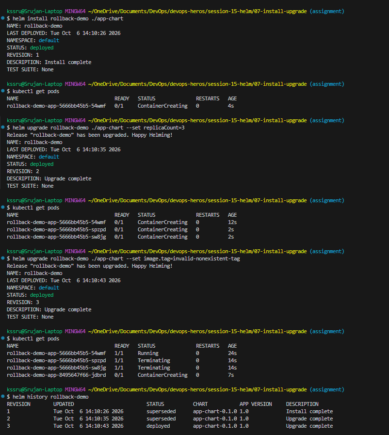

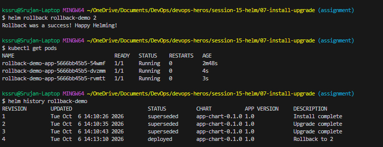

---

<br>

# Task 9: Full Multi-Resource Application Deployment (`09-deploying-application`)

## Objective

Assemble an end-to-end multi-resource Helm chart from scratch consisting of a `Deployment`, `Service` (NodePort), and `ConfigMap`, validating template rendering, linting, scaling, and lifecycle teardown.

## Chart Manifests

### `guestbook-chart/templates/configmap.yaml`
```yaml
apiVersion: v1
kind: ConfigMap
metadata:
  name: {{ .Release.Name }}-config
data:
  welcome: {{ .Values.config.welcomeMessage | quote }}
  appName: {{ .Values.config.appName | quote }}
```

### `guestbook-chart/templates/deployment.yaml`
```yaml
apiVersion: apps/v1
kind: Deployment
metadata:
  name: {{ .Release.Name }}-app
spec:
  replicas: {{ .Values.replicaCount }}
  selector:
    matchLabels:
      app: {{ .Release.Name }}
  template:
    metadata:
      labels:
        app: {{ .Release.Name }}
    spec:
      containers:
        - name: guestbook
          image: "{{ .Values.image.repository }}:{{ .Values.image.tag }}"
          ports:
            - containerPort: {{ .Values.service.port }}
          envFrom:
            - configMapRef:
                name: {{ .Release.Name }}-config
```

### `guestbook-chart/templates/service.yaml`
```yaml
apiVersion: v1
kind: Service
metadata:
  name: {{ .Release.Name }}-svc
spec:
  type: NodePort
  selector:
    app: {{ .Release.Name }}
  ports:
    - port: {{ .Values.service.port }}
      targetPort: {{ .Values.service.port }}
      nodePort: 30080
```

## Workflow & Commands

```bash
cd devops-heros/session-15-helm/09-deploying-application

# 1. Lint the chart
helm lint guestbook-chart

# 2. Render templates locally
helm template my-guestbook guestbook-chart

# 3. Deploy multi-resource application
helm install my-guestbook guestbook-chart

# 4. Verify all Kubernetes components
kubectl get pods
kubectl get svc
kubectl get cm

# 5. Upgrade and scale
helm upgrade my-guestbook guestbook-chart --set replicaCount=3

# 6. Full clean up
helm uninstall my-guestbook
```

## Concepts & What Was Learned

- **Multi-Resource Orchestration**: A single chart manages interconnected Kubernetes primitives (ConfigMaps feeding environment variables into Deployments, exposed by Services).
- **Template Filters (`| quote`)**: Formats strings safely to satisfy Kubernetes strict typing requirements.

---

<br>

# Mini-Project: Package and Deploy the Notes App with Helm

## Objective

Build, lint, package, and deploy a complete production-ready **Notes App** Helm chart supporting distinct Development and Production configurations (`values.yaml` vs `values-prod.yaml`), simulate zero-downtime upgrades, handle faulty deployments, and execute automated rollbacks.

## Architecture & Directory Layout

```text
notes-chart/
├── Chart.yaml              # Chart metadata (v2, version: 0.1.0, appVersion: "1.0")
├── values.yaml             # Dev defaults (1 replica, nginx:1.24, env: development)
├── values-prod.yaml        # Prod overrides (3 replicas, nginx:1.25, env: production)
└── templates/
    ├── configmap.yaml      # Environment variables (APP_NAME, ENVIRONMENT)
    ├── deployment.yaml     # Parameterized Deployment manifest
    └── service.yaml        # NodePort Service manifest (port 80 -> nodePort 30090)
```

## End-to-End Execution Steps

```bash
cd devops-heros/session-15-helm/mini-project

# Step 1: Lint chart quality and syntax
helm lint notes-chart

# Step 2: Render Development templates locally
helm template notes-dev notes-chart

# Step 3: Deploy Development Release (Revision 1)
helm install notes-dev notes-chart

# Step 4: Verify Dev Deployment (1 replica, dev ConfigMap)
kubectl get pods,svc,configmaps

# Step 5: Upgrade to Production Release (Revision 2 - 3 replicas, nginx:1.25)
helm upgrade notes-dev notes-chart -f notes-chart/values-prod.yaml
kubectl get pods

# Step 6: Simulate Failed Upgrade with Invalid Image (Revision 3)
helm upgrade notes-dev notes-chart --set image.tag=broken-tag-does-not-exist
kubectl get pods  # Shows ImagePullBackOff

# Step 7: Inspect Release Audit History
helm history notes-dev

# Step 8: Execute Instant Rollback to Stable Production Revision (Revision 2)
helm rollback notes-dev 2
kubectl get pods  # All 3 pods successfully return to Running

# Step 9: Teardown & Cluster Cleanup
helm uninstall notes-dev
```

## Output & Verification

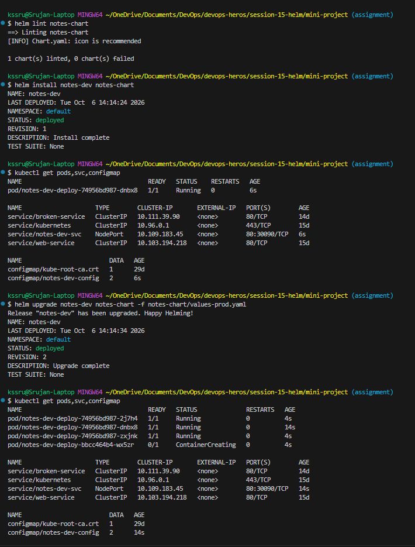

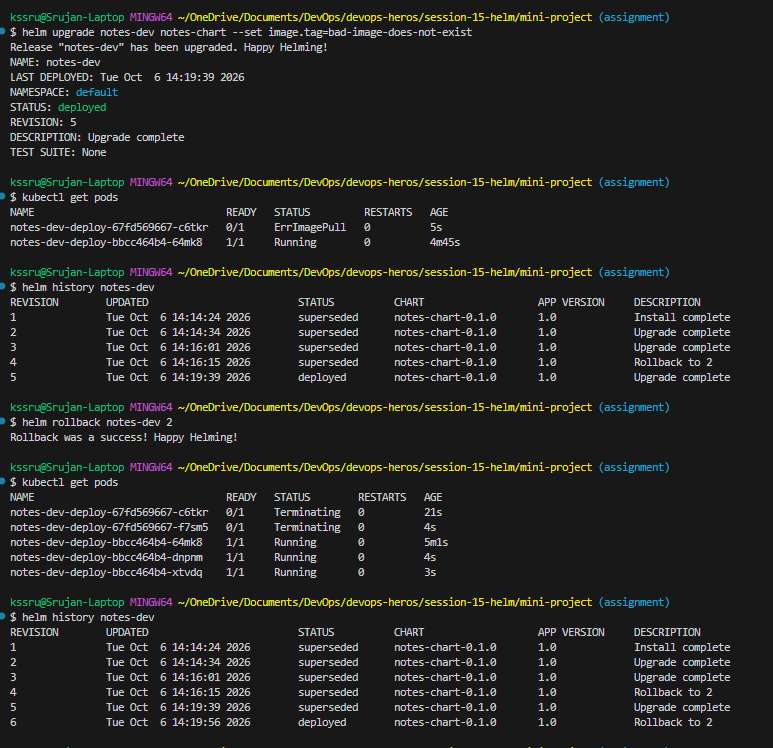

## Summary of Accomplishments & Mastered Capabilities

```text
[PASS] Created complete multi-resource Helm chart from scratch
[PASS] Maintained environment isolation using values.yaml and values-prod.yaml
[PASS] Implemented Go template parameterization across ConfigMaps, Deployments, and Services
[PASS] Validated charts using helm lint and helm template dry-run checks
[PASS] Deployed, scaled, and managed release lifecycles with helm install and helm upgrade
[PASS] Diagnosed deployment failures and executed instant rollbacks with helm rollback
[PASS] Ensured clean cluster state management via helm uninstall
```

---

## Key Helm Reference Cheat Sheet

| Command | Purpose |
|---|---|
| `helm version` | Prints client build and version information |
| `helm create <name>` | Scaffolds a new starter chart directory structure |
| `helm lint <chart>` | Runs static analysis and syntax validation on chart files |
| `helm template <release> <chart>` | Renders Go templates locally to inspect generated YAML (dry-run) |
| `helm install <release> <chart>` | Deploys a new chart release to the Kubernetes cluster |
| `helm upgrade <release> <chart>` | Upgrades an existing release with new values or template changes |
| `helm upgrade --install <release> <chart>` | Idempotently installs or upgrades a release (recommended for CI/CD) |
| `helm list` | Lists all deployed releases across namespaces |
| `helm status <release>` | Queries real-time operational status and active Kubernetes resources |
| `helm get values <release>` | Retrieves user-supplied override values |
| `helm get manifest <release>` | Prints live rendered manifests stored in the release Secret |
| `helm history <release>` | Displays the complete revision history of a release |
| `helm rollback <release> <revision>` | Rolls back a release to a previously known healthy revision |
| `helm uninstall <release>` | Deletes the release and purges all associated Kubernetes resources |

---

<br>

# Comprehensive Knowledge Guide: Concepts for Future Reference

### 1. Helm 3 Internal Architecture: How Helm Really Works
- **No Tiller Daemon (Client-Only Architecture)**: In Helm 2, an in-cluster component called `Tiller` ran with full cluster-admin rights, creating severe security vulnerabilities. Helm 3 completely removed Tiller. Helm now runs entirely on your local machine and uses your existing Kubernetes credentials (`~/.kube/config`).
- **Release Storage in Secrets**: Helm persists the state of every release directly inside Kubernetes Secrets within the release's target namespace:
  ```text
  sh.helm.release.v1.<release-name>.v<revision>
  ```
  These secrets contain base64-encoded, gzipped JSON payloads capturing the full chart metadata, user-supplied values, and the exact rendered YAML manifest applied to the cluster.
- **Three-Way Strategic Merge Patch**: When you run `helm upgrade`, Helm computes a three-way diff between:
  1. The manifest from the **previous release revision**.
  2. The **newly rendered manifest**.
  3. The **live state of the Kubernetes cluster** (preserving out-of-band edits or horizontal pod autoscaler adjustments).

---

### 2. Configuration Hierarchy & Precedence Rules
When configuring charts for multiple environments (Dev, Staging, Prod), values are evaluated according to a strict precedence order (from lowest to highest priority):

$$\text{values.yaml (Chart Defaults)} \longrightarrow \text{Parent Chart values} \longrightarrow \text{-f values-env.yaml} \longrightarrow \text{--set / --set-string (Highest Priority)}$$

**Best Practice Rule**: Never use `--set` in production CI/CD pipelines. Keep all configurations stored in version-controlled YAML files (`values-staging.yaml`, `values-prod.yaml`) to ensure complete GitOps reproducibility.

---

### 3. Go Templating, Sprig Functions & Indentation Control
Helm leverages Go templates combined with the Sprig template function library:
- **Root Context (`.` / "dot")**:
  - `.Values`: Variables passed from `values.yaml` or CLI flags.
  - `.Release.Name`, `.Release.Namespace`, `.Release.Revision`: Runtime release parameters.
  - `.Chart.Name`, `.Chart.Version`, `.Chart.AppVersion`: Metadata defined in `Chart.yaml`.
  - `.Files.Get`: Reads arbitrary non-template files packaged with the chart.
- **Whitespace Chomping (`{{-` and `-}}`)**:
  - `{{-` strips all whitespace and newlines to the left of the expression.
  - `-}}` strips all whitespace and newlines to the right.
  - *Why it matters*: YAML is strictly indentation-sensitive. Improper whitespace handling corrupts Kubernetes manifest syntax.
- **Template Filters & Pipelines (`|`)**:
  ```yaml
  name: {{ .Values.appName | default "demo" | lower | quote }}
  ```
- **Conditional Logic**:
  ```yaml
  {{- if .Values.ingress.enabled }}
  apiVersion: networking.k8s.io/v1
  kind: Ingress
  ...
  {{- end }}
  ```

---

### 4. Zero-Downtime Rollbacks & Production Incident Handling
- **Append-Only Revision Model**: Rolling back does **not** erase or delete broken revisions. If Revision 3 fails and you roll back to Revision 2, Helm generates **Revision 4** whose state is identical to Revision 2. This guarantees a complete, tamper-proof audit trail for compliance and post-mortems.
- **Automated Rollback with `--atomic`**:
  ```bash
  helm upgrade --install my-app ./chart \
    -f values-prod.yaml \
    --atomic \
    --timeout 180s
  ```
  If any pod fails liveness probes, readiness probes, or enters `CrashLoopBackOff`/`ImagePullBackOff` within 180 seconds, Helm automatically initiates an instant rollback to the previous revision without human intervention.

---

### 5. Troubleshooting Common Helm Errors

| Error Message | Root Cause | Solution |
|---|---|---|
| `cannot reuse a name that is still in use` | A release with that name already exists in the namespace. | Run `helm uninstall <name>` or use `helm upgrade --install <name> <chart>`. |
| `ImagePullBackOff` / `ErrImagePull` | The image repository or image tag specified in values does not exist. | Verify docker image name/tag; execute `helm rollback <name> <last-good-revision>`. |
| `error converting YAML to JSON: mapping values are not allowed here` | Malformed indentation or missing quotes around template variables. | Run `helm lint <chart>` and `helm template <name> <chart> --debug` to find the exact line. |
| `kubernetes cluster unreachable` | Minikube or Docker Desktop is stopped. | Start Minikube (`minikube start`) and verify connectivity (`kubectl get nodes`). |

