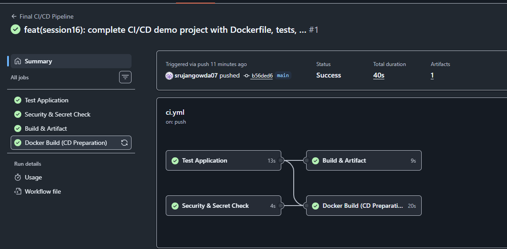
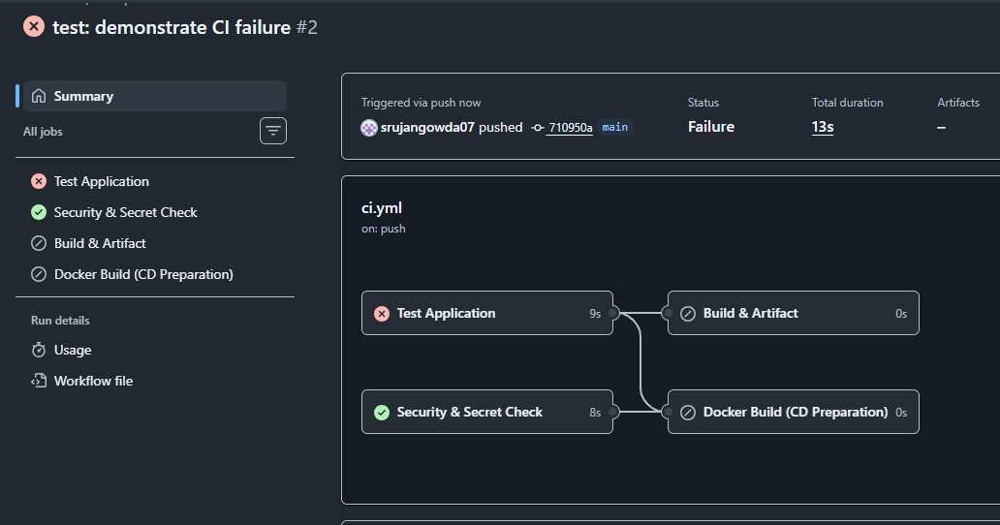
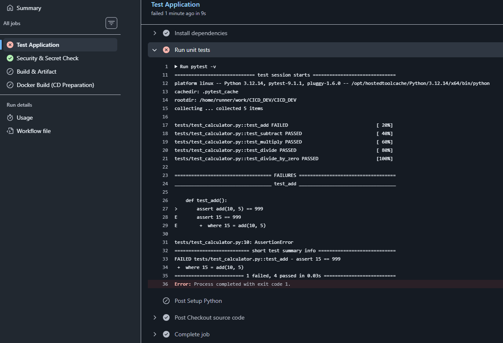

# CI/CD & GitHub Actions Demo

## Student Details

- **Name:** Srujan Gowda KS
- **Roll Number:** 24BCS10339
- **Session:** Session 16 - CI/CD & GitHub Actions

---

## 1. Project Overview

This project is the practical submission for **DevOps Session 16: CI/CD & GitHub Actions**. It implements a complete, automated Continuous Integration and Continuous Delivery (CI/CD) pipeline for a software application using **GitHub Actions**.

The pipeline automatically validates code syntax, runs unit test suites, performs repository security checks, compiles application build artifacts, and builds a containerized Docker image upon every code push and pull request.

The project is hosted in the following GitHub repository:  
**Repository:** [https://github.com/srujangowda07/CICD_DEV](https://github.com/srujangowda07/CICD_DEV)

---

## 2. Objectives

This project demonstrates the core principles of modern DevOps automation:

- **CI vs CD**: Understanding the distinction between continuous testing/integration and delivery readiness.
- **GitHub Actions**: Configuring event-driven automation directly inside a GitHub repository.
- **Workflows**: Defining pipeline specifications as version-controlled YAML files.
- **Jobs**: Organizing pipeline tasks into modular, parallel, and sequential execution blocks.
- **Steps**: Executing discrete tasks using shell commands and pre-built marketplace actions.
- **Runners**: Leveraging isolated GitHub-hosted environments (`ubuntu-latest`).
- **Secrets**: Securely referencing sensitive variables without exposing them in logs or source control.
- **Build**: Automating the packaging of application source code into distributable bundles.
- **Test**: Automating quality gates and unit tests with `pytest`.
- **Artifacts**: Persisting build outputs across jobs and for long-term retention.
- **Docker**: Containerizing the application as a deployment-readiness gate.
- **Pipeline Execution**: Observing live end-to-end execution and handling pass/fail scenarios.

---

## 3. CI vs CD

Software delivery pipelines bridge the gap between developer workstations and target runtime environments through two key phases:

### Continuous Integration (CI)
Continuous Integration is the practice of automatically building and testing software whenever a developer pushes changes to the shared repository. Its goal is early defect detection:
- In this project, CI is demonstrated by the **Test Application** and **Security & Secret Scan** jobs.
- Every commit is tested against unit test suites using `pytest`. If any test fails, the pipeline halts immediately, preventing broken code from progressing.

### Continuous Delivery (CD) vs Continuous Deployment
Continuous Delivery ensures that validated code is automatically packaged and prepared in a deployable state at all times:
- In this project, CD is demonstrated by the **Docker Build (CD Preparation)** job and **Build & Artifact** job.
- Passing code is packaged with metadata into an artifact bundle and built into a Docker container image (`application:latest`).
- **Note on Scope**: This project demonstrates **deployment readiness** (CD preparation). It does not perform live production deployment, as no external cloud target was specified for this assignment.

### Difference Summary
| Dimension | Continuous Integration (CI) | Continuous Delivery (CD) |
|---|---|---|
| **Focus** | Code health, unit testing, syntax validation | Packaging, containerization, deployment readiness |
| **Output** | Test reports, test pass/fail status | Deployable artifacts, Docker images |
| **Trigger** | Every push and pull request | After CI stages succeed |

---

## 4. CI/CD Pipeline

The pipeline is structured with clear dependencies using the `needs` keyword:

```text
Code Push / Pull Request / Manual Dispatch
                    ↓
         GitHub Actions Workflow
                    ↓
      ┌───────────────────────────┐
      │     Test Application      │
      └─────────────┬─────────────┘
                    │
         ┌──────────┴──────────┐
         ▼                     ▼
┌──────────────────┐  ┌──────────────────┐
│  Security &      │  │  Build &         │
│  Secret Scan     │  │  Artifact        │
└────────┬─────────┘  └──────────────────┘
         │
         ▼
┌──────────────────┐
│  Docker Build    │
│ (CD Preparation) │
└──────────────────┘
```

### Dependency Logic
- **`test`**: Runs first with no dependencies.
- **`security-check`**: Runs in parallel with testing to scan for sensitive files and check repository secrets.
- **`build`**: Declares `needs: test`. The build script only runs if all unit tests pass.
- **`docker-build`**: Declares `needs: [test, security-check]`. The Docker container image is built only when both functional tests and security checks pass.

---

## 5. GitHub Actions Concepts

### Workflow
A workflow is an automated, configurable process defined in YAML and stored in `.github/workflows/ci.yml`. It defines what events trigger the pipeline and what jobs should be executed.

### Jobs
Jobs are independent sets of steps that execute on a runner. This project defines 4 jobs:
1. `test`: Sets up Python, installs dependencies, and executes unit tests.
2. `security-check`: Audits repository files for leaked credentials and verifies repository secrets.
3. `build`: Executes `build.sh` and packages the output into an uploaded artifact.
4. `docker-build`: Builds a container image from `Dockerfile` as the deployment-readiness gate.

### Steps
Steps are individual tasks within a job that run sequentially. Steps either run shell commands (`run:`) or invoke reusable actions (`uses:`):
- `actions/checkout@v4`: Checks out repository source code onto the runner.
- `actions/setup-python@v5`: Configures the Python 3.12 runtime environment.
- `pip install -r requirements.txt`: Installs dependencies.
- `pytest -v`: Executes automated tests.
- `actions/upload-artifact@v4`: Persists generated build files.
- `docker/setup-buildx-action@v3`: Configures Docker Buildx engine.

### Runner
A runner is the virtual server that executes workflow jobs. This project uses `runs-on: ubuntu-latest`, which provides a clean, isolated Ubuntu Linux virtual machine managed by GitHub for each job.

### Secrets
Secrets allow workflows to access sensitive data (API keys, deployment tokens, passwords) without hardcoding them into source code:
- **Demonstration Secret**: The workflow references `${{ secrets.DEMO_SECRET }}`.
- **Safety**: The secret is only checked for presence (`[ -n "$DEMO_SECRET" ]`) and is **never printed** to the logs.
- **Purpose**: `DEMO_SECRET` is purely for educational demonstration and is not required by the calculator application. In enterprise CI/CD pipelines, repository secrets store Docker Hub tokens, AWS access keys, or production database connection strings.

### Artifacts
Artifacts are files produced during a workflow run that are saved after the runner VM is destroyed:
- The build job generates `build/` containing `calculator.py` and `build-info.txt`.
- The workflow uploads this bundle as `application-build` via `actions/upload-artifact@v4`.
- Artifacts allow team members to download verified build outputs or pass binaries between pipeline stages.

---

## 6. Project Structure

The project structure contains only verified, existing files:

```text
10-final-cicd-pipeline/
├── .github/
│   └── workflows/
│       └── ci.yml               # GitHub Actions workflow definition
├── app/
│   ├── __init__.py
│   └── calculator.py            # Python calculator application
├── tests/
│   ├── __init__.py
│   └── test_calculator.py       # Pytest unit test suite
├── .gitignore                   # Excludes caches, venvs, and build outputs
├── build.sh                     # Build and packaging shell script
├── Dockerfile                   # Docker container manifest
├── requirements.txt             # Project dependencies (pytest)
└── README.md                    # Technical documentation
```

---

## 7. Pipeline Jobs

| Job | Purpose | Result |
| --- | --- | --- |
| **Test Application** | Installs dependencies and runs pytest suite | 5 tests pass |
| **Security & Secret Scan** | Checks for sensitive files (`.env`, `*.pem`, `*.key`) and verifies secret configuration | Pass |
| **Build & Artifact** | Executes `build.sh` and archives the `build/` directory | `application-build` uploaded |
| **Docker Build** | Builds container image (`application:latest`) for CD deployment readiness | Pass |

---

## 8. Pipeline Triggers

The workflow (`ci.yml`) is configured to run under three distinct conditions:
- **`push: branches: [main]`**: Automatically triggers whenever code is merged or pushed to the `main` branch.
- **`pull_request: branches: [main]`**: Automatically tests any pull request targeting `main`, protecting the trunk branch from defects.
- **`workflow_dispatch`**: Allows manual execution on demand from the GitHub Actions web interface.

---

## 9. Pipeline Execution

When a code push occurs, GitHub Actions executes the following sequence:

1. **Checkout & Environment Setup**: The runner checks out the repository code and sets up Python 3.12.
2. **Testing**: `pytest` executes 5 test cases (`test_add`, `test_subtract`, `test_multiply`, `test_divide`, `test_divide_by_zero`).
3. **Security Validation**: The repository is scanned for uncommitted credential files (`.env`, `*.pem`, `*.key`), and `DEMO_SECRET` is checked.
4. **Build & Artifact Upload**: `build.sh` creates `build/` with build metadata (`build-info.txt`) and uploads it as `application-build`.
5. **Docker Containerization**: Docker Buildx builds the `application:latest` image, validating deployment readiness.

---

## 10. Screenshots

### Successful Workflow Execution

*This screenshot shows the successful execution of Run #1 on `main` (`feat(session16)...`). All 4 jobs (`Test Application` in 13s, `Security & Secret Check` in 4s, `Build & Artifact` in 9s, and `Docker Build (CD Preparation)` in 20s) passed with green checkmarks in 40s total duration, generating 1 artifact.*

---

### Pipeline Failure & Job Dependency Blocking

*This screenshot demonstrates the CI quality gate in action during Run #2 (`test: demonstrate CI failure`). The `Test Application` job failed (9s). Because `Build & Artifact` and `Docker Build` depend on `test` via `needs`, GitHub Actions automatically blocked downstream jobs (0s) from executing.*

---

### Pytest Failure Details in Job Logs

*This screenshot shows the detailed terminal logs inside the failed `Test Application` job. Pytest caught an assertion error (`FAILED tests/test_calculator.py::test_add - assert 15 == 999`) and exited with code 1, proving that broken code cannot sneak past automated testing into packaging or deployment.*

---

## 11. Result

The GitHub Actions CI/CD pipeline successfully:
- Automated test execution with 100% test pass rates under Python 3.12.
- Audited the repository for sensitive files and demonstrated secret injection.
- Packaged the application and uploaded the `application-build` artifact.
- Built a Docker container image confirming Continuous Delivery readiness.
- Validated pipeline protection by blocking build and packaging stages when a test failure occurred.

---

## 12. Conclusion

This assignment provided practical experience with modern CI/CD automation using GitHub Actions. By defining pipelines as code, developers eliminate manual build errors, detect regressions within seconds of pushing, and ensure that every deployable artifact is tested and packaged reproducibly.

---

## 13. Repository

- **GitHub Repository**: [https://github.com/srujangowda07/CICD_DEV](https://github.com/srujangowda07/CICD_DEV)
- **Workflow File**: `.github/workflows/ci.yml`
