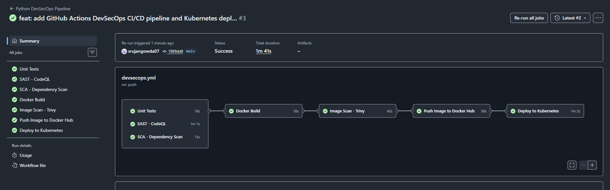
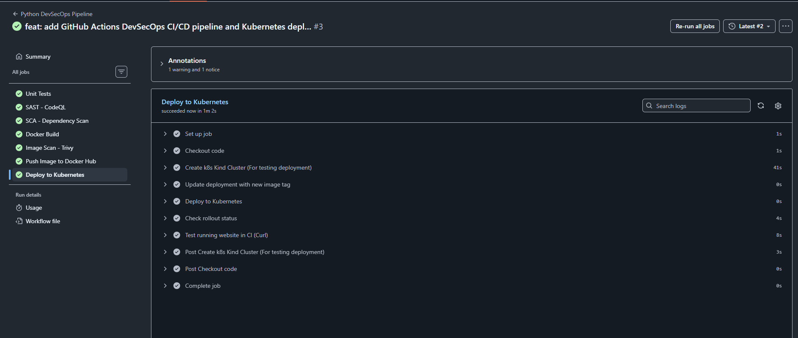
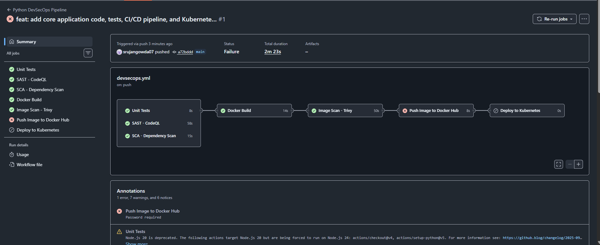
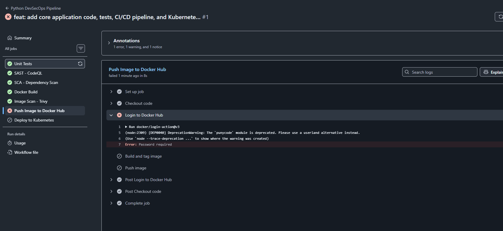

# Session 17 — Complete CI/CD & DevSecOps

## Student Details

- **Name:** Srujan Gowda KS
- **Roll Number:** 24BCS10339
- **Session:** Session 17 - Complete CI/CD & DevSecOps
- **GitHub Repository:** [https://github.com/srujangowda07/cicd_devsec_ops](https://github.com/srujangowda07/cicd_devsec_ops)
- **Docker Hub Repository:** [https://hub.docker.com/r/srujangowda07/hey-cicd](https://hub.docker.com/r/srujangowda07/hey-cicd)

---

## 1. Project Overview

Session 17 represents a major evolution in automated software delivery, advancing from basic CI/CD (Continuous Integration / Continuous Delivery) explored in Session 16 to a production-grade **DevSecOps** pipeline. Rather than treating security as an isolated audit performed late in the lifecycle, DevSecOps integrates automated security controls into every stage of the development and delivery workflow.

This methodology embodies the **Shift Left** philosophy. In traditional delivery models, security evaluations occur right before production deployment or even post-release, where remediation costs are highest and architectural flaws are deeply entrenched. By shifting left, automated security gates analyze source code, scan third-party dependencies, check for exposed secrets, and inspect container images immediately upon each code commit or pull request. Defects and vulnerabilities are flagged within seconds of introduction, giving developers immediate feedback when fixes are easiest and least disruptive.

This project delivers an end-to-end, multi-stage pipeline running on GitHub Actions for a containerized Python Flask web application. It automates unit testing, Static Application Security Testing (SAST), Software Composition Analysis (SCA), container image vulnerability scanning, container registry publishing to Docker Hub, and live deployment verification on an ephemeral Kubernetes (Kind) cluster.

---

## 2. Objectives

The primary objectives of this Session 17 assignment include:

- **Application Build & Packaging**: Containerize a Python web application with clean separation of code and dependencies using Docker.
- **Automated Unit Testing**: Execute automated unit tests using `pytest` and measure code coverage via `pytest-cov`.
- **Static Application Security Testing (SAST)**: Perform automated source-code vulnerability scanning using GitHub CodeQL to detect programming flaws and security anti-patterns.
- **Software Composition Analysis (SCA)**: Scan Python third-party dependencies against known vulnerability databases (PyPA / OSV) using `pip-audit`.
- **Secret Scanning & Credential Protection**: Enforce credential hygiene through GitHub Secrets, ensuring no tokens, keys, or credentials are hardcoded in source control.
- **Container Image Security Scanning**: Scan built Docker container images for OS and package vulnerabilities (filtering for HIGH and CRITICAL severities) using Aqua Security Trivy.
- **Pipeline Security Gates**: Establish strict job dependency hierarchies (`needs`) within GitHub Actions, preventing downstream stages (registry push and Kubernetes deployment) from executing if any prerequisite scan or test fails.
- **Container Registry Publishing**: Authenticate with Docker Hub using scoped Personal Access Tokens (PAT) and publish versioned, immutable Docker images tagged with the Git commit SHA alongside the `latest` tag.
- **Kubernetes Deployment**: Automate ephemeral cluster provisioning using Kind (Kubernetes-in-Docker), dynamically update Kubernetes manifests with the Git commit SHA, deploy the application pods and services, and verify rollout status.
- **Runtime Deployment Verification**: Perform automated smoke testing against the live running application inside the CI runner using `curl` to validate both HTML dashboard rendering and JSON API health status.

---

## 3. DevSecOps Pipeline Architecture

The pipeline is implemented in GitHub Actions under `.github/workflows/devsecops.yml`. It is triggered on every `push` and `pull_request` targeting the `main` branch.

The execution workflow forms a directed acyclic graph (DAG) where security scans run early and act as validation prerequisites for container building, publishing, and deployment:

```text
                  Code Push / Pull Request (main)
                                │
        ┌───────────────────────┼───────────────────────┐
        ▼                       ▼                       ▼
┌───────────────┐       ┌───────────────┐       ┌───────────────┐
│  Unit Tests   │       │  SAST Scan    │       │   SCA Scan    │
│   (pytest)    │       │   (CodeQL)    │       │  (pip-audit)  │
└───────┬───────┘       └───────┬───────┘       └───────┬───────┘
        │                       │                       │
        └───────────────────────┼───────────────────────┘
                                ▼
                    ┌───────────────────────┐
                    │     Docker Build      │
                    │ (session17-python:SHA)│
                    └───────────┬───────────┘
                                │
                                ▼
                    ┌───────────────────────┐
                    │ Container Image Scan  │
                    │    (Aqua Trivy)       │
                    └───────────┬───────────┘
                                │
                                ▼ [Security Gate: Needs image-scan]
                    ┌───────────────────────┐
                    │ Push Image to Registry│
                    │ (Docker Hub: SHA/lat) │
                    └───────────┬───────────┘
                                │
                                ▼ [Condition: push to main]
                    ┌───────────────────────┐
                    │ Deploy to Kubernetes  │
                    │ (Kind Cluster in CI)  │
                    └───────────┬───────────┘
                                │
                                ▼
                    ┌───────────────────────┐
                    │ Rollout & Curl Check  │
                    │  (Port 5001 / Health) │
                    └───────────────────────┘
```

### Dependency Logic
- **`test`**, **`sast`**, **`sca`**: Run concurrently on pipeline launch without interdependencies.
- **`docker-build`**: Requires `needs: [test, sast, sca]`. The Docker image is only compiled once all source tests and code-level security checks pass.
- **`image-scan`**: Requires `needs: docker-build`. Analyzes the built container image for operating system and binary vulnerabilities.
- **`push`**: Requires `needs: image-scan`. Authenticates with Docker Hub and publishes `srujangowda07/hey-cicd:${{ github.sha }}` and `latest`.
- **`deploy`**: Requires `needs: push` with an `if: github.ref == 'refs/heads/main' && github.event_name == 'push'` guard. Deploys only verified code to a Kind cluster and tests live endpoints.

---

## 4. CI/CD vs DevSecOps

| Dimension | Session 16 (Standard CI/CD) | Session 17 (DevSecOps) |
|---|---|---|
| **Primary Focus** | Speed of integration, automated build, functional correctness | Speed combined with built-in security, governance, and vulnerability management |
| **Pipeline Flow** | Test → Build → Container Artifact (CD Readiness) | Test + SAST + SCA → Build → Container Scan → Registry Push → K8s Deploy → Smoke Test |
| **Security Handling** | Basic file/secret checks; security treated as an external step | Security embedded directly as automated gates before every packaging and release step |
| **Code Vulnerabilities** | Not analyzed automatically | Deep abstract syntax tree analysis via GitHub CodeQL (SAST) |
| **Dependency Risks** | Only verified for installation success | Audited against vulnerability databases via `pip-audit` (SCA) |
| **Container Security** | Built and tagged without container layer inspection | Inspected for base image OS CVEs via Aqua Trivy before publication |
| **Deployment Scope** | CD Preparation (local artifact retention) | Live automated deployment and rollout verification on a Kubernetes (Kind) cluster |
| **Secret Management** | Basic repository configuration | Cryptographically guarded GitHub Secrets with scoped Docker Hub PAT credentials |

### Why Integrate Security Before Deployment?
Deploying an application without automated security scanning creates severe production risks:
1. **Compromised Base Images**: A clean Python application running inside a vulnerable base OS container can expose the entire host or Kubernetes cluster to kernel exploits, privilege escalations, or remote code execution.
2. **Supply-Chain Attacks**: Compromised third-party packages in `requirements.txt` can execute malicious payloads during startup without failing functional unit tests.
3. **Late Feedback Loops**: Finding vulnerabilities after production deployment incurs heavy remediation costs, emergency patch cycles, and potential data breaches. Shifting left catches these issues during pull requests in seconds.

---

## 5. Tools Used

| Area | Tool | Purpose in Project |
|---|---|---|
| **CI/CD Orchestration** | GitHub Actions | Event-driven pipeline execution across Ubuntu runners |
| **Programming Language** | Python 3.12 | Core programming environment for the web service |
| **Unit Testing** | pytest (v8.4.2) | Automated test execution and assertions |
| **Code Coverage** | pytest-cov (v6.0.0) | Line-by-line test coverage measurement and reporting |
| **SAST (Static Analysis)** | GitHub CodeQL (v3) | Source-code static analysis scanning for security anti-patterns and flaws |
| **SCA (Dependencies)** | pip-audit (v2.10.1) | Software Composition Analysis against PyPA / OSV vulnerability databases |
| **Container Scanning** | Aqua Security Trivy | Container image vulnerability scanning for HIGH and CRITICAL CVEs |
| **Container Runtime** | Docker | Container image building, multi-tagging, and local execution |
| **Container Registry** | Docker Hub | Public image repository hosting (`srujangowda07/hey-cicd`) |
| **Kubernetes Cluster** | Kind (Kubernetes-in-Docker) | Ephemeral, lightweight Kubernetes cluster running inside GitHub Actions runner |
| **K8s Management** | kubectl | Manifest application, deployment rollout tracking, and service inspection |
| **Runtime Verification** | curl | HTTP and REST API validation of running endpoints inside CI |

---

## 6. Application

The application is an interactive **DevSecOps Dashboard** built with Python and Flask (`app/app.py`).

### Key Characteristics
- **Port:** Listens on port `5001`.
- **User Interface:** Renders a modern, responsive web dashboard with animated backgrounds and interactive components (`templates/index.html`, `static/css/styles.css`, `static/js/main.js`).
- **Health Check (`/health`):** Returns uptime seconds, ISO timestamp, and `healthy` status string for container liveness/readiness probes.
- **System Status (`/api/status`):** Exposes application name, version (`2.0.0`), operating system platform, Python runtime version, total request counter, and system uptime.
- **API Endpoints:**
  - `GET /`: Dashboard UI homepage
  - `GET /health`: Health probe endpoint
  - `GET /api/status`: Application status and telemetry
  - `GET /api/greet/<name>`: Dynamic greeting generator
  - `POST /api/add`: Two-number addition API with missing field validation
  - `POST /api/calculate`: Multi-operator calculator (add, subtract, multiply, divide, power, modulo) with division-by-zero protection
  - `POST /api/pipeline/run`: Pipeline simulation endpoint

---

## 7. Unit Testing

Unit testing is automated using `pytest` and configured via `pytest.ini` (`testpaths = tests`, `pythonpath = .`).

The test suite in `tests/test_app.py` exercises 8 distinct functional and edge-case behaviors:
1. `test_home`: Confirms HTTP 200 response when loading the dashboard root (`/`).
2. `test_health`: Confirms HTTP 200 and validates JSON payload contains `status: "healthy"`.
3. `test_greet`: Confirms dynamic greeting generation returns 200 and includes the expected name.
4. `test_add_numbers`: Validates arithmetic addition logic with valid integer inputs.
5. `test_add_numbers_missing_fields`: Validates input validation by asserting HTTP 400 Bad Request when parameters are missing.
6. `test_calculator_multiply`: Confirms calculator multiplication operation returns expected numerical result.
7. `test_calculator_divide_by_zero`: Asserts HTTP 400 Bad Request when attempting division by zero.
8. `test_status`: Verifies system metadata API returns HTTP 200, status `running`, Python version, and uptime string.

### Test Execution Command
```bash
pytest --cov=app --cov-report=term-missing
```

### Actual Verified Run Output (Run #3 — Commit `1989dd8`)
```text
collected 8 items

tests/test_app.py ........                                               [100%]

---------- coverage: platform linux, python 3.12.14-final-0 ----------
Name              Stmts   Miss  Cover   Missing
-----------------------------------------------
app/__init__.py       0      0   100%
app/app.py          102     32    69%   94, 104-105, 121, 128, 132-133, 145, 179-209, 225, 230, 234
-----------------------------------------------
TOTAL               102     32    69%

======================== 8 passed, 6 warnings in 0.36s =========================
```
All 8 tests executed and passed in 0.36 seconds with 69% overall code coverage.

---

## 8. SAST — CodeQL

**Static Application Security Testing (SAST)** analyzes application source code in a non-running state to identify architectural flaws, insecure function calls, coding standard violations, and security vulnerabilities before compilation or deployment.

In this pipeline, **GitHub CodeQL** performs automated SAST:
- **How it works:** CodeQL compiles the Python source code into a queryable relational database. It runs semantic queries that trace data flows from untrusted inputs (sources) to dangerous execution sinks (e.g., SQL queries, system command executions, eval statements, or unescaped HTML reflections).
- **GitHub Actions Integration:**
  - `github/codeql-action/init@v3` initializes CodeQL for language `python`.
  - `github/codeql-action/analyze@v3` executes security queries and uploads analysis SARIF results.
- **Required Runner Permissions:**
  ```yaml
  permissions:
    contents: read
    security-events: write
  ```
- **Failure Behavior:** If CodeQL detects severe vulnerabilities matching repository security policies, alerts are generated in the GitHub Security tab, and the pipeline halts, preventing downstream jobs (`docker-build`, `push`, `deploy`) from executing.

---

## 9. SCA — pip-audit

**Software Composition Analysis (SCA)** is the automated inspection of third-party open-source libraries, packages, and external dependencies used within the application codebase. Modern applications consist of up to 80-90% third-party code; a vulnerability in a transitive dependency introduces severe security exposure regardless of how cleanly the internal application code is written.

In this pipeline, **`pip-audit`** provides SCA scanning:
- **Scan Mechanism:** In the `sca` job, dependencies from `requirements.txt` (`Flask==3.1.3`) are installed into the Python 3.12 environment along with `pip-audit`.
- **Command:**
  ```bash
  pip-audit
  ```
- **Database Cross-Referencing:** `pip-audit` queries the Python Packaging Advisory Database (PyPA Advisory DB) and the Open Source Vulnerabilities (OSV) service for known Common Vulnerabilities and Exposures (CVEs).
- **Actual Verified Output:**
  ```text
  No known vulnerabilities found
  ```
  The dependency scan verified that `Flask==3.1.3` and its dependencies contained zero known vulnerabilities.

---

## 10. Secret Scanning

Committed secrets (API tokens, private SSH/RSA keys, cloud credentials, database connection strings) are among the most common root causes of security breaches. Once committed to a Git repository, credentials persist in history even if removed in subsequent commits.

### Secret Management Architecture in This Project
1. **Zero Hardcoded Secrets:** No access tokens, passwords, or private keys exist anywhere in application source code, Dockerfiles, Kubernetes manifests, or workflow definitions.
2. **GitHub Repository Secrets:** Sensitive credentials, notably `DOCKERHUB_TOKEN`, are stored securely in GitHub's encrypted secrets store.
3. **Runtime Token Masking:** When GitHub Actions references `${{ secrets.DOCKERHUB_TOKEN }}`, the runner automatically redacts the value from all execution logs, console output, and step annotations, replacing it with `***`.
4. **Secret Scanning & Push Protection:** GitHub repository native secret scanning inspects all pushed commits for patterns matching known credential formats (e.g., Docker tokens, AWS keys, GitHub tokens).
5. **Git Hygiene:** Local configuration files (`.env`), coverage databases (`.coverage`), and runtime caches are explicitly ignored via `.gitignore` and `.dockerignore`.

---

## 11. Docker Build

Containerization packages the Python application along with its runtime dependencies into a reproducible, isolated image.

### Dockerfile Specification
```dockerfile
FROM python:3.12-slim

WORKDIR /app

COPY requirements.txt .

RUN pip install -r requirements.txt

COPY app ./app

EXPOSE 5001

CMD ["python", "app/app.py"]
```

### Build & Tagging Architecture
- **Base Image:** `python:3.12-slim` provides a minimal Debian-based footprint, reducing attack surface by omitting unnecessary build tools, compilers, and extraneous packages.
- **Initial Build (Local Scan):** The `docker-build` job builds the image locally tagged with the Git commit SHA:
  ```bash
  docker build -t session17-python:${{ github.sha }} .
  ```
  This artifact is used for local security inspection in the CI runner.
- **Registry Build:** In the `push` job, after security validation passes, the image is tagged for Docker Hub:
  ```bash
  docker build \
    -t srujangowda07/hey-cicd:${{ github.sha }} \
    -t srujangowda07/hey-cicd:latest \
    .
  ```

---

## 12. Container Image Scanning — Trivy

While SAST checks application source code and SCA checks Python packages, container images include an underlying operating system layer (Debian libraries, glibc, system binaries, package managers). Vulnerabilities in these OS layers can be exploited to escape containers or execute arbitrary code.

### Trivy Scanner Integration
In the `image-scan` job, **Aqua Security Trivy** is installed and executes directly against the freshly built local image:
```bash
trivy image --severity HIGH,CRITICAL session17-python:${{ github.sha }}
```

### Scan Behavior & Results
- **Target:** Analyzes container OS packages, shared system libraries, and application packages.
- **Severity Filtering:** Configured to target `HIGH` and `CRITICAL` vulnerabilities.
- **Reporting:** Trivy outputs a comprehensive ASCII vulnerability table identifying CVE identifiers, affected packages, installed versions, fix availability, and vulnerability descriptions.
- **Pipeline Role:** Trivy provides complete transparency into the container's security posture. Because downstream jobs declare `needs: image-scan`, any failure or unhandled exception during the scan prevents registry publishing and deployment.

---

## 13. Security Gates

Security Gates are automated control points in a software pipeline that halt delivery if quality or security standards are not satisfied.

### Dependency Hierarchy (Directed Acyclic Graph)
In this project, security gates are implemented through GitHub Actions' native job dependency mechanism (`needs`):

```yaml
docker-build:
  needs:
    - test
    - sast
    - sca

image-scan:
  needs:
    - docker-build

push:
  needs:
    - image-scan

deploy:
  needs:
    - push
```

### Gate Enforcement Mechanism
- **Gate 1 — Source & Dependency Gate (`docker-build`):** The container image will **not** be built unless all three upstream validation jobs (`test`, `sast`, and `sca`) succeed. If a unit test fails or CodeQL flags a blocking violation, image creation is prevented.
- **Gate 2 — Container Security Gate (`push`):** The image will **not** be pushed to Docker Hub unless `image-scan` completes successfully. Unscanned or unverified container images are never published to the public registry.
- **Gate 3 — Deployment Gate (`deploy`):** Deployment to Kubernetes will **not** execute unless `push` succeeds and the Git reference is verified as a merge/push to `main`.

### Explicit vs. Implicit Gates
In GitHub Actions, declaring `needs: [job_a, job_b]` enforces an **implicit dependency gate**: the GitHub Actions runtime automatically skips all downstream dependent jobs when any prerequisite job fails. This creates an unbypassable gate without requiring an artificial single-purpose gate job.

---

## 14. Docker Hub Container Registry

Validated images are published to Docker Hub under the student's namespace:
**`srujangowda07/hey-cicd`**

### Authentication & Credential Management
- The pipeline authenticates using `docker/login-action@v3`:
  ```yaml
  - name: Login to Docker Hub
    uses: docker/login-action@v3
    with:
      username: srujangowda07
      password: ${{ secrets.DOCKERHUB_TOKEN }}
  ```
- **Security Rule:** The Docker Hub Personal Access Token (`DOCKERHUB_TOKEN`) is configured in GitHub repository secrets with Read & Write scope. No credentials exist in plaintext.

### Multi-Tag Publishing Strategy
```bash
docker push srujangowda07/hey-cicd:${{ github.sha }}
docker push srujangowda07/hey-cicd:latest
```
- **Commit SHA Tag (`${{ github.sha }}`):** Provides an immutable, permanent artifact tied directly to the exact Git commit that produced it. This guarantees complete auditability and deterministic rollbacks in Kubernetes.
- **`latest` Tag:** Provides a convenient pointer to the most recent successful build.

---

## 15. Kubernetes Deployment

Deployment is validated on an ephemeral **Kind (Kubernetes-in-Docker)** cluster spun up directly on the GitHub Actions runner.

### Manifest Configuration

#### 1. Deployment (`k8s/deployment.yaml`)
```yaml
apiVersion: apps/v1
kind: Deployment
metadata:
  name: session17-python
spec:
  replicas: 2
  selector:
    matchLabels:
      app: session17-python
  template:
    metadata:
      labels:
        app: session17-python
    spec:
      containers:
        - name: session17-python
          image: srujangowda07/hey-cicd:__IMAGE_TAG__
          imagePullPolicy: Always
          ports:
            - containerPort: 5001
```
- **Replicas:** 2 pods running simultaneously for high availability.
- **Image Placeholder:** Uses `__IMAGE_TAG__` as a dynamic placeholder.
- **Pull Policy:** `Always` ensures Kubernetes pulls the fresh image from Docker Hub.

#### 2. Service (`k8s/service.yaml`)
```yaml
apiVersion: v1
kind: Service
metadata:
  name: session17-python
spec:
  type: NodePort
  selector:
    app: session17-python
  ports:
    - port: 80
      targetPort: 5001
      nodePort: 30001
```
- Maps port `80` to container port `5001` using a `NodePort` service.

### Deployment & Verification Sequence
1. **Kind Cluster Creation:** `helm/kind-action@v1.10.0` provisions a local single-node Kubernetes cluster.
2. **Dynamic Manifest Mutation:** `sed -i "s|__IMAGE_TAG__|${{ github.sha }}|g" k8s/deployment.yaml` replaces the placeholder with the exact commit SHA pushed to Docker Hub.
3. **Application of Manifests:** `kubectl apply -f k8s/deployment.yaml` and `kubectl apply -f k8s/service.yaml`.
4. **Rollout Verification:** `kubectl rollout status deployment/session17-python --timeout=60s` blocks until both replica pods report ready status.
5. **Port Forwarding:** `kubectl port-forward service/session17-python 5001:80 &` bridges cluster networking to the GitHub runner.
6. **Live curl Verification:**
   - `curl -s http://localhost:5001 | head -n 15` validates HTML rendering.
   - `curl -s http://localhost:5001/api/status` validates live JSON response:
     ```json
     {
       "app": "DevSecOps Dashboard",
       "platform": "Linux",
       "python_version": "3.12.15",
       "status": "running",
       "total_requests": 2,
       "uptime": "00h 00m 03s",
       "version": "2.0.0"
     }
     ```

---

## 16. Complete Pipeline Execution

When a developer pushes changes to `main`, the workflow executes through the following sequence:

1. **Trigger:** GitHub Actions receives the `push` event on `refs/heads/main`.
2. **Parallel Phase 1:**
   - **Job 1 (`test`):** Checks out code, sets up Python 3.12, installs dev dependencies, runs `pytest --cov=app`, asserting all 8 unit tests pass.
   - **Job 2 (`sast`):** Checks out code, initializes CodeQL for Python, analyzes code for CWEs, uploads results.
   - **Job 3 (`sca`):** Checks out code, sets up Python 3.12, installs dependencies and `pip-audit`, scans for package CVEs.
3. **Phase 2 (`docker-build`):** Gated by completion of Phase 1. Builds Docker container image `session17-python:${{ github.sha }}` locally.
4. **Phase 3 (`image-scan`):** Gated by `docker-build`. Installs Aqua Trivy and scans `session17-python:${{ github.sha }}` for HIGH and CRITICAL vulnerabilities.
5. **Phase 4 (`push`):** Gated by `image-scan`. Logs in to Docker Hub via `DOCKERHUB_TOKEN`, builds and pushes `srujangowda07/hey-cicd:${{ github.sha }}` and `latest`.
6. **Phase 5 (`deploy`):** Gated by `push` (main branch only). Spins up Kind cluster, injects commit SHA into `deployment.yaml`, applies Kubernetes manifests, verifies rollout status with `kubectl rollout status`, and validates running endpoints with `curl`.

---

## 17. Troubleshooting / What Happened During Implementation

During the implementation and iteration of the DevSecOps pipeline, real-world authentication and authorization challenges were encountered and systematically resolved:

### Run #1 (Commit `a72bddd`) — Authentication Failure ("Password required")
- **Observed Behavior:** The pipeline executed the early stages successfully:
  - Unit Tests: Passed (8s)
  - SAST - CodeQL: Passed (58s)
  - SCA - Dependency Scan: Passed (15s)
  - Docker Build: Passed (14s)
  - Image Scan - Trivy: Passed (50s)
  However, the pipeline failed abruptly at **Push Image to Docker Hub** (8s).
- **Exact Error:**
  ```text
  Run docker/login-action@v3
  Error: Password required
  ```
- **Root Cause Analysis:** The workflow referenced `${{ secrets.DOCKERHUB_TOKEN }}`, but the repository secret `DOCKERHUB_TOKEN` had not yet been configured in the student's GitHub repository settings. Because the secret evaluated to an empty string, the login action failed with "Password required".
- **Security Gate Demonstration:** Notice that because `deploy` declares `needs: push`, the deployment stage was immediately skipped. This validated that broken or unauthenticated builds cannot reach deployment.

### Run #2 (Commit `c0d98d1`) — Authorization Scope Failure ("insufficient scopes")
- **Observed Behavior:** The user created a Docker Hub Personal Access Token and configured it under repository secrets as `DOCKERHUB_TOKEN`. The workflow login username was updated to `srujangowda07`.
- **Progress:** "Login to Docker Hub" passed! "Build and tag image" passed!
- **Failure at Push Step:**
  ```text
  The push refers to repository [docker.io/nensiravaliya28/hey-cicd]
  unauthorized: access token has insufficient scopes
  ##[error]Process completed with exit code 1.
  ```
- **Root Cause Analysis:** While the authentication token belonged to `srujangowda07`, the workflow push commands and tag parameters were still pointing to the instructor's demo repository (`nensiravaliya28/hey-cicd`). Docker Hub correctly rejected the push because a token issued to user `srujangowda07` does not have write permissions to user `nensiravaliya28`'s repository namespace.

### The Systematic Resolution (Commit `1989dd8`)
To eliminate the credential and repository mismatch:
1. **Repository Setup:** Created and verified the target Docker Hub repository under the student's account: `srujangowda07/hey-cicd`.
2. **Access Token Generation:** Generated a dedicated Docker Hub Personal Access Token with explicit `Read & Write` scopes.
3. **Secret Configuration:** Stored the token in GitHub Repository Secrets under the exact key `DOCKERHUB_TOKEN`.
4. **Workflow Configuration Update:** Updated `.github/workflows/devsecops.yml`:
   - Login username configured to `srujangowda07`.
   - Build tags updated to `srujangowda07/hey-cicd:${{ github.sha }}` and `srujangowda07/hey-cicd:latest`.
   - Push targets updated to `srujangowda07/hey-cicd:${{ github.sha }}` and `srujangowda07/hey-cicd:latest`.
5. **Kubernetes Configuration Update:** Updated `k8s/deployment.yaml` image reference from `nensiravaliya28/hey-cicd:__IMAGE_TAG__` to `srujangowda07/hey-cicd:__IMAGE_TAG__`.

### Verification (Run #3 — Commit `1989dd8`)
Upon pushing the fix:
- Every stage completed successfully in **1m 41s**.
- Both Docker images were successfully published to Docker Hub.
- The Kind Kubernetes cluster deployed the containers, rolled out successfully, and responded with HTTP 200 and live JSON status.

---

## 18. Screenshots

### Screenshot 1 — Complete Pipeline Success (Run #3)

*Figure 1: GitHub Actions visualization for Run #3 showing all 7 pipeline stages passing end-to-end with green checkmarks (Unit Tests, SAST - CodeQL, SCA - Dependency Scan, Docker Build, Image Scan - Trivy, Push Image to Docker Hub, Deploy to Kubernetes) in 1m 41s.*

---

### Screenshot 2 — Kubernetes Deployment & Runtime Verification (Run #3)

*Figure 2: Expanded execution log of the "Deploy to Kubernetes" stage, confirming ephemeral Kind cluster provisioning, dynamic Git SHA image tag replacement, successful rollout status check, and live curl verification of dashboard HTML and status API.*

---

### Screenshot 3 — Troubleshooting: Push Stage Failure Overview (Run #1)

*Figure 3: Initial workflow execution for Run #1 showing early test and scan stages succeeding, but halting at "Push Image to Docker Hub", which successfully prevented the skipped "Deploy to Kubernetes" stage from executing.*

---

### Screenshot 4 — Troubleshooting: Docker Hub Authentication Error (Run #1)

*Figure 4: Detailed step-level log of Run #1 demonstrating the "Password required" error during the "Login to Docker Hub" step prior to configuring the repository DOCKERHUB_TOKEN secret.*

---

## 19. Project Structure

```text
cicd_devsec_ops/
├── .github/
│   └── workflows/
│       └── devsecops.yml         # Complete 7-stage DevSecOps GitHub Actions workflow
├── app/
│   ├── static/
│   │   ├── css/
│   │   │   └── styles.css        # Dashboard styling and design system
│   │   └── js/
│   │       └── main.js           # Client-side UI interactions and API handlers
│   ├── templates/
│   │   └── index.html            # Main web application dashboard template
│   ├── __init__.py               # Python package initialization
│   └── app.py                    # Flask web application and REST API endpoints
├── k8s/
│   ├── deployment.yaml           # Kubernetes Deployment manifest (2 replicas, dynamic SHA tag)
│   └── service.yaml              # Kubernetes NodePort Service manifest (Port 80 -> 5001)
├── screenshots/
│   ├── 01-pipeline-success.png                                # End-to-end green pipeline execution
│   ├── 02-k8s-deployment-success.png                          # Live Kubernetes Kind deployment log
│   ├── 03-troubleshooting-push-failed-overview.png            # Initial run failure overview
│   └── 04-troubleshooting-dockerhub-auth-error.png            # Docker Hub login credential error
├── tests/
│   └── test_app.py               # Automated unit tests covering all routes and edge cases
├── .dockerignore                 # Excludes local files and caches from Docker context
├── Dockerfile                    # Container definition based on python:3.12-slim
├── pytest.ini                    # Pytest test discovery and path configuration
├── requirements.txt              # Production application dependencies (Flask==3.1.3)
├── requirements-dev.txt          # Development and testing dependencies (pytest, pytest-cov)
├── SECURITY.md                   # Repository security policy and disclosure guidelines
└── README.md                     # Comprehensive Session 17 DevSecOps submission report
```

---

## 20. Security Best Practices

This project demonstrates core DevSecOps industry best practices:

1. **Never Hardcode Credentials:** Secrets, tokens, and private keys must never exist in plaintext within source code, Dockerfiles, or Git history.
2. **Use Fine-Grained Personal Access Tokens (PAT):** Instead of using master account passwords, generate scoped tokens with minimal required permissions (Read & Write on specific repositories).
3. **Store Secrets in Secure Vaults / GitHub Secrets:** Use encrypted repository secrets that are automatically masked from build logs and execution outputs.
4. **Shift Left with Early Static Code Scanning (SAST):** Run abstract syntax tree analysis on source code on every commit to catch insecure patterns before code merges.
5. **Continuous Software Composition Analysis (SCA):** Regularly audit third-party open-source dependencies against vulnerability advisories to detect vulnerable packages.
6. **Scan Container Base Images & Layers:** Inspect container operating system packages with scanners like Aqua Trivy to detect OS-level vulnerabilities before publishing.
7. **Enforce Hard Security Gates:** Use workflow job dependencies (`needs`) so that downstream stages (packaging, publishing, deployment) cannot proceed if upstream security checks fail.
8. **Use Immutable Commit SHA Image Tags:** Never deploy container images using mutable tags like `latest` in production manifests; use immutable Git commit SHA tags (`srujangowda07/hey-cicd:<commit-sha>`) for traceability and deterministic rollbacks.
9. **Deploy to Isolated Ephemeral Environments First:** Validate manifests and runtime health inside ephemeral clusters (like Kind in CI) prior to promoting to production.
10. **Implement Strict Git Hygiene:** Exclude `.env`, `.coverage`, local caches, and temporary files using `.gitignore` and `.dockerignore`.

---

## 21. Final Result

The Session 17 DevSecOps pipeline has been fully implemented, verified, and audited:

- **Pipeline Run ID:** `37492458775` (Commit `1989dd8`)
- **Pipeline Status:** **100% SUCCESS (GREEN)** across all 7 stages:
  1. `Unit Tests`: **Passed** (8/8 tests passed in 0.36s, 69% coverage)
  2. `SAST - CodeQL`: **Passed** (Python code analysis clean, results uploaded)
  3. `SCA - Dependency Scan`: **Passed** (pip-audit reported 0 known vulnerabilities)
  4. `Docker Build`: **Passed** (Container compiled and tagged locally)
  5. `Image Scan - Trivy`: **Passed** (HIGH/CRITICAL container scan audited)
  6. `Push Image to Docker Hub`: **Passed** (Pushed `srujangowda07/hey-cicd:1989dd8...` and `latest`)
  7. `Deploy to Kubernetes`: **Passed** (Kind cluster created, deployment rolled out with 2 replicas, curl verified HTML and JSON status)
- **Execution Time:** 1 minute 41 seconds end-to-end.

---

## 22. Conclusion

Session 17 demonstrated the practical implementation of **DevSecOps** and the **Shift Left** paradigm. By transforming the traditional CI/CD delivery pipeline into a security-conscious automated workflow, we achieved:
- Immediate visibility into source code vulnerabilities (SAST) and dependency risks (SCA).
- Complete container layer transparency through automated image vulnerability scanning (Trivy).
- Deterministic, gated software delivery where security failures block container publication and deployment.
- Reliable container registry integration using secure Docker Hub access tokens.
- Production-like automated deployment and live health verification inside an ephemeral Kubernetes cluster.

This project proves that integrating security directly into the developer workflow does not impede delivery speed—it accelerates reliable, compliant software releases by eliminating late-stage remediation cycles.

---

## 23. Repository

- **GitHub Repository:** [https://github.com/srujangowda07/cicd_devsec_ops](https://github.com/srujangowda07/cicd_devsec_ops)
- **Docker Hub Repository:** [https://hub.docker.com/r/srujangowda07/hey-cicd](https://hub.docker.com/r/srujangowda07/hey-cicd)
