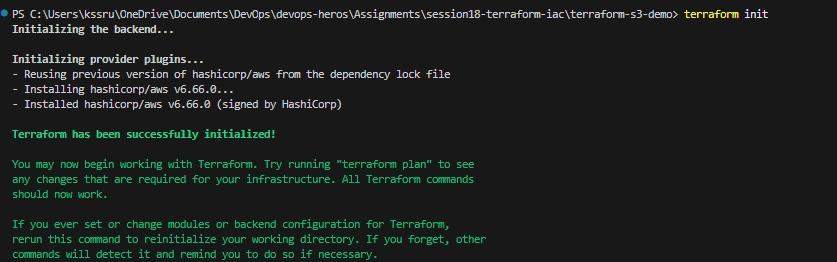
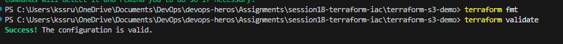
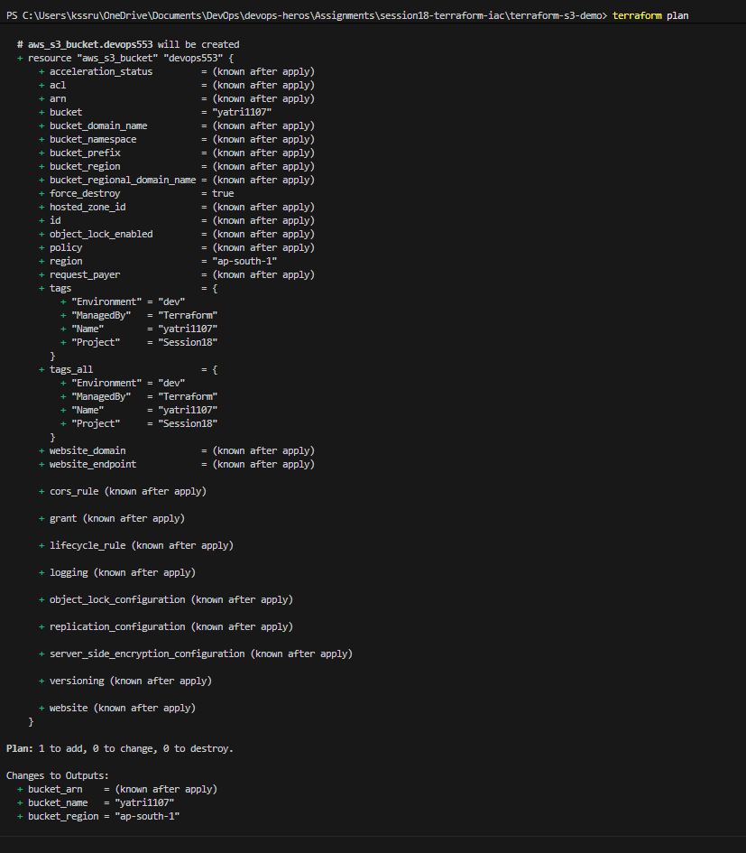
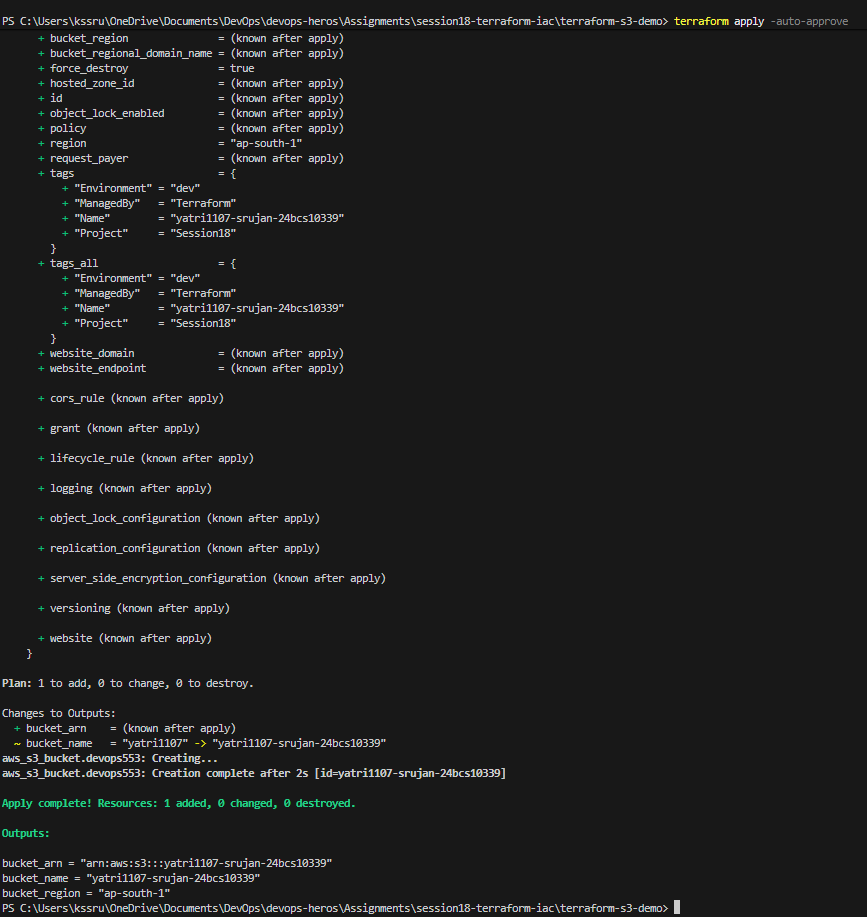
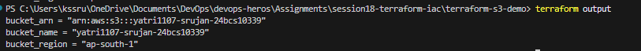

# Session 18 — Terraform & Infrastructure as Code

## Student Details

- **Name:** Srujan Gowda KS
- **Roll Number:** 24BCS10339
- **Session:** Session 18 - Terraform & Infrastructure as Code

---

## 1. Project Overview

Welcome to the **Session 18: Terraform & Infrastructure as Code (IaC)** project submission! 

When people start using cloud providers like Amazon Web Services (AWS), they usually log into a website (the AWS Management Console) and click buttons to create servers, databases, and storage buckets. While that works for learning, it quickly becomes slow, error-prone, and impossible to replicate when building real-world software systems.

In this assignment, we transition to modern DevOps practices by using **HashiCorp Terraform**—a tool that allows us to write plain code files that automatically build, manage, and delete cloud infrastructure.

This submission is split into two main sections:
1. **Task 1: Terraform S3 Demo Project**: Writing code to automatically create an Amazon S3 storage bucket on AWS, inspecting its properties, and destroying it safely using Terraform commands.
2. **Task 2: AWS Services In-Depth Research**: A beginner-friendly yet thorough technical deep dive into five essential AWS services: **IAM** (Governance), **EC2** (Virtual Servers), **S3** (Object Storage), **VPC** (Private Networking), and **DynamoDB & RDS** (Database Solutions).

---

## 2. Infrastructure as Code (IaC) Explained Simply

> [!NOTE]  
> **Simple Real-World Analogy**:  
> Imagine baking a cake. If you bake from memory without writing anything down, every cake will taste slightly different, and if you forget an ingredient, the cake is ruined. But if you have a written **recipe card**, anyone can follow the exact instructions and bake the exact same cake every single time.  
> **Infrastructure as Code is that recipe card for the cloud.** Instead of manually clicking buttons on AWS, you write down your cloud setup as code. Terraform reads that recipe and builds your infrastructure reliably every single time.

### 2.1 Declarative vs. Imperative — What’s the Difference?

- **Imperative (Tell the computer *HOW* to do it step-by-step)**:  
  Like telling a taxi driver: *"Drive 200 meters, turn left, wait 10 seconds at the signal, then turn right."* If the driver misunderstands even one step, you end up lost. Scripts like Bash or PowerShell work this way.
- **Declarative (Tell the computer *WHAT* you want the end result to be)**:  
  Like telling a taxi driver: *"Take me to Central Railway Station."* The driver figures out the best route and gets you to the exact destination. **Terraform is declarative**: you simply declare *"I want an S3 bucket named `my-bucket`"*, and Terraform handles all the complex AWS API calls to make it happen.

### 2.2 Why is Terraform So Popular?

1. **Idempotence (Safe to re-run)**: If you run Terraform ten times without changing your code, it won't create ten duplicate buckets. It checks what is already there and only makes changes if needed.
2. **Version Control**: Since infrastructure is written in text files (`.tf`), you can track changes in Git, collaborate in teams, and review pull requests before deploying to the cloud.
3. **Cloud Agnostic**: Terraform uses a universal language (HCL - HashiCorp Configuration Language) and can talk to AWS, Google Cloud, Microsoft Azure, Kubernetes, and hundreds of other platforms using **Providers**.

---

## 3. How Terraform Works Under the Hood

Terraform relies on three core building blocks to do its job:

```text
  ┌─────────────────────────────────────────────────────────────┐
  │                 Your Code (.tf files)                       │
  │     (The blueprint: "I want an S3 bucket in ap-south-1")    │
  └──────────────────────────────┬──────────────────────────────┘
                                 │
                                 ▼
  ┌─────────────────────────────────────────────────────────────┐
  │                    Terraform Core Engine                    │
  │  (Reads code, compares with state, creates execution plan)  │
  └──────────────┬──────────────────────────────┬───────────────┘
                 │                              │
                 ▼                              ▼
  ┌─────────────────────────────┐ ┌─────────────────────────────┐
  │    AWS Provider Plugin      │ │  State File (terraform.tfstate)
  │ (Translates to AWS API calls)│ │ (Memory of what is already  │
  └──────────────┬──────────────┘ │           built)            │
                 │                └─────────────────────────────┘
                 ▼
  ┌─────────────────────────────┐
  │    Real AWS Cloud Resource  │
  │      (Live S3 Bucket)       │
  └─────────────────────────────┘
```

1. **The Provider (`provider.tf`)**:  
   Think of the provider as a **translator** or **adapter**. Terraform core doesn't inherently know how AWS works. The AWS Provider plugin translates Terraform instructions into official AWS API requests.
2. **The State File (`terraform.tfstate`)**:  
   Think of the state file as Terraform's **memory notebook**. When Terraform creates a bucket on AWS, AWS assigns it unique IDs and ARNs. Terraform writes those details into `terraform.tfstate`. Next time you run a command, Terraform checks this notebook first so it knows what already exists.

---

## 4. Task 1: Terraform S3 Project Breakdown

All code files for Task 1 are stored in the project folder:  

### 4.1 Project File Layout

```text
terraform-s3-demo/
├── provider.tf       # Tells Terraform to use the AWS plugin and sets the region
├── variables.tf      # Declares inputs/parameters (like bucket name and region)
├── terraform.tfvars  # Supplies the actual custom values for our variables
├── main.tf           # Defines the actual S3 bucket resource to be created
├── outputs.tf        # Specifies what information to print after creation
└── README.md         # Local documentation
```

### 4.2 Walking Through the Code Files

#### 1. `provider.tf` — Connecting to AWS
This file tells Terraform which cloud provider we are talking to and which region to target:
```hcl
provider "aws" {
  region = var.aws_region
}
```
*Beginner Explanation*: Just like selecting your city on a delivery app, this tells Terraform to build our resources in AWS's Mumbai region (`ap-south-1`).

#### 2. `variables.tf` — Creating Reusable Parameters
Instead of hardcoding values directly in our resource code, we define variables:
```hcl
variable "aws_region" {
  type        = string
  description = "AWS region where the S3 bucket will be created."
  default     = "ap-south-1"
}

variable "bucket_name" {
  type        = string
  description = "Name of the S3 bucket."
  default     = "yatri1107"
}
```
*Beginner Explanation*: Variables are like fill-in-the-blank forms. They allow the same code to be reused for development, testing, or production simply by changing the input values.

#### 3. `terraform.tfvars` — Supplying Real Values
In AWS, **S3 bucket names must be globally unique across all AWS accounts in the world**. If another user anywhere on Earth already took the name `yatri1107`, AWS will reject it. We use `terraform.tfvars` to supply our unique custom name:
```hcl
aws_region  = "ap-south-1"
bucket_name = "yatri1107-srujan-24bcs10339"
```

#### 4. `main.tf` — Declaring the S3 Bucket Resource
This is the core recipe where we declare what we want AWS to create:
```hcl
resource "aws_s3_bucket" "devops553" {
  bucket        = var.bucket_name
  force_destroy = true

  tags = {
    Name        = var.bucket_name
    Environment = "dev"
    ManagedBy   = "Terraform"
    Project     = "Session18"
  }
}
```
*Beginner Explanation*:
- `resource "aws_s3_bucket" "devops553"`: We are creating an AWS S3 bucket, and internally inside Terraform, we give this block a local nickname (`devops553`).
- `force_destroy = true`: Allows Terraform to safely clean up and delete the bucket even if files are placed inside it later.
- `tags`: Key-value labels attached to the bucket in AWS so teammates know who owns it and what project it belongs to.

#### 5. `outputs.tf` — Returning Helpful Information
Once the bucket is created, we want Terraform to immediately print out its details on our screen:
```hcl
output "bucket_name" {
  type        = string
  description = "Name of the S3 bucket."
  value       = aws_s3_bucket.devops553.bucket
}

output "bucket_arn" {
  type        = string
  description = "ARN of the S3 bucket."
  value       = aws_s3_bucket.devops553.arn
}

output "bucket_region" {
  type        = string
  description = "AWS region of the S3 bucket."
  value       = aws_s3_bucket.devops553.region
}
```

---

## 5. The Terraform Lifecycle — Step-by-Step Execution

Here is the exact journey we executed in our terminal to build, inspect, and destroy the infrastructure, along with our verified execution screenshots.

```text
 ┌──────────────┐     ┌──────────────┐     ┌──────────────┐     ┌──────────────┐
 │  1. init     │ ──► │ 2. fmt/valid │ ──► │  3. plan     │ ──► │  4. apply    │
 │ (Setup tools)│     │(Check syntax)│     │(Preview plan)│     │ (Build on AWS│
 └──────────────┘     └──────────────┘     └──────────────┘     └──────┬───────┘
                                                                       │
 ┌──────────────┐     ┌──────────────┐     ┌──────────────┐            │
 │  7. destroy  │ ◄── │  6. output   │ ◄── │   5. show    │ ◄──────────┘
 │(Clean up AWS)│     │(Read values) │     │(Inspect state│
 └──────────────┘     └──────────────┘     └──────────────┘
```

---

### Step 1: Initializing Terraform (`terraform init`)
Before Terraform can do anything, it must prepare the working directory. It reads `provider.tf`, notices we need AWS, connects to HashiCorp's registry, downloads the AWS plugin (`hashicorp/aws v6.66.0`), and creates a `.terraform.lock.hcl` file.

```powershell
terraform init
```


*Figure 5.1: Terminal output confirming that the AWS provider plugin was successfully installed and the environment initialized.*

---

### Step 2: Formatting & Validating (`terraform fmt` & `terraform validate`)
- **`terraform fmt`**: Cleans up formatting, aligning equals signs and indentation so the code looks tidy and professional.
- **`terraform validate`**: Reads all configuration files and confirms that there are no syntax errors, typos, or missing parameters.

```powershell
terraform fmt
terraform validate
```


*Figure 5.2: Terminal output confirming `Success! The configuration is valid.`*

---

### Step 3: Previewing Changes (`terraform plan`)
`terraform plan` is the safety net of DevOps. It performs a read-only dry run. It connects to AWS, checks what currently exists, and displays a preview:
`Plan: 1 to add, 0 to change, 0 to destroy.`
It also shows the green `+` signs next to every attribute that is about to be created.

```powershell
terraform plan
```


*Figure 5.3: `terraform plan` showing the detailed blueprint of the S3 bucket before anything is created.*

---

### Step 4: Applying and Creating the Bucket (`terraform apply`)
`terraform apply -auto-approve` takes the plan and turns it into real infrastructure. Terraform sends HTTP requests to AWS S3 APIs, creates the bucket `yatri1107-srujan-24bcs10339` in 2 seconds, updates `terraform.tfstate`, and prints our outputs.

```powershell
terraform apply -auto-approve
```


*Figure 5.4: Live creation completed on AWS in 2 seconds with outputs displayed.*

---

### Step 5: Inspecting Current State (`terraform show`)
Once infrastructure is running, `terraform show` reads `terraform.tfstate` and prints a clear, human-readable summary of every single cloud attribute AWS assigned to our bucket (ARN, bucket domain name, hosted zone ID, and encryption settings).

```powershell
terraform show
```


*Figure 5.5: `terraform show` displaying the comprehensive live state of our bucket.*

---

### Step 6: Viewing Outputs (`terraform output`)
Rather than searching through hundreds of lines of state data, `terraform output` quickly prints only the key variables we marked as important in `outputs.tf`:

```powershell
terraform output
```


*Figure 5.6: The terminal displaying the bucket name, ARN, and region.*

---

### Step 7: Cleaning Up and Deleting (`terraform destroy`)
In cloud computing, **idle resources cost money**. When our testing is complete, `terraform destroy -auto-approve` reads the state file, identifies the resources it created, and safely removes them from AWS.

```powershell
terraform destroy -auto-approve
```


*Figure 5.7: `terraform destroy` cleanly deleting the S3 bucket with 0 orphaned resources left behind.*

---

## 6. Task 2: AWS Services Technical Research

To build a well-rounded foundation in cloud computing, we conducted in-depth technical research on five core AWS services. Full dedicated research guides are located in `aws-services/`:

```text
aws-services/
├── 01-iam/README.md          # Identity & Access Management (Security & Governance)
├── 02-ec2/README.md          # Elastic Compute Cloud (Virtual Servers & Compute)
├── 03-s3/README.md           # Simple Storage Service (Scalable Object Storage)
├── 04-vpc/README.md          # Virtual Private Cloud (Software-Defined Networking)
└── 05-dynamodb-rds/README.md # Managed Databases (Serverless NoSQL vs. Relational SQL)
```

---

### 6.1 [01. AWS IAM — Identity & Access Management](aws-services/01-iam/README.md)
- **What is it?** IAM is the gatekeeper of your AWS account. It answers two questions: *Who are you?* (Authentication) and *What are you allowed to do?* (Authorization).
- **Core Entities Explained**:
  - **Users**: Real people or systems who log in using passwords or access keys.
  - **Groups**: Collections of users (e.g., `Developers`, `Security-Admins`) sharing the same permissions.
  - **Roles**: Temporary permissions that can be assumed by applications or services (like an EC2 server reading an S3 bucket) without saving permanent secret keys on the server.
- **The Golden Rule — Least Privilege**: Always give users the **absolute bare minimum permissions** needed to do their job. If an engineer only needs to read files, do not grant write or delete permissions.
- **Top Best Practice**: Never use the AWS Root Account for everyday tasks. Lock it with a strong password and hardware/virtual MFA (Multi-Factor Authentication).

---

### 6.2 [02. AWS EC2 — Elastic Compute Cloud](aws-services/02-ec2/README.md)
- **What is it?** EC2 allows you to rent virtual computers (called **Instances**) running in Amazon's data centers. You can choose how much CPU, RAM, and storage they have, and turn them on or off anytime.
- **Core Components Explained**:
  - **AMI (Amazon Machine Image)**: The template or snapshot of the operating system (e.g., Ubuntu 22.04 or Amazon Linux) used to boot your server.
  - **Instance Types**: Letter-and-number codes representing hardware capacity. For example, `t3.micro` (small, cheap, general-purpose) vs. `c5.large` (compute-heavy) vs. `g4dn` (GPU-powered for AI).
  - **Key Pairs**: Secure public/private encryption keys used to log into Linux servers via SSH without typing passwords.
  - **Security Groups**: A virtual firewall wrapped around your server that controls which ports are open (e.g., Port 80 for HTTP web traffic, Port 22 for SSH).
  - **EBS (Elastic Block Store)**: The virtual hard drive plugged into your EC2 instance that keeps your data safe even when the server is powered down.

---

### 6.3 [03. AWS S3 — Simple Storage Service](aws-services/03-s3/README.md)
- **What is it?** S3 is an object storage service designed to store and protect any amount of data (images, videos, backups, website files, database dumps) with **99.999999999% (11 9's) durability**.
- **Core Components Explained**:
  - **Buckets**: Top-level folders with globally unique names worldwide.
  - **Objects**: The files stored inside buckets, each identifiable by a unique key/path.
  - **Storage Classes**: Different tiers to save money based on how often you access data:
    - *S3 Standard*: For files you need every day.
    - *S3 Standard-IA*: For files you access rarely, but need instantly when requested.
    - *S3 Glacier*: Ultra-cheap archive storage for compliance records where you can wait hours for retrieval.
  - **Versioning**: Saves previous versions of files so you can easily restore them if someone accidentally deletes or overwrites them.

---

### 6.4 [04. AWS VPC — Virtual Private Cloud](aws-services/04-vpc/README.md)
- **What is it?** A VPC is your own private, isolated slice of the internet inside AWS. It prevents random internet users from accessing your private backend systems.
- **Core Components Explained**:
  - **CIDR Blocks & Subnets**: Your VPC gets an IP range (e.g., `10.0.0.0/16`). Subnets divide this range into smaller sections placed across different physical buildings (Availability Zones).
  - **Public vs. Private Subnets**:
    - *Public Subnet*: Connected to the outside world via an **Internet Gateway (IGW)**. This is where public-facing websites and load balancers live.
    - *Private Subnet*: Hidden from the internet with no direct public route. This is where sensitive databases and backend application servers live.
  - **NAT Gateway**: Placed in a public subnet to allow servers in private subnets to download software updates from the internet while blocking anyone from the internet from initiating incoming connections.
  - **Security Groups vs. Network ACLs (NACLs)**: Security Groups protect individual servers (stateful firewall), while NACLs protect the entire subnet boundary (stateless firewall).

---

### 6.5 [05. AWS DynamoDB & RDS — Database Services](aws-services/05-dynamodb-rds/README.md)
- **The Core Difference**:
  - **Amazon RDS (Relational Database Service)**: Ideal for traditional SQL databases (PostgreSQL, MySQL, MariaDB, Oracle). Data is organized in structured tables with strict columns, relationships, foreign keys, and complex multi-table joins (e.g., banking systems, financial ledgers, inventory).
  - **Amazon DynamoDB (NoSQL Database)**: Fully managed, serverless, single-digit millisecond latency key-value store. You don't have to manage servers or size CPU/RAM. Data is flexible and schema-less, organized by a **Partition Key** and optional **Sort Key** (e.g., mobile game leaderboards, user session carts, IoT sensor readings).
- **High Availability in Databases**:
  - **Multi-AZ (High Availability)**: Automatically keeps an exact synchronous replica of your database running in a second physical data center. If the primary crashes, AWS automatically fails over in under 2 minutes.
  - **Read Replicas (Scalability)**: Creates read-only copies to handle heavy read traffic (such as generating daily reports) without slowing down the main database.

---

## 7. Key Student Learnings & Practical Takeaways

1. **Why Manual Clicking Fails in Production**:
   - Creating an S3 bucket manually in the AWS Console took multiple clicks, selecting menus, choosing regions, and remembering tags. With Terraform, the entire bucket was defined cleanly in code and launched in **2 seconds**.
2. **Solving the Global Namespace Conflict**:
   - S3 requires globally unique names across all AWS accounts. Attempting to use the default name `yatri1107` resulted in a `409 BucketAlreadyExists` error because another AWS user owned it. We learned how to use `terraform.tfvars` to supply our unique name (`yatri1107-srujan-24bcs10339`) without modifying the core `main.tf` code.
3. **The Power of `terraform plan`**:
   - Being able to preview exact additions, modifications, and deletions before applying them gives DevOps engineers total confidence and eliminates unintended destructive mistakes.
4. **Clean Teardowns Prevent Cloud Billing**:
   - Practicing `terraform destroy` showed how easy it is to spin down temporary test environments, guaranteeing zero unwanted cloud charges.
5. **Connecting Theory with Practice**:
   - Researching IAM, EC2, S3, VPC, and Databases helped connect abstract cloud concepts directly to hands-on code automation.
