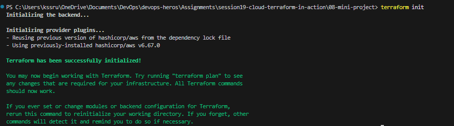
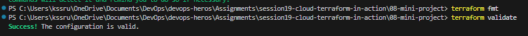
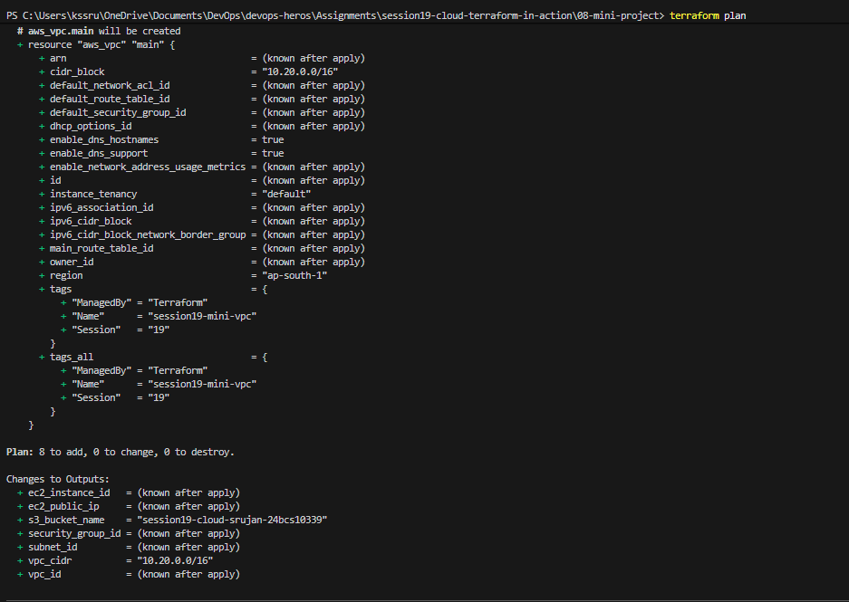
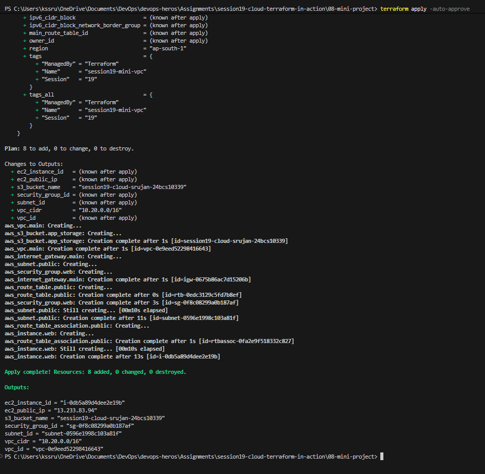
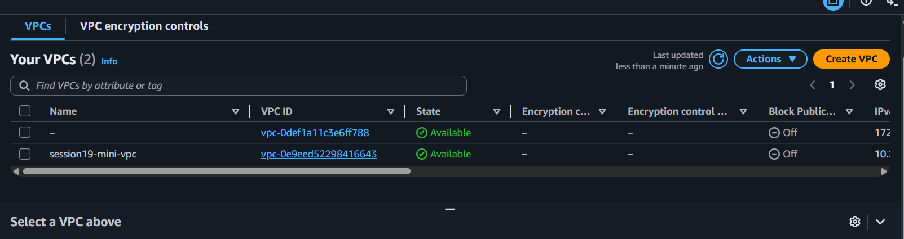
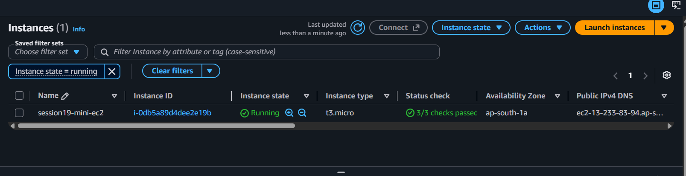
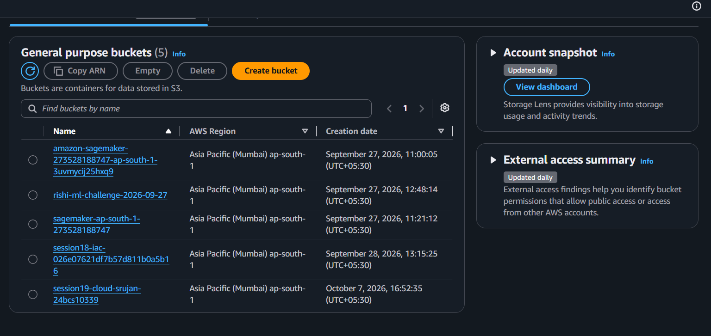
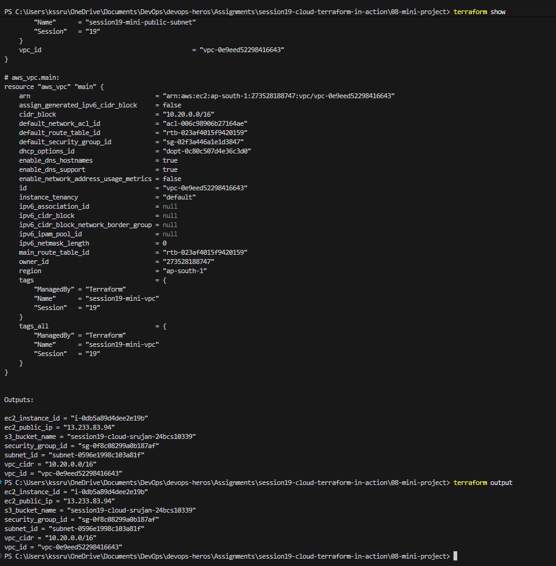
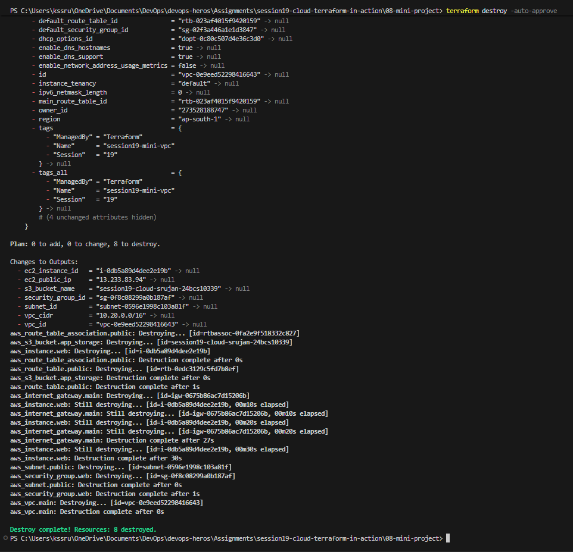

# Session 19 — Cloud & Terraform in Action

## Student Details

- **Name:** Srujan Gowda KS
- **Roll Number:** 24BCS10339
- **Session:** Session 19 - Cloud & Terraform in Action

---

## 1. Project Overview

Welcome to the **Session 19: Cloud & Terraform in Action** practical assignment submission!

While Session 18 introduced fundamental Terraform commands (`init`, `plan`, `apply`, `destroy`) using a single standalone S3 bucket, **Session 19 elevates our Infrastructure as Code (IaC) skills to real-world multi-tier cloud architecture**.

In this project, we designed, deployed, validated, and destroyed an **end-to-end cloud environment on Amazon Web Services (AWS)** using declarative Terraform code. Rather than managing isolated components, this project interconnects six foundational cloud building blocks:
1. **Isolated Virtual Network (VPC)**: A custom private network space (`10.20.0.0/16`).
2. **Public Subnet**: A dedicated network segment (`10.20.1.0/24`) placed in Availability Zone `ap-south-1a`.
3. **Internet Gateway (IGW) & Route Table**: Establishing bidirectional internet connectivity for cloud resources.
4. **Security Group**: An instance-level virtual firewall allowing inbound web traffic (HTTP Port 80, HTTPS Port 443) and administrative access (SSH Port 22).
5. **EC2 Virtual Server**: A live virtual machine (`t3.micro`) bootstrapped with an automated Apache web server via `user_data`.
6. **S3 Object Storage**: A scalable, durable storage bucket for application files with automated lifecycle destruction rules.

---

## 2. Architecture & Design

```text
                               AWS Region: ap-south-1 (Mumbai)
  ┌──────────────────────────────────────────────────────────────────────────────────┐
  │  VPC: 10.20.0.0/16 ("session19-mini-vpc" / vpc-0e9eed52298416643)                 │
  │                                                                                  │
  │  Internet Gateway ("session19-mini-igw") ◄──► Route Table (0.0.0.0/0 -> IGW)     │
  │                                     │                                            │
  │  ┌──────────────────────────────────┴─────────────────────────────────────────┐  │
  │  │  Public Subnet: 10.20.1.0/24 ("session19-mini-public-subnet")              │  │
  │  │  AZ: ap-south-1a | Auto-assign Public IP: Enabled                          │  │
  │  │                                                                            │  │
  │  │    ┌────────────────────────────────────────────────────────────────┐      │  │
  │  │    │  Security Group ("session19-mini-web-sg")                      │      │  │
  │  │    │  • Ingress: Port 80 (HTTP), Port 443 (HTTPS), Port 22 (SSH)    │      │  │
  │  │    │  • Egress: All Outbound IPv4 (0.0.0.0/0)                       │      │  │
  │  │    │                                                                │      │  │
  │  │    │      EC2 Web Server ("session19-mini-ec2" / i-0db5a89d4dee2e19b)│      │  │
  │  │    │      • Instance Type: t3.micro                                 │      │  │
  │  │    │      • OS: Amazon Linux 2023 (AMI dynamic lookup)              │      │  │
  │  │    │      • Public IP: 13.233.83.94                                 │      │  │
  │  │    │      • Automated Web Server: Apache (httpd) on Port 80         │      │  │
  │  │    └────────────────────────────────────────────────────────────────┘      │  │
  │  └────────────────────────────────────────────────────────────────────────────┘  │
  │                                                                                  │
  │  S3 Bucket: "session19-cloud-srujan-24bcs10339" (force_destroy = true)            │
  └──────────────────────────────────────────────────────────────────────────────────┘
```

---

## 3. Core Concepts & Resource Dependencies

### 3.1 Understanding Resource Dependencies in Terraform
In cloud computing, infrastructure cannot be created in a random sequence:
- An **EC2 Instance** cannot exist without a **Subnet** and a **Security Group**.
- A **Subnet** and a **Security Group** cannot exist without a **VPC**.
- A **Route Table Association** requires both a **Route Table** and a **Subnet**.

Terraform automatically builds a **Directed Acyclic Graph (DAG)** of all declared resources:
- **Implicit Dependencies**: By passing `subnet_id = aws_subnet.public.id` and `vpc_security_group_ids = [aws_security_group.web.id]` into `aws_instance.web`, Terraform automatically deduces the proper creation hierarchy without manual orchestration.
- **Parallel Execution**: Resources with no inter-dependencies (such as the independent **S3 Bucket** and the **VPC**) are provisioned concurrently by Terraform to maximize deployment speed.

---

## 4. Project Files & Code Walkthrough

All code files are organized within `08-mini-project/`:

```text
08-mini-project/
├── versions.tf        # Specifies Terraform core version and HashiCorp AWS provider (~> 6.0)
├── variables.tf       # Declares parameterized inputs for region, instance size, and bucket name
├── terraform.tfvars   # Assigns concrete deployment values for the environment
├── main.tf            # Complete infrastructure definition (VPC, Subnet, IGW, RT, SG, EC2, S3)
├── outputs.tf         # Defines exported attributes printed upon completion
└── README.md          # Local project documentation
```

### Key Highlights from `main.tf`:

1. **Virtual Private Cloud (VPC)**:
   ```hcl
   resource "aws_vpc" "main" {
     cidr_block           = "10.20.0.0/16"
     enable_dns_support   = true
     enable_dns_hostnames = true
     tags = { Name = "session19-mini-vpc", Session = "19", ManagedBy = "Terraform" }
   }
   ```
2. **Public Subnet with Internet Route**:
   ```hcl
   resource "aws_subnet" "public" {
     vpc_id                  = aws_vpc.main.id
     cidr_block              = "10.20.1.0/24"
     availability_zone       = "${var.aws_region}a"
     map_public_ip_on_launch = true
   }

   resource "aws_internet_gateway" "main" {
     vpc_id = aws_vpc.main.id
   }

   resource "aws_route_table" "public" {
     vpc_id = aws_vpc.main.id
     route {
       cidr_block = "0.0.0.0/0"
       gateway_id = aws_internet_gateway.main.id
     }
   }
   ```
3. **Web & Management Security Group**:
   ```hcl
   resource "aws_security_group" "web" {
     name        = "session19-mini-web-sg"
     description = "Allow HTTP and HTTPS for Session 19"
     vpc_id      = aws_vpc.main.id

     ingress { from_port = 80, to_port = 80, protocol = "tcp", cidr_blocks = ["0.0.0.0/0"] }
     ingress { from_port = 443, to_port = 443, protocol = "tcp", cidr_blocks = ["0.0.0.0/0"] }
     ingress { from_port = 22, to_port = 22, protocol = "tcp", cidr_blocks = ["0.0.0.0/0"] }
     egress  { from_port = 0, to_port = 0, protocol = "-1", cidr_blocks = ["0.0.0.0/0"] }
   }
   ```
4. **Dynamic AMI Lookup & EC2 Web Server**:
   ```hcl
   data "aws_ami" "amazon_linux" {
     most_recent = true
     owners      = ["amazon"]
     filter { name = "name", values = ["al2023-ami-2023.*-x86_64"] }
     filter { name = "virtualization-type", values = ["hvm"] }
   }

   resource "aws_instance" "web" {
     ami                    = data.aws_ami.amazon_linux.id
     instance_type          = var.instance_type
     subnet_id              = aws_subnet.public.id
     vpc_security_group_ids = [aws_security_group.web.id]

     user_data = <<-EOF
                 #!/bin/bash
                 dnf update -y
                 dnf install -y httpd
                 systemctl start httpd
                 systemctl enable httpd
                 echo "<h1>Cloud Infrastructure Deployed via Terraform - Session 19</h1>" > /var/www/html/index.html
                 EOF
   }
   ```
5. **Amazon S3 Storage Bucket**:
   ```hcl
   resource "aws_s3_bucket" "app_storage" {
     bucket        = var.bucket_name
     force_destroy = true
     tags = { Name = var.bucket_name, Session = "19", ManagedBy = "Terraform" }
   }
   ```

---

## 5. Step-by-Step Workflow & Evidence

All 9 execution screenshots are verified and stored inside `screenshot/`:

---

### Step 1: Initializing the Environment (`terraform init`)
Terraform initialized the backend and downloaded the official **HashiCorp AWS provider plugin (`v6.67.0`)**, writing provider selections to `.terraform.lock.hcl`.

```powershell
terraform init
```


*Figure 5.1: Terminal output confirming successful provider plugin installation and environment initialization.*

---

### Step 2: Code Formatting & Syntax Validation (`terraform fmt` & `terraform validate`)
`terraform fmt` formatted all `.tf` files to standard HCL style, and `terraform validate` performed a static analysis check confirming all syntax, arguments, and resource references were valid.

```powershell
terraform fmt
terraform validate
```


*Figure 5.2: Terminal confirmation showing `Success! The configuration is valid.`*

---

### Step 3: Generating the Execution Plan (`terraform plan`)
Terraform analyzed the cloud state against local code, determining that 8 resources needed to be created:
- `aws_vpc.main`
- `aws_subnet.public`
- `aws_internet_gateway.main`
- `aws_route_table.public`
- `aws_route_table_association.public`
- `aws_security_group.web`
- `aws_instance.web`
- `aws_s3_bucket.app_storage`

```powershell
terraform plan
```


*Figure 5.3: `terraform plan` execution preview displaying `Plan: 8 to add, 0 to change, 0 to destroy`.*

---

### Step 4: Applying Infrastructure (`terraform apply`)
Terraform executed the plan against AWS APIs in Mumbai (`ap-south-1`). All 8 resources were provisioned successfully in parallel and topological dependency order.

```powershell
terraform apply -auto-approve
```


*Figure 5.4: Live creation log showing `Apply complete! Resources: 8 added, 0 changed, 0 destroyed.` and initial outputs.*

---

### Step 5: AWS Management Console Verification (UI Screenshots)

#### 5.1 Custom VPC Created
Navigating to **AWS Console > VPC > Your VPCs** confirms our isolated virtual network `session19-mini-vpc` with IPv4 CIDR `10.20.0.0/16` and state `Available`.


*Figure 5.5: AWS Console showing `session19-mini-vpc` (`vpc-0e9eed52298416643`) active in the Mumbai region.*

#### 5.2 EC2 Instance Running
Navigating to **AWS Console > EC2 > Instances** verifies our virtual server `session19-mini-ec2` (`i-0db5a89d4dee2e19b`) running with public IP `13.233.83.94` in subnet `subnet-0596e1998c103a81f`.


*Figure 5.6: AWS Console displaying the EC2 web server instance in `Running` state.*

#### 5.3 S3 Storage Bucket Created
Navigating to **Amazon S3 > Buckets** verifies the storage bucket `session19-cloud-srujan-24bcs10339` created in region `ap-south-1`.


*Figure 5.7: AWS S3 Console displaying the globally unique bucket.*

---

### Step 6: Querying Outputs & State Inspection (`terraform output` & `terraform show`)
Running `terraform show` and `terraform output` extracted the live attributes recorded in `terraform.tfstate`:
- `vpc_id` = `vpc-0e9eed52298416643`
- `vpc_cidr` = `10.20.0.0/16`
- `subnet_id` = `subnet-0596e1998c103a81f`
- `security_group_id` = `sg-0f8c08299a0b187af`
- `ec2_instance_id` = `i-0db5a89d4dee2e19b`
- `ec2_public_ip` = `13.233.83.94`
- `s3_bucket_name` = `session19-cloud-srujan-24bcs10339`

```powershell
terraform output
```


*Figure 5.8: Terminal output displaying live state inspection and exported resource attributes.*

---

### Step 7: Teardown & Clean Up (`terraform destroy`)
Once testing and verification were completed, running `terraform destroy -auto-approve` safely de-provisioned all 8 resources in reverse dependency order, ensuring zero lingering costs.

```powershell
terraform destroy -auto-approve
```


*Figure 5.9: `terraform destroy` successfully deleting all 8 provisioned resources.*

---

## 6. Key Learnings & Takeaways

1. **Holistic Infrastructure Orchestration**:
   - Building a complete stack demonstrated how individual components—VPCs, subnets, route tables, security groups, EC2 instances, and S3 buckets—seamlessly fit together into an interconnected cloud system.
2. **Dynamic AMI Lookups with Data Sources**:
   - Hardcoding static AMI IDs leads to fragile code because AMIs differ across regions and are regularly superseded. Using `data "aws_ami"` guarantees portability and resilience.
3. **Automated Server Bootstrapping**:
   - Leveraging `user_data` to automatically install and launch Apache HTTP Server eliminated the need for manual SSH configuration.
4. **Idempotency and Reverse Destruction**:
   - Observing `terraform destroy` illustrated how Terraform reverses its dependency graph (deleting EC2 and associations first before deleting subnets and VPC), ensuring smooth teardown without dependency lock errors.
