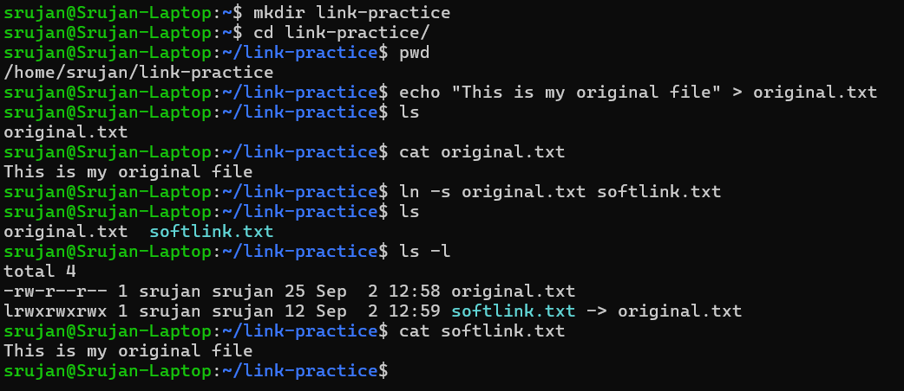
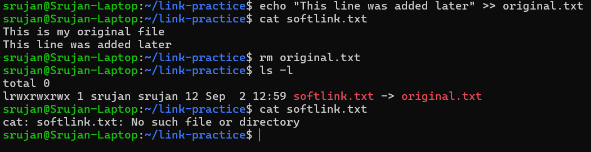
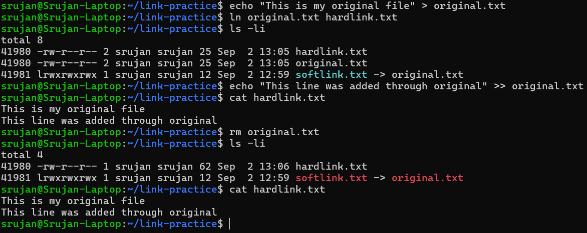
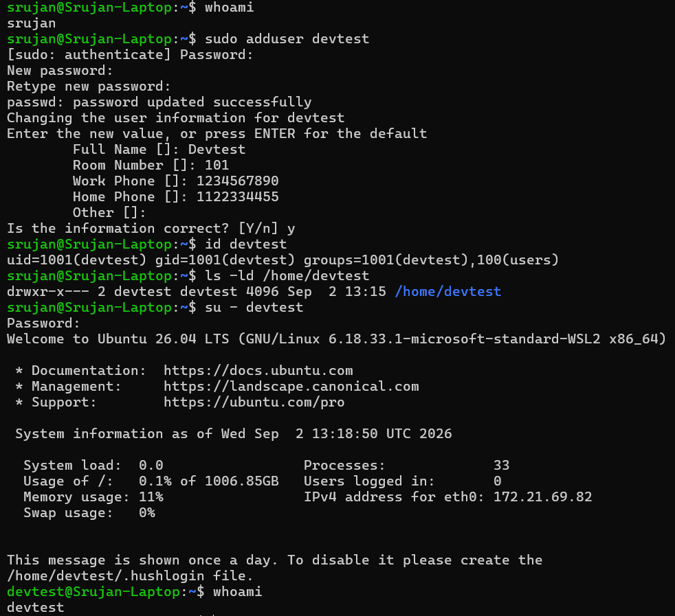
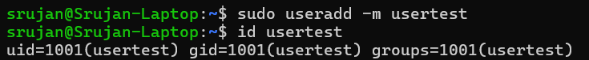
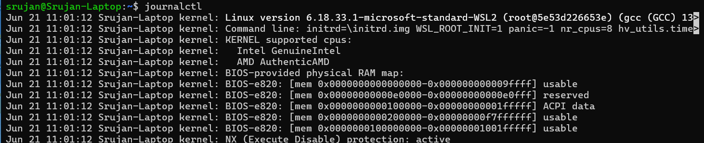
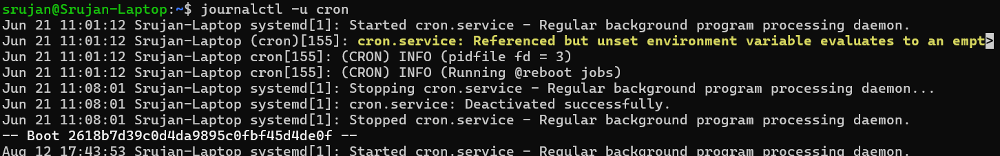
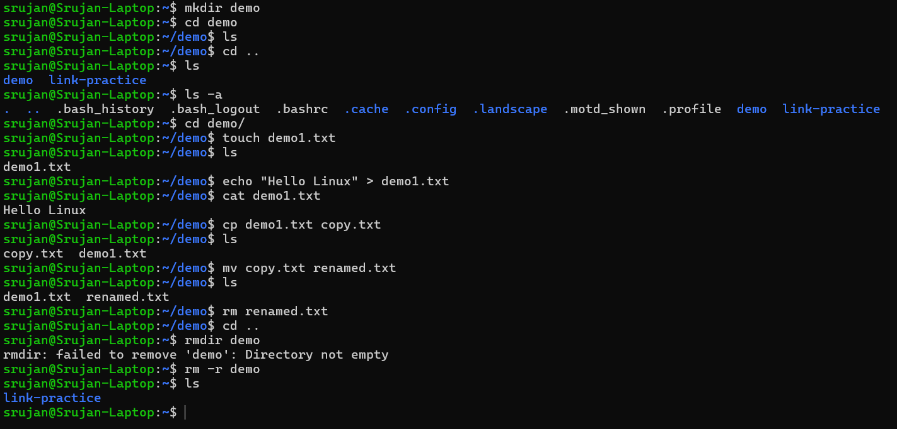

# DevOps Linux Homework - Session 1

## Overview
This document covers the practical tasks completed for DevOps Session 1. The tasks include working with soft and hard links, comparing user creation utilities (`adduser` vs `useradd`), inspecting system logs with `journalctl`, and practicing basic Linux file and directory management commands.

---

## Task 1 - Soft Link and Hard Link

### Objective
To create soft (symbolic) links and hard links in Linux and observe their behavior when the original file is modified or deleted.

### Concept
A soft link acts as a shortcut that points to the file path of another file. If the original file is deleted, the soft link breaks because the path target no longer exists. A hard link points directly to the underlying data on the disk (the same inode). Because a hard link shares the same inode as the original file, deleting the original filename does not delete the actual data, and the hard link continues to function normally.

| Soft Link | Hard Link |
|---|---|
| Points to the path of another file | Refers to the same inode |
| Breaks if the target file is deleted | Can still work if the original filename is deleted |
| Created using `ln -s` | Created using `ln` |

### Commands Used
```bash
mkdir link-practice
cd link-practice/
pwd
echo "This is my original file" > original.txt
ls
cat original.txt
ln -s original.txt softlink.txt
ls
ls -l
cat softlink.txt

echo "This line was added later" >> original.txt
cat softlink.txt
rm original.txt
ls -l
cat softlink.txt

echo "This is my original file" > original.txt
ln original.txt hardlink.txt
ls -li
echo "This line was added through original" >> original.txt
cat hardlink.txt
rm original.txt
ls -li
cat hardlink.txt
```

### Output / Observation
1. Creating the soft link with `ln -s original.txt softlink.txt` created an entry `softlink.txt -> original.txt` in `ls -l`. Reading `softlink.txt` displayed the text from `original.txt`.
2. After deleting `original.txt` with `rm original.txt`, the soft link turned red in `ls -l`, and running `cat softlink.txt` returned `cat: softlink.txt: No such file or directory`.
3. Creating the hard link with `ln original.txt hardlink.txt` resulted in both files sharing inode `41980` with a link count of 2 in `ls -li` (`softlink.txt` had inode `41981`).
4. Appending text to `original.txt` updated `hardlink.txt` automatically. After removing `original.txt`, `ls -li` showed `hardlink.txt` still present with inode `41980` and a link count of 1. Running `cat hardlink.txt` successfully displayed the full content.

### Screenshot

The screenshot below shows the soft link creation process and verification with ls -l.



The screenshot below demonstrates how the soft link breaks after deleting the original file.



The screenshot below shows hard link creation, shared inode numbers, and data persistence after deleting the original file.



### What I Learned
I learned how Linux uses inodes to reference data on disk. Seeing `softlink.txt` fail after `original.txt` was removed proved that soft links only store file paths, while checking inode `41980` explained why `hardlink.txt` retained the file contents even after deleting the original file name.

---

## Task 2 - adduser vs useradd

### Objective
To understand the differences between `adduser` and `useradd` commands when creating users in Linux.

### Concept
Both `adduser` and `useradd` are used to create standard Linux user accounts. `adduser` is a higher-level interactive script on Ubuntu that prompts for passwords and user information while automatically creating the home directory. `useradd` is a lower-level utility that relies on command-line flags (such as `-m` to create a home directory) and does not prompt interactively, making it useful for automation and scripts.

| adduser | useradd |
|---|---|
| Higher-level utility | Lower-level utility |
| Interactive | Option-based/non-interactive |
| Convenient for normal user creation | Useful for scripting and automation |

### Commands Used
```bash
whoami
sudo adduser devtest
id devtest
ls -ld /home/devtest
su - devtest
whoami

sudo useradd -m usertest
id usertest
```

### Output / Observation
1. Running `sudo adduser devtest` prompted interactively for password, Full Name (`Devtest`), Room Number (`101`), Work Phone (`1234567890`), and Home Phone (`1122334455`). It automatically created `/home/devtest`. Running `id devtest` showed UID `1001` and GID `1001`. Switching users with `su - devtest` and running `whoami` returned `devtest`.
2. Running `sudo useradd -m usertest` created the user non-interactively without prompting for user info. `id usertest` confirmed UID `1001` and GID `1001` were created.

### Screenshot

The screenshot below shows the interactive user creation process using adduser.



The screenshot below shows the non-interactive user creation process using useradd.



### What I Learned
I understood that `adduser` is more user-friendly for manual administration because it guides you through setting passwords and user profile details interactively. `useradd` is preferable when writing automated scripts where user interaction is not possible.

---

## Task 3 - journalctl

### Objective
To learn how to inspect Linux system logs and filter service logs using `journalctl`.

### Concept
Linux records system and kernel events in logs managed by the `systemd` journal. The `journalctl` command is used to query these logs. Using the `-u` flag allows filtering logs for a specific service unit, such as `cron`, which is a daemon that runs scheduled commands and jobs in the background.

### Commands Used
```bash
journalctl
journalctl -u cron
```

### Output / Observation
1. Running `journalctl` displayed kernel startup logs from boot, including the Linux kernel version (`6.18.33.1-microsoft-standard-WSL2`), memory map information, and hardware CPU detection details.
2. Running `journalctl -u cron` filtered logs specifically for `cron.service`. The logs showed `systemd` starting `cron.service - Regular background program processing daemon`, cron daemon startup details, as well as service stops and restarts across system reboots.

### Screenshot

The screenshot below shows general system logs displayed using journalctl.



The screenshot below shows logs filtered specifically for cron.service using journalctl -u cron.



### What I Learned
I learned how to use `journalctl` to view logs from systemd. Filtering by service using `journalctl -u cron` showed how easy it is to track the status and history of a background service when troubleshooting.

---

## Task 4 - Linux Command Cheat Sheet

### Objective
To practice fundamental Linux command-line utilities for managing files and directories.

### Concept
Basic command-line utilities are essential for creating, navigating, viewing, copying, renaming, and removing files and directories in Linux.

| Command | Purpose |
|---|---|
| `mkdir` | Creates a new directory |
| `cd` | Changes directory |
| `ls` | Lists directory contents |
| `ls -a` | Lists all files including hidden files |
| `touch` | Creates an empty file |
| `echo` | Writes text to stdout or into a file |
| `cat` | Displays file contents |
| `cp` | Copies a file |
| `mv` | Moves or renames a file |
| `rm` | Removes a file |
| `rmdir` | Removes an empty directory |
| `rm -r` | Removes a directory and its contents recursively |

### Commands Used
```bash
mkdir demo
cd demo
ls
cd ..
ls
ls -a
cd demo/
touch demo1.txt
ls
echo "Hello Linux" > demo1.txt
cat demo1.txt
cp demo1.txt copy.txt
ls
mv copy.txt renamed.txt
ls
rm renamed.txt
cd ..
rmdir demo
rm -r demo
ls
```

### Output / Observation
1. Created directory `demo`, navigated into it, and created `demo1.txt` with `touch`.
2. Wrote `"Hello Linux"` into `demo1.txt` using `echo` and verified with `cat`.
3. Copied `demo1.txt` to `copy.txt` with `cp`, renamed `copy.txt` to `renamed.txt` using `mv`, and deleted it with `rm`.
4. Attempted `rmdir demo` from parent folder, which failed with `rmdir: failed to remove 'demo': Directory not empty`.
5. Ran `rm -r demo`, which successfully deleted the directory and its remaining contents recursively.

### Screenshot

The screenshot below shows the practical execution of basic Linux file and directory management commands.




---

## What I Learned
From this session, I got a better understanding of basic Linux file handling, link creation, user administration, and system logging. Creating soft links and hard links side by side helped me see how inode references work in practice when files are deleted. I also learned how to filter service logs using `journalctl -u`, which will be useful for debugging background services in DevOps tasks.
