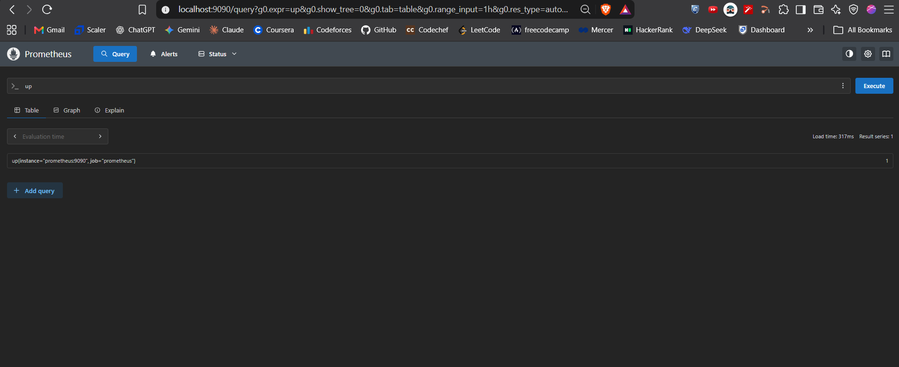
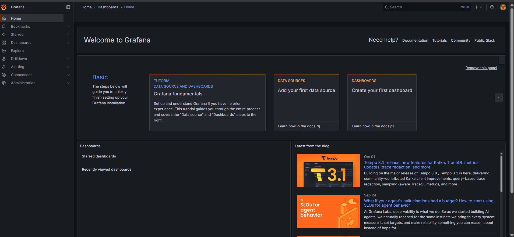
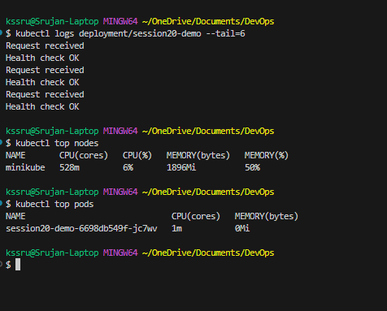
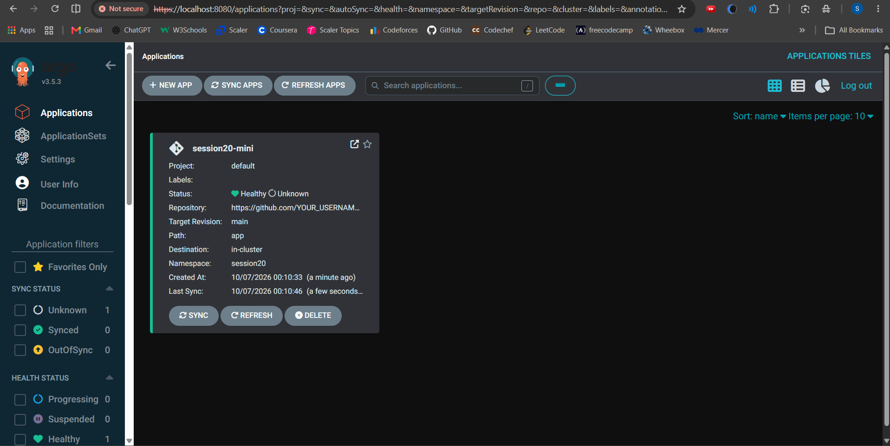
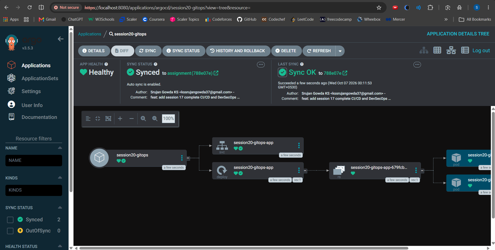

# Session 20 — Monitoring, Observability & GitOps

## Student Details

- **Name:** Srujan Gowda KS
- **Roll Number:** 24BCS10339
- **Session:** Session 20 - Monitoring, Observability & GitOps
---

## 1. Executive Summary & Overview

As software systems migrate from monolithic applications to cloud-native, distributed microservice architectures running on Kubernetes, infrastructure and application footprints become ephemeral, dynamic, and decoupled. A single user interaction may traverse dozens of independent containerized services, databases, message queues, and external APIs.

In this paradigm, two major operational engineering disciplines are required to maintain high reliability, rapid incident response, and continuous delivery:

1. **Monitoring & Observability**: Transforming raw system runtime data into actionable intelligence. This goes beyond static threshold alerts to high-fidelity telemetry spanning the three foundational pillars: **Metrics, Logs, and Distributed Traces (M.E.L.T.)**.
2. **GitOps**: Unifying infrastructure automation and continuous application delivery under the principle that **Git is the single source of truth** for declarative state, enforced by in-cluster controllers like **Argo CD** through continuous reconciliation and automated drift correction.

This document serves as both a practical laboratory submission for Session 20 and a comprehensive, production-grade learning reference for modern cloud-native observability and GitOps.

---

## 2. Learning Objectives & Core Competencies

By completing this practical module, the following competencies are mastered:

- **Differentiating Monitoring vs. Observability**: Moving from symptoms (*"Is it broken?"*) to root causes (*"Why did it break?"*).
- **The Observability Triad (Metrics, Logs, Traces)**:
  - Modeling numeric time-series data with metric types (Counters, Gauges, Histograms, Summaries).
  - Designing structured, contextual logging pipelines.
  - Understanding distributed tracing, parent-child span contexts, and request correlation.
- **Monitoring Methodologies (Google SRE & Industry Frameworks)**:
  - The **Four Golden Signals** (Latency, Traffic, Errors, Saturation).
  - The **RED Method** (Rate, Errors, Duration) for request-driven services.
  - The **USE Method** (Utilization, Saturation, Errors) for hardware and infrastructure resources.
- **Deploying Prometheus & Grafana**:
  - Configuring scrape configurations, pull intervals, and target discovery.
  - Querying time-series databases with PromQL (instant queries, range queries, aggregations, rate functions).
  - Visualizing metrics, CPU/memory usage, and application health in Grafana.
- **Kubernetes Observability Architecture**:
  - Understanding cAdvisor, metrics-server, and kubelet telemetry.
  - Extracting runtime signals using `kubectl top`, `kubectl logs`, and `kubectl describe`.
  - Diagnostics for Pod lifecycles, exit codes (`OOMKilled`, `CrashLoopBackOff`), and probe failures.
- **GitOps Principles & Architecture**:
  - The four core OpenGitOps tenets: Declarative, Versioned & Immutable, Pulled Automatically, Continuously Reconciled.
  - Push-based CI/CD vs. Pull-based GitOps security paradigms.
  - Configuring Argo CD, managing the `Application` CRD, handling automated sync, self-healing, and zero-touch cluster scaling via Git commits.

---

## 3. Monitoring vs. Observability (Deep Dive)

Although the terms are often used interchangeably, they represent fundamentally different levels of operational visibility:

```text
┌────────────────────────────────────────┐       ┌────────────────────────────────────────┐
│               MONITORING               │       │             OBSERVABILITY              │
├────────────────────────────────────────┤       ├────────────────────────────────────────┤
│ • Focus: "Is the system healthy?"      │       │ • Focus: "Why is the system behaving   │
│ • Answers: KNOWN-UNKNOWNS              │       │   this way?"                           │
│ • Detects predefined failure modes     │       │ • Explores: UNKNOWN-UNKNOWNS           │
│ • Signals: Binary thresholds & Alerts  │       │ • Dissects novel, complex edge cases   │
│ • Approach: Black-box, passive symptom │       │ • Signals: Metrics + Logs + Traces     │
│   tracking                             │       │ • Approach: White-box, internal state  │
│                                        │       │   inference from external outputs      │
└────────────────────────────────────────┘       └────────────────────────────────────────┘
```

### Comparative Analysis Table

| Dimension | Monitoring | Observability |
|---|---|---|
| **Core Question** | *"Is something broken right now?"* | *"Why did this failure cascade occur?"* |
| **System Perspective** | **Black-Box**: Inspects external symptoms (HTTP 500 error spikes, high ping latency). | **White-Box**: Inspects internal operational paths, database query execution times, lock contentions. |
| **Problem Domain** | Addresses **Known-Unknowns**: Problems you know could happen (e.g., disk fills up, CPU hits 90%). | Addresses **Unknown-Unknowns**: Emergent behaviors never anticipated (e.g., specific UTF-8 payload causing deadlock). |
| **Tooling Paradigm** | Static Dashboards, threshold-based alerts (PagerDuty, Slack pings). | High-cardinality exploratory search, trace waterfalls, distributed query engines (Jaeger, Tempo, Loki). |
| **Human Action** | Alerts you to jump on a bridge call. | Gives you the exact code line, span ID, and database query causing the delay. |

### Real-World Production Analogy
- **Monitoring**: The warning lights on a car's dashboard. The battery light turns red, or the engine thermometer spikes. You are alerted that the vehicle is in an unhealthy state.
- **Observability**: Connecting an OBD-II diagnostic computer into the car's engine control unit (ECU). The mechanic reads fuel-air injection ratios over time, timing belt sensor logs, and oil pressure traces across cylinder firings to discover that a clogged fuel injector caused cylinder misfire.

---

## 4. The Three Pillars of Observability

Observability relies on three primary telemetry signals, commonly referred to as the **M.E.L.T.** framework (Metrics, Events/Logs, Traces):

```text
                                  ┌───────────────────────────────┐
                                  │   The Observability Pillars   │
                                  └───────────────┬───────────────┘
                                                  │
                 ┌────────────────────────────────┼────────────────────────────────┐
                 ▼                                ▼                                ▼
      ┌──────────────────────┐         ┌──────────────────────┐         ┌──────────────────────┐
      │       METRICS        │         │         LOGS         │         │        TRACES        │
      ├──────────────────────┤         ├──────────────────────┤         ├──────────────────────┤
      │ "How much? How fast?"│         │   "What happened?"   │         │ "Where was time spent│
      │ • Numeric aggregation│         │ • Contextual event   │         │ • Request journey    │
      │ • Time-series DB     │         │ • High cardinality   │         │ • Distributed hops   │
      │ • Low storage cost   │         │ • Text/Structured    │         │ • Parent/child spans │
      │ • Best for Alerting  │         │ • Best for Diagnosis │         │ • Best for Latency   │
      └──────────────────────┘         └──────────────────────┘         └──────────────────────┘
```

---

### Pillar 1: Metrics (Aggregations Over Time)

A **Metric** is a numeric value measured at uniform time intervals, stored as a time-series with optional key-value labels (dimensions).

#### Key Metric Types (Prometheus Standard)
1. **Counter**: A cumulative metric that only increases (or resets to 0 on service restart).
   - *Use Case*: Total HTTP requests (`http_requests_total`), total errors (`app_exceptions_total`).
   - *Golden Rule*: Never graph raw counters directly; always calculate their rate of change using `rate()` or `irate()`.
2. **Gauge**: A metric that can arbitrarily go up or down.
   - *Use Case*: Memory usage (`process_resident_memory_bytes`), active concurrent connections (`http_active_connections`), CPU usage.
3. **Histogram**: Samples observations (usually request durations or response sizes) and counts them in configurable bucket intervals.
   - *Use Case*: Request latency (`http_request_duration_seconds_bucket`). Allows computing quantiles (p50, p90, p99) across distributed instances via `histogram_quantile()`.
4. **Summary**: Similar to histograms, but calculates configurable quantiles directly on the client side.

#### The High-Cardinality Trap
**Cardinality** refers to the number of unique time-series created by combinations of label values.
- *Good Labels (Low Cardinality)*: `method="POST"`, `status="200"`, `environment="prod"` (tens or hundreds of combinations).
- *Dangerous Labels (High Cardinality)*: `user_id="128491"`, `email="alice@example.com"`, `order_id="99214"` (millions of combinations). High cardinality can exhaust time-series database RAM and crash Prometheus instances.

---

### Pillar 2: Logs (Contextual Event Records)

A **Log** is a timestamped record of an event that occurred inside the software runtime.

#### Evolution of Logging
1. **Unstructured Plaintext Logs** (Legacy):
   ```text
   2026-10-07 00:15:23 [ERROR] User 1042 failed to purchase item 99: payment gateway timeout
   ```
   *Drawback*: Requires complex Regular Expressions (Regex) to parse and index in log aggregators.
2. **Structured JSON Logs** (Modern Standard):
   ```json
   {
     "timestamp": "2026-10-07T00:15:23.412Z",
     "level": "ERROR",
     "service": "checkout-service",
     "user_id": "1042",
     "order_id": "99",
     "trace_id": "4bf92f3577b34da6a3ce929d0e0e4736",
     "span_id": "00f067aa0ba902b7",
     "error_code": "PG_TIMEOUT",
     "duration_ms": 5002,
     "message": "Payment gateway timeout after 5000ms"
   }
   ```
   *Advantage*: Native key-value querying in modern log processors (Grafana Loki, Elasticsearch/OpenSearch), allowing instant filtering by `trace_id` or `user_id`.

---

### Pillar 3: Traces (Distributed Request Journeys)

In microservices, a single frontend click may trigger:
```text
Client -> API Gateway -> Auth Service -> Order Service -> Inventory Service -> Database
```
If the request takes 3.5 seconds, logs from individual services alone make it difficult to determine which specific hop caused the delay.

A **Distributed Trace** tracks the end-to-end execution path of a transaction across process and network boundaries:

```text
Trace: ID = 4bf92f3577b34da6a3ce929d0e0e4736 (Total Duration: 820ms)
│
├── [Span 1] API Gateway: GET /checkout (820ms)
│   ├── [Span 2] Auth Service: VerifyToken (30ms)
│   └── [Span 3] Order Service: ProcessOrder (760ms)
│       ├── [Span 4] Inventory: ReserveStock (40ms)
│       └── [Span 5] Database: INSERT INTO orders (680ms) ──► [BOTTLENECK DETECTED]
```

#### Core Tracing Terminology (OpenTelemetry / W3C Standard)
- **Trace**: A collection of spans that share a single global `trace_id`.
- **Span**: A named, timed operation representing a unit of work. Contains:
  - Operation name (e.g., `SELECT * FROM users`)
  - Start timestamp and duration
  - Span ID and Parent Span ID
  - Attributes/Tags (e.g., `http.status_code=200`, `db.system=postgresql`)
  - Events/Logs within the span
- **Context Propagation**: Injecting trace metadata into HTTP headers (`traceparent: 00-4bf92f3577b34da6a3ce929d0e0e4736-00f067aa0ba902b7-01`) so downstream services can join the active trace.

---

## 5. Industry Monitoring Frameworks: Golden Signals, RED & USE

Professional site reliability engineering uses structured frameworks to avoid dashboard clutter and alert fatigue:

### 1. The Four Golden Signals (Google SRE Book)
- **Latency**: The time it takes to service a request. Important to separate successful request latency from error latency (e.g., an instant HTTP 500 should not lower perceived latency).
- **Traffic**: A measure of how much demand is being placed on the system (e.g., HTTP requests/second, network I/O throughput).
- **Errors**: The rate of requests that fail (explicit 5xx responses, implicit bad content, or protocol failures).
- **Saturation**: How "full" the service is. Measures resource constraints (memory saturation, CPU run-queue length, database connection pool limits).

### 2. The RED Method (Best for Request-Driven Services)
Created by Tom Wilkie, RED simplifies microservice monitoring:
- **Rate**: Number of requests per second.
- **Errors**: Number of failing requests per second.
- **Duration**: Amount of time those requests take.

### 3. The USE Method (Best for Hardware & Infrastructure)
Created by Brendan Gregg, USE is applied to all physical/virtual resources (CPUs, disks, busses):
- **Utilization**: The average time that the resource was busy servicing work (e.g., Disk 80% utilized).
- **Saturation**: The degree to which extra work is queued waiting for the resource (e.g., CPU load average > core count).
- **Errors**: The count of error events (e.g., disk controller write errors, dropped network packets).

---

## 6. Task 1: Monitoring Architecture (Prometheus & Grafana)

Task 1 implements a production-style metrics monitoring stack using Docker Compose under `04-grafana/docker-compose.yml`.

### System Architecture Diagram
```text
┌─────────────────────────────────┐
│       Prometheus Scraper        │
│    (prom/prometheus:v3.5.0)     │
│         Port: 9090              │
├─────────────────────────────────┤
│ • Reads prometheus.yml          │
│ • Pulls http://localhost:9090/  │
│   metrics every 15s             │
│ • Stores time-series in TSDB    │
│ • PromQL Query Engine           │
└────────────────┬────────────────┘
                 │
                 │ PromQL over HTTP API
                 ▼
┌─────────────────────────────────┐
│       Grafana Dashboard         │
│     (grafana/grafana:12.1.1)    │
│         Port: 3000              │
├─────────────────────────────────┤
│ • Authenticates via admin/admin │
│ • Data Source: http://          │
│   prometheus:9090               │
│ • Visual panels (Stat, Gauge,   │
│   Time-Series Graph)            │
└─────────────────────────────────┘
```

### Essential PromQL Cheat Sheet

| Use Case | PromQL Query | Description |
|---|---|---|
| **Health Check** | `up` | Returns `1` if the scrape target is alive, `0` if down. |
| **Request Rate** | `rate(http_requests_total[5m])` | Per-second average rate of HTTP requests over the last 5 minutes. |
| **Error Percentage** | `sum(rate(http_requests_total{status=~"5.."}[5m])) / sum(rate(http_requests_total[5m])) * 100` | Calculates percentage of HTTP 5xx errors across all endpoints. |
| **CPU Usage Rate** | `rate(process_cpu_seconds_total[1m])` | Real-time CPU core consumption rate of the application process. |
| **Memory in MB** | `process_resident_memory_bytes / 1024 / 1024` | Converts raw byte resident memory allocation into readable Megabytes. |
| **99th Percentile Latency**| `histogram_quantile(0.99, sum(rate(http_request_duration_seconds_bucket[5m])) by (le))` | Calculates the 99th percentile response latency in seconds. |

---

## 7. Task 2: Kubernetes Observability

Kubernetes provides built-in instrumentation to observe container state, resource usage, and orchestrator decisions.

```text
┌─────────────────────────────────────────────────────────────┐
│                      Kubernetes Node                        │
│                                                             │
│  ┌───────────────┐     ┌───────────────┐                    │
│  │    cAdvisor   │     │    Kubelet    │                    │
│  │(Raw container │     │(Pod lifecycle,│                    │
│  │ CPU/RAM stats)│     │ health events)│                    │
│  └───────┬───────┘     └───────┬───────┘                    │
│          │                     │                            │
│          ▼                     ▼                            │
│  ┌─────────────────────────────────────┐                    │
│  │           metrics-server            │                    │
│  │(Aggregates node/pod metrics for API)│                    │
│  └──────────────────┬──────────────────┘                    │
└─────────────────────┼───────────────────────────────────────┘
                      │
                      ▼
               kubectl top pods
               kubectl top nodes
```

### Health Probes in Kubernetes
To maintain self-healing observability, Kubernetes relies on container probes:
1. **Liveness Probe**: Determines if the container is still running. If it fails, the kubelet kills the container and initiates a restart according to the `restartPolicy`.
   - *Example*: Detects deadlocks where an application process is alive but completely unresponsive.
2. **Readiness Probe**: Determines if a container is ready to accept incoming network traffic. If it fails, endpoints controller removes the pod's IP from all matching Services.
   - *Example*: Prevents user traffic during cold-start cache warming or database migrations.
3. **Startup Probe**: Disables liveness and readiness checks until the application has fully initialized, preventing premature restart loops on legacy slow-starting workloads.

### Diagnostic Command Reference
- `kubectl logs deployment/session20-demo --tail=20 -f`: Stream live stdout/stderr application logs.
- `kubectl describe deployment session20-demo`: Inspect replica counts, rollout conditions, and scheduler events.
- `kubectl top nodes`: Real-time CPU cores and memory percentage per node.
- `kubectl top pods`: Real-time CPU millicores (`1m = 0.001 CPU core`) and memory mebibytes consumed per pod.

---

## 8. Task 3: GitOps Principles & Architecture (Argo CD)

### What is GitOps?
**GitOps** is a set of practices where the **entire desired state of an infrastructure and application delivery environment is version-controlled in Git**. Automated operators inside the cluster continuously reconcile the actual running state with the desired state stored in Git.

### The Four OpenGitOps Tenets
1. **Declarative**: The system state must be described declaratively (e.g., Kubernetes YAML, Helm, Kustomize), specifying *what* the system should look like rather than *how* to achieve it.
2. **Versioned and Immutable**: The desired state is stored in Git, guaranteeing an auditable history, commit authors, cryptographic commit hashes, and easy rollbacks (`git revert`).
3. **Pulled Automatically**: Software agents running inside the target environment pull the state from Git, removing the need to expose cluster API access to external CI runners.
4. **Continuously Reconciled**: Software agents continuously monitor the running cluster against Git. If drift occurs (manual tampering or node failures), the system automatically self-heals back to Git's specification.

---

### Push-Based CI/CD vs. Pull-Based GitOps

```text
PUSH MODEL (Traditional CI/CD):
┌──────────────┐     Build/Test     ┌───────────────────┐      kubectl apply      ┌────────────────────┐
│ Developer PR ├───────────────────►│ GitHub Actions CI ├────────────────────────►│ Kubernetes Cluster │
└──────────────┘                    └───────────────────┘ (Requires Kubeconfig    └────────────────────┘
                                                           Admin Credentials)

PULL MODEL (GitOps with Argo CD):
┌──────────────┐     git push       ┌───────────────────┐                         ┌────────────────────┐
│ Developer PR ├───────────────────►│  Git Repository   │                         │ Kubernetes Cluster │
└──────────────┘                    │ (Desired State)   │                         │                    │
                                    └─────────▲─────────┘                         │  ┌──────────────┐  │
                                              │                                   │  │   Argo CD    │  │
                                              │ Continuous Read (No push access)  │  │  Controller  │  │
                                              └───────────────────────────────────┼──┤ (In-cluster) │  │
                                                                                  │  └──────┬───────┘  │
                                                                                  │         │ Reconcile│
                                                                                  │         ▼          │
                                                                                  │    Target Pods     │
                                                                                  └────────────────────┘
```

#### Why GitOps is More Secure:
- **No Inbound Cluster Firewall Holes**: The CI system does not need admin credentials (`kubeconfig`) to your production cluster. If your CI runner is compromised, attackers do not gain root access to Kubernetes.
- **Drift Detection & Elimination**: In push-based CI, if an engineer manually runs `kubectl scale --replicas=0`, the CI server has no idea. In GitOps, Argo CD immediately detects that actual state != Git state, flags an **OutOfSync** event, and restores the replica count back to Git's declared value (**Self-Healing**).

---

### Argo CD Component Architecture

Argo CD runs natively inside Kubernetes in the `argocd` namespace:
- **`argocd-server`**: The gRPC/REST API server and Web UI console. Manages authentication, RBAC, and webhooks.
- **`argocd-repo-server`**: An internal service that clones Git repositories, parses manifests (YAML, Kustomize, Helm), and generates raw Kubernetes manifests.
- **`argocd-application-controller`**: The continuous reconciliation engine. Compares manifests generated by `argocd-repo-server` with live resources running in Kubernetes and triggers automated sync and self-healing.
- **`argocd-dex-server`**: Authentication provider integrating with external identity providers (OIDC, OAuth2, LDAP, GitHub, SAML).
- **`argocd-redis`**: In-memory cache for repository states, token sessions, and application status to reduce GitHub API rate limiting.

---

## 9. Screenshot Deliverables & Practical Evidence

The practical verification for Session 20 was captured and recorded in the screenshots below:

---

### Screenshot 1 — Prometheus Web UI & PromQL Metric Query

*Figure 1: Prometheus Web UI at `http://localhost:9090/query` executing the `up` PromQL expression, confirming that the instance scraper is healthy and returning a status value of `1`.*

---

### Screenshot 2 — Grafana Monitoring Dashboard

*Figure 2: Grafana Web UI at `http://localhost:3000` authenticated as `admin`, showing the management interface ready for Prometheus data source connections, metric panel visualizations, and alert rule definitions.*

---

### Screenshot 3 — Kubernetes Observability: Live Pod Logs & Resource Metrics

*Figure 3: Terminal verification showing live application event logs extracted via `kubectl logs deployment/session20-demo --tail=6` (`Health check OK`, `Request received`), followed by resource metrics from `kubectl top nodes` (CPU 528m / Memory 1896Mi) and `kubectl top pods` (CPU 1m / Memory 0Mi).*

---

### Screenshot 4 — Argo CD Applications Overview

*Figure 4: Argo CD Web Console at `https://localhost:8080` showing the application management interface, navigation menu, and connected Kubernetes cluster.*

---

### Screenshot 5 — Argo CD GitOps: Live Continuous Sync & Resource Tree

*Figure 5: Detailed Argo CD resource tree view for `session20-gitops`, demonstrating complete GitOps synchronization directly from GitHub repository `https://github.com/srujangowda07/devops-heros.git` (commit by Srujan Gowda KS). The application status confirms both Healthy and Synced states across Namespace, Service, Deployment, ReplicaSet, and running Pods.*

---

## 10. Hands-On Execution Guide & Commands Reference

To reproduce this environment from scratch:

### 1. Cluster & Monitoring Setup
```powershell
# Start Minikube with metrics-server enabled
minikube start --driver=docker
minikube addons enable metrics-server

# Start Prometheus & Grafana stack
cd session20-monitoring-observability-gitops/04-grafana
docker compose up -d
docker compose ps
```

### 2. Deploy Observability Demo Workload
```powershell
# Deploy application
cd ../../
kubectl apply -f session20-monitoring-observability-gitops/02-metrics-logs-traces/k8s-demo/

# Extract Observability Signals
kubectl get pods
kubectl logs deployment/session20-demo --tail=10
kubectl describe deployment session20-demo
kubectl top nodes
kubectl top pods
```

### 3. Deploy & Connect Argo CD (GitOps)
```powershell
# Install Argo CD server-side to prevent annotation size limits
kubectl create namespace argocd
kubectl apply -n argocd --server-side --force-conflicts -f https://raw.githubusercontent.com/argoproj/argo-cd/stable/manifests/install.yaml

# Retrieve Initial Admin Password
$secret = kubectl -n argocd get secret argocd-initial-admin-secret -o jsonpath="{.data.password}"
[System.Text.Encoding]::UTF8.GetString([System.Convert]::FromBase64String($secret))

# Port forward Argo CD server
kubectl port-forward svc/argocd-server -n argocd 8080:443 &

# Deploy GitOps Application tracking your repository
@"
apiVersion: argoproj.io/v1alpha1
kind: Application
metadata:
  name: session20-gitops
  namespace: argocd
spec:
  project: default
  source:
    repoURL: https://github.com/srujangowda07/devops-heros.git
    targetRevision: assignment
    path: session20-monitoring-observability-gitops/06-git-as-source-of-truth/gitops-repo/app
  destination:
    server: https://kubernetes.default.svc
    namespace: session20
  syncPolicy:
    automated:
      prune: true
      selfHeal: true
    syncOptions:
      - CreateNamespace=true
"@ | kubectl apply -f -

# Verify GitOps sync and deployed pods
kubectl get applications -n argocd
kubectl get all -n session20
```

---

## 11. Production Troubleshooting Playbook

### Scenario 1: Pod Crashes with `OOMKilled` (Exit Code 137)
- **Symptom**: Pod status shows `CrashLoopBackOff` or `OOMKilled`.
- **Diagnostic Step**: Run `kubectl describe pod <pod-name>`. Inspect `Last State -> Terminated -> Reason: OOMKilled (Exit Code 137)`.
- **Root Cause**: The container's memory consumption exceeded the `resources.limits.memory` configured in its deployment manifest. The Linux kernel Out-Of-Memory killer terminated the process.
- **Resolution**: Profile heap memory using Prometheus metric `container_memory_working_set_bytes`. Increase the pod's memory limit in Git and let Argo CD reconcile.

### Scenario 2: Argo CD Sync Shows `OutOfSync` / `ComparisonError`
- **Symptom**: Application tile turns yellow/orange with `ComparisonError: rpc error: code = Unknown desc = repository not found`.
- **Root Cause**:
  1. The repository is private and missing Git credentials in `argocd-secret`.
  2. The `targetRevision` branch does not exist on remote.
  3. The `path` inside the Git repository contains an unparseable manifest or contains another `Application` object targeting the same namespace.
- **Resolution**: Check the repo-server logs with `kubectl logs deployment/argocd-repo-server -n argocd`. Ensure the tracked directory only contains deployable workload manifests (`deployment.yaml`, `service.yaml`, `configmap.yaml`).

### Scenario 3: `kubectl top` Fails with `Metrics API not available`
- **Symptom**: `error: Metrics API not available`.
- **Root Cause**: The `metrics-server` pod has not started, cannot resolve Kubelet hostnames, or requires the `--kubelet-insecure-tls` flag on local clusters like Minikube.
- **Resolution**: Run `minikube addons enable metrics-server` and verify that the pod reaches `Running` via `kubectl get pods -n kube-system -l k8s-app=metrics-server`. Allow 30–60 seconds for the first scrape cycle to populate the API.

---

## 12. Conclusion & Key Takeaways

Session 20 provides the foundation for operating mission-critical Kubernetes environments:

1. **Observability is not optional**: You cannot optimize or repair what you cannot measure. Designing software with structured logs, well-chosen metric types, and distributed tracing context ensures incidents are diagnosed in minutes rather than hours.
2. **Prometheus and Grafana provide unified visibility**: Prometheus handles real-time metrics collection and PromQL querying, while Grafana translates that data into business and infrastructure dashboards.
3. **GitOps represents the modern gold standard for deployment**: By shifting operations to Git and employing Argo CD as an in-cluster reconciliation engine, infrastructure becomes self-documenting, auditable, self-healing, and resilient against human error and configuration drift.
