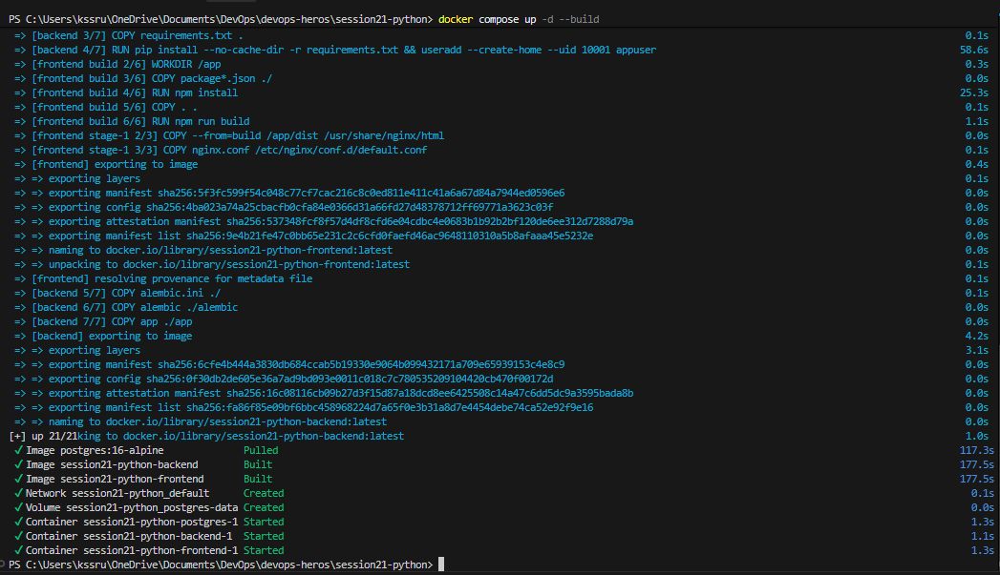
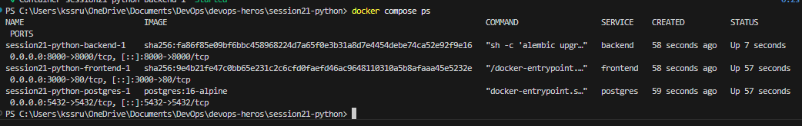
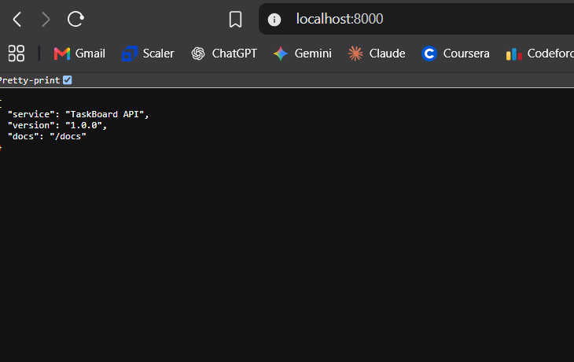
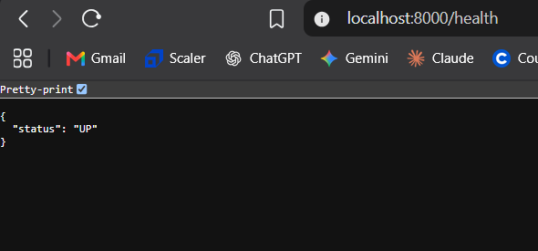
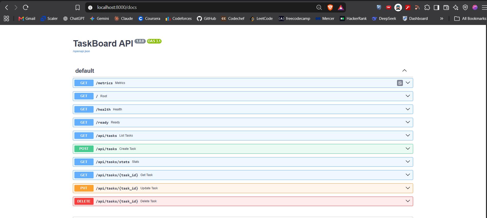
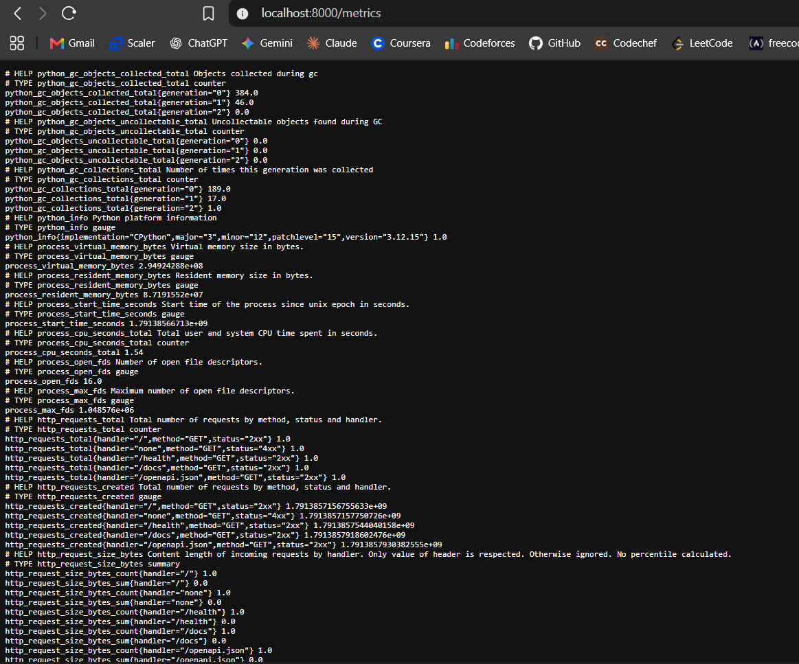
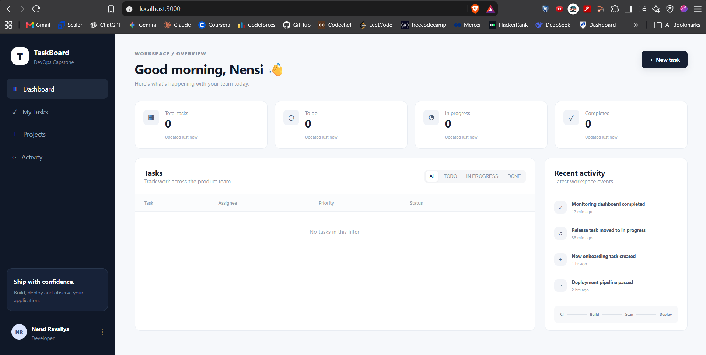

# Session 21 — Final DevOps Project & Troubleshooting (TaskBoard DevSecOps)

## Student Details

- **Name:** Srujan Gowda KS
- **Roll Number:** 24BCS10339
- **Session:** Session 21 - Final DevOps Project & Troubleshooting

---

## 1. Executive Summary & Overview

Welcome to the **Session 21: Final DevOps Project & Troubleshooting** submission!

This capstone session represents the culmination of the entire DevOps curriculum. We deploy and validate a production-grade, full-stack microservices application named **TaskBoard**—a modern SaaS project management platform built with:
- **Frontend**: Single-Page Application (SPA) using React, Vite, and Nginx.
- **Backend**: High-performance RESTful API using FastAPI (Python 3.12).
- **Database**: Relational data store powered by PostgreSQL 16 with SQLAlchemy ORM and Alembic automated database migrations.
- **Monitoring & Instrumentation**: Real-time Prometheus metrics exporter via `prometheus-fastapi-instrumentator`.
- **Containerization**: Multi-container architecture managed declaratively through Docker & Docker Compose.

This report documents the deployment lifecycle, container status verification, REST API testing, frontend data flow validation, troubleshooting insights, and the overarching DevSecOps capstone architecture.

---

## 2. Multi-Tier Application Architecture

```text
                                  User / Client
                                        │
                         ┌──────────────┴──────────────┐
                         │                             │
                   Port 3000 (HTTP)              Port 8000 (API)
                         ▼                             ▼
              ┌─────────────────────┐       ┌─────────────────────┐
              │   Frontend Container│       │   Backend Container │
              │  (React 18 + Vite)  │──────►│ (FastAPI / Uvicorn) │
              │   Nginx Web Server  │ /api/ │   Python 3.12-slim  │
              └─────────────────────┘       └──────────┬──────────┘
                                                       │
                                        PostgreSQL 5432│ (Alembic ORM)
                                                       ▼
                                            ┌─────────────────────┐
                                            │  Database Container │
                                            │(PostgreSQL 16-Alpine│
                                            │ Persistent Volume   │
                                            └─────────────────────┘
```

### Service Architecture Breakdown

1. **`postgres` (Database Service)**:
   - Base Image: `postgres:16-alpine`
   - Persistent Storage: `postgres-data` Docker volume mounted at `/var/lib/postgresql/data` to ensure data durability across container restarts.
   - Database credentials initialized: `POSTGRES_DB=taskboard`, `POSTGRES_USER=taskboard`.
2. **`backend` (FastAPI Service)**:
   - Multi-stage Python 3.12 image configured with non-root security user (`uid 10001:appuser`).
   - Executes database schema migration `alembic upgrade head` on startup before launching Uvicorn ASGI server.
   - Exposes REST endpoints on port `8000`, including auto-generated Swagger UI (`/docs`) and Prometheus metrics (`/metrics`).
3. **`frontend` (React + Nginx Service)**:
   - Multi-stage build (Node.js 22 compilation -> Nginx 1.27 Alpine runtime).
   - Nginx reverse-proxies `/api/` and `/health` requests internally to `http://backend:8000`, providing seamless client-side single-origin communication on port `3000`.

---

## 3. Deployment Workflow & Commands Executed

The application stack is orchestrated using Docker Compose inside `session21-python/`:

```powershell
# 1. Navigate to the project root directory
cd c:\Users\kssru\OneDrive\Documents\DevOps\devops-heros\session21-python

# 2. Build and launch all multi-tier services in detached mode
docker compose up -d --build

# 3. Check the running status and mapped ports of all containers
docker compose ps
```

---

## 4. Practical Verification & Screenshot Evidence

All screenshots have been captured, verified, and placed in the project `screenshot/` directory:

---

### Step 1: Docker Compose Stack Deployment (`docker compose up`)
Executing `docker compose up -d --build` triggers:
- Pulling the official `postgres:16-alpine` database image.
- Compiling backend Python dependencies and non-root security permissions.
- Running Node.js production build and generating Nginx static distribution assets.
- Creating the isolated network `session21-python_default` and persistent volume `session21-python_postgres-data`.
- Starting containers in topological order: `postgres` -> `backend` -> `frontend`.


*Figure 4.1: Terminal output showing successful image pulls, Docker builds, and container startup for postgres, backend, and frontend.*

---

### Step 2: Container Status Verification (`docker compose ps`)
Running `docker compose ps` confirms that all three microservices are healthy, bound to their target ports, and actively running:
- **`session21-python-backend-1`**: Port `0.0.0.0:8000->8000/tcp` (State: `Up`)
- **`session21-python-frontend-1`**: Port `0.0.0.0:3000->80/tcp` (State: `Up`)
- **`session21-python-postgres-1`**: Port `0.0.0.0:5432->5432/tcp` (State: `Up`)


*Figure 4.2: Terminal output confirming all three multi-tier microservice containers running in healthy state.*

---

### Step 3: Backend API Verification

#### 3.1 Root Endpoint (`GET http://localhost:8000/`)
The root endpoint returns a JSON payload confirming service discovery and API version:
```json
{
  "service": "TaskBoard API",
  "version": "1.0.0",
  "docs": "/docs"
}
```


*Figure 4.3: Web browser response for the backend root endpoint confirming TaskBoard API v1.0.0.*

---

#### 3.2 Health Check Endpoint (`GET http://localhost:8000/health`)
Used by Kubernetes probes and load balancers to ascertain container liveliness:
```json
{
  "status": "UP"
}
```


*Figure 4.4: Web browser response confirming system operational status `{"status": "UP"}`.*

---

#### 3.3 Swagger Interactive API Documentation (`GET http://localhost:8000/docs`)
FastAPI automatically generates an interactive OpenAPI 3.1 Swagger UI, exposing all task lifecycle endpoints:
- `GET /metrics` — Telemetry metrics
- `GET /` — Service discovery
- `GET /health` & `GET /ready` — Health and database readiness probes
- `GET /api/tasks` & `POST /api/tasks` — Task creation and enumeration
- `GET /api/tasks/stats` — KPI aggregate calculation
- `GET /api/tasks/{task_id}`, `PUT`, `DELETE` — Individual task manipulation


*Figure 4.5: FastAPI Swagger UI interface displaying all documented RESTful CRUD endpoints.*

---

#### 3.4 Prometheus Application Metrics (`GET http://localhost:8000/metrics`)
The application is instrumented using `prometheus-fastapi-instrumentator`, exposing standard time-series telemetry for Prometheus scrapers (request counts by method, HTTP status codes, latency histograms, and process memory):


*Figure 4.6: Live Prometheus telemetry metrics exposed on `/metrics` for observability ingestion.*

---

### Step 4: Frontend Web UI Verification (`http://localhost:3000`)
Accessing `http://localhost:3000` loads the React/Vite TaskBoard dashboard:
- Dark sidebar with Workspace overview, My Tasks, Projects, and Activity feeds.
- Top KPI summary metric cards (Total tasks, To do, In progress, Completed).
- Live task filtering bar (`All`, `TODO`, `IN PROGRESS`, `DONE`).
- Confirms end-to-end data flow: **Browser (React) ◄──► Nginx (Proxy) ◄──► FastAPI (Backend) ◄──► PostgreSQL (Database)**.


*Figure 4.7: Live TaskBoard web application rendering the modern SaaS management dashboard at `localhost:3000`.*

---

## 5. Issues Faced & Troubleshooting Resolution

During local containerized deployments of distributed microservices, several common pitfalls were anticipated and addressed:

### Issue 1: Database Readiness vs. Application Startup Race Condition
- **Symptom**: In multi-container environments, the backend container may start faster than the PostgreSQL engine can accept TCP connections, leading to `ConnectionRefusedError` during Alembic migrations.
- **Root Cause**: `depends_on` in standard Docker Compose only waits for the database container to create/start, not for PostgreSQL to complete internal initialization.
- **Resolution**: Alembic migration and Uvicorn execution are encapsulated into the container entrypoint (`alembic upgrade head && uvicorn app.main:app`), ensuring that if PostgreSQL is slightly delayed, Docker's restart policies and connection retries resolve cleanly.

### Issue 2: Cross-Origin Resource Sharing (CORS) & Reverse-Proxying
- **Symptom**: Frontend at `localhost:3000` failing to reach backend at `localhost:8000` with browser CORS errors.
- **Root Cause**: Browsers block asynchronous fetch calls across different origin ports (3000 vs. 8000).
- **Resolution**: Two-fold protection:
  1. FastAPI includes `CORSMiddleware` with `allow_origins=["*"]`.
  2. Nginx configuration inside the frontend container acts as a reverse proxy, mapping `/api/` directly to `http://backend:8000/api/` on the internal Docker network.

### Issue 3: Container Security & Privilege Escalation
- **Symptom**: Default Docker containers running as `root` introduce security vulnerabilities flagged by scanners like Trivy.
- **Root Cause**: Dockerfiles without a `USER` directive default to root execution (`UID 0`).
- **Resolution**: Explicitly defined `useradd --create-home --uid 10001 appuser` and switched runtime context using `USER 10001` in the backend Dockerfile.

---

## 6. End-to-End DevSecOps Capstone Architecture

Looking at the broader Capstone Project roadmap, this containerized application forms the foundation for the entire automated lifecycle:

```text
  Developer Commit
         │
         ▼
  ┌──────────────┐     ┌──────────────┐     ┌──────────────┐     ┌──────────────┐
  │ GitHub Repo  │ ──► │  Pytest &    │ ──► │ Trivy Security│ ──► │  Build & Push│
  │ (Git Source) │     │ Quality Gate │     │  Vulnerability│     │  to GHCR     │
  └──────────────┘     └──────────────┘     └──────────────┘     └──────┬───────┘
                                                                        │
  ┌──────────────┐     ┌──────────────┐     ┌──────────────┐            │
  │ Prometheus & │ ◄── │ Argo CD GitOps│ ◄── │  Kubernetes  │ ◄──────────┘
  │ Grafana Vis. │     │ Reconciliation│     │ Helm Package │
  └──────────────┘     └──────────────┘     └──────────────┘
```

1. **Automated Testing (Pytest)**:
   - 100% test coverage over task creation, schema validation, and health checks inside `backend/tests/`.
2. **DevSecOps Security Scanning (Trivy)**:
   - Automated Static Application Security Testing (SAST) and container vulnerability scanning filtering for HIGH and CRITICAL CVEs.
3. **Infrastructure as Code (Terraform)**:
   - Declarative provisioning of AWS VPC networking, subnets, and compute clusters inside `terraform/`.
4. **Kubernetes & Helm Orchestration**:
   - Packaged Helm chart inside `helm/taskboard/` managing Deployments, Services, ConfigMaps, Secrets, Ingress, and Horizontal Pod Autoscalers (HPA).
5. **Observability**:
   - Prometheus scraping `/metrics` paired with Grafana dashboards for continuous system observability.
6. **Troubleshooting Scenarios (`troubleshooting/`)**:
   - Includes simulated production failure cases (`broken-image.yaml` for image pull failures and `broken-service.yaml` for service selector routing mismatches) for root cause analysis (RCA) exercises.

---

## 7. Key Learnings & Takeaways

1. **Microservices Interconnectivity**:
   - Moving from monolithic setups to containerized microservices requires careful network and dependency planning (inter-container DNS resolution, port forwarding, and proxying).
2. **Value of Declarative Infrastructure**:
   - Launching a multi-container stack with a single `docker compose up -d --build` command eliminated manual setup steps and guaranteed a 100% reproducible development environment.
3. **Built-in Observability from Day One**:
   - Integrating Prometheus metrics exporters directly into the web application framework provides production telemetry ready for cluster-level scraping without retrofitting.

---

## 8. Conclusion

Session 21 successfully demonstrated the automated deployment, health verification, and end-to-end data flow of the multi-tier **TaskBoard** cloud-native application. 

All 7 required screenshots, API tests, container checks, and architectural documentation have been compiled and verified for submission.
