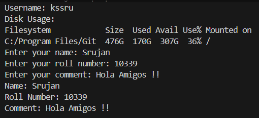

# Shell Scripting Homework – System Information Script

## Objective
The objective of this assignment was to write and execute a Bash script that collects system information, accepts user input interactively, manages directories and files, and redirects process output into a log file.

## Script
The script for this homework is written in `test.sh`. When executed, it creates a target directory named `res_log`, moves into it, retrieves system details such as date, hostname, username, and disk space usage, asks the user for personal information, and writes active processes and final outputs into log files.

## Commands Used
The following commands and features were used in `test.sh`:

- `mkdir`: Creates a new directory (`res_log`) to store log files.
- `cd`: Changes the working directory to `res_log`.
- `date`: Retrieves the current system date and time using command substitution `$(date)`.
- `hostname`: Retrieves the system hostname using command substitution `$(hostname)`.
- `whoami`: Retrieves the current logged-in username using command substitution `$(whoami)`.
- `df -h`: Displays file system disk space usage in human-readable format.
- `touch`: Creates an empty file named `process.log`.
- `ps`: Lists running processes.
- `>`: Output redirection operator used to save process information (`ps > process.log`) and summary text into log files (`result.log`).
- `read -p`: Displays a prompt and reads user input into variables (`name`, `roll_no`, `comment`).
- `echo`: Prints text to the terminal screen.
- Bash Variables: Used to store data like `$current_date`, `$hostname`, `$username`, `$name`, `$roll_no`, and `$comment`.

## Execution and Output
When running `./test.sh` in the terminal, the script executes step by step, displaying the date, hostname, username, disk space usage, prompting for input, and printing the entered details:

```text
Current Date: Wed, Sep  2, 2026  7:22:35 PM
Hostname: Srujan-Laptop
Username: kssru
Disk Usage:
Filesystem            Size  Used Avail Use% Mounted on
C:/Program Files/Git  476G  170G  307G  36% /
Enter your name: Srujan
Enter your roll number: 10339
Enter your comment: Hola Amigos !!
Name: Srujan
Roll Number: 10339
Comment: Hola Amigos !!
```

## Screenshots

The screenshot below shows the successful execution of `test.sh` in the terminal, displaying the system information, disk usage, and interactive user prompts.



## Files Created
Executing `test.sh` created the following directory and files in the project:

- `res_log/`: Directory created by `mkdir res_log` to hold log files.
- `res_log/process.log`: File containing the list of running processes captured with `ps > process.log`.
- `res_log/result.log`: File containing the final summary text written using `echo ... > result.log`.

## What I Learned
Doing this practical helped me understand how Bash scripts automate daily tasks. I learned how to store command results inside variables using `$()`, check disk usage using `df -h`, take user input with `read -p`, create folders and files automatically, and redirect output into `.log` files using `>`.
