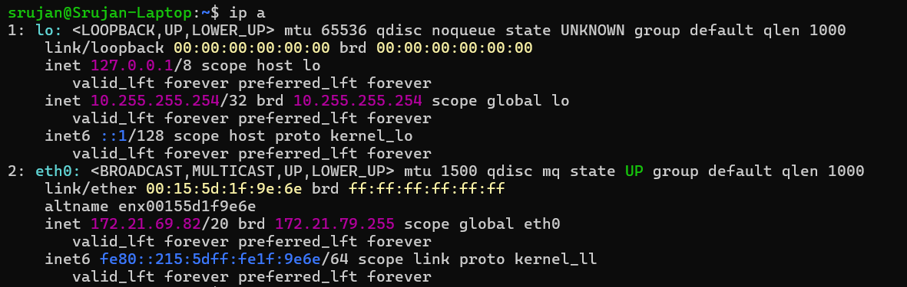
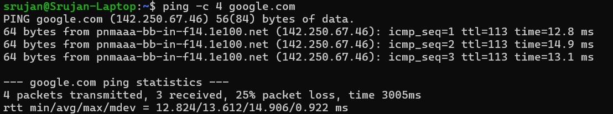
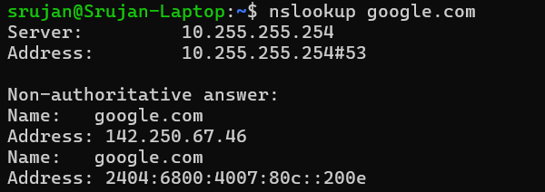
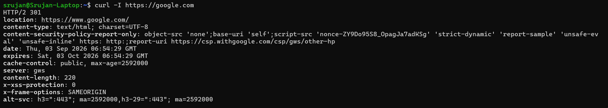
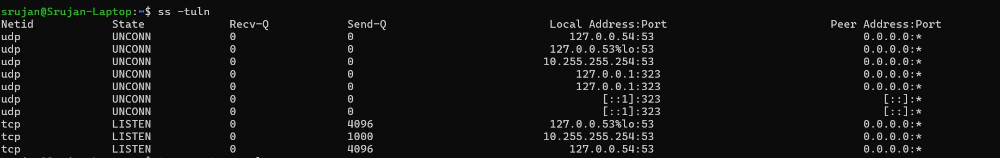
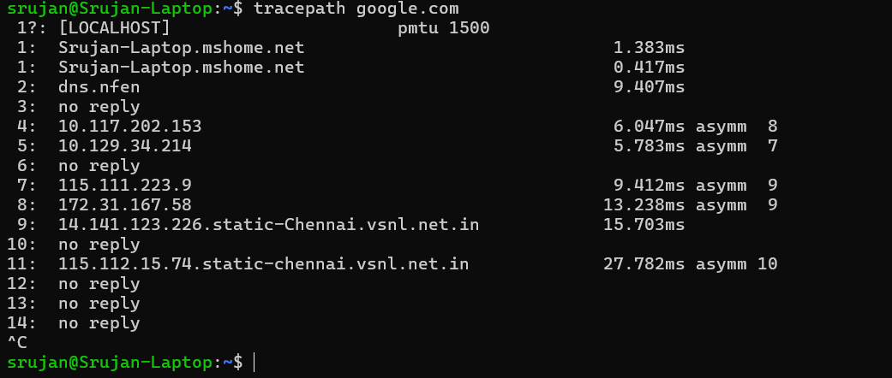

# Networking – Practical Assignment

## Introduction

In this assignment, I practiced basic networking concepts and Linux networking commands using my Ubuntu/WSL terminal.

I learned about IP addresses, subnetting, DHCP, DNS, TCP and UDP, HTTP and HTTPS, ports, NAT, MAC addresses, unicast, multicast and broadcast. I also practiced networking commands and observed their actual output in the terminal.

---

# 1. IP Addresses

An IP address is used to identify a device or network interface on a network.

IPv4 addresses are **32 bits** long and are written using four numbers separated by dots.

Example:

```text
192.168.1.10
```

Each part is called an octet and contains 8 bits.

```text
8 + 8 + 8 + 8 = 32 bits
```

### Public and Private IP Addresses

A **public IP address** is used for communication over the internet.

A **private IP address** is used inside a local network.

Common private IPv4 ranges are:

```text
10.0.0.0/8
172.16.0.0/12
192.168.0.0/16
```

---

# 2. IP Address Classes

IPv4 addresses were historically divided into different classes.

| Class | Range     | Default Prefix |
| ----- | --------- | -------------- |
| A     | 1 – 126   | /8             |
| B     | 128 – 191 | /16            |
| C     | 192 – 223 | /24            |
| D     | 224 – 239 | Multicast      |
| E     | 240 – 255 | Experimental   |

Classes A, B and C were used for normal network addressing.

Class D is used for multicast.

Class E was reserved for experimental purposes.

The class system used fixed network sizes, which could waste IP addresses. CIDR was introduced to allow more flexible network sizes.

---

# 3. Subnetting

Subnetting means dividing a larger network into smaller networks.

A subnet mask tells us which part of an IP address is the network portion and which part is the host portion.

For example:

```text
192.168.1.10/24
```

The `/24` means the first 24 bits are used for the network portion.

The remaining:

```text
32 - 24 = 8 bits
```

are available for hosts.

For a traditional `/24` network:

```text
Network address → 192.168.1.0
Usable addresses → 192.168.1.1 - 192.168.1.254
Broadcast address → 192.168.1.255
```

---

# 4. DHCP

DHCP stands for **Dynamic Host Configuration Protocol**.

It automatically provides network configuration to devices.

A DHCP server can provide:

* IP address
* Subnet mask
* Default gateway
* DNS server

### DHCP DORA Process

The DHCP process can be remembered using **DORA**:

```text
Discover
   ↓
Offer
   ↓
Request
   ↓
ACK
```

**Discover:** The client looks for a DHCP server.

**Offer:** The DHCP server offers an IP address.

**Request:** The client requests the offered address.

**ACK:** The server confirms the IP address assignment.

DHCP Discover is commonly sent as a broadcast because the client does not initially know the DHCP server's address.

---

# 5. DNS

DNS stands for **Domain Name System**.

DNS converts domain names into IP addresses.

For example:

```text
google.com
     ↓
142.250.67.46
```

This allows users to use domain names instead of remembering IP addresses.

A simplified DNS process is:

```text
Client
  ↓
DNS Resolver
  ↓
DNS Servers
  ↓
IP Address
```

DNS responses can also be cached for a period of time.

---

# 6. TCP vs UDP

TCP and UDP are transport-layer protocols.

## TCP

TCP stands for **Transmission Control Protocol**.

TCP is connection-oriented and provides reliable and ordered delivery of data.

TCP uses a three-way handshake:

```text
Client                 Server

  SYN  -------------->

       <-------------- SYN-ACK

  ACK  -------------->

```

## UDP

UDP stands for **User Datagram Protocol**.

UDP is connectionless and has less overhead than TCP. It does not guarantee delivery or ordering of packets.

### Difference between TCP and UDP

| TCP                 | UDP                   |
| ------------------- | --------------------- |
| Connection-oriented | Connectionless        |
| Reliable delivery   | No delivery guarantee |
| Ordered data        | No ordering guarantee |
| More overhead       | Less overhead         |

---

# 7. HTTP and HTTPS

HTTP stands for **HyperText Transfer Protocol**.

It is used for communication between web clients and web servers.

HTTP commonly uses:

```text
Port 80
```

HTTPS stands for **HTTP Secure**.

HTTPS uses HTTP with TLS to secure communication.

HTTPS commonly uses:

```text
Port 443
```

HTTPS provides:

* Encryption
* Authentication
* Data integrity

---

# 8. SSL/TLS Certificates

HTTPS uses TLS to secure communication between a client and server.

People commonly say "SSL certificate", but modern websites use **TLS**.

A TLS certificate contains information such as:

* Domain name
* Public key
* Certificate authority
* Validity period
* Digital signature

The certificate helps the browser verify that it is communicating with the correct website.

TLS also helps protect the communication from being read or modified by attackers.

---

# 9. Ports

A port identifies a particular network service or application on a device.

For example:

```text
192.168.1.10:22
```

Here:

```text
192.168.1.10 → IP address
22            → Port
```

Some common ports are:

| Port | Service    |
| ---: | ---------- |
|   22 | SSH        |
|   53 | DNS        |
|   80 | HTTP       |
|  443 | HTTPS      |
| 3306 | MySQL      |
| 5432 | PostgreSQL |
| 6379 | Redis      |

Port numbers range from:

```text
0 – 65535
```

---

# 10. NAT

NAT stands for **Network Address Translation**.

NAT is used to translate private IP addresses into public IP addresses when devices communicate with the internet.

For example, devices in a home network can have private IP addresses:

```text
Laptop → 192.168.1.10
Mobile → 192.168.1.11
TV    → 192.168.1.12
```

The router can allow all these devices to access the internet using a public IP address.

A simple example is:

```text
Laptop
192.168.1.10
     ↓
 Router
   NAT
     ↓
Public IP
     ↓
Internet
```

NAT became widely used because IPv4 has a limited number of addresses. It allows many devices using private IP addresses to share public IPv4 addresses.

---

# 11. MAC Address

MAC stands for **Media Access Control**.

A MAC address is used to identify a network interface at the data-link layer.

A commonly used MAC address is **48 bits**, which is equal to 6 bytes.

Example:

```text
00:15:5d:1f:9e:6e
```

The MAC address shown in my `ip a` output was:

```text
00:15:5d:1f:9e:6e
```

A traditional 48-bit MAC address is commonly divided into two 24-bit parts:

```text
First 24 bits       Last 24 bits
OUI                 Device-specific part
```

The first 24 bits are called the **OUI (Organizationally Unique Identifier)**.

The remaining 24 bits are used to identify the network interface within that address block.

### About the additional 16 bits

IPv4 uses 32 bits, while a commonly used MAC address uses 48 bits.

Therefore:

```text
48 - 32 = 16 bits
```

However, these 16 bits are **not added to IPv4 to create a MAC address**.

MAC addresses and IPv4 addresses are separate addressing systems.

---

# 12. Unicast, Multicast and Broadcast

### Unicast

Unicast means **one-to-one** communication.

```text
Device A ─────────→ Device B
```

Example: A computer communicating with a particular web server.

### Multicast

Multicast means **one-to-many selected devices**.

```text
             ┌→ Device B
Device A ────┼→ Device C
             └→ Device D
```

Only devices that are part of the multicast group receive the traffic.

### Broadcast

Broadcast means **one-to-all devices on the local network**.

```text
             ┌→ Device B
Device A ────┼→ Device C
             ├→ Device D
             └→ Device E
```

An example is DHCP Discover, where a client broadcasts to find a DHCP server.

---

# 13. Basic Networking Terminology

### Network

A network is a group of connected devices that can communicate with each other.

### Client

A client is a device or application that requests a service.

### Server

A server is a device or application that provides a service to clients.

### Router

A router connects different networks and forwards packets between them.

### Packet

A packet is a unit of data sent across a network.

### Protocol

A protocol is a set of rules used for communication between devices.

Examples include TCP, UDP, HTTP, HTTPS, DNS and DHCP.

### Default Gateway

A default gateway is the device used to send traffic outside the local network.

---

# 14. Practical Networking Commands

## 14.1 `ip a`

### Command

```bash
ip a
```

### Screenshot



### What I understood

The `ip a` command is used to display network interfaces and IP addresses.

In my output, the main interface was `eth0` and it had:

```text
172.21.69.82/20
```

I also saw the loopback interface `lo` with:

```text
127.0.0.1
```

The `/20` represents the network prefix.

---

## 14.2 `hostname -I`

### Command

```bash
hostname -I
```

### Screenshot


### Output observed

```text
172.21.69.82
```

### What I understood

The `hostname -I` command displays the IP addresses assigned to the system.

In my case, it showed:

```text
172.21.69.82
```

---

## 14.3 `ping`

### Command

```bash
ping -c 4 google.com
```

### Screenshot



### What I understood

The `ping` command is used to test network connectivity.

In my output, `google.com` was resolved to:

```text
142.250.67.46
```

The result showed:

```text
4 packets transmitted
3 packets received
25% packet loss
```

The average response time was:

```text
13.612 ms
```

`ping` commonly uses ICMP to test connectivity and shows response time and packet loss.

---

## 14.4 `nslookup`

### Command

```bash
nslookup google.com
```

### Screenshot



### What I understood

The `nslookup` command is used to perform a DNS lookup.

My output showed the DNS server:

```text
10.255.255.254
```

It returned both IPv4 and IPv6 addresses for Google.

The response was marked as `Non-authoritative`, which means the answer came from a DNS resolver rather than directly from the authoritative DNS server.

I had to install `bind9-dnsutils` because `nslookup` was not initially available on my system.

---

## 14.5 `curl`

### Command

```bash
curl -I https://google.com
```

### Screenshot



### What I understood

The `curl` command is used to communicate with web servers and make HTTP/HTTPS requests.

The `-I` option requests only the HTTP response headers.

My output showed:

```text
HTTP/2 301
```

A `301` response means that the requested URL has been permanently redirected.

The output also showed:

```text
location: https://www.google.com/
```

This means `https://google.com` redirected to `https://www.google.com/`.

---

## 14.6 `ss -tuln`

### Command

```bash
ss -tuln
```

### Screenshot



### What I understood

The `ss` command is used to display network sockets.

The options mean:

```text
-t → TCP
-u → UDP
-l → Listening
-n → Numeric
```

My output showed services listening on port `53`, which is commonly used for DNS.

I also saw UDP port `323` on the local system.

This helped me understand that network services use ports for communication.

---

## 14.7 `tracepath`

### Command

```bash
tracepath google.com
```

### Screenshot



### What I understood

The `tracepath` command is used to see the network path and intermediate hops toward a destination.

My output showed several hops, including:

```text
1: Srujan-Laptop.mshome.net
2: dns.nfen
4: 10.117.202.153
5: 10.129.34.214
7: 115.111.223.9
8: 172.31.167.58
9: 14.141.123.226.static-Chennai.vsnl.net.in
```

Some hops showed:

```text
no reply
```

This does not necessarily mean that the connection is broken. Some routers may not respond to network diagnostic packets.

I used `tracepath` because the `traceroute` package was not available from my configured Ubuntu repositories.

---

# 15. Command Summary

| Command       | Purpose                                   |
| ------------- | ----------------------------------------- |
| `ip a`        | Shows network interfaces and IP addresses |
| `hostname -I` | Shows IP addresses assigned to the system |
| `ping`        | Tests network connectivity                |
| `nslookup`    | Performs DNS lookup                       |
| `curl`        | Makes HTTP/HTTPS requests                 |
| `ss -tuln`    | Shows listening TCP and UDP sockets       |
| `tracepath`   | Shows the network path and hops           |

---

# 16. What I Learned

From this assignment, I understood the basic concepts of computer networking and practiced them using Linux commands.

I learned how IP addresses identify devices on a network, how public and private IP addresses are used, and how subnetting divides networks into smaller networks.

I understood how DHCP assigns IP configuration automatically and how DNS converts domain names into IP addresses.

I also learned the difference between TCP and UDP, how HTTP and HTTPS work, and why ports are needed for different network services.

I learned how NAT allows devices with private IP addresses to access the internet through public IP addresses.

I also learned that MAC addresses are commonly 48 bits and are different from IPv4 addresses.

Finally, I practiced commands such as `ip a`, `hostname -I`, `ping`, `nslookup`, `curl`, `ss -tuln`, and `tracepath` to understand and troubleshoot basic networking in Linux.
