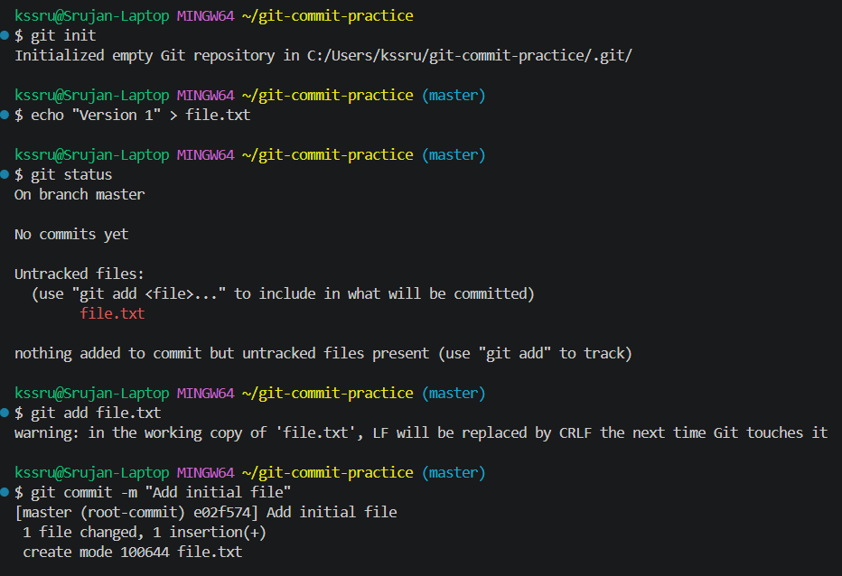
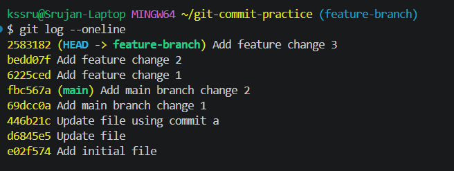
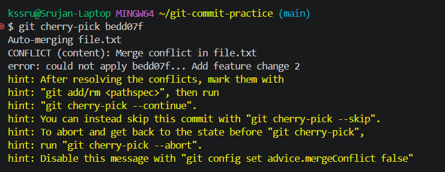
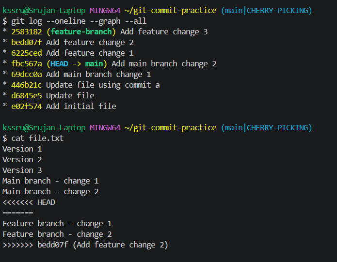
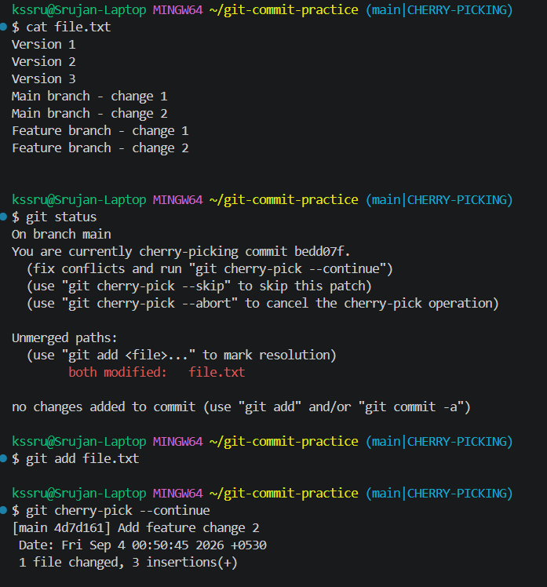

# Git Homework – Commit and Cherry-Pick

## Introduction

In this practical assignment, I practiced Git commits, branches, and cherry-picking using Git Bash on Windows.

The assignment covers two main concepts:

1. Difference between `git commit -m` and `git commit -a -m`
2. Creating commits on different branches and using `git cherry-pick` to apply one specific commit to the `main` branch

During the cherry-pick process, I also faced and resolved a merge conflict in `file.txt`.

---

# Task 1: `git commit -m` and `git commit -a -m`

## Objective

The objective was to understand how Git handles changes between the working directory, staging area, and repository.

The basic Git flow is:

```text
Working Directory
       ↓
    git add
       ↓
Staging Area
       ↓
   git commit
       ↓
Repository
```

The staging area is important because it allows us to select exactly which changes should be included in a commit.

---

## `git commit -m`

```bash
git commit -m "message"
```

Here, `-m` means **message**. It allows us to provide the commit message directly.

This command commits **only changes that are already staged**.

For example:

```bash
git add file.txt
git commit -m "Update file"
```

The `git add` command first moves the selected changes into the staging area. The `git commit` command then takes those staged changes and creates a new commit.

If a tracked file has been modified but has not been staged, running:

```bash
git commit -m "Update file"
```

will not include that modification.

### When to use it

`git commit -m` is useful when I want **control over exactly what goes into a commit**.

For example, if I modified three files but only want to commit one:

```bash
git add app.js
git commit -m "Update application logic"
```

Only the staged change is included.

---

## `git commit -a -m`

```bash
git commit -a -m "message"
```

Here:

* `-a` means automatically stage changes to tracked files
* `-m` provides the commit message

For modified or deleted files that are already tracked by Git, the `-a` option stages those changes automatically and then commits them.

The flow is:

```text
Modified/Deleted Tracked Files
             ↓
     Automatically Staged
             ↓
           Commit
```

For example:

```bash
git commit -a -m "Fix login issue"
```

This can save the separate `git add` step when working with already tracked files.

### Important limitation

`git commit -a` does **not** automatically add new or untracked files.

For example:

```text
Modified tracked file → included ✅
Deleted tracked file  → included ✅
New untracked file    → not included ❌
```

A new file still needs:

```bash
git add newfile.txt
```

before it can be committed.

---

## Difference Between the Two

| Command                      | Staging behavior                                     | What gets committed?           |
| ---------------------------- | ---------------------------------------------------- | ------------------------------ |
| `git commit -m "message"`    | Does not stage automatically                         | Only staged changes            |
| `git commit -a -m "message"` | Automatically stages tracked modifications/deletions | Modified/deleted tracked files |

### Simple way to remember

```text
git commit -m
→ Commit what I have already staged.

git commit -a -m
→ Stage modified/deleted tracked files and commit them.
```

The `-m` option is about the **commit message**. The `-a` option is about **automatically staging tracked changes**.

---

## Task 1 Practical Result

The practical test showed the difference between the two commands.

The repository history contained:

```text
446b21c Update file using commit a
d6845e5 Update file
e02f574 Add initial file
```

### Screenshot – Initial Repository Setup



This screenshot shows the repository initialization, creation of `file.txt`, its initial untracked state, staging, and the first commit.

### Screenshot – `git commit -a -m`


This screenshot shows the use of `git commit -a -m` on a modified tracked file and the resulting commit history.

---

# Task 2: Git Cherry-Pick

## Objective

The objective was to create commits on `main`, create another branch with additional commits, identify one specific commit, and bring only that commit into `main` using cherry-pick.

---

## Step 1: Create Commits on `main`

The repository was renamed from `master` to `main`:

```bash
git branch -M main
```

Two additional commits were created on `main`:

```text
69dcc0a Add main branch change 1
fbc567a Add main branch change 2
```

This gave the `main` branch its own changes before creating the feature branch.

---

## Step 2: Create the Feature Branch

A new branch was created using:

```bash
git checkout -b feature-branch
```

This created `feature-branch` from the current state of `main` and switched to it.

The purpose of the branch was to keep feature-related commits separate from `main`.

---

## Step 3: Create Commits on `feature-branch`

Three commits were created on the feature branch:

```text
6225ced Add feature change 1
bedd07f Add feature change 2
2583182 Add feature change 3
```

The commit history showed:

```text
2583182 (HEAD -> feature-branch) Add feature change 3
bedd07f Add feature change 2
6225ced Add feature change 1
fbc567a (main) Add main branch change 2
69dcc0a Add main branch change 1
```

### Screenshot – Branch Commit History



This screenshot shows the commits on `feature-branch` and the point where `main` was before the cherry-pick.

---

# What is Git Cherry-Pick?

`git cherry-pick` is used when we want to take **one specific commit from another branch** and apply its changes to the current branch.

For example:

```text
feature-branch

A → B → C
    ↑
 selected commit
```

If `B` is cherry-picked into `main`, only the changes from `B` are applied to `main`.

It does not merge the complete feature branch.

In this practical, the selected commit was:

```text
bedd07f Add feature change 2
```

---

# Step 4: Cherry-Pick the Commit

I switched back to `main`:

```bash
git checkout main
```

Then I ran:

```bash
git cherry-pick bedd07f
```

The intention was to apply the changes from `bedd07f` to `main`.

However, Git reported a conflict:

```text
Auto-merging file.txt
CONFLICT (content): Merge conflict in file.txt
error: could not apply bedd07f... Add feature change 2
```

### Screenshot – Cherry-Pick Conflict



This screenshot shows Git stopping the cherry-pick because it could not automatically combine the changes.

---

# Why Did the Conflict Happen?

The conflict occurred because both branches had modified the same file, `file.txt`.

The `main` branch had:

```text
Main branch - change 1
Main branch - change 2
```

The feature branch had:

```text
Feature branch - change 1
Feature branch - change 2
```

Because the changes were made in the same area of the same file, Git could not automatically decide how the final file should look.

Git therefore inserted conflict markers:

```text
<<<<<<< HEAD
=======
Feature branch - change 1
Feature branch - change 2
>>>>>>> bedd07f
```

These markers show the conflicting versions and need to be resolved manually.

### Screenshot – Conflict Markers



This screenshot shows the conflict markers inside `file.txt` while the repository was in the `CHERRY-PICKING` state.

---

# Step 5: Resolve the Conflict

I opened `file.txt` and removed the conflict markers.

The resolved file contained:

```text
Version 1
Version 2
Version 3
Main branch - change 1
Main branch - change 2
Feature branch - change 1
Feature branch - change 2
```

After resolving the file, I staged it:

```bash
git add file.txt
```

This told Git that the conflict in the file had been resolved.

---

# Step 6: Complete the Cherry-Pick

Since Git had paused the cherry-pick because of the conflict, I used:

```bash
git cherry-pick --continue
```

This told Git to continue and finish the cherry-pick using the resolved file.

Git successfully created the commit:

```text
[main 4d7d161] Add feature change 2
1 file changed, 3 insertions(+)
```

### Screenshot – Final Cherry-Pick



This screenshot shows the conflict being resolved, the file being staged, and the cherry-pick being completed successfully.

---

# Why Did the Commit Hash Change?

The original commit on `feature-branch` was:

```text
bedd07f Add feature change 2
```

After cherry-picking it into `main`, the new commit was:

```text
4d7d161 Add feature change 2
```

The hash is different because Git created a **new commit on `main`**.

The changes came from the original commit, but the new commit has a different parent in the history, so it gets a different commit hash.

---

# Final Verification

After completing the cherry-pick, the repository was back on the `main` branch.

The cherry-picked commit was:

```text
4d7d161 Add feature change 2
```

The final file contained:

```text
Version 1
Version 2
Version 3
Main branch - change 1
Main branch - change 2
Feature branch - change 1
Feature branch - change 2
```

The repository can be verified with:

```bash
git status
```

Expected result:

```text
On branch main
nothing to commit, working tree clean
```

The complete branch history can be viewed with:

```bash
git log --oneline --graph --all
```

This verifies that the selected commit was successfully applied to `main`.

---

# Problems Faced and How I Solved Them

## 1. Unstaged changes with `git commit -m`

When changes are not staged, `git commit -m` does not include them.

The solution is to stage the required changes first using:

```bash
git add file.txt
```

and then commit them.

---

## 2. Cherry-Pick Conflict

The main issue during Task 2 was a conflict in `file.txt`.

Git could not automatically combine the changes from `main` and the selected feature commit.

I solved it by:

1. Opening `file.txt`
2. Removing the conflict markers
3. Keeping the required content
4. Running `git add file.txt`
5. Running `git cherry-pick --continue`

The cherry-pick then completed successfully.

---

# Concepts Learned

### Working Directory

The working directory contains the files I am currently working on and modifying.

### Staging Area

The staging area contains the changes that are selected for the next commit.

### Commit

A commit is a saved snapshot of the staged changes in the Git repository.

### Branch

A branch allows development to happen separately from another branch.

### `git log`

`git log` is used to view commit history and identify commit hashes.

### `git commit -m`

Commits changes that have already been staged.

### `git commit -a -m`

Automatically stages modifications and deletions to tracked files and commits them.

### Cherry-Pick

Applies one specific commit from another branch to the current branch.

### Merge Conflict

A conflict happens when Git cannot automatically combine changes from different branches.

### `git cherry-pick --continue`

Used after resolving a cherry-pick conflict to complete the paused cherry-pick operation.

---

# Final Result

Both tasks were completed successfully.

In Task 1, I understood how `git commit -m` and `git commit -a -m` handle changes differently. The main difference is that `-a` automatically stages modifications and deletions of tracked files, while a normal `git commit -m` uses only what is already staged.

In Task 2, I created commits on `main` and `feature-branch`, selected the commit:

```text
bedd07f Add feature change 2
```

and cherry-picked it into `main`.

The cherry-pick initially caused a conflict in `file.txt`. I resolved the conflict manually, staged the resolved file, and completed the operation using:

```bash
git cherry-pick --continue
```

Git then created the new commit:

```text
4d7d161 Add feature change 2
```

This practical helped me understand how Git handles commits, branches, selective changes, and conflicts in an actual workflow.

---

# Screenshots

## Task 1

### 1. Initial Repository Setup and First Commit


### 2. `git commit -a -m` and Commit History


## Task 2

### 3. Main and Feature Branch Commit History


### 4. Cherry-Pick Conflict


### 5. Conflict Markers


### 6. Final Resolution and Cherry-Pick Completion


