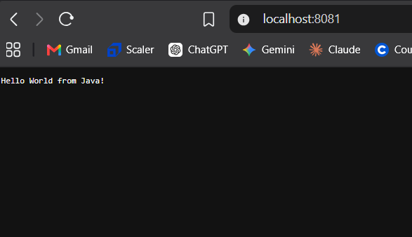
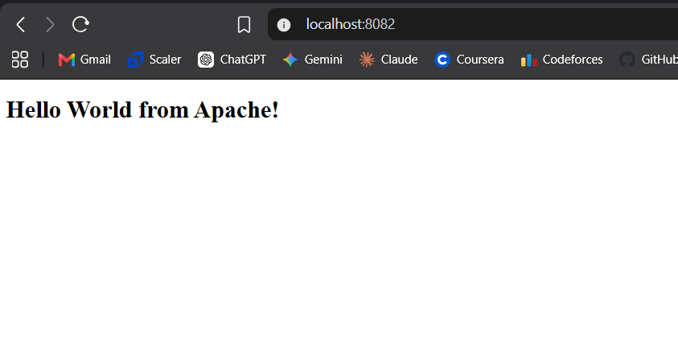
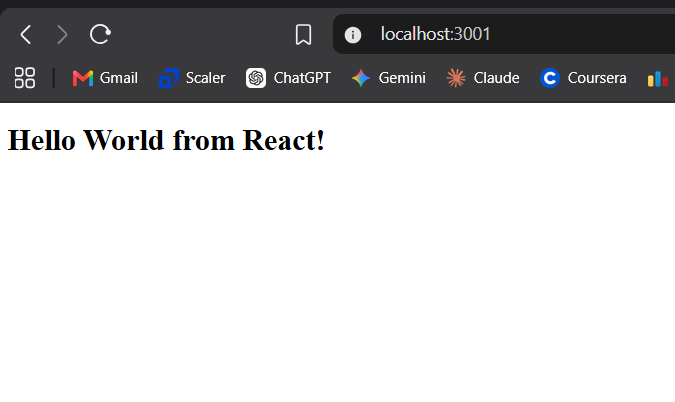
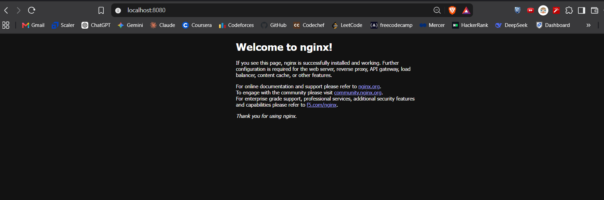
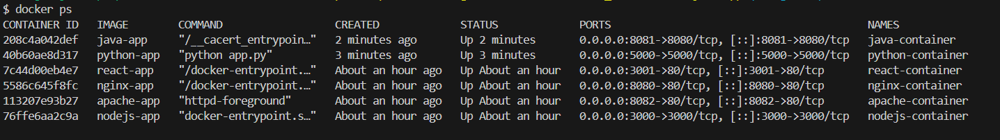

# Docker Fundamentals – Hello World Applications

## Introduction

In this assignment, I created and containerized simple Hello World web applications using Docker. I worked with Node.js, Python, Java, Apache, React, and Nginx.

For each application, I created a separate folder containing the application code and a Dockerfile. I then built a Docker image from the Dockerfile, created and started a container from the image, and verified the application through a web browser using localhost.

This assignment helped me understand the basic Docker workflow from creating an application to running it inside a container.

---

## Folder Structure

```text
session6-docker_fundamentals/
│
├── screenshot/
│   ├── node.png
│   ├── python.png
│   ├── java.png
│   ├── apache.png
│   ├── react.png
│   ├── nginx.png
│   └── containers.png
│
├── nodejs-app/
│   ├── server.js
│   └── Dockerfile
│
├── python-app/
│   ├── app.py
│   └── Dockerfile
│
├── java-app/
│   ├── HelloWorld.java
│   └── Dockerfile
│
├── Apache-app/
│   ├── index.html
│   └── Dockerfile
│
├── React-app/
│   ├── package.json
│   ├── index.html
│   ├── src/
│   │   └── main.jsx
│   └── Dockerfile
│
├── nginx-app/
│   ├── index.html
│   └── Dockerfile
│
└── README.md
```

---

## Applications Created

### 1. Node.js Application

A simple Node.js HTTP server was created to display a Hello World message.

#### Dockerfile

The Dockerfile uses a Node.js base image, copies the application into the container, exposes port 3000, and starts the Node.js server.

#### Commands Used
```bash
docker build -t nodejs-app .
docker run -d --name nodejs-container -p 3000:3000 nodejs-app
```

To check the running container:
```bash
docker ps
```

#### Verification

The application was accessed using: `http://localhost:3000`

The browser displayed:
> Hello World from Node.js!

The screenshot below shows the Node.js web application running on port 3000 in the browser:


---

### 2. Python Application

A simple Python HTTP server was created to display Hello World in a browser.

#### Dockerfile

The Dockerfile uses a Python base image, copies the Python application into the container, exposes port 5000, and starts the Python web server.

#### Commands Used
```bash
docker build -t python-app .
docker run -d --name python-container -p 5000:5000 python-app
```

To check the container:
```bash
docker ps
```

#### Verification

The application was accessed using: `http://localhost:5000`

The browser displayed:
> Hello World from Python!

The screenshot below shows the Python HTTP web server output in the browser on port 5000:


---

### 3. Java Application

A simple Java HTTP server was created using Java's built-in HTTP server functionality.

#### Dockerfile

The Dockerfile uses a Java JDK image, copies the Java source file into the container, compiles it during the Docker image build, and starts the Java application when the container runs.

#### Commands Used
```bash
docker build -t java-app .
docker run -d --name java-container -p 8081:8080 java-app
```

To check the container:
```bash
docker ps
```

#### Port Mapping

The Java application listens on port 8080 inside the container. Docker maps it to port 8081 on the host:
`localhost:8081 → container:8080`

#### Verification

The application was accessed using: `http://localhost:8081`

The browser displayed:
> Hello World from Java!

The screenshot below shows the Java HTTP server response running on host port 8081:



---

### 4. Apache Web Server

Apache HTTP Server was used to serve a simple HTML Hello World page.

#### Dockerfile

The Dockerfile uses the Apache HTTP Server image and copies the `index.html` file into Apache's default web directory.

#### Commands Used
```bash
docker build -t apache-app .
docker run -d --name apache-container -p 8082:80 apache-app
```

To check the container:
```bash
docker ps
```

#### Port Mapping

Apache listens on port 80 inside the container. Docker maps it to port 8082 on the host:
`localhost:8082 → container:80`

#### Verification

The application was accessed using: `http://localhost:8082`

The browser displayed:
> Hello World from Apache!

The screenshot below shows the Apache web server serving the HTML index page on port 8082:



---

### 5. React Application

A simple React application was created to display Hello World. The React application was built inside Docker and the generated production files were served using Nginx.

#### Dockerfile

A multi-stage Docker build was used.
* The first stage uses Node.js to install dependencies and build the React application.
* The second stage uses Nginx to serve the generated React files.

#### Commands Used
```bash
docker build -t react-app .
docker run -d --name react-container -p 3001:80 react-app
```

To check the container:
```bash
docker ps
```

#### Port Mapping

Nginx serves the React application on port 80 inside the container. Docker maps it to port 3001 on the host:
`localhost:3001 → container:80`

#### Verification

The application was accessed using: `http://localhost:3001`

The browser displayed:
> Hello World from React!

The screenshot below shows the React web application running in the browser on port 3001:



---

### 6. Nginx Application

A simple HTML Hello World page was served using Nginx.

#### Dockerfile

The Dockerfile uses the Nginx Alpine image and copies the HTML file into Nginx's default web directory.

#### Commands Used
```bash
docker build -t nginx-app .
docker run -d --name nginx-container -p 8080:80 nginx-app
```

To check the container:
```bash
docker ps
```

#### Port Mapping

Nginx listens on port 80 inside the container. Docker maps it to port 8080 on the host:
`localhost:8080 → container:80`

#### Verification

The application was accessed using: `http://localhost:8080`

The browser displayed:
> Hello World from Nginx!

The screenshot below shows the Nginx web server running on port 8080 in the browser:



---

## Docker Commands Learned and Used

### Checking Docker

* **Check Docker version:** `docker --version` (Displays the installed Docker version)
* **Check Docker information:** `docker info` (Displays information about the Docker environment)

### Images

* **List Docker images:** `docker images` (Shows local Docker images)
* **Build an image:** `docker build -t nodejs-app .` (Builds an image using Dockerfile in current directory; `-t` tags the image name)
* **Remove an image:** `docker rmi nginx-app` (Removes a Docker image)

### Containers

* **Create and start a new container:** `docker run -d --name nodejs-container -p 3000:3000 nodejs-app`
  * `-d`: Runs in detached mode (background)
  * `-it`: Interactive terminal
  * `-p 8080:80`: Maps host port 8080 to container port 80 (`HOST_PORT:CONTAINER_PORT`)
  * `--name nginx-container`: Assigns custom container name

### Checking Containers

* **Show running containers:** `docker ps`
* **Show all containers:** `docker ps -a`

### Container Lifecycle

* **Stop container:** `docker stop <container-name>`
* **Start existing container:** `docker start <container-name>`
* **Restart container:** `docker restart <container-name>`
* **Remove container:** `docker rm <container-name>`
* **Force remove container:** `docker rm -f <container-name>`

### Viewing Container Information

* **View logs:** `docker logs <container-name>`
* **Follow logs:** `docker logs -f <container-name>`
* **Execute command inside container:** `docker exec -it <container-name> sh`
* **Inspect container:** `docker inspect <container-name>`

---

## Important Docker Concepts Learned

### Image vs Container

A Docker image is a packaged template used to create containers. A container is a running or stopped instance created from an image.

```text
Dockerfile → docker build → Image → docker run → Container
```

### `docker run` vs `docker start`

* `docker run` creates a new container from an image and starts it.
* `docker start` starts an existing stopped container.

### `rm` vs `rmi`

* `docker rm <container>` removes a container.
* `docker rmi <image>` removes an image (the `i` in `rmi` stands for image).

### Port Mapping

Docker containers have their own network environment. The `-p` option allows a port on the host machine to forward traffic to a port inside the container.

```text
Host (localhost:8080) → Docker port mapping → Container:80 → Nginx
```

---

## Port Mapping Summary Used in Assignment

| Application | Container Port | Host Port | Browser URL |
| :--- | :--- | :--- | :--- |
| **Node.js** | `3000` | `3000` | [localhost:3000](http://localhost:3000) |
| **Python** | `5000` | `5000` | [localhost:5000](http://localhost:5000) |
| **Java** | `8080` | `8081` | [localhost:8081](http://localhost:8081) |
| **Apache** | `80` | `8082` | [localhost:8082](http://localhost:8082) |
| **React** | `80` | `3001` | [localhost:3001](http://localhost:3001) |
| **Nginx** | `80` | `8080` | [localhost:8080](http://localhost:8080) |

---

## Containers Running in My Docker Engine

The terminal status of running containers confirmed with `docker ps`:



The screenshots in the screenshot folder show the Docker containers running and the corresponding Hello World applications being accessed through localhost.

---

## What I Learned

Through this assignment, I learned how to containerize applications using Docker and how a Dockerfile is used to create an image.

I understood the difference between a Docker image and a container, and learned that `docker run` creates a new container while `docker start` starts an existing stopped container.

I also learned how to build images using `docker build`, check images using `docker images`, and manage containers using commands such as `docker ps`, `docker stop`, `docker start`, `docker restart`, and `docker rm`.

Another important concept I learned was Docker port mapping. The application listens on a port inside the container, and the `-p` option maps that port to a port on the host machine so that the application can be accessed through localhost.

I also worked with different types of applications and servers, including Node.js, Python, Java, Apache, React, and Nginx. This helped me understand that Docker can be used to package and run applications built using different technologies in a consistent environment.
