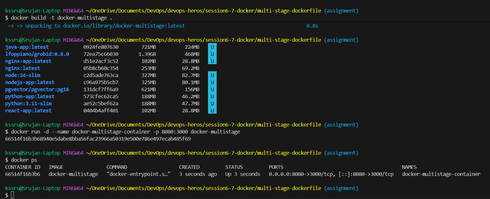
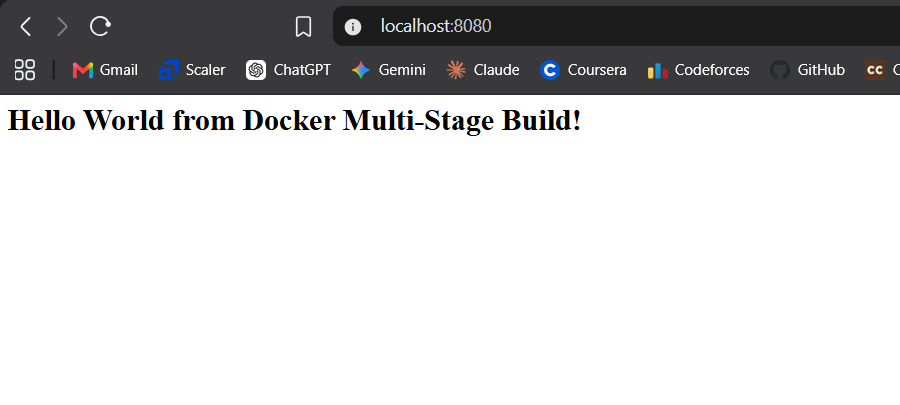
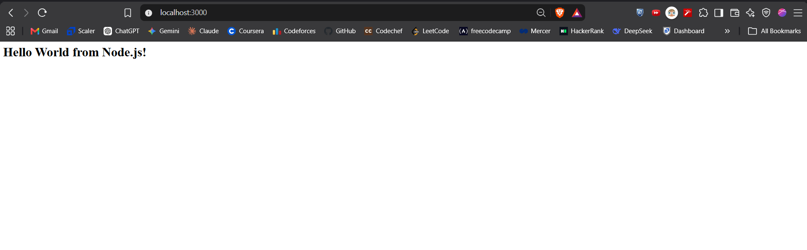
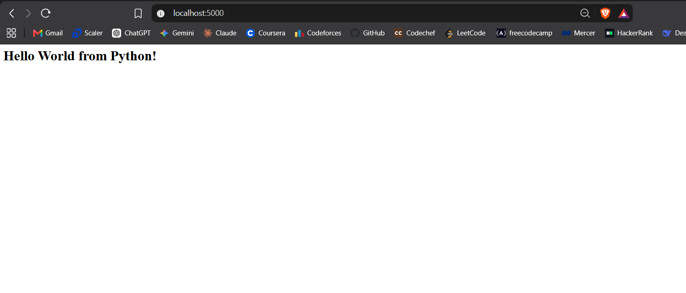

# Docker Multi-Stage Build Homework

## Student Details

**Name:** Srujan Gowda KS  
**Enrollment Number:** 24BCS10339

---

## Introduction

In this assignment, I worked with a multi-stage Dockerfile and also ran different types of applications using Docker.

For the multi-stage build, I used the given Node.js Express application. I built the Docker image, ran it as a container, and accessed the application through `localhost:8080`.

I also deployed Node.js, Python, and Java applications using Docker.

---

# Task 1: Run Multi-Stage Dockerfile

## Project Structure

The multi-stage Docker project contains:

```text
multi-stage-dockerfile/
├── Dockerfile
├── package.json
└── server.js
```

The Dockerfile contains two stages:

* **Builder stage** – installs the required Node.js dependencies.
* **Production stage** – creates the final image and copies the required files from the builder stage.

The Node.js application listens on port 3000.

## Build the Docker Image

I built the Docker image using:

```bash
docker build -t docker-multistage .
```

I also checked the created image using:

```bash
docker images
```

The image was successfully created with the name `docker-multistage`.

## Run the Container

The application runs on port 3000 inside the container. Since I needed to access it using port 8080 on my system, I used:

```bash
docker run -d --name docker-multistage-container -p 8080:3000 docker-multistage
```

The port mapping is:

```text
Host Port 8080 → Container Port 3000
```

This allowed me to access the application using `localhost:8080`.

## Check the Running Container

I checked the running container using:

```bash
docker ps
```

The output showed the following port mapping:

```text
0.0.0.0:8080->3000/tcp
```

This confirmed that the container was running and that port 8080 on my system was mapped to port 3000 inside the container.

The screenshot below shows the terminal output of `docker ps` with the running container:



## Access the Application

I opened the application in my browser using:

`http://localhost:8080`

The application loaded successfully and displayed:

> Hello World from Docker Multi-Stage Build!

The screenshot below shows the application running in the browser:



---

# Task 2: Documentation

The required student details are provided at the beginning of this README.

The application was successfully accessed through `localhost:8080`.

The running container was verified using `docker ps`.

The `docker ps` output showed:

```text
0.0.0.0:8080->3000/tcp
```

This confirmed that the application was running inside the Docker container and was accessible through port 8080 on my system.

---

# Task 3: Docker Application Deployment

I deployed three different types of applications using Docker:

1. Node.js
2. Python
3. Java

## 1. Node.js Application

I created and ran a Node.js application using Docker.

The image was built using:

```bash
docker build -t nodejs-app .
```

The container was started using:

```bash
docker run -d --name nodejs-container -p 3000:3000 nodejs-app
```

I accessed the application through: `http://localhost:3000`

The screenshot below shows the Node.js application running in the browser:



## 2. Python Application

I also ran a simple Python web application inside a Docker container.

The application was accessed through: `http://localhost:5000`

The screenshot below shows the Python application running in the browser:



## 3. Java Application

I deployed a Java application using Docker.

The Java application runs on port 8080 inside the container. I mapped it to port 8081 on my system.

```text
Host Port 8081 → Container Port 8080
```

I accessed the application through: `http://localhost:8081`

The screenshot below shows the Java application running in the browser:


---

# What I Learned

The main thing I understood from this assignment was how a multi-stage Dockerfile separates the build stage from the final application image.

I also got a better understanding of Docker port mapping while running the multi-stage application. The application was listening on port 3000 inside the container, but I needed to access it using port 8080 on my computer. Using:

```bash
-p 8080:3000
```

made this possible.

I verified the mapping using `docker ps` and then opened `localhost:8080` in the browser to confirm that the application was working.

I also got practical experience running Node.js, Python, and Java applications using Docker.
