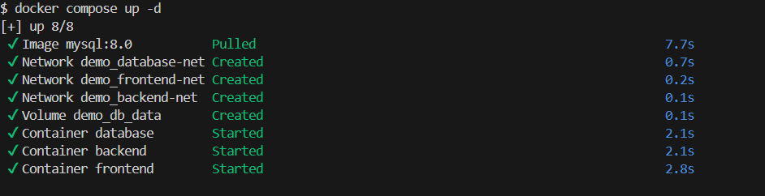
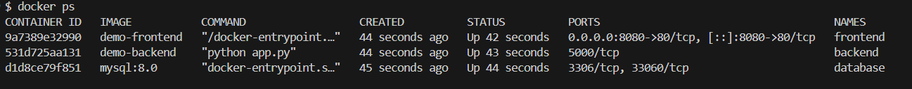
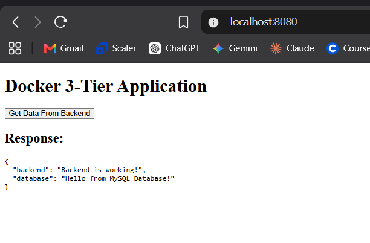
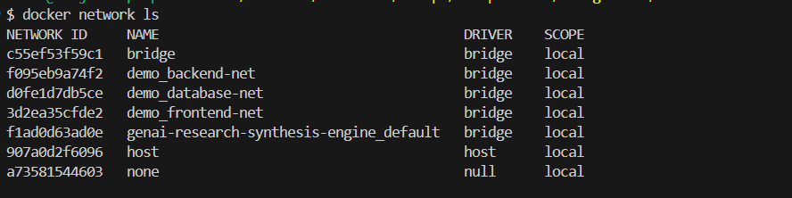
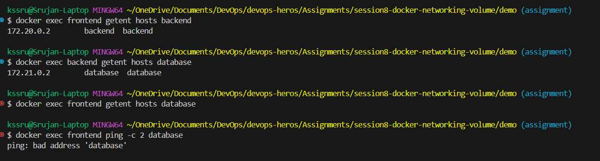
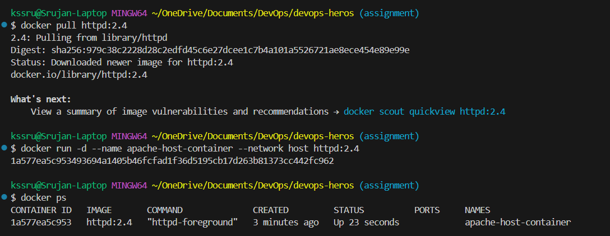
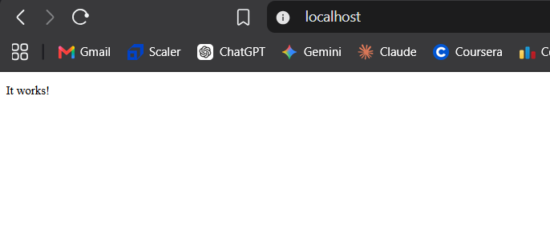

# Docker Networking & Volume Homework

## Student Details

- **Name:** Srujan Gowda KS
- **Enrollment Number:** 24BCS10339

---

## Introduction

In this assignment, I practiced Docker networking and storage concepts using Docker and Docker Compose.

The practical work covered:
- Creating custom Docker bridge networks.
- Connecting containers through Docker networks.
- Connecting one container to multiple networks.
- Verifying container-to-container communication using Docker's internal DNS.
- Demonstrating network isolation between containers.
- Using host networking with Apache HTTP Server.
- Using bind mounts with Nginx.
- Understanding named volumes and bind mounts.
- Researching Docker overlay networks and their use in multi-host environments.

---

<br>

# Task 1: Docker Container Networking

## Objective

The objective of Task 1 was to create a three-tier application consisting of:
1. **Frontend:** Nginx web server.
2. **Backend:** Python Flask API.
3. **Database:** MySQL 8.0.

The task required creating three separate Docker bridge networks and connecting the backend container to two networks simultaneously. I also verified communication between the containers and demonstrated network isolation between the frontend and database.

---

## Project Structure

The Task 1 application is organized inside the `demo/` directory:

```text
demo/
├── docker-compose.yml
├── backend/
│   ├── app.py
│   ├── Dockerfile
│   └── requirements.txt
├── frontend/
│   ├── Dockerfile
│   ├── index.html
│   └── nginx.conf
└── database/
    └── init.sql
```

### File Description

* `docker-compose.yml` – Defines the three services, networks, port mapping, dependencies, and database volume.
* `frontend/` – Contains the Nginx Dockerfile, Nginx configuration, and frontend HTML page.
* `backend/` – Contains the Flask application, Dockerfile, and Python dependencies.
* `database/init.sql` – Initializes the MySQL database, creates the required table, and inserts sample data.

<br>

### Dockerfile vs Docker Compose

A `Dockerfile` describes how an individual Docker image is built. In this project, the frontend and backend each have their own Dockerfile.

The `docker-compose.yml` file is used to define and manage multiple services together. It handles the services, networks, volumes, port mappings, and dependencies.

In this project:
* **Frontend** → built using `frontend/Dockerfile`.
* **Backend** → built using `backend/Dockerfile`.
* **Database** → uses the existing `mysql:8.0` image.

---

## Network Design

Three custom Docker bridge networks were used:
* `frontend-net`
* `backend-net`
* `database-net`

```text
Frontend (Nginx)
       │
       │ frontend-net
       ▼
 Backend (Flask)
       │
       │ backend-net
       ▼
Database (MySQL)
       │
       │ database-net
       ▼
   Additional
   Database Network
```

<br>

### Network Attachment Matrix

| Container | frontend-net | backend-net | database-net |
| :--- | :---: | :---: | :---: |
| **Frontend** | Yes | No | No |
| **Backend** | Yes | Yes | No |
| **Database** | No | Yes | Yes |

The backend is connected to two networks, making it a multi-network container.

The frontend and database do not share a common network. Therefore, the frontend cannot directly resolve the database container through Docker's internal DNS.

---

## Building the Images

The frontend and backend images were built using:

```bash
docker compose build
```

This command reads the Dockerfiles in the `frontend/` and `backend/` directories and builds the required images.



---

## Starting the Containers

The complete application stack was started using:

```bash
docker compose up -d
```

The `-d` option runs the containers in detached mode, allowing the terminal to be used after the containers start.

The three containers running were: `frontend`, `backend`, `database`.

I verified the running containers using:

```bash
docker ps
```



---

## Frontend Verification

The frontend container maps host port `8080` to container port `80` (`8080:80`). I accessed the application using:

`http://localhost:8080`

The request flow is:

```text
Browser ──> localhost:8080 ──> Frontend Nginx ──> Backend Flask API ──> MySQL Database
```

The application successfully returned:

```json
{
  "backend": "Backend is working!",
  "database": "Hello from MySQL Database!"
}
```



This shows that the frontend was able to communicate with the backend, and the backend was able to retrieve data from MySQL.

---

## Checking Docker Networks

I checked the Docker networks using:

```bash
docker network ls
```

The generated network names were:
* `demo_frontend-net`
* `demo_backend-net`
* `demo_database-net`



---

## Verifying Backend on Two Networks

The backend container was required to be connected to two networks. I verified this using:

```bash
docker inspect backend --format '{{json .NetworkSettings.Networks}}'
```

The output showed that the backend was connected to `demo_frontend-net` and `demo_backend-net`.



---

## Frontend, Backend and Database Connectivity

### Frontend to Backend Connectivity

The frontend and backend share `demo_frontend-net`. I tested Docker's internal DNS resolution from the frontend container using:

```bash
docker exec frontend getent hosts backend
```

Docker successfully resolved the hostname `backend` to the internal IP address of the backend container.

<br>

### Backend to Database Connectivity

The backend and database share `demo_backend-net`. I tested DNS resolution from the backend container using:

```bash
docker exec backend getent hosts database
```

Docker successfully resolved the hostname `database`.

<br>

### Frontend to Database Isolation

I also tested whether the frontend could resolve the database container:

```bash
docker exec frontend getent hosts database
```

The lookup did not return the database address. This is expected because the frontend and database containers do not share a Docker network.

---

## Named Volume

The MySQL service uses a named Docker volume:

```yaml
volumes:
  - db_data:/var/lib/mysql
```

The volume stores MySQL data outside the container's writable layer so data persists even if the MySQL container is recreated.

---

<br>

# Task 2: Host Network

## Objective

The objective was to run an Apache HTTP Server container using Docker's host network (`--network host`) to understand how host networking differs from normal Docker bridge networking and port mapping.

---

## Pulling Apache

I pulled the Apache HTTP Server image using:

```bash
docker pull httpd:2.4
```

`httpd` is the official daemon executable name used by Apache.

---

## Creating the Host Network Container

The Apache container was created using:

```bash
docker run -d --name apache-host-container --network host httpd:2.4
```

Unlike normal port publishing, the command does not use `-p 80:80` because host networking uses the host network stack directly.



---

## Host Network Access

The Apache URL was accessed using: `http://localhost:80`

The browser rendered the default Apache page: **It works!**



---

<br>

# Task 3: Bind Mount

## Objective

The objective was to mount a local directory into an Nginx container and verify that changes made to the local file are reflected inside the running container without restarting it.

---

## Host File Setup

A local directory was created: `bind-mount-demo/index.html` with initial HTML content:

```html
<h1>Hello students ?</h1>
```

---

## Creating Nginx Container with Bind Mount

The Nginx container was created using a bind mount:

```bash
docker run -d --name nginx-bindmount -p 8085:80 -v "C:/Users/kssru/OneDrive/Documents/DevOps/devops-heros/Assignments/session8-docker-networking-volume/bind-mount-demo:/usr/share/nginx/html" nginx:alpine
```

Port mapping `8085:80` maps host port `8085` to Nginx container port `80`.

---

## Live File Update

1. Navigated to `http://localhost:8085` → Displayed **Hello students ?**
2. Modified local `bind-mount-demo/index.html` file content to:
   ```html
   <h1>Hello students ? - Updated</h1>
   ```
3. Refreshed browser `http://localhost:8085` without restarting the container → The updated content displayed instantly!


---

## Bind Mount vs Named Volume

* **Bind Mount** → Directly connects a specific directory on the host to a location inside the container (`bind-mount-demo` for Nginx).
* **Named Volume** → Managed by Docker and useful for persistent database storage (`db_data` for MySQL).

---

<br>

# Task 4: Overlay Network

## What is an Overlay Network?

An overlay network is a Docker network driver that allows containers running on **different Docker hosts** to communicate with each other as if they were connected to the same network.

Normally, a bridge network works within a single Docker host. If containers are running on two different Docker machines, a normal bridge network cannot directly connect them. An overlay network solves this problem by creating a virtual network that works across multiple Docker hosts.

For example, suppose we have:
- **Docker Host 1** → Frontend container
- **Docker Host 2** → Backend container
- **Docker Host 3** → Database container

With an overlay network, these containers can communicate with each other even though they are running on different hosts.

<br>

### Bridge Network vs Overlay Network

| Feature | Bridge Network | Overlay Network |
| :--- | :--- | :--- |
| **Scope** | Usually one Docker host | Multiple Docker hosts |
| **Driver** | `bridge` | `overlay` |
| **Multi-host communication** | No | Yes |
| **Common use** | Containers on the same host | Distributed container services |
| **Example** | Task 1 | Docker Swarm |

---

## How Overlay Networking Works

An overlay network creates a **virtual network on top of the existing host network**.

When a container sends data to another container on a different Docker host, Docker encapsulates the container's network traffic and sends it through the host network to the destination host.

Docker commonly uses **VXLAN** for this communication. VXLAN encapsulates the original container traffic inside UDP packets, using UDP port `4789`.

The basic flow is:

```text
Container A
    │
    ▼
Overlay Network
    │
    ▼
Host Network
    │
    ▼
Docker Host 2
    │
    ▼
Container B
```

The destination Docker host receives the encapsulated traffic, removes the outer network information, and forwards the original traffic to the destination container.

This allows containers on different hosts to communicate without needing to know the physical network details of the other host.

---

## Where Overlay Networks Are Used

Overlay networks are mainly useful when containers are distributed across multiple Docker hosts.

Some common use cases are:
* **Docker Swarm** – Allows services running on different Swarm nodes to communicate.
* **Distributed microservices** – Different services can run on different machines while still communicating through the same logical network.
* **Multi-host container deployments** – Useful when an application is spread across multiple Docker servers.
* **High availability applications** – Containers can be distributed across different hosts while maintaining network communication.

---

## Simple Understanding

The easiest way to understand the difference is:

* **Bridge network:** Containers communicate within the same Docker host.
* **Overlay network:** Containers can communicate across different Docker hosts using a shared virtual network.


<br>

# Learnings

1. **Dockerfile vs Docker Compose:** A Dockerfile defines how an individual image is built, while Docker Compose manages multiple services, networks, volumes, and configurations together.
2. **Docker Bridge Networks:** Containers connected to the same user-defined bridge network can communicate with each other using Docker's internal DNS.
3. **Multi-Network Containers:** A container can be connected to multiple networks (e.g. backend connected to `frontend-net` and `backend-net`).
4. **Network Isolation:** Containers that do not share a network cannot directly resolve each other.
5. **Host Networking:** The `--network host` option uses the host networking environment directly instead of normal Docker port mapping (`-p`).
6. **Named Volumes vs Bind Mounts:** Named volumes store persistent data managed by Docker, while bind mounts connect local host directories directly for live development.
