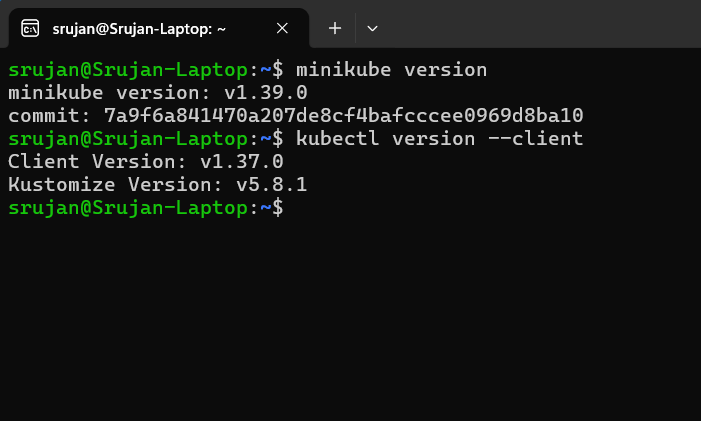
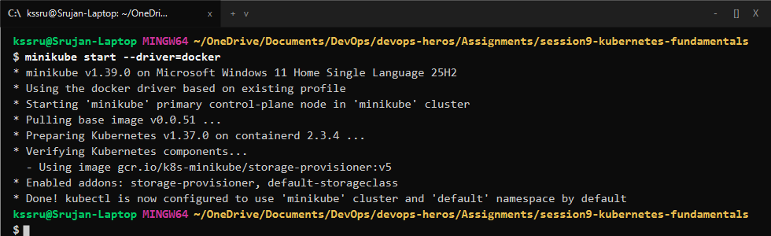
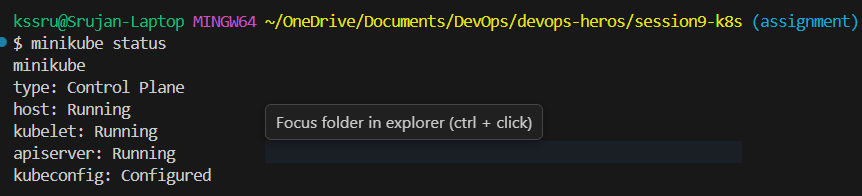
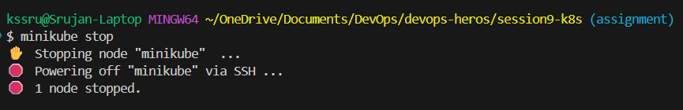

# Session 9 - Kubernetes Fundamentals & Minikube Setup

## Student Details

- **Name:** Srujan Gowda KS
- **Enrollment Number:** 24BCS10339
- **Session:** 09 - Kubernetes Fundamentals

---

## Introduction

In this assignment, I started learning Kubernetes and set up a local cluster on my machine using Minikube and Docker.

The main tasks completed were:
- Checking that `minikube` and `kubectl` are installed properly.
- Starting the Minikube local cluster using the Docker driver.
- Checking cluster status and verifying that the node is ready.
- Stopping the cluster properly.
- Understanding the Kubernetes architecture and writing down what the control plane and worker node components do.

---

<br>

# Task 1: Minikube & CLI Installation Verification

## Objective

Verify that `minikube` and `kubectl` command-line tools are installed on my system and working correctly.

## Commands

```bash
minikube version
kubectl version --client
```

## Output

```text
minikube version: v1.39.0
commit: 7a9f6a841470a207de8cf4bafcccee0969d8ba10

Client Version: v1.37.0
Kustomize Version: v5.8.1
```



---

<br>

# Task 2: Starting the Minikube Cluster

## Objective

Start a local single-node Kubernetes cluster using Minikube configured with Docker driver.

## Commands

```bash
minikube start --driver=docker
```

## Output

Minikube pulled the base image, started the control plane container, configured `containerd` runtime, and enabled default addons (`storage-provisioner`, `default-storageclass`).



---

<br>

# Task 3: Verifying Cluster Status & Node Health

## Objective

Check that the control plane components (`kubelet`, `apiserver`) are running and verify that the node status is `Ready`.

## Commands

```bash
minikube status
kubectl get nodes -o wide
```

## Output

```text
minikube
type: Control Plane
host: Running
kubelet: Running
apiserver: Running
kubeconfig: Configured

NAME       STATUS   ROLES           AGE   VERSION   INTERNAL-IP    EXTERNAL-IP   OS-IMAGE                         KERNEL-VERSION                              CONTAINER-RUNTIME
minikube   Ready    control-plane   13d   v1.37.0   192.168.49.2   <none>        Debian GNU/Linux 12 (bookworm)   6.18.33.1-microsoft-standard-WSL2 (amd64)   containerd://2.3.4
```



---

<br>

# Task 4: Stopping the Minikube Cluster

## Objective

Stop the Minikube cluster safely so that it frees up system memory and CPU when not in use.

## Commands

```bash
minikube stop
minikube status
```

## Output

```text
* Stopping node 'minikube' ...
* Powering off 'minikube' via SSH ...
* 1 node stopped.

minikube
type: Control Plane
host: Stopped
kubelet: Stopped
apiserver: Stopped
kubeconfig: Configured
```



---

<br>

# Task 5: Kubernetes Cluster Architecture & Core Components

Based on the official Kubernetes documentation, a Kubernetes cluster consists of two main parts: the **Control Plane (Master Node)** and the **Worker Nodes**.

### 1. Control Plane (Master Node) Components

- **`kube-apiserver` (API Server):**
  - This is the central management entry point for the whole cluster.
  - All tools (`kubectl`, dashboard) and internal components communicate only through the API server via REST APIs.
- **`etcd` (Cluster Database):**
  - A distributed key-value store that holds the complete state, configuration, and data of the cluster.
  - Only `kube-apiserver` communicates directly with `etcd`.
- **`kube-scheduler` (Scheduler):**
  - Watches for newly created pods that do not have a node assigned yet.
  - Selects the best worker node to run the pod based on available CPU, memory, and constraints.
- **`kube-controller-manager` (Controllers):**
  - Runs continuous loops to make sure the actual state of the cluster matches the desired state.
  - Examples include the Node Controller (notices when a node goes down) and ReplicaSet Controller (maintains the correct number of pod copies).

### 2. Worker Node Components

- **`kubelet`:**
  - The main agent running on each worker node.
  - Takes Pod specifications from the API server and makes sure the containers are created and running healthily.
- **`kube-proxy`:**
  - Manages network rules on the worker node to handle communication between pods and services.
- **`Container Runtime` (CRI):**
  - The software that actually pulls images and runs the containers (e.g. `containerd`, `CRI-O`).
- **`Pod`:**
  - The smallest deployable building block in Kubernetes. It wraps one or more containers that share the same network IP and storage volumes.
